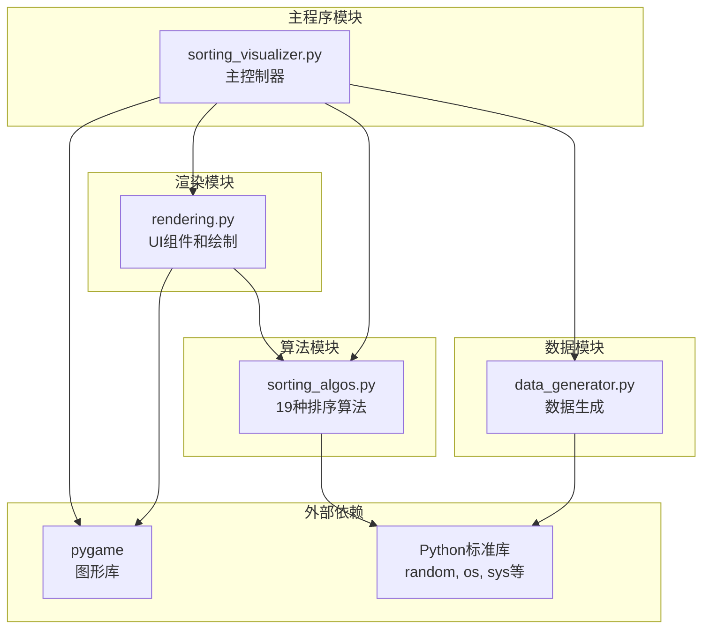
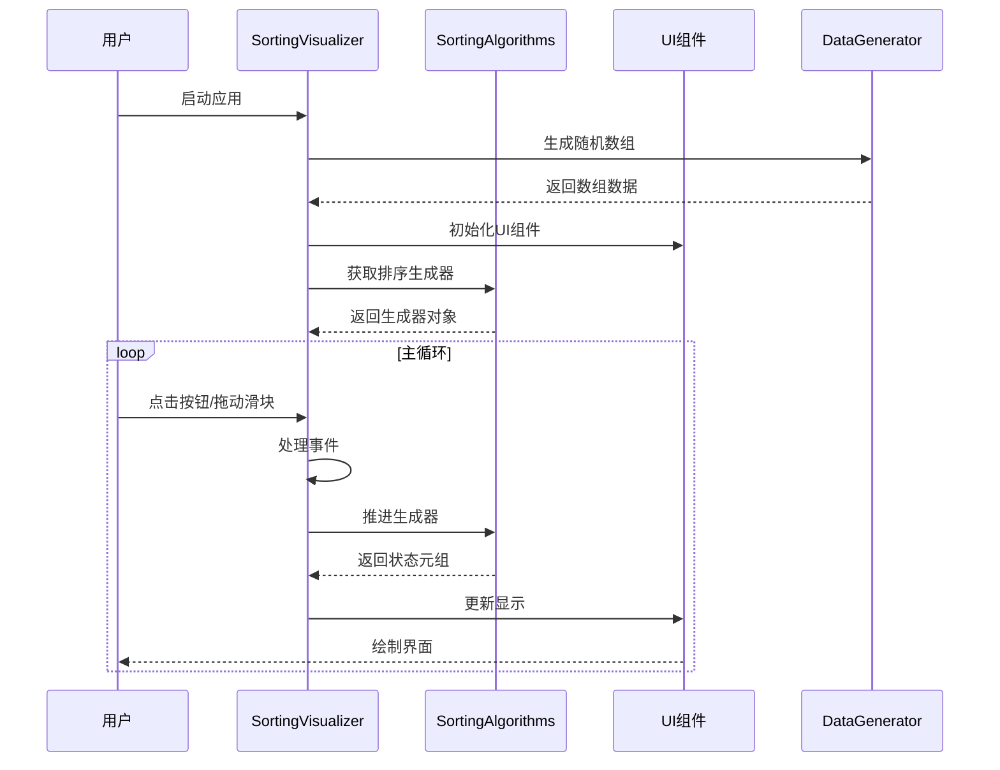
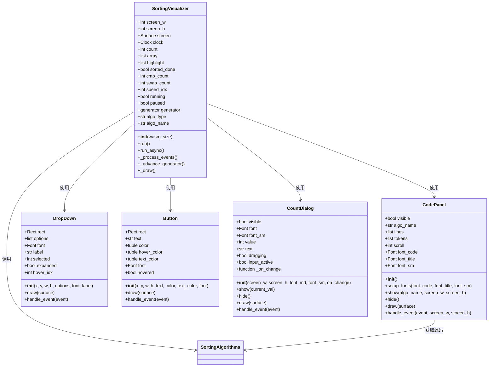
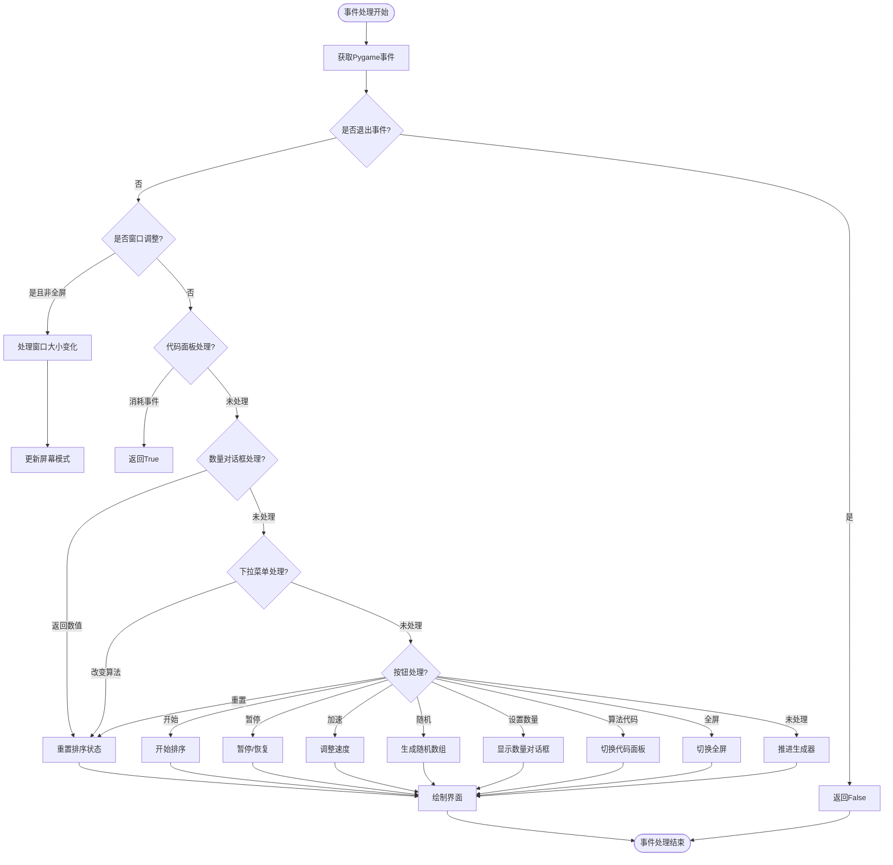
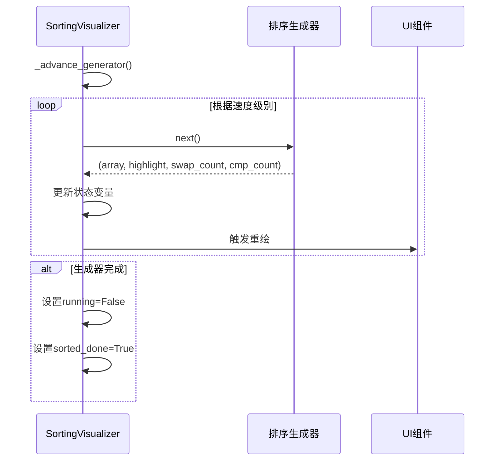
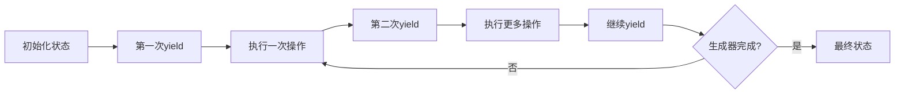
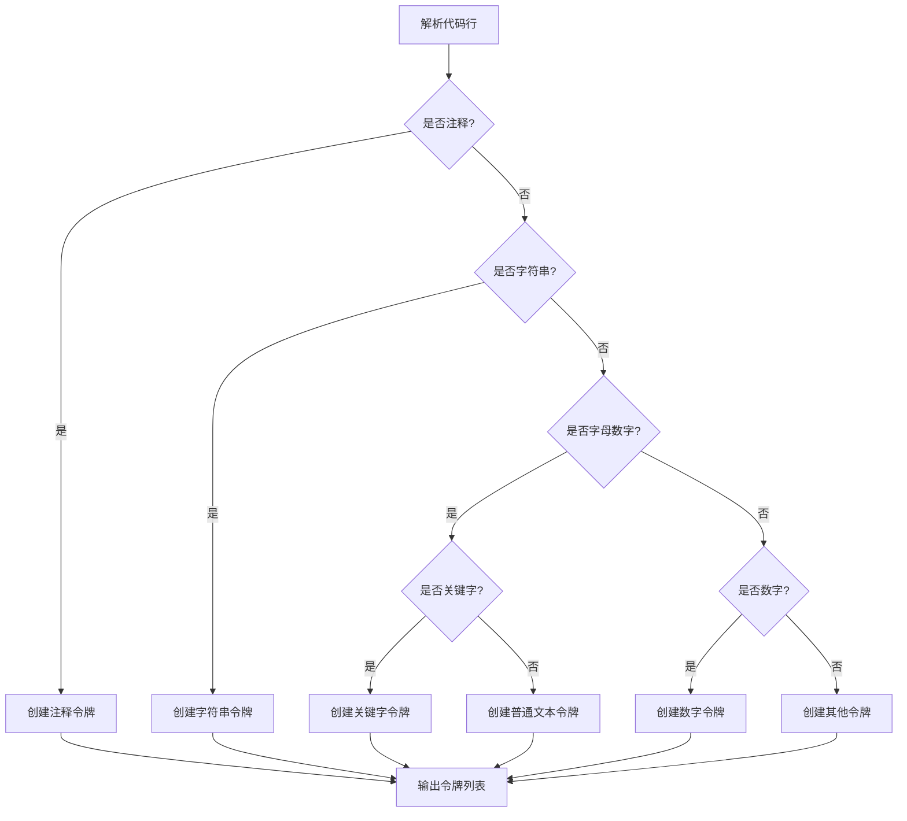
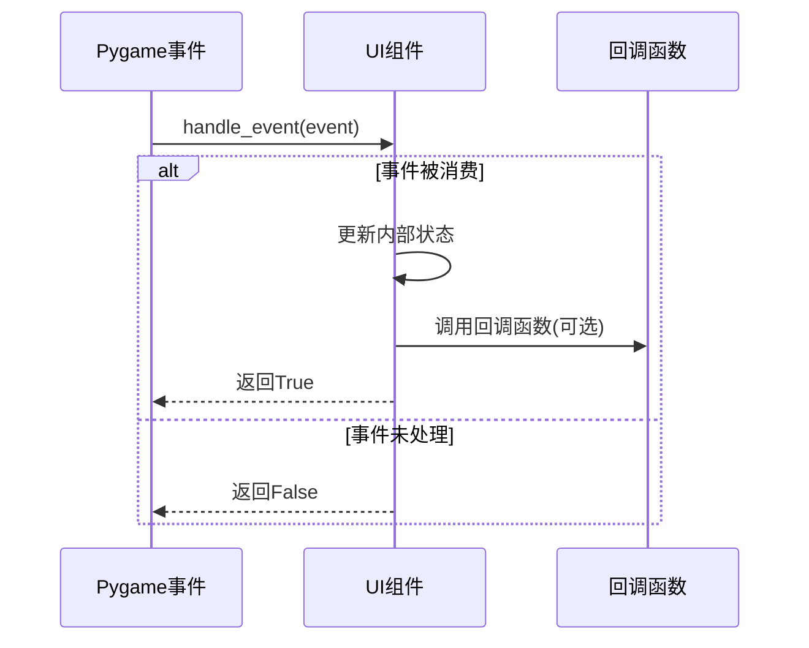
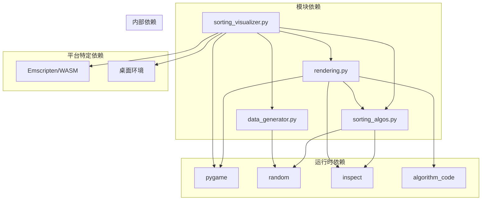
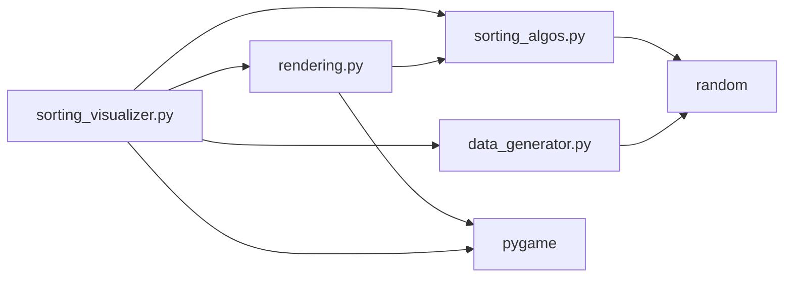

# API参考手册

<cite>
**本文档引用的文件**
- [sorting_visualizer.py](file://sorting_visualizer.py)
- [sorting_algos.py](file://sorting_algos.py)
- [rendering.py](file://rendering.py)
- [data_generator.py](file://data_generator.py)
</cite>

## 目录
1. [简介](#简介)
2. [项目结构](#项目结构)
3. [核心组件](#核心组件)
4. [架构概览](#架构概览)
5. [详细组件分析](#详细组件分析)
6. [依赖关系分析](#依赖关系分析)
7. [性能考虑](#性能考虑)
8. [故障排除指南](#故障排除指南)
9. [结论](#结论)
10. [附录](#附录)

## 简介

这是一个基于Pygame的数据结构可视化项目，专门用于演示各种排序算法的工作原理。该项目将复杂的算法逻辑转换为直观的动画效果，帮助用户理解不同排序算法的时间复杂度、空间复杂度和执行流程。

项目采用模块化设计，包含四个主要模块：
- **sorting_visualizer.py**: 主程序控制器，管理整个可视化流程
- **sorting_algos.py**: 包含19种排序算法的实现，全部为生成器函数
- **rendering.py**: UI组件和绘制功能
- **data_generator.py**: 数据生成工具

## 项目结构



**图表来源**
- [sorting_visualizer.py:1-50](file://sorting_visualizer.py#L1-L50)
- [sorting_algos.py:1-10](file://sorting_algos.py#L1-L10)
- [rendering.py:1-15](file://rendering.py#L1-L15)
- [data_generator.py:1-10](file://data_generator.py#L1-L10)

**章节来源**
- [sorting_visualizer.py:1-50](file://sorting_visualizer.py#L1-L50)
- [sorting_algos.py:1-10](file://sorting_algos.py#L1-L10)
- [rendering.py:1-15](file://rendering.py#L1-L15)
- [data_generator.py:1-10](file://data_generator.py#L1-L10)

## 核心组件

### SortingVisualizer 类

SortingVisualizer 是整个应用程序的核心控制器类，负责协调所有组件的交互和数据流。

#### 构造函数
```python
def __init__(self, wasm_size=None):
    """
    初始化排序可视化器
    
    参数:
        wasm_size: (w, h) 浏览器固定画布大小，None 时使用桌面模式
    """
```

#### 主要属性

| 属性名 | 类型 | 描述 | 默认值 |
|--------|------|------|--------|
| `is_wasm` | bool | 是否在WebAssembly环境中运行 | False |
| `screen_w` | int | 屏幕宽度 | 自动计算 |
| `screen_h` | int | 屏幕高度 | 自动计算 |
| `screen` | Surface | Pygame屏幕对象 | None |
| `clock` | Clock | 游戏时钟 | None |
| `font_sm` | Font | 小号字体 | None |
| `font_md` | Font | 中号字体 | None |
| `font_lg` | Font | 大号字体 | None |
| `count` | int | 数组大小 | 100 |
| `array` | list | 当前数组数据 | [] |
| `highlight` | list | 高亮索引列表 | [] |
| `sorted_done` | bool | 排序是否完成 | False |
| `cmp_count` | int | 比较次数 | 0 |
| `swap_count` | int | 交换次数 | 0 |
| `speed_idx` | int | 速度级别索引 | 2 |
| `running` | bool | 是否正在运行 | False |
| `paused` | bool | 是否暂停 | False |
| `generator` | generator | 当前排序生成器 | None |
| `algo_type` | str | 算法类型 ("basic" 或 "fun") | "basic" |
| `algo_name` | str | 当前算法名称 | BASIC_ALGOS[0] |

#### 主要方法

##### 运行时控制方法
- `_start_sort()`: 开始排序过程
- `_pause_sort()`: 暂停/恢复排序
- `_reset()`: 重置到初始状态
- `_generate_random()`: 生成新的随机数组

##### 事件处理方法
- `_process_events()`: 处理所有用户输入事件
- `_advance_generator()`: 推进排序生成器
- `_handle_resize(w, h)`: 处理窗口大小变化

##### 绘制方法
- `_draw_bars()`: 绘制柱状图
- `_draw_ctrl()`: 绘制控制栏
- `_draw()`: 完整的帧绘制

##### 主循环方法
- `run()`: 桌面模式主循环
- `run_async()`: Web模式主循环

**章节来源**
- [sorting_visualizer.py:62-113](file://sorting_visualizer.py#L62-L113)
- [sorting_visualizer.py:115-144](file://sorting_visualizer.py#L115-L144)
- [sorting_visualizer.py:146-178](file://sorting_visualizer.py#L146-L178)
- [sorting_visualizer.py:180-196](file://sorting_visualizer.py#L180-L196)
- [sorting_visualizer.py:198-206](file://sorting_visualizer.py#L198-L206)
- [sorting_visualizer.py:208-234](file://sorting_visualizer.py#L208-L234)
- [sorting_visualizer.py:235-244](file://sorting_visualizer.py#L235-L244)
- [sorting_visualizer.py:245-262](file://sorting_visualizer.py#L245-L262)
- [sorting_visualizer.py:263-267](file://sorting_visualizer.py#L263-L267)
- [sorting_visualizer.py:269-287](file://sorting_visualizer.py#L269-L287)
- [sorting_visualizer.py:289-312](file://sorting_visualizer.py#L289-L312)
- [sorting_visualizer.py:313-356](file://sorting_visualizer.py#L313-L356)
- [sorting_visualizer.py:357-384](file://sorting_visualizer.py#L357-L384)
- [sorting_visualizer.py:386-458](file://sorting_visualizer.py#L386-L458)
- [sorting_visualizer.py:461-476](file://sorting_visualizer.py#L461-L476)

### 排序算法模块

sorting_algos.py 包含19种排序算法，全部实现为生成器函数，每次迭代产生 `(array, highlight_indices, swap_count, cmp_count)` 元组。

#### 算法分类

##### 基础排序算法 (10种)
- 冒泡排序 (Bubble Sort)
- 选择排序 (Selection Sort)
- 插入排序 (Insertion Sort)
- 快速排序 (Quick Sort)
- 归并排序 (Merge Sort)
- 希尔排序 (Shell Sort)
- 堆排序 (Heap Sort)
- 桶排序 (Bucket Sort)
- 计数排序 (Counting Sort)
- 基数排序 (Radix Sort)

##### 趣味排序算法 (9种)
- 猴子排序 (Monkey Sort)
- 睡眠排序 (Sleep Sort)
- 面条排序 (Noodle Sort)
- 斯大林排序 (Stalin Sort)
- 鸡尾酒排序 (Cocktail Sort)
- 慢排序 (Slow Sort)
- 煎饼排序 (Pancake Sort)
- 珠排序 (Bead Sort)
- 鸽巢排序 (Pigeonhole Sort)

#### 算法接口规范

所有算法函数遵循统一的生成器接口：

```python
def algorithm_name(arr):
    """
    生成器函数，逐步返回排序过程的状态
    
    参数:
        arr: 待排序的数组副本
    
    返回:
        生成器，每次产生四元组:
        (array: list[int], 
         highlight_indices: list[int], 
         swap_count: int, 
         cmp_count: int)
    """
```

**章节来源**
- [sorting_algos.py:12-25](file://sorting_algos.py#L12-L25)
- [sorting_algos.py:35-48](file://sorting_algos.py#L35-L48)
- [sorting_algos.py:50-66](file://sorting_algos.py#L50-L66)
- [sorting_algos.py:68-87](file://sorting_algos.py#L68-L87)
- [sorting_algos.py:89-121](file://sorting_algos.py#L89-L121)
- [sorting_algos.py:123-153](file://sorting_algos.py#L123-L153)
- [sorting_algos.py:155-177](file://sorting_algos.py#L155-L177)
- [sorting_algos.py:179-221](file://sorting_algos.py#L179-L221)
- [sorting_algos.py:223-247](file://sorting_algos.py#L223-L247)
- [sorting_algos.py:249-271](file://sorting_algos.py#L249-L271)
- [sorting_algos.py:273-300](file://sorting_algos.py#L273-L300)
- [sorting_algos.py:306-327](file://sorting_algos.py#L306-L327)
- [sorting_algos.py:329-357](file://sorting_algos.py#L329-L357)
- [sorting_algos.py:359-385](file://sorting_algos.py#L359-L385)
- [sorting_algos.py:387-409](file://sorting_algos.py#L387-L409)
- [sorting_algos.py:411-432](file://sorting_algos.py#L411-L432)
- [sorting_algos.py:434-453](file://sorting_algos.py#L434-L453)
- [sorting_algos.py:455-466](file://sorting_algos.py#L455-L466)
- [sorting_algos.py:468-484](file://sorting_algos.py#L468-L484)
- [sorting_algos.py:486-502](file://sorting_algos.py#L486-L502)

### UI组件模块

rendering.py 提供了完整的用户界面组件系统，包括颜色常量、绘制工具和各种UI控件。

#### 颜色常量

```python
# 基础颜色
BLACK   = (0,   0,   0)
WHITE   = (255, 255, 255)
BLUE    = (30,  100, 255)
YELLOW  = (255, 220, 0)
GREEN   = (0,   220, 80)
RED     = (220, 50,  50)
CYAN    = (0,   220, 220)

# 辅助颜色
ORANGE  = (255, 140, 0)
PURPLE  = (160, 60,  200)
GRAY    = (80,  80,  80)
LGRAY   = (140, 140, 140)
DKBLUE  = (10,  30,  80)
TEAL    = (0,   180, 160)
PINK    = (220, 60,  120)
```

#### UI组件类

##### CodePanel 类
代码面板组件，用于显示算法源码并支持滚动和语法高亮。

**构造函数**
```python
def __init__(self):
    self.visible = False
    self.algo_name = ""
    self.lines = []
    self.tokens = []
    self.scroll = 0
    self.font_code = None
    self.font_title = None
    self.font_sm = None
    self._drag_sb = False
```

**主要方法**
- `setup_fonts(font_code, font_title, font_sm)`: 设置字体
- `show(algo_name: str, screen_w: int, screen_h: int)`: 显示面板
- `hide()`: 隐藏面板
- `draw(surface)`: 绘制面板
- `handle_event(event, screen_w, screen_h)`: 处理事件

##### DropDown 类
下拉菜单组件。

**构造函数**
```python
def __init__(self, x, y, w, h, options, font, label=""):
    self.rect = pygame.Rect(x, y, w, h)
    self.options = options
    self.font = font
    self.label = label
    self.selected = 0
    self.expanded = False
    self.hover_idx = -1
```

**主要方法**
- `draw(surface)`: 绘制下拉菜单
- `handle_event(event)`: 处理事件，返回是否选择了新选项

##### Button 类
按钮组件。

**构造函数**
```python
def __init__(self, x, y, w, h, text, color, text_color=WHITE, font=None):
    self.rect = pygame.Rect(x, y, w, h)
    self.text = text
    self.color = color
    self.hover_color = tuple(min(255, c+50) for c in color)
    self.text_color = text_color
    self.font = font
    self.hovered = False
```

**主要方法**
- `draw(surface)`: 绘制按钮
- `handle_event(event)`: 处理事件，返回是否被点击

##### CountDialog 类
数量设置对话框，支持滑块拖动和直接输入。

**构造函数**
```python
def __init__(self, screen_w, screen_h, font_md, font_sm, on_change=None):
    self.visible = False
    self.font = font_md
    self.font_sm = font_sm
    self.value = 100
    self.text = "100"
    self.dragging = False
    self.input_active = False
    self._on_change = on_change
    self._layout(screen_w, screen_h)
```

**主要方法**
- `show(current_val)`: 显示对话框
- `hide()`: 隐藏对话框
- `draw(surface)`: 绘制对话框
- `handle_event(event)`: 处理事件，返回确认的数值或None

**章节来源**
- [rendering.py:16-30](file://rendering.py#L16-L30)
- [rendering.py:110-142](file://rendering.py#L110-L142)
- [rendering.py:144-166](file://rendering.py#L144-L166)
- [rendering.py:167-279](file://rendering.py#L167-L279)
- [rendering.py:284-349](file://rendering.py#L284-L349)
- [rendering.py:354-379](file://rendering.py#L354-L379)
- [rendering.py:384-557](file://rendering.py#L384-L557)

### 数据生成模块

data_generator.py 提供了数据生成工具，主要用于创建排序算法的测试数据。

#### 主要函数

##### generate_random_array 函数
```python
def generate_random_array(count, min_val=1, max_val=1000):
    """
    生成随机整数数组
    
    参数:
        count: 数组长度
        min_val: 最小值（含）
        max_val: 最大值（含）
    
    返回:
        list[int]: 长度为 count 的随机整数列表
    """
```

##### create_sort_state 函数
```python
def create_sort_state():
    """
    创建排序初始状态字典
    
    返回:
        dict: 包含排序状态的字典
    """
```

**章节来源**
- [data_generator.py:11-23](file://data_generator.py#L11-L23)
- [data_generator.py:26-48](file://data_generator.py#L26-L48)

## 架构概览



**图表来源**
- [sorting_visualizer.py:386-458](file://sorting_visualizer.py#L386-L458)
- [sorting_visualizer.py:269-287](file://sorting_visualizer.py#L269-L287)
- [sorting_algos.py:507-550](file://sorting_algos.py#L507-L550)

### 类继承关系图



**图表来源**
- [sorting_visualizer.py:62-113](file://sorting_visualizer.py#L62-L113)
- [rendering.py:110-142](file://rendering.py#L110-L142)
- [rendering.py:284-349](file://rendering.py#L284-L349)
- [rendering.py:354-379](file://rendering.py#L354-L379)
- [rendering.py:384-557](file://rendering.py#L384-L557)

## 详细组件分析

### SortingVisualizer 类详细分析

#### 事件处理流程



**图表来源**
- [sorting_visualizer.py:386-458](file://sorting_visualizer.py#L386-L458)

#### 排序生成器推进机制



**图表来源**
- [sorting_visualizer.py:269-287](file://sorting_visualizer.py#L269-L287)

### 排序算法详细分析

#### 算法生成器协议

所有排序算法都遵循相同的生成器协议，确保一致的用户体验：



**图表来源**
- [sorting_algos.py:35-48](file://sorting_algos.py#L35-L48)
- [sorting_algos.py:50-66](file://sorting_algos.py#L50-L66)

#### 性能特征对比

| 算法类型 | 时间复杂度(平均) | 时间复杂度(最坏) | 空间复杂度 | 稳定性 |
|----------|------------------|------------------|------------|--------|
| 基础排序 | O(n²) 到 O(n log n) | O(n²) 到 O(n²) | O(1) 到 O(n) | 部分稳定 |
| 趣味排序 | O(∞) 到 O(n log n) | O(∞) 到 O(n log n) | O(1) 到 O(n) | 不稳定 |

**章节来源**
- [sorting_algos.py:35-300](file://sorting_algos.py#L35-L300)

### UI组件详细分析

#### CodePanel 语法高亮机制



**图表来源**
- [rendering.py:59-104](file://rendering.py#L59-L104)

#### 事件回调机制

UI组件采用统一的事件处理模式：



**图表来源**
- [rendering.py:241-279](file://rendering.py#L241-L279)
- [rendering.py:317-349](file://rendering.py#L317-L349)
- [rendering.py:372-379](file://rendering.py#L372-L379)

**章节来源**
- [rendering.py:110-279](file://rendering.py#L110-L279)
- [rendering.py:284-379](file://rendering.py#L284-L379)
- [rendering.py:384-557](file://rendering.py#L384-L557)

## 依赖关系分析



**图表来源**
- [sorting_visualizer.py:17-47](file://sorting_visualizer.py#L17-L47)
- [sorting_algos.py:564-587](file://sorting_algos.py#L564-L587)
- [rendering.py:10](file://rendering.py#L10)

### 模块导入关系



**图表来源**
- [sorting_visualizer.py:34-47](file://sorting_visualizer.py#L34-L47)
- [rendering.py:8-11](file://rendering.py#L8-L11)

**章节来源**
- [sorting_visualizer.py:17-47](file://sorting_visualizer.py#L17-L47)
- [sorting_algos.py:564-587](file://sorting_algos.py#L564-L587)
- [rendering.py:8-11](file://rendering.py#L8-L11)

## 性能考虑

### 时间复杂度优化

1. **生成器模式**: 所有算法实现为生成器，避免一次性计算所有步骤
2. **按需渲染**: 只在状态变化时触发重绘
3. **速度调节**: 支持10个预设速度级别，范围从0.25x到128x

### 内存使用优化

1. **原地排序**: 大多数算法在原数组上进行操作
2. **状态复用**: 使用共享状态对象减少内存分配
3. **渐进加载**: 代码面板按需加载和渲染

### 平台适配

1. **WASM支持**: 检测Emscripten环境，禁用某些桌面特性
2. **字体回退**: 提供多级字体回退策略
3. **资源管理**: 条件加载外部资源文件

## 故障排除指南

### 常见问题及解决方案

#### 字体显示问题
**症状**: 文字显示为默认字体或乱码  
**原因**: 缺少指定字体文件  
**解决方案**: 
- 确保字体文件存在于程序目录
- 检查字体文件权限
- 系统字体回退机制会自动启用

#### 算法源码无法显示
**症状**: 算法代码面板空白  
**原因**: 源码提取失败  
**解决方案**:
- 检查算法名称是否正确
- 确认算法函数存在
- 检查网络连接(WASM环境)

#### 性能问题
**症状**: 界面卡顿或响应缓慢  
**原因**: 数据量过大或速度过快  
**解决方案**:
- 减少数据量(1-1000)
- 降低播放速度
- 关闭不必要的特效

#### 事件处理问题
**症状**: 按钮无响应或对话框无法关闭  
**原因**: 事件冒泡或焦点丢失  
**解决方案**:
- 确保事件循环正常运行
- 检查鼠标位置是否在有效区域内
- 重启应用程序

**章节来源**
- [sorting_visualizer.py:235-244](file://sorting_visualizer.py#L235-L244)
- [sorting_algos.py:559-600](file://sorting_algos.py#L559-L600)
- [rendering.py:241-279](file://rendering.py#L241-L279)

## 结论

这个排序算法可视化项目展示了如何将复杂的算法概念转化为直观的可视化体验。通过模块化设计和生成器模式，项目实现了高效、可扩展的算法演示系统。

### 主要优势

1. **教育价值**: 直观展示算法执行过程
2. **技术先进**: 使用现代Python特性和最佳实践
3. **跨平台**: 支持桌面和Web环境
4. **可扩展性**: 模块化架构便于添加新算法

### 技术特色

1. **生成器驱动**: 实现渐进式算法演示
2. **事件驱动**: 响应式的用户交互
3. **模块化设计**: 清晰的职责分离
4. **平台适配**: 智能的环境检测和适配

## 附录

### 版本兼容性和变更历史

由于项目结构相对简单，版本变更主要体现在以下方面：

#### 版本 1.0 (当前版本)
- 基础功能完整实现
- 19种排序算法支持
- 完整的UI组件系统
- WASM/Web兼容性

#### 可能的未来改进方向
- 添加更多排序算法
- 增强交互功能
- 支持自定义算法
- 优化性能表现

### 错误处理机制

项目采用了多层次的错误处理策略：

1. **异常捕获**: 关键操作都有try-except保护
2. **回退机制**: 字体、源码提取等都有备用方案
3. **状态验证**: 事件处理前验证组件状态
4. **资源清理**: 正确释放Pygame资源

### 最佳实践建议

1. **算法学习**: 从基础算法开始，逐步学习高级算法
2. **性能观察**: 注意不同算法的性能差异
3. **交互体验**: 利用速度调节功能深入理解算法
4. **代码学习**: 通过源码面板学习算法实现细节