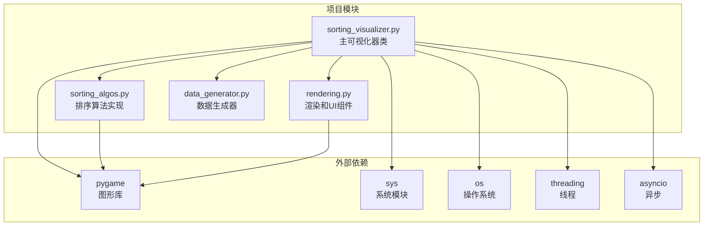
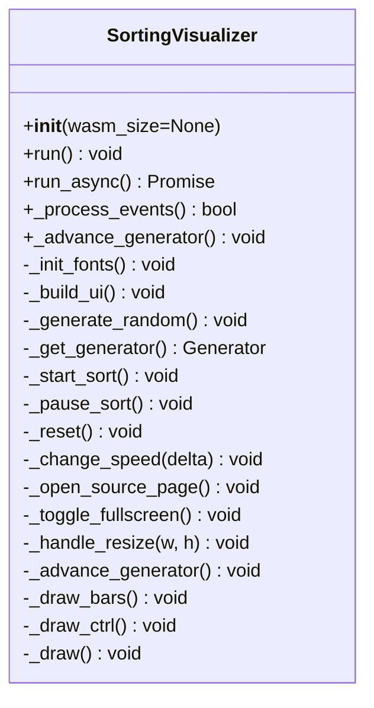
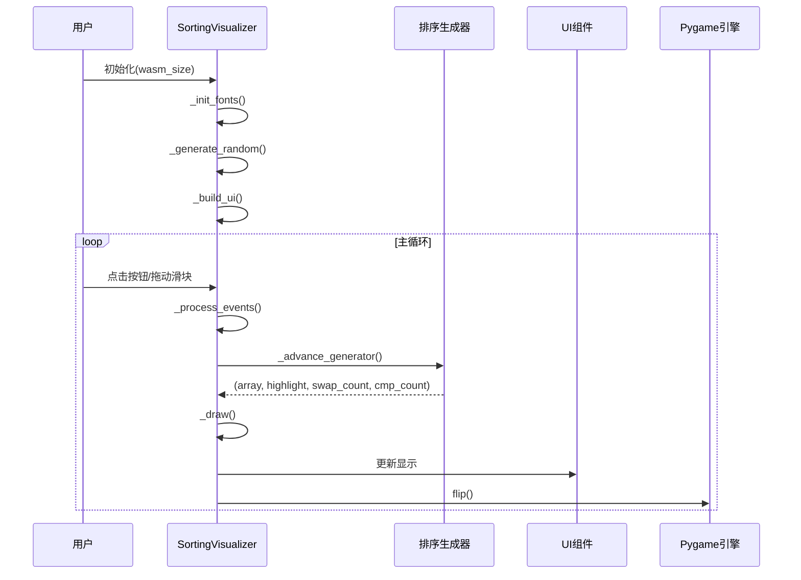
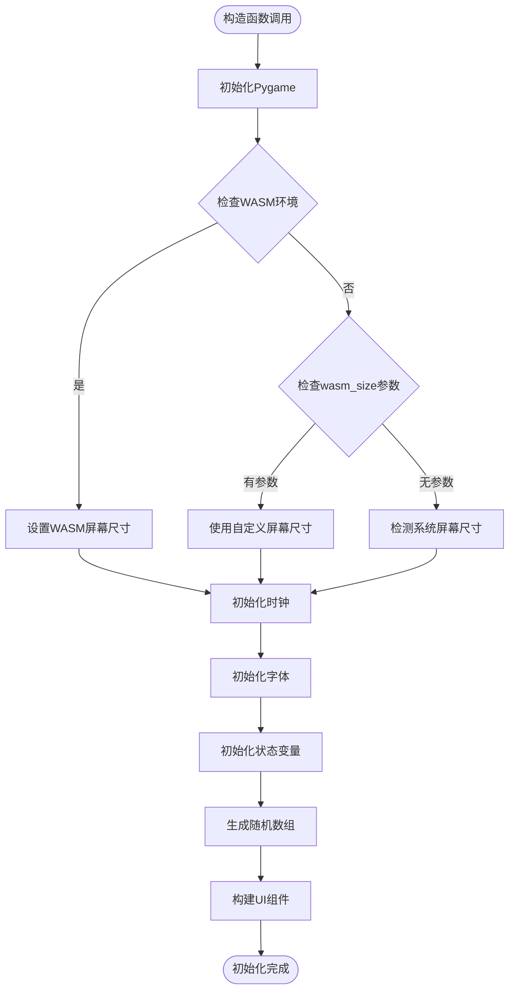
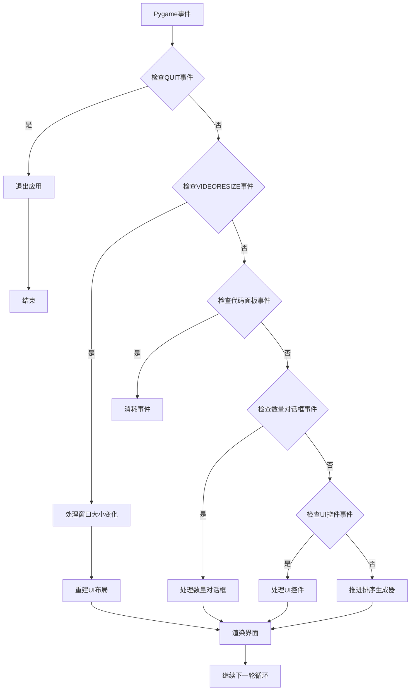
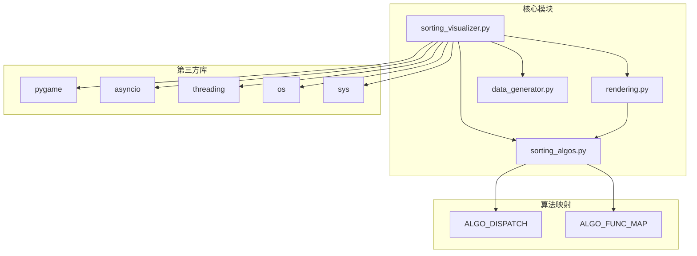

# SortingVisualizer类API

<cite>
**本文档引用的文件**
- [sorting_visualizer.py](file://sorting_visualizer.py)
- [sorting_algos.py](file://sorting_algos.py)
- [rendering.py](file://rendering.py)
- [data_generator.py](file://data_generator.py)
</cite>

## 目录
1. [简介](#简介)
2. [项目结构](#项目结构)
3. [核心组件](#核心组件)
4. [架构概览](#架构概览)
5. [详细组件分析](#详细组件分析)
6. [依赖关系分析](#依赖关系分析)
7. [性能考虑](#性能考虑)
8. [故障排除指南](#故障排除指南)
9. [结论](#结论)

## 简介

SortingVisualizer类是Python数据可视化项目的核心组件，用于实时展示各种排序算法的执行过程。该类实现了基于Pygame的图形用户界面，能够可视化19种不同的排序算法，包括经典的冒泡排序、快速排序等基础算法，以及猴子排序、睡眠排序等趣味算法。

该项目采用模块化设计，将排序算法逻辑、渲染功能和UI组件分离到不同的模块中，便于维护和扩展。支持桌面环境和WebAssembly(WASM)两种运行模式，具有良好的跨平台兼容性。

## 项目结构

项目采用清晰的模块化架构，主要包含以下四个核心文件：

**图表来源**
- [sorting_visualizer.py:1-50](file://sorting_visualizer.py#L1-L50)
- [sorting_algos.py:1-20](file://sorting_algos.py#L1-L20)
- [rendering.py:1-15](file://rendering.py#L1-L15)

**章节来源**
- [sorting_visualizer.py:1-50](file://sorting_visualizer.py#L1-L50)
- [sorting_algos.py:1-20](file://sorting_algos.py#L1-L20)
- [rendering.py:1-15](file://rendering.py#L1-L15)

## 核心组件

### SortingVisualizer类概述

SortingVisualizer类是整个项目的主控制器，负责协调所有组件的工作流程。该类实现了完整的事件驱动架构，支持同步和异步两种运行模式。

#### 构造函数参数详解

**图表来源**
- [sorting_visualizer.py:62-490](file://sorting_visualizer.py#L62-L490)

**章节来源**
- [sorting_visualizer.py:62-113](file://sorting_visualizer.py#L62-L113)

### 实例属性详解

| 属性名 | 类型 | 默认值 | 描述 |
|--------|------|--------|------|
| `count` | int | 100 | 当前数组元素数量 |
| `array` | list[int] | [] | 当前要排序的数组 |
| `highlight` | list[int] | [] | 当前需要高亮显示的索引列表 |
| `sorted_done` | bool | False | 排序是否已完成 |
| `cmp_count` | int | 0 | 比较操作次数 |
| `swap_count` | int | 0 | 交换操作次数 |
| `speed_idx` | int | 2 | 速度级别索引，默认1.0倍速 |
| `running` | bool | False | 是否正在运行排序 |
| `paused` | bool | False | 是否处于暂停状态 |
| `generator` | Generator | None | 当前排序算法的生成器 |
| `algo_type` | str | "basic" | 算法类型："basic"或"fun" |
| `algo_name` | str | "冒泡排序" | 当前选择的算法名称 |

**章节来源**
- [sorting_visualizer.py:94-106](file://sorting_visualizer.py#L94-L106)

## 架构概览

项目采用事件驱动的双模式架构，支持桌面和Web运行环境：

**图表来源**
- [sorting_visualizer.py:464-479](file://sorting_visualizer.py#L464-L479)
- [sorting_visualizer.py:386-461](file://sorting_visualizer.py#L386-L461)

**章节来源**
- [sorting_visualizer.py:464-479](file://sorting_visualizer.py#L464-L479)
- [sorting_visualizer.py:386-461](file://sorting_visualizer.py#L386-L461)

## 详细组件分析

### 构造函数详细分析

#### 参数说明

**wasm_size参数**
- **类型**: tuple[int, int] 或 None
- **作用**: 指定浏览器WASM模式下的固定画布尺寸
- **默认行为**: 当为None时，自动检测屏幕分辨率
- **应用场景**: Web环境部署时确保一致的显示效果

#### 初始化过程

**图表来源**
- [sorting_visualizer.py:63-113](file://sorting_visualizer.py#L63-L113)

**章节来源**
- [sorting_visualizer.py:63-113](file://sorting_visualizer.py#L63-L113)

### 主要方法详解

#### run() 方法

**方法签名**: `run() -> None`

**功能描述**: 桌面模式的主事件循环，使用同步方式处理所有事件和渲染。

**参数**: 无

**返回值**: 无（无限循环直到用户退出）

**工作流程**:
1. 设置帧率限制(FPS=60)
2. 处理事件循环
3. 调用 `_process_events()` 进行事件处理
4. 渲染界面
5. 重复执行

**章节来源**
- [sorting_visualizer.py:464-471](file://sorting_visualizer.py#L464-L471)

#### run_async() 方法

**方法签名**: `run_async() -> Awaitable[None]`

**功能描述**: WebAssembly模式的异步主循环，适用于浏览器环境。

**参数**: 无

**返回值**: 异步协程对象

**工作流程**:
1. 设置帧率限制(FPS=60)
2. 处理事件循环
3. 调用 `_process_events()` 进行事件处理
4. 调用 `await asyncio.sleep(0)` 让出控制权给浏览器事件循环
5. 重复执行

**章节来源**
- [sorting_visualizer.py:472-479](file://sorting_visualizer.py#L472-L479)

#### _process_events() 方法

**方法签名**: `_process_events() -> bool`

**功能描述**: 通用事件处理方法，被 `run()` 和 `run_async()` 调用。

**参数**: 无

**返回值**: bool - 是否继续运行(True表示继续，False表示退出)

**事件处理流程**:
1. 处理Pygame事件队列
2. 处理代码面板事件
3. 处理数量设置对话框事件
4. 处理UI控件事件
5. 调用 `_advance_generator()` 推进排序
6. 调用 `_draw()` 进行渲染

**章节来源**
- [sorting_visualizer.py:386-461](file://sorting_visualizer.py#L386-L461)

#### _advance_generator() 方法

**方法签名**: `_advance_generator() -> None`

**功能描述**: 根据当前速度级别推进排序生成器执行。

**参数**: 无

**返回值**: 无

**执行逻辑**:
1. 检查运行状态和暂停状态
2. 计算每帧执行的步数：`steps = max(1, int(speed))`
3. 循环执行指定步数
4. 从生成器获取新的状态元组
5. 更新数组、高亮索引、统计计数
6. 处理排序完成情况

**章节来源**
- [sorting_visualizer.py:269-287](file://sorting_visualizer.py#L269-L287)

### UI交互接口

#### 按钮组件

| 按钮 | 功能 | 触发事件 |
|------|------|----------|
| 开始 | 启动/继续排序 | `_start_sort()` |
| 暂停 | 暂停/恢复排序 | `_pause_sort()` |
| 重置 | 重新生成数组 | `_reset()` |
| 加速 | 提高速度级别 | `_change_speed(+1)` |
| 减速 | 降低速度级别 | `_change_speed(-1)` |
| 随机生成 | 重新生成随机数组 | `_generate_random()` |
| 设置数量 | 打开数量设置对话框 | `CountDialog.show()` |
| 全屏 | 切换全屏模式 | `_toggle_fullscreen()` |
| 算法代码 | 显示/隐藏算法源码 | `CodePanel.show()/hide()` |

**章节来源**
- [sorting_visualizer.py:154-162](file://sorting_visualizer.py#L154-L162)
- [sorting_visualizer.py:435-457](file://sorting_visualizer.py#L435-L457)

#### 下拉菜单

- **基础排序**: 包含10种经典排序算法
- **趣味排序**: 包含9种创意排序算法  
- **切换逻辑**: 通过 `btn_basic_tab` 和 `btn_fun_tab` 切换算法类型

**章节来源**
- [sorting_visualizer.py:150-151](file://sorting_visualizer.py#L150-L151)
- [sorting_visualizer.py:425-433](file://sorting_visualizer.py#L425-L433)

### 事件处理机制

**图表来源**
- [sorting_visualizer.py:386-461](file://sorting_visualizer.py#L386-L461)

**章节来源**
- [sorting_visualizer.py:386-461](file://sorting_visualizer.py#L386-L461)

## 依赖关系分析

### 模块间依赖关系

**图表来源**
- [sorting_visualizer.py:34-47](file://sorting_visualizer.py#L34-L47)
- [sorting_algos.py:507-550](file://sorting_algos.py#L507-L550)

### 算法分类

项目包含两类排序算法，共19种：

#### 基础排序算法（10种）
- 冒泡排序
- 选择排序  
- 插入排序
- 快速排序
- 归并排序
- 希尔排序
- 堆排序
- 桶排序
- 计数排序
- 基数排序

#### 趣味排序算法（9种）
- 猴子排序
- 睡眠排序
- 面条排序
- 斯大林排序
- 鸡尾酒排序
- 慢排序
- 煎饼排序
- 珠排序
- 鸽巢排序

**章节来源**
- [sorting_algos.py:13-24](file://sorting_algos.py#L13-L24)
- [sorting_algos.py:507-550](file://sorting_algos.py#L507-L550)

## 性能考虑

### 速度控制机制

系统实现了灵活的速度控制系统：

| 速度级别 | 倍数值 | 用途 |
|----------|--------|------|
| 0 | 0.25x | 极慢速，适合学习理解 |
| 1 | 0.5x | 慢速，观察算法细节 |
| 2 | 1.0x | 标准速度，平衡学习和效率 |
| 3 | 2.0x | 中速，快速演示 |
| 4 | 4.0x | 快速，算法对比 |
| 5 | 8.0x | 更快速度 |
| 6 | 16.0x | 非常快速 |
| 7 | 32.0x | 极快速度 |
| 8 | 64.0x | 超快速度 |
| 9 | 128.0x | 最快速度 |

**章节来源**
- [sorting_visualizer.py:56](file://sorting_visualizer.py#L56)
- [sorting_visualizer.py:232-233](file://sorting_visualizer.py#L232-L233)

### 内存管理

- **数组复制**: 在启动排序时对数组进行浅拷贝，避免修改原始数据
- **生成器模式**: 使用生成器函数逐帧产生状态，减少内存占用
- **字体缓存**: 预加载字体资源，避免重复I/O操作

### 渲染优化

- **增量更新**: 仅更新发生变化的UI元素
- **批量绘制**: 将多个绘制操作合并执行
- **条件渲染**: 根据状态决定是否进行昂贵的渲染操作

## 故障排除指南

### 常见问题及解决方案

#### Pygame初始化失败
**症状**: 应用启动时报错
**原因**: 缺少Pygame依赖或环境配置问题
**解决**: `pip install pygame`

#### 字体加载失败
**症状**: 文本显示异常或使用默认字体
**原因**: 系统缺少指定字体文件
**解决**: 确保字体文件存在于指定路径或安装系统字体

#### WASM模式运行异常
**症状**: 浏览器中显示空白或功能异常
**原因**: pygbag环境配置问题
**解决**: 检查pygbag版本和配置，确保正确打包

#### 性能问题
**症状**: 帧率低或卡顿
**解决**: 
1. 降低数据量 (`count`属性)
2. 减慢速度级别 (`speed_idx`属性)
3. 关闭不必要的UI组件

**章节来源**
- [sorting_visualizer.py:115-144](file://sorting_visualizer.py#L115-L144)
- [sorting_visualizer.py:237-243](file://sorting_visualizer.py#L237-L243)

## 结论

SortingVisualizer类是一个设计精良的数据可视化组件，具有以下特点：

1. **模块化设计**: 清晰的职责分离，便于维护和扩展
2. **跨平台支持**: 同时支持桌面和Web环境
3. **丰富的算法库**: 包含19种不同类型的排序算法
4. **直观的用户界面**: 提供完整的交互控制和状态反馈
5. **灵活的配置选项**: 支持多种参数调整和自定义

该类为学习和研究排序算法提供了优秀的可视化平台，既适合教学演示，也适合算法性能对比分析。通过合理的架构设计和性能优化，能够在保证用户体验的同时提供准确的算法执行可视化。