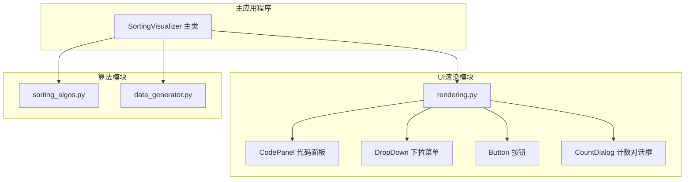
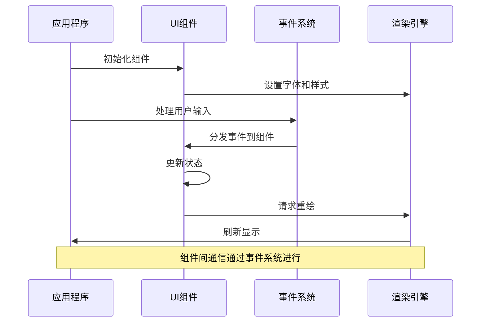
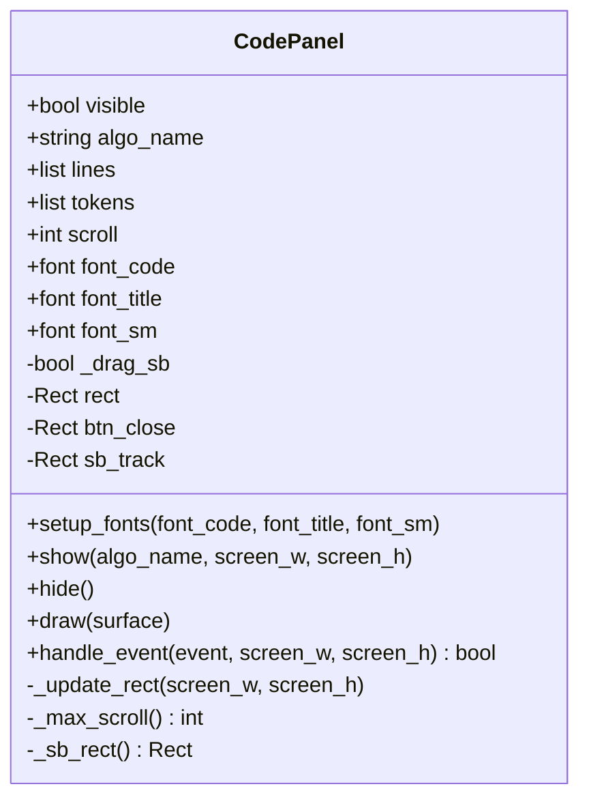
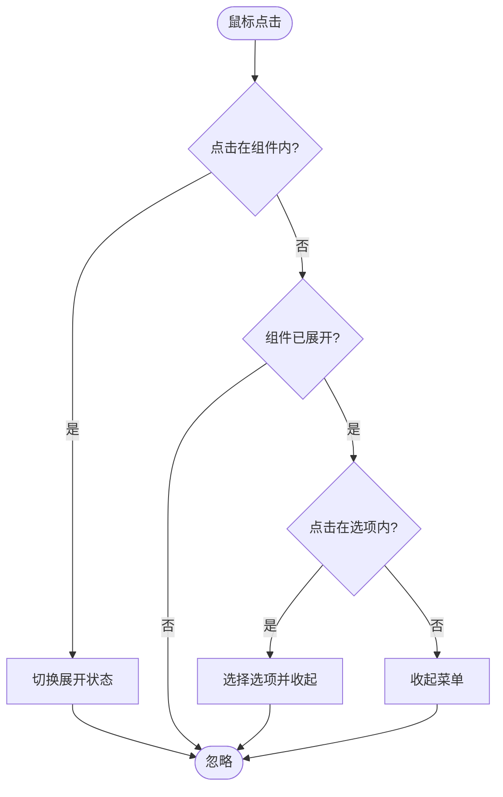
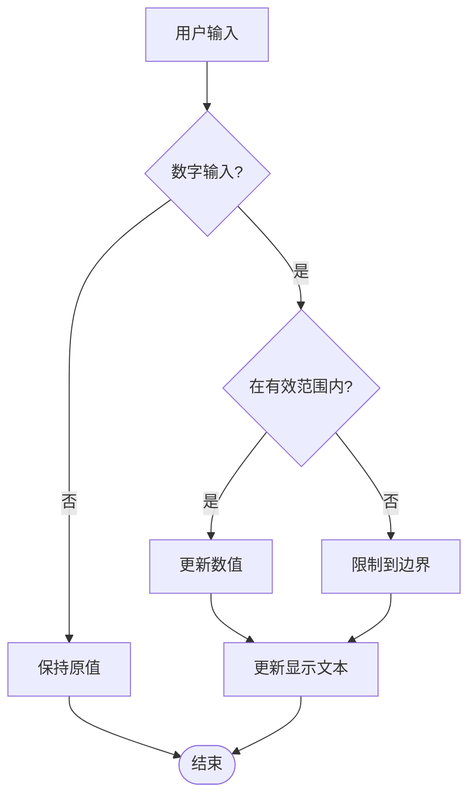
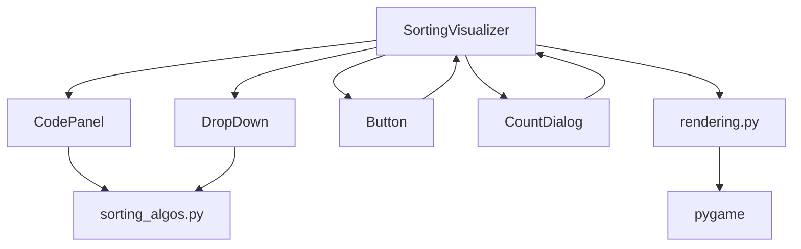

# UI组件API

<cite>
**本文档引用的文件**
- [rendering.py](file://rendering.py)
- [sorting_visualizer.py](file://sorting_visualizer.py)
- [sorting_algos.py](file://sorting_algos.py)
- [data_generator.py](file://data_generator.py)
</cite>

## 目录
1. [简介](#简介)
2. [项目结构](#项目结构)
3. [核心组件](#核心组件)
4. [架构概览](#架构概览)
5. [详细组件分析](#详细组件分析)
6. [依赖关系分析](#依赖关系分析)
7. [性能考虑](#性能考虑)
8. [故障排除指南](#故障排除指南)
9. [结论](#结论)

## 简介

这是一个基于Pygame的排序算法可视化工具，专注于提供直观的用户界面和丰富的交互体验。该系统包含了完整的UI渲染模块，提供了多种可复用的组件，支持实时数据可视化、算法演示和代码展示功能。

## 项目结构

该项目采用模块化设计，主要包含以下核心模块：

**图表来源**
- [sorting_visualizer.py:62-113](file://sorting_visualizer.py#L62-L113)
- [rendering.py:110-280](file://rendering.py#L110-L280)

**章节来源**
- [sorting_visualizer.py:1-490](file://sorting_visualizer.py#L1-L490)
- [rendering.py:1-564](file://rendering.py#L1-L564)

## 核心组件

UI渲染模块提供了四个主要的用户界面组件，每个组件都实现了标准的draw和handle_event接口，确保了统一的交互模式。

### 颜色常量系统

系统定义了丰富的颜色常量，用于统一界面配色方案：

| 颜色名称 | RGB值 | 用途 |
|---------|-------|------|
| BLACK | (0, 0, 0) | 基础背景色 |
| WHITE | (255, 255, 255) | 文本和高亮 |
| BLUE | (30, 100, 255) | 主要功能色 |
| YELLOW | (255, 220, 0) | 警告和强调 |
| GREEN | (0, 220, 80) | 成功状态 |
| RED | (220, 50, 50) | 错误状态 |
| CYAN | (0, 220, 220) | 边框和装饰 |
| ORANGE | (255, 140, 0) | 重要操作 |
| PURPLE | (160, 60, 200) | 特殊功能 |
| GRAY | (80, 80, 80) | 中性背景 |
| LGRAY | (140, 140, 140) | 辅助文本 |
| DKBLUE | (10, 30, 80) | 深色背景 |
| TEAL | (0, 180, 160) | 调试信息 |
| PINK | (220, 60, 120) | 用户反馈 |

### 工具函数

系统提供了两个关键的工具函数：

1. **clamp函数**：用于限制数值范围，确保参数在有效范围内
2. **draw_text函数**：提供灵活的文本渲染功能，支持多种锚点对齐方式

**章节来源**
- [rendering.py:14-30](file://rendering.py#L14-L30)
- [rendering.py:38-47](file://rendering.py#L38-L47)

## 架构概览

整个UI系统的架构遵循组件化设计原则，各个组件相互独立又协同工作：

**图表来源**
- [sorting_visualizer.py:386-461](file://sorting_visualizer.py#L386-L461)
- [rendering.py:110-280](file://rendering.py#L110-L280)

## 详细组件分析

### CodePanel 代码面板组件

CodePanel是一个独立的右侧浮动面板，用于显示当前选中算法的源代码，并提供语法高亮和滚动功能。

#### 构造函数和属性

**图表来源**
- [rendering.py:110-280](file://rendering.py#L110-L280)

#### 核心功能特性

1. **语法高亮**：支持关键字、字符串、注释、函数名和数字的彩色显示
2. **滚动控制**：提供鼠标滚轮和拖拽滚动条两种滚动方式
3. **响应式布局**：根据屏幕尺寸动态调整面板位置和大小
4. **独立显示**：作为覆盖层显示在可视化区域上方

#### 事件处理机制

| 事件类型 | 处理逻辑 | 返回值 |
|---------|---------|--------|
| MOUSEBUTTONDOWN | 检测点击区域，处理关闭按钮和滚动条 | True表示事件被消耗 |
| MOUSEBUTTONUP | 结束拖拽操作 | 无返回值 |
| MOUSEMOTION | 处理滚动条拖拽 | True表示滚动中 |
| MOUSEWHEEL | 处理鼠标滚轮事件 | True表示已处理 |

**章节来源**
- [rendering.py:110-280](file://rendering.py#L110-L280)

### DropDown 下拉菜单组件

DropDown提供了一个可展开的选项列表，支持鼠标悬停和选择功能。

#### 构造函数参数

| 参数 | 类型 | 描述 |
|------|------|------|
| x, y | int | 组件左上角坐标 |
| w, h | int | 组件宽度和高度 |
| options | list[str] | 选项列表 |
| font | Font | 字体对象 |
| label | str | 标签文本 |

#### 交互行为

**图表来源**
- [rendering.py:284-349](file://rendering.py#L284-L349)

**章节来源**
- [rendering.py:284-349](file://rendering.py#L284-L349)

### Button 按钮组件

Button是最简单的交互组件，提供基本的点击反馈和状态管理。

#### 自定义配置选项

| 属性 | 类型 | 默认值 | 描述 |
|------|------|--------|------|
| rect | Rect | 必需 | 按钮边界矩形 |
| text | str | 必需 | 显示文本 |
| color | tuple | 必需 | 按钮基础颜色 |
| text_color | tuple | WHITE | 文本颜色 |
| font | Font | None | 字体对象 |

#### 状态管理

按钮组件维护以下状态：
- `hovered`: 是否处于悬停状态
- `hover_color`: 悬停时的颜色（在基础颜色基础上增加亮度）
- `rect`: 按钮的几何边界

**章节来源**
- [rendering.py:354-379](file://rendering.py#L354-L379)

### CountDialog 计数对话框

CountDialog提供了一个复杂的设置界面，支持滑块拖拽和直接文本输入两种方式。

#### 数据输入验证机制

**图表来源**
- [rendering.py:384-564](file://rendering.py#L384-L564)

#### 验证规则

1. **范围限制**：最小值1，最大值1000
2. **类型检查**：只接受数字字符
3. **长度限制**：最多4位数字
4. **实时反馈**：滑块拖拽时即时更新显示

#### 返回值约定

| 情况 | 返回值 | 用途 |
|------|--------|------|
| 确认设置 | 正整数 | 新的数据量值 |
| 取消操作 | -1 | 关闭对话框但不更改数据量 |
| 未处理 | None | 事件未被此组件处理 |

**章节来源**
- [rendering.py:384-564](file://rendering.py#L384-L564)

## 依赖关系分析

UI组件之间的依赖关系相对简单，主要通过SortingVisualizer主类进行协调：

**图表来源**
- [sorting_visualizer.py:146-178](file://sorting_visualizer.py#L146-L178)
- [rendering.py:8-10](file://rendering.py#L8-L10)

**章节来源**
- [sorting_visualizer.py:146-178](file://sorting_visualizer.py#L146-L178)
- [rendering.py:8-10](file://rendering.py#L8-L10)

## 性能考虑

### 渲染优化策略

1. **子表面渲染**：CodePanel使用subsurface技术减少不必要的像素操作
2. **增量更新**：只重绘可见区域内的代码行
3. **事件过滤**：组件内部处理事件，避免无效的全局重绘

### 内存管理

- **字体缓存**：CodePanel延迟加载代码字体，避免内存浪费
- **源码缓存**：算法源码使用字典缓存，避免重复读取

### 事件处理效率

- **早期返回**：组件在事件不匹配时立即返回，减少处理开销
- **状态最小化**：每个组件只维护必要的状态变量

## 故障排除指南

### 常见问题及解决方案

1. **字体显示异常**
   - 检查字体文件路径是否正确
   - 确保字体文件存在且可访问
   - 验证字体格式兼容性

2. **组件点击无响应**
   - 确认组件的visible状态
   - 检查事件坐标转换是否正确
   - 验证组件边界矩形计算

3. **滚动功能失效**
   - 检查scroll值是否在有效范围内
   - 确认_max_scroll()计算结果
   - 验证鼠标坐标与组件边界的碰撞检测

**章节来源**
- [rendering.py:203-213](file://rendering.py#L203-L213)
- [rendering.py:261-267](file://rendering.py#L261-L267)

## 结论

这个UI渲染模块展现了良好的模块化设计和组件化架构。四个核心组件各自职责明确，通过统一的接口规范实现了高度的可复用性和可扩展性。系统不仅提供了丰富的交互功能，还注重性能优化和用户体验，在复杂的数据可视化场景中表现优异。

模块的设计充分考虑了实际应用需求，为类似的数据可视化项目提供了优秀的参考模板。