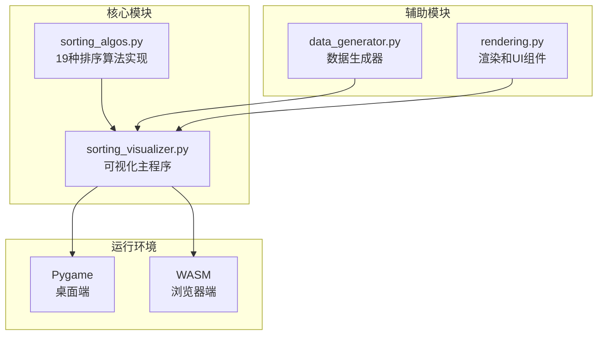
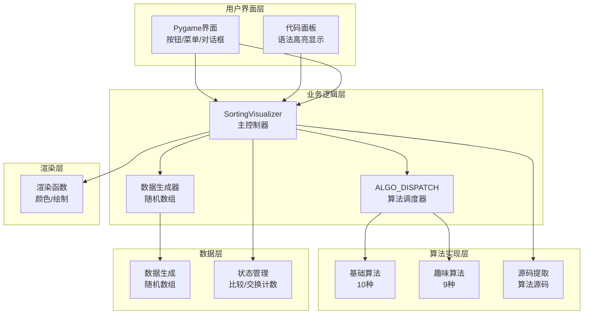
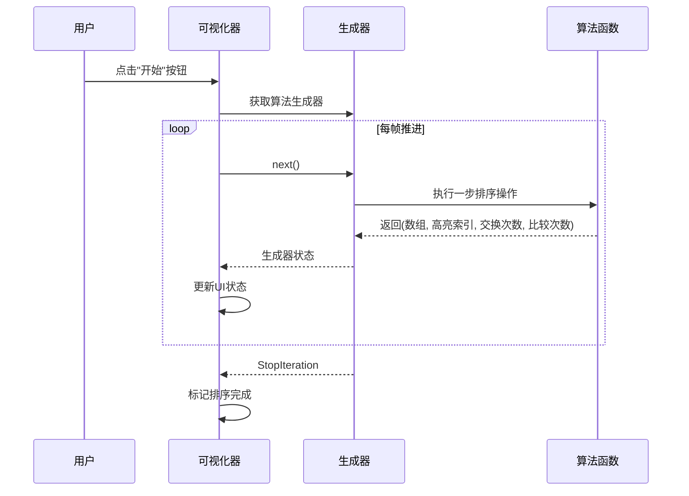
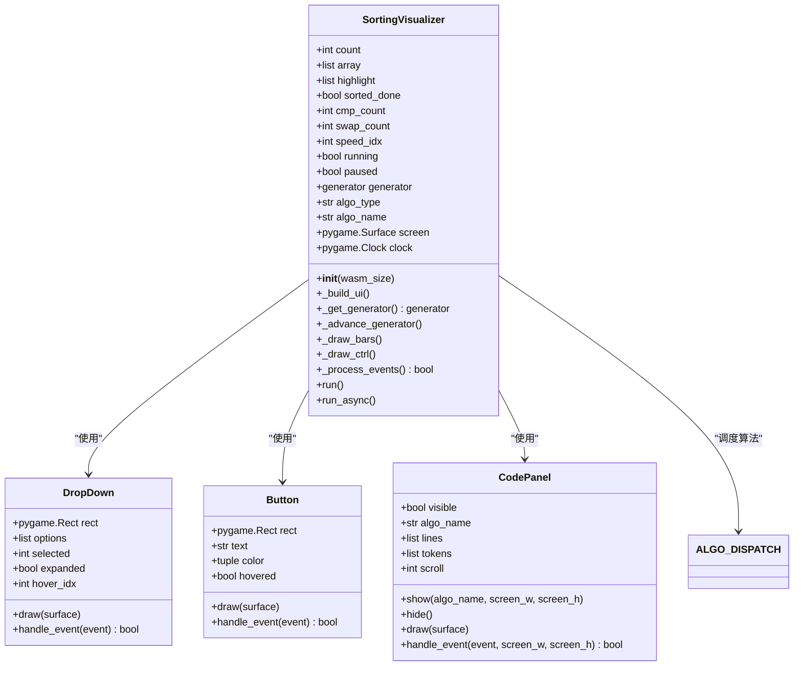
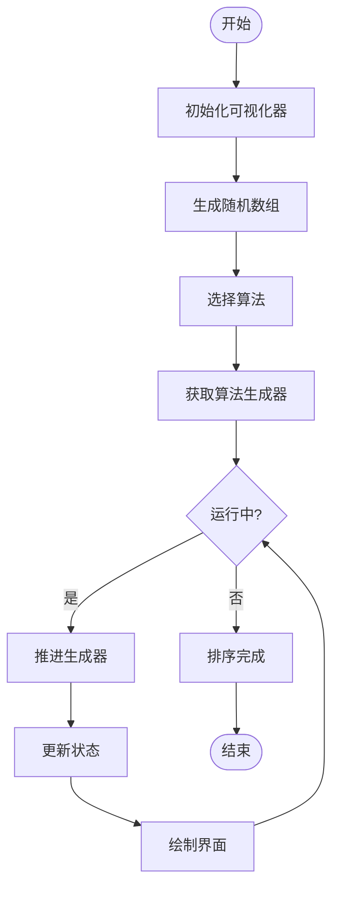
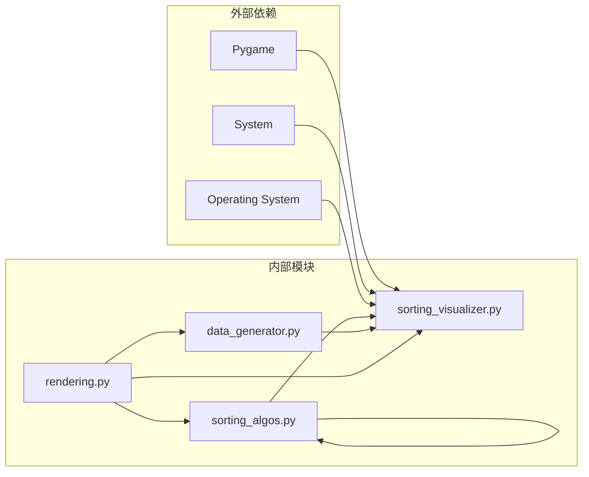

# 排序算法API

<cite>
**本文档引用的文件**
- [sorting_algos.py](file://sorting_algos.py)
- [sorting_visualizer.py](file://sorting_visualizer.py)
- [data_generator.py](file://data_generator.py)
- [rendering.py](file://rendering.py)
</cite>

## 目录
1. [简介](#简介)
2. [项目结构](#项目结构)
3. [核心组件](#核心组件)
4. [架构概览](#架构概览)
5. [详细组件分析](#详细组件分析)
6. [依赖关系分析](#依赖关系分析)
7. [性能考虑](#性能考虑)
8. [故障排除指南](#故障排除指南)
9. [结论](#结论)

## 简介

这是一个基于Python的排序算法可视化系统，提供了19种排序算法的生成器实现。该系统采用生成器模式设计，每个算法都实现了统一的接口规范：接收数组参数，返回元组`(数组, 高亮索引列表, 交换次数, 比较次数)`。系统支持桌面端和浏览器(WASM)两种运行环境，并提供了丰富的可视化功能。

## 项目结构

该项目采用模块化设计，主要包含以下四个核心文件：



**图表来源**
- [sorting_algos.py:1-600](file://sorting_algos.py#L1-L600)
- [sorting_visualizer.py:1-490](file://sorting_visualizer.py#L1-L490)
- [data_generator.py:1-48](file://data_generator.py#L1-L48)
- [rendering.py:1-564](file://rendering.py#L1-L564)

**章节来源**
- [sorting_algos.py:1-600](file://sorting_algos.py#L1-L600)
- [sorting_visualizer.py:1-490](file://sorting_visualizer.py#L1-L490)
- [data_generator.py:1-48](file://data_generator.py#L1-L48)
- [rendering.py:1-564](file://rendering.py#L1-L564)

## 核心组件

### 算法分类

系统将19种排序算法分为两大类别：

#### 基础排序算法（10种）
- 冒泡排序
- 选择排序  
- 插入排序
- 快速排序
- 归并排序
- 希尔排序
- 堆排序
- 桶排序
- 计数排序
- 基数排序

#### 趣味排序算法（9种）
- 猴子排序
- 睡眠排序
- 面条排序
- 斯大林排序
- 鸡尾酒排序
- 慢排序
- 煎饼排序
- 珠排序
- 鸽巢排序

### 算法映射字典

系统提供了两个重要的映射字典：

#### ALGO_FUNC_MAP
建立算法名称到函数名的映射关系：
- `"冒泡排序": "bubble_sort"`
- `"选择排序": "selection_sort"`
- `"插入排序": "insertion_sort"`
- `"快速排序": "quick_sort"`
- `"归并排序": "merge_sort"`
- `"希尔排序": "shell_sort"`
- `"堆排序": "heap_sort"`
- `"桶排序": "bucket_sort"`
- `"计数排序": "counting_sort"`
- `"基数排序": "radix_sort"`
- `"猴子排序": "monkey_sort"`
- `"睡眠排序": "sleep_sort"`
- `"面条排序": "noodle_sort"`
- `"斯大林排序": "stalin_sort"`
- `"鸡尾酒排序": "cocktail_sort"`
- `"慢排序": "slow_sort"`
- `"煎饼排序": "pancake_sort"`
- `"珠排序": "bead_sort"`
- `"鸽巢排序": "pigeonhole_sort"`

#### ALGO_DISPATCH
建立算法名称到函数对象的映射关系，供可视化程序使用：
- `"冒泡排序": bubble_sort`
- `"选择排序": selection_sort`
- `"插入排序": insertion_sort`
- `"快速排序": quick_sort`
- `"归并排序": merge_sort`
- `"希尔排序": shell_sort`
- `"堆排序": heap_sort`
- `"桶排序": bucket_sort`
- `"计数排序": counting_sort`
- `"基数排序": radix_sort`
- `"猴子排序": monkey_sort`
- `"睡眠排序": sleep_sort`
- `"面条排序": noodle_sort`
- `"斯大林排序": stalin_sort`
- `"鸡尾酒排序": cocktail_sort`
- `"慢排序": slow_sort`
- `"煎饼排序": pancake_sort`
- `"珠排序": bead_sort`
- `"鸽巢排序": pigeonhole_sort`

**章节来源**
- [sorting_algos.py:12-24](file://sorting_algos.py#L12-L24)
- [sorting_algos.py:507-550](file://sorting_algos.py#L507-L550)

## 架构概览

系统采用分层架构设计，实现了算法逻辑与可视化展示的分离：



**图表来源**
- [sorting_visualizer.py:62-490](file://sorting_visualizer.py#L62-L490)
- [sorting_algos.py:35-600](file://sorting_algos.py#L35-L600)
- [rendering.py:107-564](file://rendering.py#L107-L564)

## 详细组件分析

### 生成器接口规范

所有排序算法都遵循统一的生成器接口规范：

#### 函数签名
```python
def algorithm_name(arr):
    """
    排序算法生成器
    
    参数:
        arr: 待排序的数组副本
        
    返回:
        生成器，每次产生四元组:
        (array, highlight_indices, swap_count, cmp_count)
        
        - array: 当前数组状态
        - highlight_indices: 需要高亮显示的索引列表
        - swap_count: 交换操作总次数
        - cmp_count: 比较操作总次数
    """
```

#### 状态推进机制



**图表来源**
- [sorting_visualizer.py:269-287](file://sorting_visualizer.py#L269-L287)
- [sorting_algos.py:35-600](file://sorting_algos.py#L35-L600)

### 基础排序算法详解

#### 冒泡排序 (Bubble Sort)
- **实现特点**: 重复遍历数组，相邻元素比较交换
- **时间复杂度**: O(n²)
- **空间复杂度**: O(1)
- **稳定性**: 稳定
- **适用场景**: 教学演示，小规模数据

#### 选择排序 (Selection Sort)
- **实现特点**: 每次选择最小元素放到正确位置
- **时间复杂度**: O(n²)
- **空间复杂度**: O(1)
- **稳定性**: 不稳定
- **适用场景**: 内存写入成本高的环境

#### 插入排序 (Insertion Sort)
- **实现特点**: 将元素插入到已排序部分的正确位置
- **时间复杂度**: O(n²)
- **空间复杂度**: O(1)
- **稳定性**: 稳定
- **适用场景**: 小规模或基本有序数据

#### 快速排序 (Quick Sort)
- **实现特点**: 分治算法，选择基准元素分区
- **时间复杂度**: 平均O(n log n)，最坏O(n²)
- **空间复杂度**: O(log n)
- **稳定性**: 不稳定
- **适用场景**: 大多数情况下的首选算法

#### 归并排序 (Merge Sort)
- **实现特点**: 分治算法，合并两个有序数组
- **时间复杂度**: O(n log n)
- **空间复杂度**: O(n)
- **稳定性**: 稳定
- **适用场景**: 需要稳定性的场合

#### 希尔排序 (Shell Sort)
- **实现特点**: 插入排序的改进，间隔序列递减
- **时间复杂度**: O(n^(3/2))
- **空间复杂度**: O(1)
- **稳定性**: 不稳定
- **适用场景**: 中等规模数据

#### 堆排序 (Heap Sort)
- **实现特点**: 基于二叉堆的数据结构
- **时间复杂度**: O(n log n)
- **空间复杂度**: O(1)
- **稳定性**: 不稳定
- **适用场景**: 内存受限的环境

#### 桶排序 (Bucket Sort)
- **实现特点**: 分桶后分别排序
- **时间复杂度**: 平均O(n + k)，最坏O(n²)
- **空间复杂度**: O(n + k)
- **稳定性**: 取决于桶内排序
- **适用场景**: 值域分布均匀的数据

#### 计数排序 (Counting Sort)
- **实现特点**: 统计元素出现次数
- **时间复杂度**: O(n + k)
- **空间复杂度**: O(k)
- **稳定性**: 稳定
- **适用场景**: 整数范围较小的数据

#### 基数排序 (Radix Sort)
- **实现特点**: 按位数进行多轮排序
- **时间复杂度**: O(d × n)
- **空间复杂度**: O(n + k)
- **稳定性**: 稳定
- **适用场景**: 固定长度整数排序

### 趣味排序算法详解

#### 猴子排序 (Monkey Sort)
- **实现特点**: 随机打乱直到数组有序
- **时间复杂度**: 期望O(n!)，最坏无穷大
- **空间复杂度**: O(1)
- **适用场景**: 教学演示算法效率

#### 睡眠排序 (Sleep Sort)
- **实现特点**: 模拟睡眠时间排序
- **时间复杂度**: O(max_value + n)
- **空间复杂度**: O(1)
- **适用场景**: 概念性算法

#### 面条排序 (Noodle Sort)
- **实现特点**: 直接插入的可视化展示
- **时间复杂度**: O(n²)
- **空间复杂度**: O(1)
- **适用场景**: 教学演示插入原理

#### 斯大林排序 (Stalin Sort)
- **实现特点**: 删除不符合条件的元素
- **时间复杂度**: O(n)
- **空间复杂度**: O(1)
- **适用场景**: 演示"破坏性"算法概念

#### 鸡尾酒排序 (Cocktail Sort)
- **实现特点**: 双向冒泡排序
- **时间复杂度**: O(n²)
- **空间复杂度**: O(1)
- **稳定性**: 稳定
- **适用场景**: 基本有序的小数据集

#### 慢排序 (Slow Sort)
- **实现特点**: 递归设计的故意低效算法
- **时间复杂度**: O(n^(log 3/log 2))
- **空间复杂度**: O(log n)
- **适用场景**: 教学演示算法效率对比

#### 煎饼排序 (Pancake Sort)
- **实现特点**: 通过翻转操作排序
- **时间复杂度**: O(n²)
- **空间复杂度**: O(1)
- **稳定性**: 不稳定
- **适用场景**: 特殊约束下的排序问题

#### 珠排序 (Bead Sort)
- **实现特点**: 模拟算盘珠的重力排序
- **时间复杂度**: O(sum)
- **空间复杂度**: O(sum)
- **适用场景**: 概念性算法展示

#### 鸽巢排序 (Pigeonhole Sort)
- **实现特点**: 基于值域范围的计数排序
- **时间复杂度**: O(n + k)
- **空间复杂度**: O(k)
- **稳定性**: 稳定
- **适用场景**: 整数范围较小的数据

**章节来源**
- [sorting_algos.py:35-600](file://sorting_algos.py#L35-L600)

### 可视化系统架构

#### SortingVisualizer 类



**图表来源**
- [sorting_visualizer.py:62-490](file://sorting_visualizer.py#L62-L490)
- [rendering.py:284-379](file://rendering.py#L284-L379)
- [rendering.py:110-279](file://rendering.py#L110-L279)

#### 数据流图



**图表来源**
- [sorting_visualizer.py:198-287](file://sorting_visualizer.py#L198-L287)
- [data_generator.py:11-23](file://data_generator.py#L11-L23)

**章节来源**
- [sorting_visualizer.py:62-490](file://sorting_visualizer.py#L62-L490)
- [rendering.py:107-564](file://rendering.py#L107-L564)
- [data_generator.py:11-48](file://data_generator.py#L11-L48)

## 依赖关系分析

### 模块间依赖关系



**图表来源**
- [sorting_visualizer.py:17-47](file://sorting_visualizer.py#L17-L47)
- [sorting_algos.py:9](file://sorting_algos.py#L9)

### 运行时依赖

系统支持两种运行环境：

#### 桌面端 (Desktop)
- 需要安装 `pygame` 库
- 支持全屏模式和窗口调整
- 支持源码页面独立运行

#### 浏览器端 (WASM)
- 通过 pygbag 运行
- 无全屏模式支持
- 源码页面不可用

**章节来源**
- [sorting_visualizer.py:23-29](file://sorting_visualizer.py#L23-L29)
- [sorting_visualizer.py:484-489](file://sorting_visualizer.py#L484-L489)

## 性能考虑

### 算法性能特征

| 算法类型 | 时间复杂度 | 空间复杂度 | 稳定性 | 适用场景 |
|---------|-----------|-----------|-------|---------|
| 基础排序 | O(n²) | O(1) | 稳定 | 小规模数据 |
| 快速排序 | O(n log n) | O(log n) | 不稳定 | 大多数情况 |
| 归并排序 | O(n log n) | O(n) | 稳定 | 需要稳定性 |
| 堆排序 | O(n log n) | O(1) | 不稳定 | 内存受限 |
| 计数排序 | O(n + k) | O(k) | 稳定 | 小范围整数 |
| 基数排序 | O(d × n) | O(n + k) | 稳定 | 固定长度整数 |

### 性能优化建议

1. **选择合适算法**
   - 小于100个元素：插入排序或选择排序
   - 100-1000个元素：快速排序或归并排序
   - 大于1000个元素：归并排序或堆排序

2. **可视化性能**
   - 合理设置刷新频率
   - 适当降低数据量
   - 使用适当的动画速度

3. **内存管理**
   - 注意桶排序的空间需求
   - 控制计数排序的范围
   - 避免不必要的数组复制

## 故障排除指南

### 常见问题及解决方案

#### 算法执行异常
- **症状**: 算法运行过程中崩溃
- **原因**: 算法实现中的边界条件处理不当
- **解决**: 检查数组边界访问，确保索引有效性

#### 性能问题
- **症状**: 大数据量时运行缓慢
- **原因**: 算法复杂度过高或可视化开销过大
- **解决**: 选择更高效的算法，降低可视化细节

#### 内存不足
- **症状**: 程序运行时内存占用过高
- **原因**: 桶排序、计数排序等需要额外内存
- **解决**: 减少数据量，选择内存友好的算法

#### 浏览器兼容性问题
- **症状**: 在浏览器中无法正常运行
- **原因**: 缺少必要的依赖或平台限制
- **解决**: 确保 pygbag 环境配置正确

**章节来源**
- [sorting_algos.py:434-452](file://sorting_algos.py#L434-L452)
- [sorting_visualizer.py:235-244](file://sorting_visualizer.py#L235-L244)

## 结论

本排序算法可视化系统提供了完整的19种排序算法实现，具有以下特点：

1. **统一接口**: 所有算法遵循相同的生成器接口规范
2. **可视化友好**: 实现了直观的动画效果和状态显示
3. **教学价值**: 包含基础算法和趣味算法，适合学习和演示
4. **跨平台支持**: 同时支持桌面端和浏览器端运行
5. **可扩展性**: 模块化设计便于添加新的算法实现

系统特别适合作为算法教学和可视化演示的工具，帮助用户理解不同排序算法的工作原理和性能特征。通过合理的算法选择和参数配置，可以在保证教学效果的同时获得良好的用户体验。