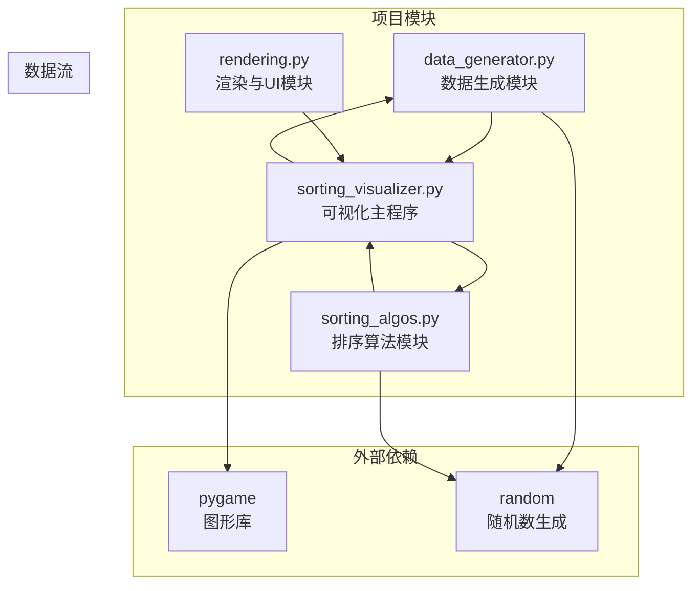
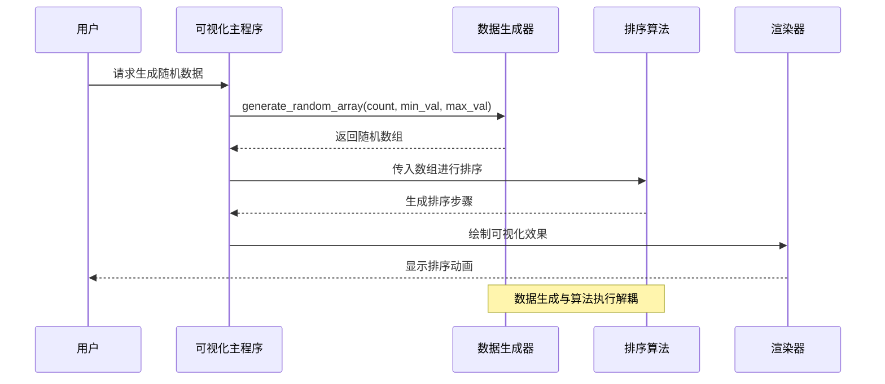
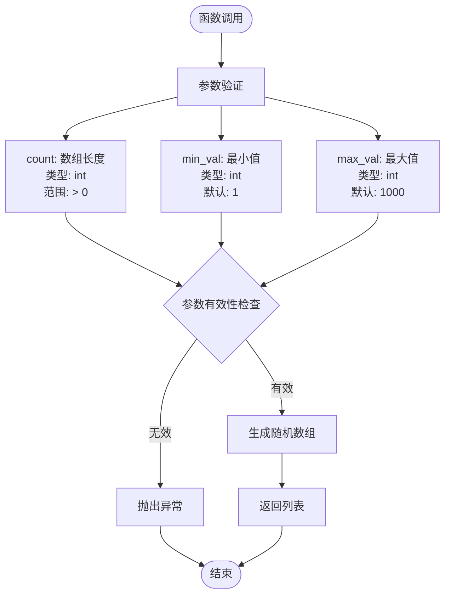
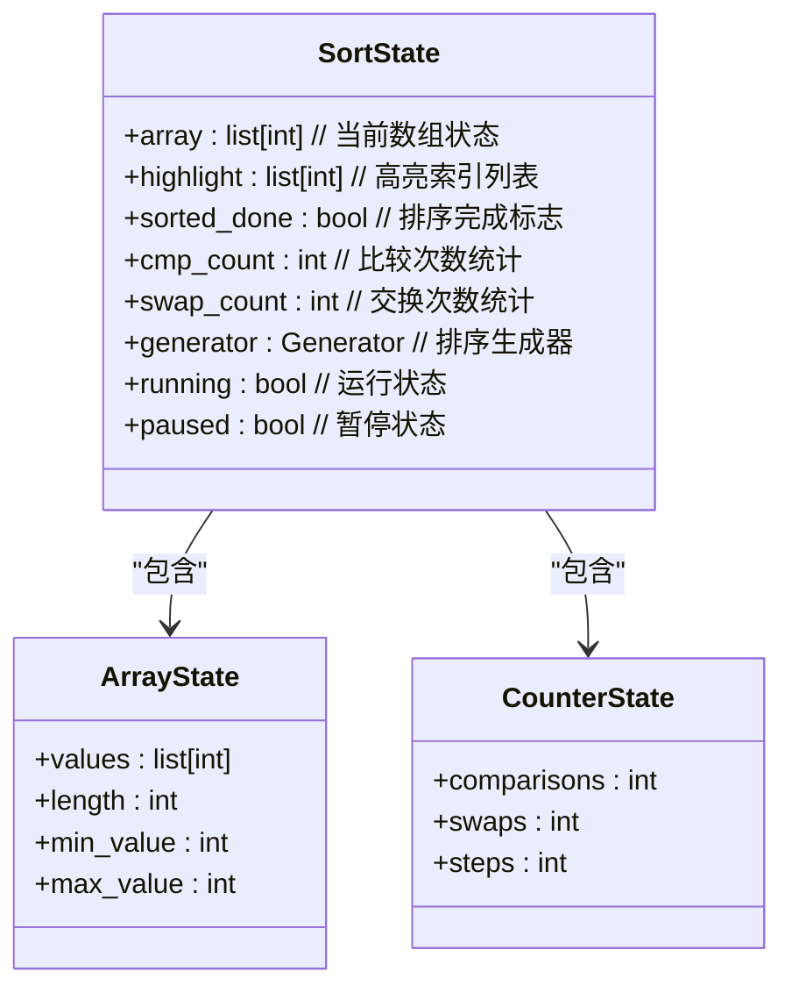
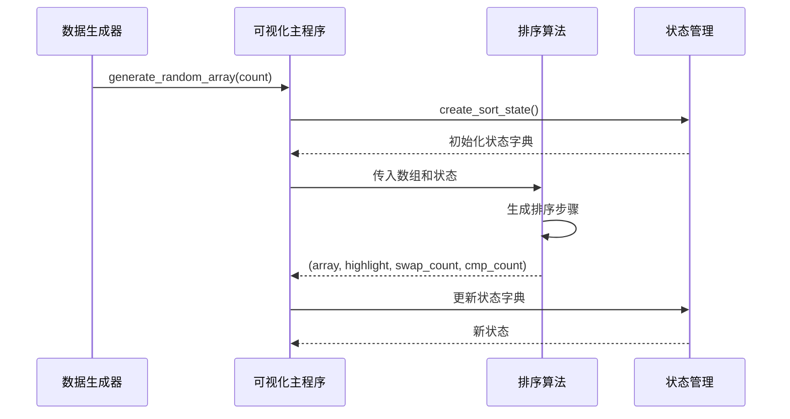
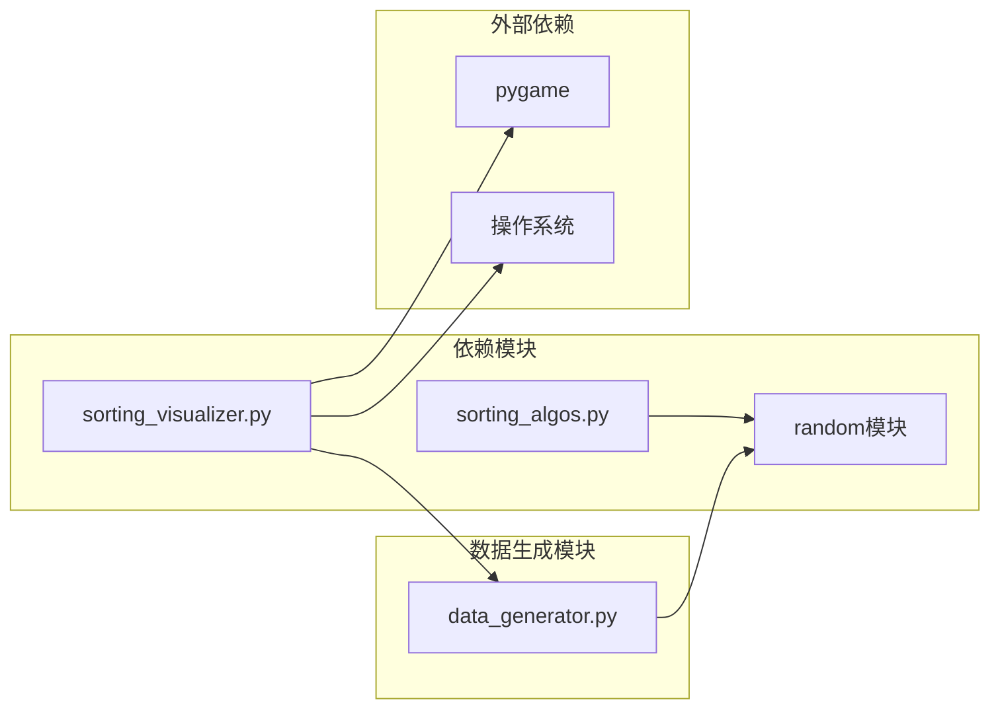
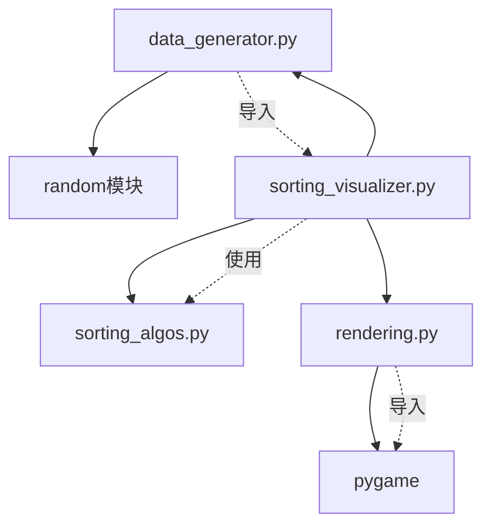

# 数据生成API

<cite>
**本文档引用的文件**
- [data_generator.py](file://data_generator.py)
- [sorting_algos.py](file://sorting_algos.py)
- [sorting_visualizer.py](file://sorting_visualizer.py)
- [rendering.py](file://rendering.py)
</cite>

## 目录
1. [简介](#简介)
2. [项目结构](#项目结构)
3. [核心组件](#核心组件)
4. [架构概览](#架构概览)
5. [详细组件分析](#详细组件分析)
6. [依赖关系分析](#依赖关系分析)
7. [性能考虑](#性能考虑)
8. [故障排除指南](#故障排除指南)
9. [结论](#结论)

## 简介

数据生成模块是Python数据可视化项目的核心组件之一，专门负责生成排序算法可视化所需的随机数组数据。该模块提供了高效的随机数据生成功能，支持可配置的数据范围和数量，并与排序算法模块无缝集成，为用户提供直观的算法执行过程演示。

该项目采用模块化设计，将数据生成、排序算法实现和可视化渲染分离，确保了代码的可维护性和扩展性。数据生成模块作为底层支撑，为上层的排序算法可视化提供了高质量的测试数据。

## 项目结构

项目采用清晰的模块化架构，每个文件都有明确的职责分工：

**图表来源**
- [data_generator.py:1-48](file://data_generator.py#L1-L48)
- [sorting_algos.py:1-600](file://sorting_algos.py#L1-L600)
- [sorting_visualizer.py:1-490](file://sorting_visualizer.py#L1-L490)
- [rendering.py:1-564](file://rendering.py#L1-L564)

**章节来源**
- [data_generator.py:1-48](file://data_generator.py#L1-L48)
- [sorting_visualizer.py:1-490](file://sorting_visualizer.py#L1-L490)

## 核心组件

数据生成模块主要包含两个核心函数：

### generate_random_array() - 随机数组生成器

这是模块的主要API函数，负责生成指定长度和数值范围的随机整数数组。

### create_sort_state() - 排序状态管理器

用于初始化排序过程的状态字典，为排序算法提供统一的数据结构接口。

**章节来源**
- [data_generator.py:11-47](file://data_generator.py#L11-L47)

## 架构概览

数据生成模块在整个可视化系统中扮演着关键的支撑角色：

**图表来源**
- [sorting_visualizer.py:186-222](file://sorting_visualizer.py#L186-L222)
- [data_generator.py:11-23](file://data_generator.py#L11-L23)

## 详细组件分析

### generate_random_array() 函数详解

#### 函数签名与参数规范

**图表来源**
- [data_generator.py:11-23](file://data_generator.py#L11-L23)

#### 算法原理

函数采用列表推导式的高效实现，通过内置的`random.randint()`函数生成指定范围内的随机整数。该实现具有以下特点：

- **时间复杂度**: O(n)，其中n为数组长度
- **空间复杂度**: O(n)，用于存储生成的数组
- **内存效率**: 单次分配，避免重复扩容操作

#### 性能优化策略

1. **列表推导式优化**: 使用Python内置的列表推导式替代显式循环
2. **原地生成**: 直接生成目标数组，无需中间缓冲
3. **最小化函数调用开销**: 单次randint调用覆盖整个数组生成过程

#### 返回值格式

函数返回标准Python列表，包含以下特征：
- **类型**: `list[int]`
- **长度**: 等于count参数
- **元素范围**: [min_val, max_val]（包含边界值）
- **数据类型**: 整数类型

**章节来源**
- [data_generator.py:11-23](file://data_generator.py#L11-L23)

### create_sort_state() 函数详解

#### 状态字典结构

**图表来源**
- [data_generator.py:26-47](file://data_generator.py#L26-L47)

#### 初始化过程

状态字典的创建遵循以下原则：

1. **空数组初始化**: `array`字段初始化为空列表
2. **清空高亮**: `highlight`字段初始化为空列表
3. **重置统计**: `cmp_count`和`swap_count`初始化为0
4. **生成器占位**: `generator`设置为None
5. **控制标志**: `running`和`paused`初始化为False

#### 边界条件处理

- **空数组**: 支持count=0的情况，返回空列表
- **单元素**: 支持count=1的情况，返回包含一个随机数的列表
- **参数验证**: 通过调用方确保参数有效性

**章节来源**
- [data_generator.py:26-47](file://data_generator.py#L26-L47)

### 与排序算法模块的集成

#### 数据传递格式

排序算法模块期望接收以下格式的数据：

**图表来源**
- [sorting_visualizer.py:186-222](file://sorting_visualizer.py#L186-L222)
- [sorting_algos.py:35-47](file://sorting_algos.py#L35-L47)

#### 状态更新机制

排序过程中，状态字典会持续更新以反映当前的执行状态：

1. **数组状态**: 实时反映排序进度
2. **高亮信息**: 标识当前比较的元素位置
3. **统计信息**: 累加比较和交换次数
4. **完成标志**: 排序完成后设置为True

**章节来源**
- [sorting_visualizer.py:269-286](file://sorting_visualizer.py#L269-L286)
- [sorting_algos.py:35-47](file://sorting_algos.py#L35-L47)

## 依赖关系分析

数据生成模块与其他组件的依赖关系如下：

**图表来源**
- [data_generator.py:8](file://data_generator.py#L8)
- [sorting_visualizer.py:47](file://sorting_visualizer.py#L47)
- [sorting_algos.py:9](file://sorting_algos.py#L9)

### 内部依赖关系

**图表来源**
- [data_generator.py:8](file://data_generator.py#L8)
- [sorting_visualizer.py:34-47](file://sorting_visualizer.py#L34-L47)
- [rendering.py:8](file://rendering.py#L8)

**章节来源**
- [data_generator.py:8](file://data_generator.py#L8)
- [sorting_visualizer.py:34-47](file://sorting_visualizer.py#L34-L47)

## 性能考虑

### 时间复杂度分析

数据生成模块的性能特征：

- **generate_random_array()**: O(n) - 线性时间复杂度
- **create_sort_state()**: O(1) - 常数时间复杂度
- **内存使用**: O(n) - 与数组长度成正比

### 内存优化策略

1. **惰性求值**: 排序算法采用生成器模式，避免一次性加载所有步骤
2. **状态复用**: 状态字典在多次排序间复用，减少内存分配
3. **就地修改**: 排序算法直接修改输入数组，避免额外空间

### 大数据量处理

对于大规模数据集（>10000元素），建议：

1. **调整可视化密度**: 减少显示的元素数量以提高渲染性能
2. **降低刷新频率**: 在大数据量时适当降低动画速度
3. **内存监控**: 监控内存使用情况，避免系统资源耗尽

## 故障排除指南

### 常见问题及解决方案

#### 参数错误

**问题**: `count`参数为负数或零
**解决方案**: 确保count > 0，或在调用前进行参数验证

**章节来源**
- [data_generator.py:11-23](file://data_generator.py#L11-L23)

#### 内存不足

**问题**: 大规模数据生成导致内存溢出
**解决方案**: 
- 分批生成较小的数据集
- 调整最大数组长度限制
- 监控系统可用内存

#### 性能问题

**问题**: 数据生成速度缓慢
**解决方案**:
- 检查系统随机数源性能
- 避免在高频调用中重复生成相同数据
- 考虑使用预生成的数据集

### 调试技巧

1. **参数验证**: 在函数入口处添加参数边界检查
2. **日志记录**: 添加详细的执行日志便于调试
3. **单元测试**: 编写针对边界条件的测试用例

**章节来源**
- [data_generator.py:11-47](file://data_generator.py#L11-L47)

## 结论

数据生成模块为Python数据可视化项目提供了高效、可靠的随机数据生成功能。其简洁的设计和清晰的接口使得复杂的排序算法可视化变得简单易用。

### 主要优势

1. **高性能**: 采用优化的列表推导式实现O(n)时间复杂度
2. **易用性**: 简洁的API设计，易于集成到现有系统
3. **可扩展性**: 模块化设计支持功能扩展和定制
4. **稳定性**: 完善的错误处理和边界条件管理

### 应用场景

- 教育演示：展示各种排序算法的工作原理
- 性能测试：对比不同排序算法的时间复杂度
- 算法教学：可视化算法执行过程
- 数据分析：生成测试数据集进行算法验证

该模块的成功实施证明了良好的软件工程实践的重要性，包括清晰的模块划分、完善的接口设计和全面的错误处理机制。这些特性共同确保了系统的稳定性和可维护性。