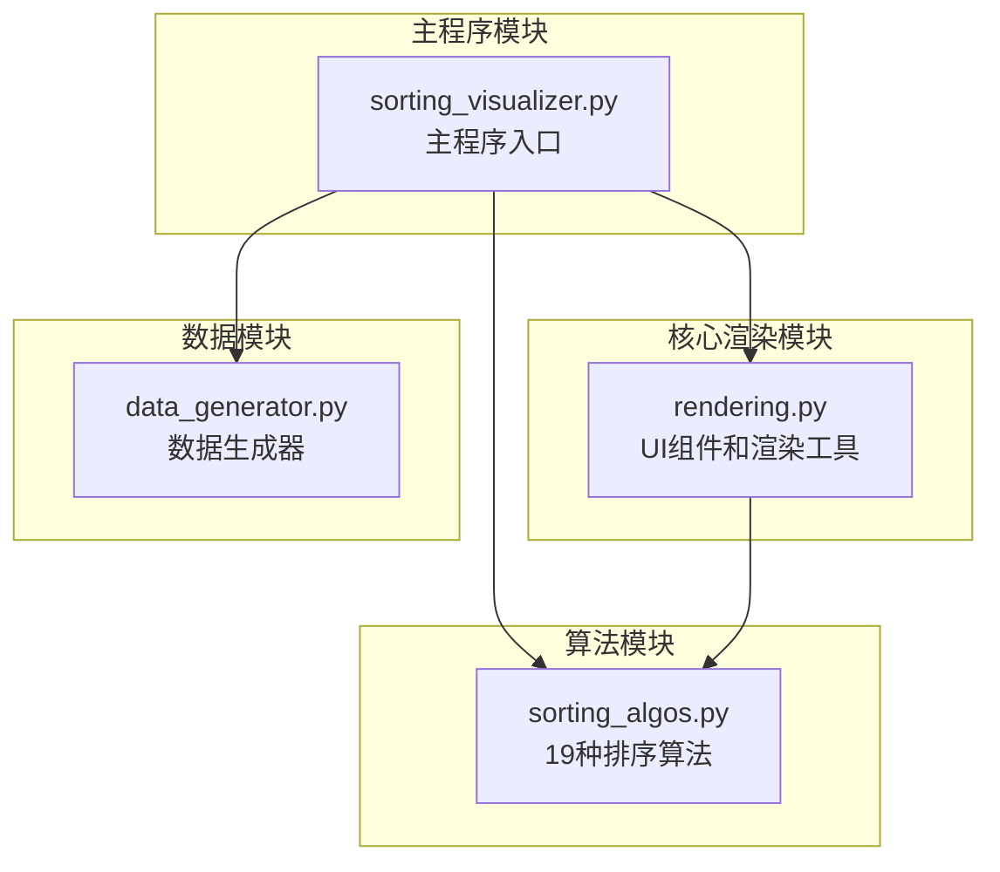
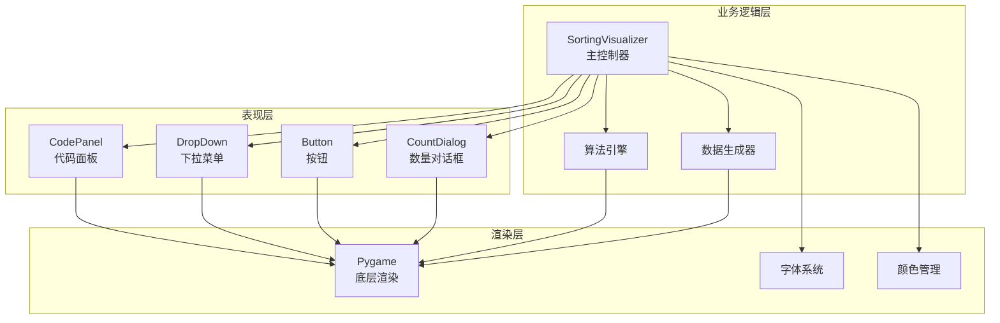
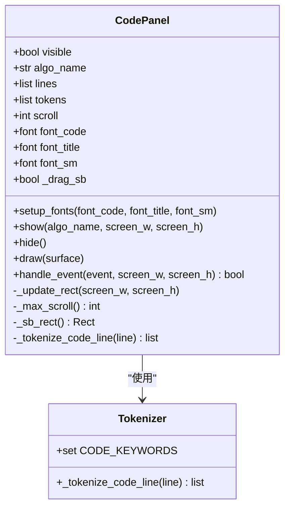
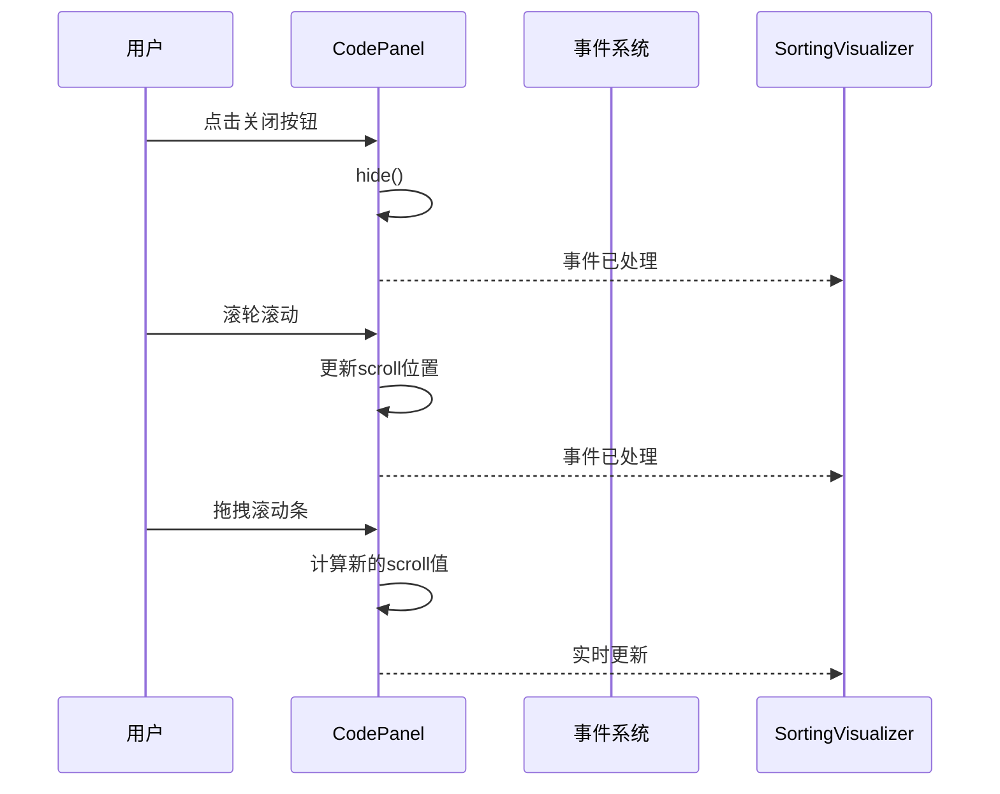
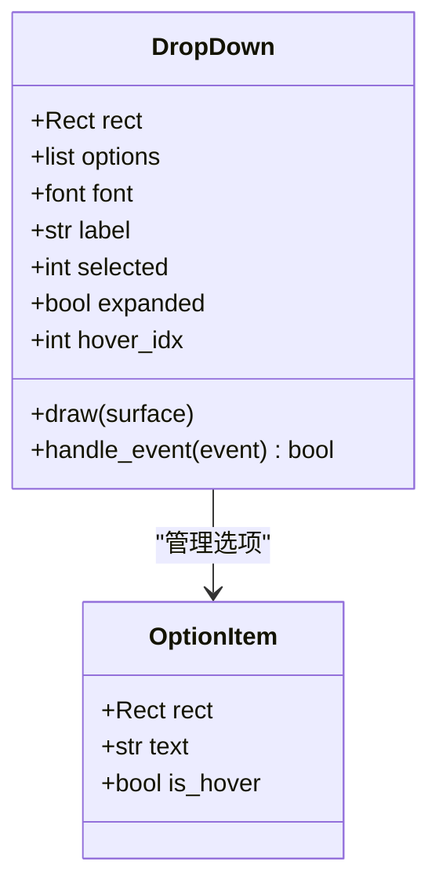
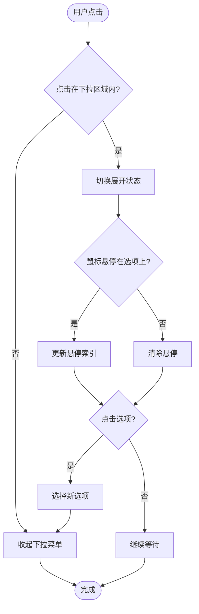
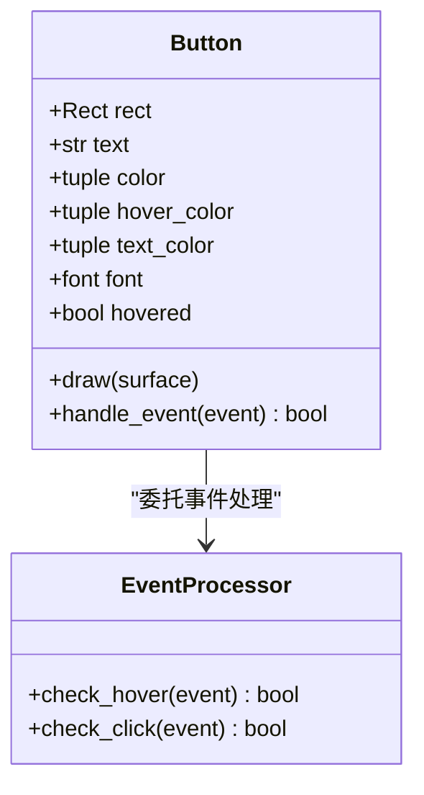
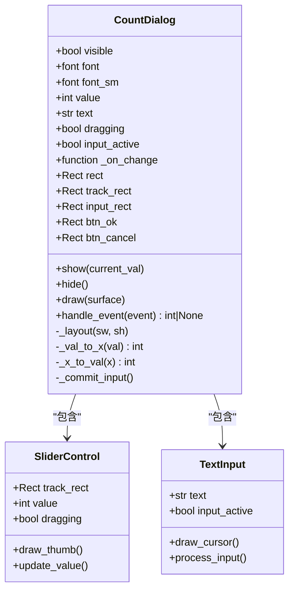
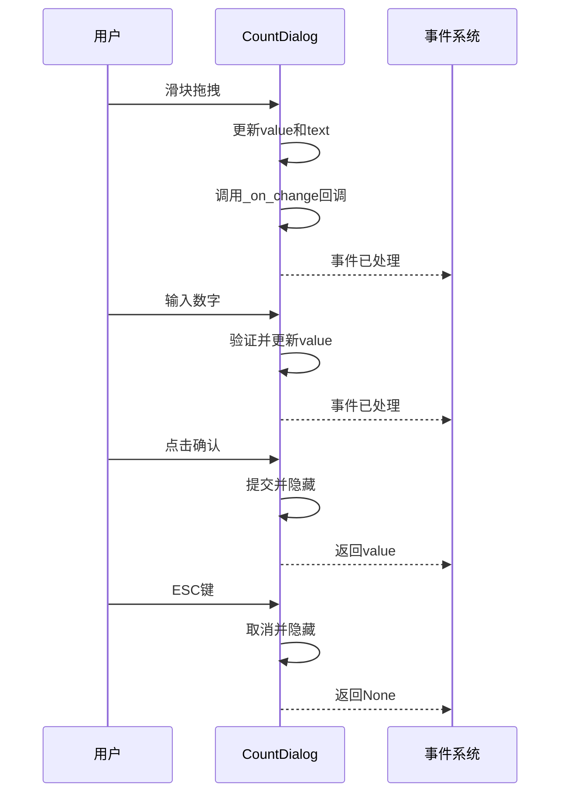
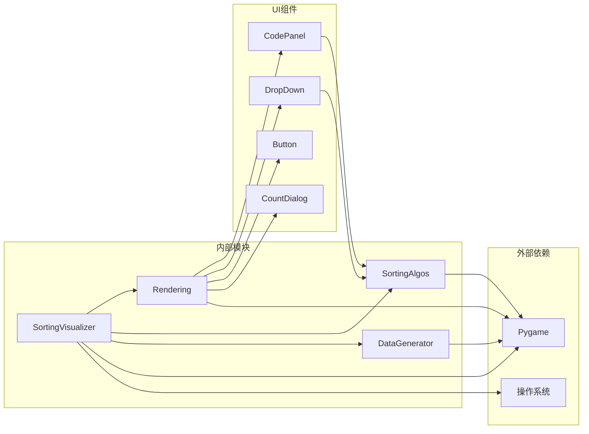

# UI渲染系统

<cite>
**本文档引用的文件**
- [rendering.py](file://rendering.py)
- [sorting_visualizer.py](file://sorting_visualizer.py)
- [sorting_algos.py](file://sorting_algos.py)
- [data_generator.py](file://data_generator.py)
</cite>

## 目录
1. [简介](#简介)
2. [项目结构](#项目结构)
3. [核心组件](#核心组件)
4. [架构概览](#架构概览)
5. [详细组件分析](#详细组件分析)
6. [依赖关系分析](#依赖关系分析)
7. [性能考虑](#性能考虑)
8. [故障排除指南](#故障排除指南)
9. [结论](#结论)
10. [附录](#附录)

## 简介

这是一个基于Pygame的数据可视化项目，专注于排序算法的可视化演示。该系统提供了完整的UI渲染框架，包括多种交互式UI组件，支持中文字体渲染和响应式设计。系统采用模块化架构，将UI组件、算法逻辑和数据生成分离，便于维护和扩展。

## 项目结构

该项目采用清晰的模块化组织结构：



**图表来源**
- [sorting_visualizer.py:1-480](file://sorting_visualizer.py#L1-L480)
- [rendering.py:1-557](file://rendering.py#L1-L557)
- [sorting_algos.py:1-600](file://sorting_algos.py#L1-L600)
- [data_generator.py:1-48](file://data_generator.py#L1-L48)

**章节来源**
- [sorting_visualizer.py:1-480](file://sorting_visualizer.py#L1-L480)
- [rendering.py:1-557](file://rendering.py#L1-L557)

## 核心组件

UI渲染系统的核心由四个主要组件构成：

### 颜色系统
系统定义了丰富的颜色常量，采用深色主题设计：
- **主色调**: 深蓝灰背景 (10, 15, 35)
- **强调色**: 青色 (0, 220, 220) 和蓝色 (30, 100, 255)
- **状态色**: 绿色 (0, 220, 80) 表示成功，红色 (220, 50, 50) 表示错误
- **中性色**: 白色 (255, 255, 255) 和灰色系列

### 字体系统
实现了智能字体加载机制：
- **优先级**: 捆绑字体 → 系统字体 → Pygame默认字体
- **字体类型**: 小号 (16px)、中号 (20px)、大号 (28px)
- **中文字体支持**: 支持微软雅黑、黑体等常用中文字体

**章节来源**
- [rendering.py:14-30](file://rendering.py#L14-L30)
- [rendering.py:38-47](file://rendering.py#L38-L47)
- [sorting_visualizer.py:115-144](file://sorting_visualizer.py#L115-L144)

## 架构概览

系统采用分层架构设计，各层职责明确：



**图表来源**
- [sorting_visualizer.py:62-113](file://sorting_visualizer.py#L62-L113)
- [rendering.py:110-557](file://rendering.py#L110-L557)

## 详细组件分析

### CodePanel 代码面板组件

CodePanel是系统中最复杂的UI组件，提供算法源码的语法高亮显示和交互功能。

#### 设计特点
- **浮动面板设计**: 叠加在可视化区域上方，不影响控制栏
- **语法高亮**: 支持关键字、字符串、注释、函数名、数字的彩色显示
- **滚动机制**: 内置垂直滚动条，支持鼠标拖拽和滚轮滚动
- **响应式布局**: 根据屏幕尺寸动态调整面板位置和大小

#### 核心功能实现



**图表来源**
- [rendering.py:110-279](file://rendering.py#L110-L279)
- [rendering.py:59-104](file://rendering.py#L59-L104)

#### 语法高亮算法

代码面板实现了完整的Python语法高亮功能：

| 语法元素 | 颜色代码 | 识别规则 |
|---------|---------|---------|
| 关键字 | (86, 156, 214) | def、return、if、else等 |
| 字符串 | (206, 145, 120) | 包含在引号中的文本 |
| 注释 | (106, 153, 85) | 以#开头的行 |
| 函数名 | (220, 220, 170) | 后跟括号的标识符 |
| 数字 | (181, 206, 168) | 数字字面量 |
| 普通文本 | (212, 212, 212) | 默认颜色 |

#### 交互行为



**图表来源**
- [rendering.py:241-278](file://rendering.py#L241-L278)

**章节来源**
- [rendering.py:110-279](file://rendering.py#L110-L279)
- [rendering.py:59-104](file://rendering.py#L59-L104)

### DropDown 下拉菜单组件

DropDown组件提供了算法选择功能，支持两种算法类型：基础排序和趣味排序。

#### 设计原则
- **紧凑布局**: 占用空间最小化，不影响可视化区域
- **清晰标识**: 使用标签区分不同类型的算法
- **直观交互**: 点击展开，悬停高亮选项

#### 核心实现



**图表来源**
- [rendering.py:284-349](file://rendering.py#L284-L349)

#### 交互流程



**图表来源**
- [rendering.py:317-348](file://rendering.py#L317-L348)

**章节来源**
- [rendering.py:284-349](file://rendering.py#L284-L349)

### Button 按钮组件

Button组件是系统中最简单的交互组件，提供统一的按钮样式和事件处理。

#### 设计特性
- **圆角矩形**: 使用6像素圆角半径，现代感强
- **悬停效果**: 鼠标悬停时颜色自动变亮
- **一致风格**: 所有按钮共享相同的视觉语言

#### 实现细节



**图表来源**
- [rendering.py:354-379](file://rendering.py#L354-L379)

**章节来源**
- [rendering.py:354-379](file://rendering.py#L354-L379)

### CountDialog 统计对话框

CountDialog提供了数据量设置功能，支持滑块拖拽和直接输入两种模式。

#### 多模态交互
- **滑块模式**: 直观的拖拽操作，支持实时回调
- **输入模式**: 键盘输入，支持数字验证和光标闪烁
- **确认机制**: 确认按钮和回车键提交，取消按钮退出

#### 核心功能



**图表来源**
- [rendering.py:384-557](file://rendering.py#L384-L557)

#### 事件处理流程



**图表来源**
- [rendering.py:492-557](file://rendering.py#L492-L557)

**章节来源**
- [rendering.py:384-557](file://rendering.py#L384-L557)

## 依赖关系分析

系统采用松耦合设计，组件间通过明确定义的接口进行通信：



**图表来源**
- [sorting_visualizer.py:34-47](file://sorting_visualizer.py#L34-L47)
- [rendering.py:8-10](file://rendering.py#L8-L10)

### 组件通信机制

系统采用事件驱动的通信模式：

1. **事件冒泡**: UI组件处理事件后，未处理的事件传递给主控制器
2. **状态同步**: 主控制器维护全局状态，组件通过状态更新保持一致性
3. **回调机制**: 滑块等组件支持实时回调，实现即时反馈

**章节来源**
- [sorting_visualizer.py:379-451](file://sorting_visualizer.py#L379-L451)
- [rendering.py:241-278](file://rendering.py#L241-L278)

## 性能考虑

### 渲染优化策略

1. **增量渲染**: 只重新绘制发生变化的UI区域
2. **字体缓存**: 避免重复创建字体对象
3. **子表面优化**: 使用subsurface减少绘制调用
4. **滚动优化**: 仅渲染可见行，支持大文件的高效滚动

### 内存管理

- **字体资源**: 在应用启动时一次性加载字体
- **颜色缓存**: 使用预定义颜色常量，避免重复计算
- **事件处理**: 及时释放不再使用的事件对象

### 响应式设计

系统支持动态窗口调整：
- **自适应布局**: UI组件根据屏幕尺寸重新定位
- **比例缩放**: 控件尺寸按比例调整
- **全屏模式**: 支持全屏切换，自动调整布局

## 故障排除指南

### 常见问题及解决方案

#### 字体显示问题
**症状**: 文字显示为方块或乱码
**原因**: 系统缺少中文字体
**解决**: 
1. 确保msyh.ttc或simhei.ttf文件存在
2. 检查字体路径配置
3. 验证字体文件完整性

#### 颜色显示异常
**症状**: UI颜色不正确
**原因**: Pygame版本兼容性问题
**解决**:
1. 更新到最新Pygame版本
2. 检查RGB值范围 (0-255)
3. 验证颜色常量定义

#### 事件处理冲突
**症状**: 按钮点击无响应
**原因**: 事件被其他组件拦截
**解决**:
1. 检查事件处理顺序
2. 确保visible状态正确
3. 验证碰撞检测逻辑

**章节来源**
- [sorting_visualizer.py:115-144](file://sorting_visualizer.py#L115-L144)
- [rendering.py:38-47](file://rendering.py#L38-L47)

## 结论

该UI渲染系统展现了优秀的模块化设计和工程实践：

### 技术优势
- **模块化架构**: 清晰的职责分离，便于维护和扩展
- **中文字体支持**: 完善的多语言支持机制
- **响应式设计**: 适应不同屏幕尺寸的能力
- **性能优化**: 增量渲染和资源管理策略

### 设计亮点
- **深色主题**: 减少眼部疲劳，突出可视化内容
- **语法高亮**: 提升代码可读性和学习体验
- **交互反馈**: 即时的状态变化和视觉提示
- **一致性**: 统一的设计语言和交互模式

### 扩展建议
1. **主题系统**: 添加可配置的主题切换功能
2. **动画效果**: 增加平滑的过渡动画
3. **无障碍支持**: 添加键盘导航和屏幕阅读器支持
4. **国际化**: 支持多语言界面

## 附录

### 组件使用示例

#### 基本按钮创建
```python
# 创建开始按钮
btn_start = Button(
    x=355, y=90, w=90, h=38,
    text="开始",
    color=(0,160,50),
    font=font_md
)
```

#### 下拉菜单配置
```python
# 创建算法选择下拉菜单
dd_basic = DropDown(
    x=10, y=90, w=160, h=38,
    options=BASIC_ALGOS,
    font=font_md,
    label="基础"
)
```

#### 对话框使用
```python
# 显示数量设置对话框
count_dialog.show(current_count)
# 获取用户输入
value = count_dialog.handle_event(event)
if value is not None:
    count = value
```

### 自定义扩展指导

#### 添加新UI组件
1. **继承通用接口**: 实现draw()和handle_event()方法
2. **定义样式**: 使用现有的颜色常量和字体
3. **集成事件处理**: 在主控制器中注册事件处理
4. **测试兼容性**: 验证在不同分辨率下的表现

#### 主题定制
1. **颜色方案**: 修改颜色常量定义
2. **字体配置**: 更新字体加载逻辑
3. **布局调整**: 修改控件尺寸和间距
4. **视觉效果**: 添加或修改装饰元素

#### 性能优化
1. **批量渲染**: 合并相似的绘制调用
2. **延迟加载**: 按需加载资源
3. **内存池**: 复用临时对象
4. **算法优化**: 使用更高效的渲染算法