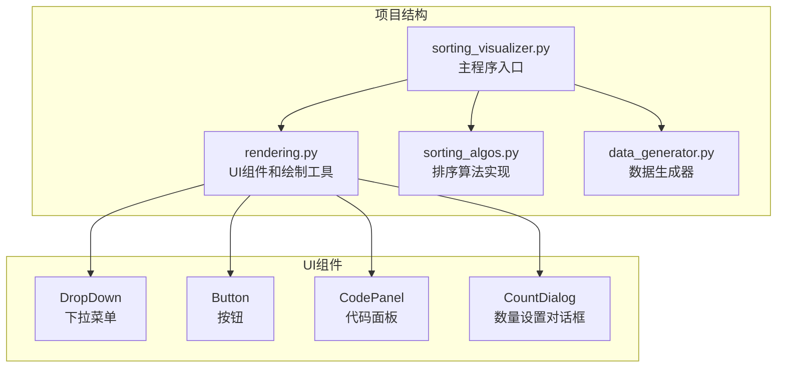
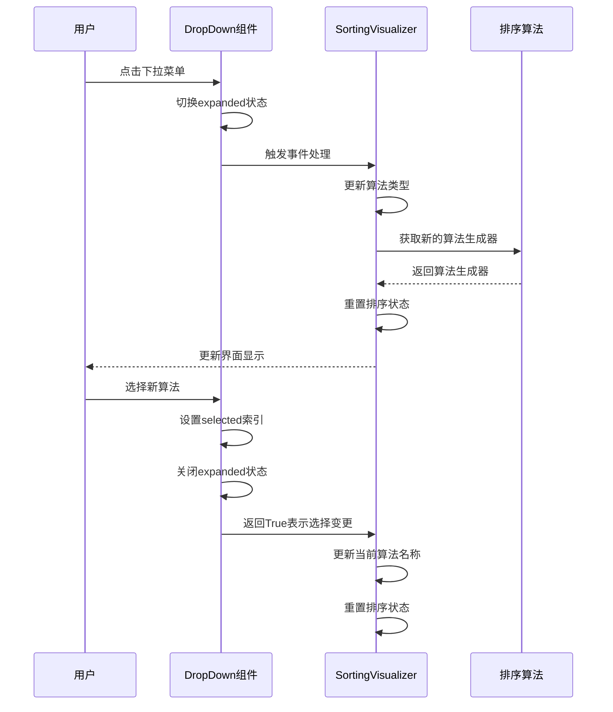
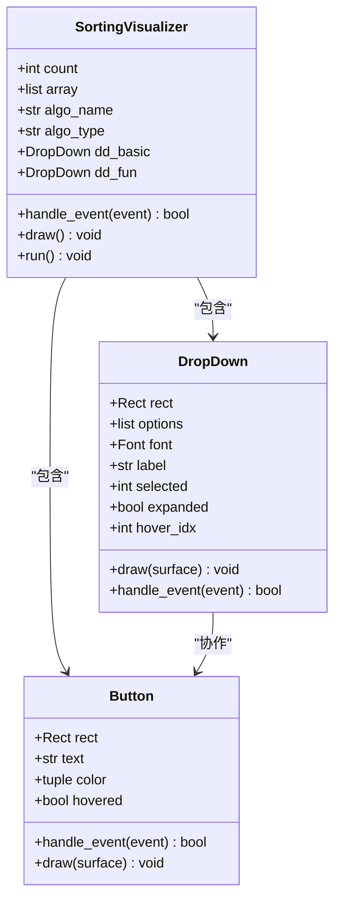
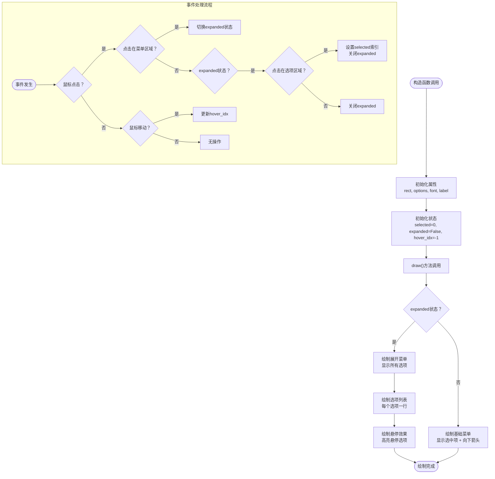
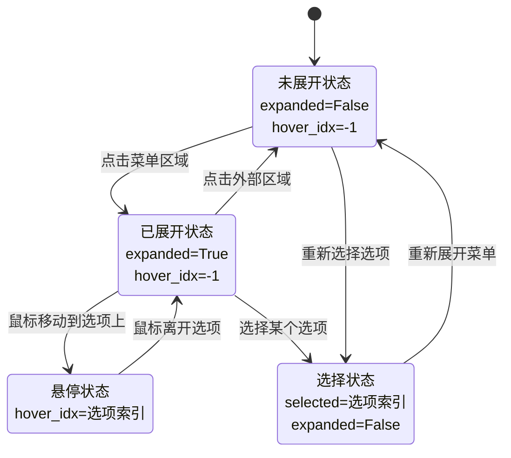
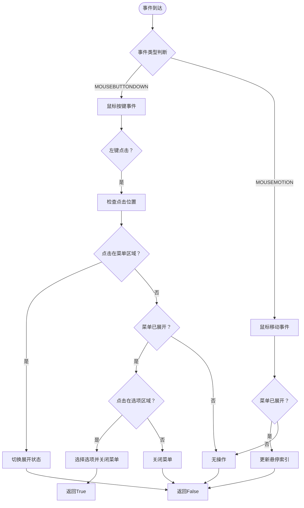
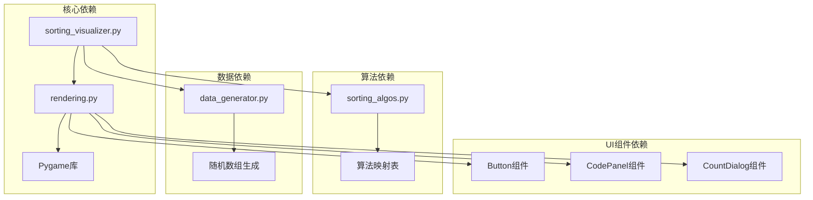

# 下拉菜单组件

<cite>
**本文档引用的文件**
- [sorting_visualizer.py](file://sorting_visualizer.py)
- [rendering.py](file://rendering.py)
- [sorting_algos.py](file://sorting_algos.py)
- [data_generator.py](file://data_generator.py)
</cite>

## 目录
1. [简介](#简介)
2. [项目结构](#项目结构)
3. [核心组件](#核心组件)
4. [架构概览](#架构概览)
5. [详细组件分析](#详细组件分析)
6. [依赖关系分析](#依赖关系分析)
7. [性能考虑](#性能考虑)
8. [故障排除指南](#故障排除指南)
9. [结论](#结论)
10. [附录](#附录)

## 简介

本文档深入解析了Python数据可视化项目中的下拉菜单组件（DropDown）。该组件是排序算法可视化工具的重要UI元素，用于在基础排序算法和趣味排序算法之间进行切换。文档将详细分析DropDown类的实现，包括展开折叠逻辑、选项渲染、悬停状态管理、事件处理机制，以及视觉设计和交互行为。

该项目使用Pygame作为图形库，实现了完整的排序算法可视化系统，其中下拉菜单组件是用户界面的重要组成部分。

## 项目结构

项目采用模块化设计，主要包含以下核心文件：



**图表来源**
- [sorting_visualizer.py:1-50](file://sorting_visualizer.py#L1-L50)
- [rendering.py:281-350](file://rendering.py#L281-L350)

**章节来源**
- [sorting_visualizer.py:1-50](file://sorting_visualizer.py#L1-L50)
- [rendering.py:1-50](file://rendering.py#L1-L50)

## 核心组件

下拉菜单组件是整个可视化系统中用户交互的关键元素。它提供了算法选择功能，允许用户在不同的排序算法之间进行切换。

### 组件特性

- **状态管理**: 包含selected、expanded、hover_idx三个核心状态
- **视觉设计**: 独特的蓝色主题配色方案和箭头指示器
- **交互响应**: 支持鼠标点击、悬停效果和即时反馈
- **事件传播**: 完整的事件处理机制，支持多种交互场景

### 状态系统

下拉菜单组件维护以下关键状态：

| 状态属性 | 类型 | 默认值 | 描述 |
|---------|------|--------|------|
| selected | int | 0 | 当前选中的选项索引 |
| expanded | bool | False | 下拉菜单展开状态 |
| hover_idx | int | -1 | 悬停选项的索引 |

**章节来源**
- [rendering.py:284-293](file://rendering.py#L284-L293)

## 架构概览

下拉菜单组件在整个应用架构中扮演着重要角色，它与主程序、按钮组件和其他UI元素协同工作。



**图表来源**
- [sorting_visualizer.py:414-424](file://sorting_visualizer.py#L414-L424)
- [rendering.py:317-348](file://rendering.py#L317-L348)

### 组件关系图



**图表来源**
- [sorting_visualizer.py:62-113](file://sorting_visualizer.py#L62-L113)
- [rendering.py:284-350](file://rendering.py#L284-L350)

**章节来源**
- [sorting_visualizer.py:146-178](file://sorting_visualizer.py#L146-L178)
- [rendering.py:284-350](file://rendering.py#L284-L350)

## 详细组件分析

### DropDown类实现详解

DropDown类是本项目中最复杂的UI组件之一，实现了完整的下拉菜单功能。

#### 核心实现分析



**图表来源**
- [rendering.py:294-348](file://rendering.py#L294-L348)

#### 状态管理机制

下拉菜单的状态管理是其核心功能的基础：

**状态转换图**



**图表来源**
- [rendering.py:317-348](file://rendering.py#L317-L348)

#### 视觉设计分析

下拉菜单采用了独特的视觉设计，体现了项目的整体风格：

**颜色方案**
- 背景色：深蓝色 (#141E3A)
- 边框色：青色 (#00DCEC)
- 文本色：白色 (#FFFFFF)
- 选项高亮：浅蓝色 (#325096)
- 悬停效果：更深蓝色 (#14285A)

**布局设计**
- 基础菜单高度：38像素
- 选项高度：与基础菜单相同
- 箭头指示器：位于右侧，使用Unicode字符 ▲/▼
- 内边距：左侧8像素，右侧25像素用于箭头

**章节来源**
- [rendering.py:294-316](file://rendering.py#L294-L316)
- [rendering.py:317-348](file://rendering.py#L317-L348)

### 事件处理机制

下拉菜单的事件处理机制支持多种交互场景：

#### 事件处理流程



**图表来源**
- [rendering.py:317-348](file://rendering.py#L317-L348)

#### 键盘导航支持

虽然当前实现主要支持鼠标交互，但可以轻松扩展键盘导航功能：

**键盘导航建议**
- 上/下箭头键：在选项间移动
- Enter键：确认选择
- ESC键：取消选择并关闭菜单
- Tab键：在不同UI组件间切换

**章节来源**
- [rendering.py:317-348](file://rendering.py#L317-L348)

### 选项渲染机制

下拉菜单的选项渲染采用了高效的逐项绘制策略：

#### 渲染流程

```mermaid
sequenceDiagram
participant Surface as Pygame表面
participant DD as DropDown组件
participant Option as 单个选项
DD->>Surface : 绘制基础菜单背景
DD->>Surface : 绘制基础菜单边框
DD->>Surface : 绘制选中文本
DD->>Surface : 绘制箭头指示器
alt 菜单已展开
loop 遍历所有选项
DD->>Option : 创建选项矩形
Option->>Surface : 绘制选项背景
Option->>Surface : 绘制选项边框
Option->>Surface : 绘制选项文本
end
end
```

**图表来源**
- [rendering.py:294-316](file://rendering.py#L294-L316)

#### 性能优化策略

- **延迟渲染**：只有在菜单展开时才渲染选项
- **碰撞检测优化**：使用Pygame的colliderect方法进行高效检测
- **最小重绘**：只在状态变化时更新界面

**章节来源**
- [rendering.py:294-316](file://rendering.py#L294-L316)

## 依赖关系分析

下拉菜单组件与其他系统组件的依赖关系如下：



**图表来源**
- [sorting_visualizer.py:34-47](file://sorting_visualizer.py#L34-L47)
- [rendering.py:8-11](file://rendering.py#L8-L11)

### 组件耦合度分析

下拉菜单组件与主程序的耦合度适中，既保持了足够的独立性，又能够有效地与主程序交互：

| 组件 | 耦合程度 | 说明 |
|------|----------|------|
| SortingVisualizer | 中等 | 通过事件返回值进行状态同步 |
| Button组件 | 低 | 无直接依赖，独立存在 |
| CodePanel组件 | 低 | 无直接依赖，独立存在 |
| CountDialog组件 | 低 | 无直接依赖，独立存在 |

**章节来源**
- [sorting_visualizer.py:414-424](file://sorting_visualizer.py#L414-L424)
- [rendering.py:284-350](file://rendering.py#L284-L350)

## 性能考虑

下拉菜单组件在性能方面采用了多项优化策略：

### 时间复杂度分析

- **事件处理**：O(n)，其中n为选项数量（主要用于悬停检测）
- **渲染**：O(1)基础菜单，O(n)展开菜单
- **内存使用**：O(n)存储选项列表

### 优化策略

1. **条件渲染**：仅在菜单展开时渲染选项
2. **碰撞检测优化**：使用Pygame内置的colliderect方法
3. **状态缓存**：避免重复计算选项位置
4. **最小化重绘**：只在状态变化时更新界面

### 性能监控建议

- 监控事件处理时间，确保在60FPS下流畅运行
- 考虑选项数量较多时的性能影响
- 在移动设备上的触摸响应优化

## 故障排除指南

### 常见问题及解决方案

#### 问题1：菜单无法展开
**症状**：点击菜单区域无反应
**可能原因**：
- 事件坐标系统不匹配
- 矩形边界计算错误
- 事件处理顺序问题

**解决方法**：
- 检查rect属性的初始化
- 验证事件坐标转换
- 确认事件处理优先级

#### 问题2：悬停效果异常
**症状**：悬停状态不正确或闪烁
**可能原因**：
- hover_idx更新时机不当
- 矩形边界重叠问题
- 事件处理冲突

**解决方法**：
- 确保在MOUSEMOTION事件中更新hover_idx
- 检查选项矩形的y坐标计算
- 避免在展开状态下处理其他事件

#### 问题3：选择后状态未更新
**症状**：选择了新选项但界面未反映
**可能原因**：
- 事件返回值错误
- 主程序状态同步问题
- 重绘逻辑缺失

**解决方法**：
- 确保handle_event返回True时通知主程序
- 检查主程序对changed标志的处理
- 确认界面重绘调用

**章节来源**
- [rendering.py:317-348](file://rendering.py#L317-L348)
- [sorting_visualizer.py:414-424](file://sorting_visualizer.py#L414-L424)

## 结论

下拉菜单组件是Python数据可视化项目中的一个精心设计的UI组件，展现了良好的软件工程实践：

### 设计优势

1. **清晰的状态管理**：三个核心状态（selected、expanded、hover_idx）提供了完整的交互状态覆盖
2. **优雅的视觉设计**：深蓝配色方案与项目的整体风格完美融合
3. **高效的事件处理**：简洁明了的事件处理逻辑，易于理解和维护
4. **良好的性能表现**：通过条件渲染和优化的碰撞检测确保流畅体验

### 技术亮点

- **模块化设计**：独立的DropDown类，便于复用和测试
- **事件驱动架构**：通过事件返回值实现松耦合的状态同步
- **可扩展性**：为键盘导航等扩展功能预留了接口
- **跨平台兼容**：基于Pygame，支持桌面和Web环境

### 改进建议

1. **增强键盘支持**：添加Arrow键导航和Enter确认功能
2. **动画效果**：添加展开/收起的平滑过渡动画
3. **无障碍支持**：添加屏幕阅读器支持
4. **国际化**：支持多语言本地化

## 附录

### 使用示例

#### 基本使用

```python
# 创建下拉菜单实例
dd_basic = DropDown(10, 90, 160, 38, BASIC_ALGOS, font_md, "基础")

# 在主循环中处理事件
changed = dd_basic.handle_event(event)
if changed:
    current_algorithm = BASIC_ALGOS[dd_basic.selected]
    # 处理算法切换逻辑
```

#### 自定义配置

```python
# 自定义颜色方案
custom_dd = DropDown(
    x=10, y=90, w=160, h=38,
    options=BASIC_ALGOS,
    font=font_md,
    label="自定义标签"
)
```

### 样式定制指南

#### 颜色定制

| 属性 | 默认值 | 自定义方法 |
|------|--------|------------|
| 菜单背景色 | (20, 40, 90) | 修改draw方法中的背景色参数 |
| 边框颜色 | (0, 220, 220) | 修改draw方法中的边框色参数 |
| 文本颜色 | (255, 255, 255) | 修改draw_text调用的颜色参数 |
| 悬停背景色 | (50, 80, 150) | 修改hover状态下的背景色 |

#### 尺寸调整

```python
# 调整菜单尺寸
dd = DropDown(x, y, width, height, options, font, label)
# width: 菜单宽度
# height: 菜单高度（选项高度与之相同）
```

### 扩展开发指导

#### 添加键盘导航

```python
def handle_key_event(self, event):
    """添加键盘事件处理"""
    if not self.expanded:
        return False
    
    if event.key == pygame.K_UP:
        self.selected = max(0, self.selected - 1)
        return True
    elif event.key == pygame.K_DOWN:
        self.selected = min(len(self.options) - 1, self.selected + 1)
        return True
    elif event.key == pygame.K_RETURN:
        self.expanded = False
        return True
    
    return False
```

#### 添加动画效果

```python
def draw_with_animation(self, surface, animation_progress):
    """添加展开动画效果"""
    # 实现渐变展开/收起动画
    pass
```

#### 添加无障碍支持

```python
def get_accessible_description(self):
    """返回屏幕阅读器可用的描述"""
    return f"下拉菜单，当前选择：{self.options[self.selected]}，共{len(self.options)}个选项"
```

**章节来源**
- [sorting_visualizer.py:146-178](file://sorting_visualizer.py#L146-L178)
- [rendering.py:284-350](file://rendering.py#L284-L350)