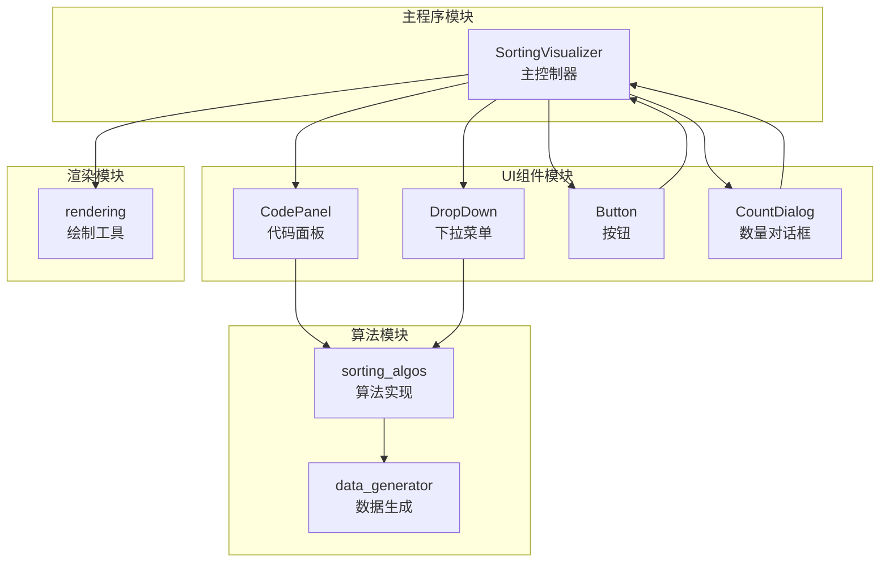
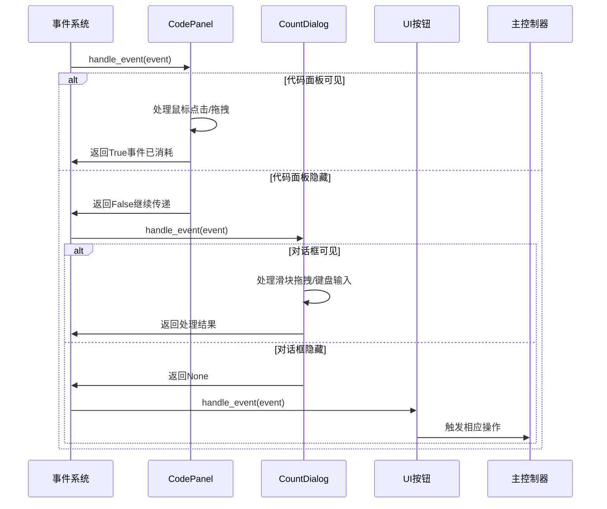
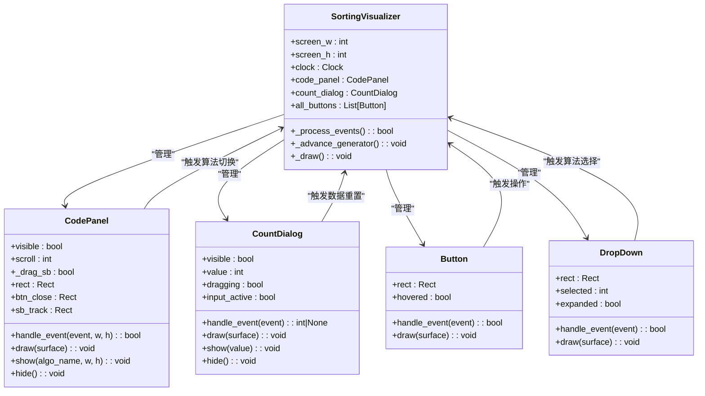
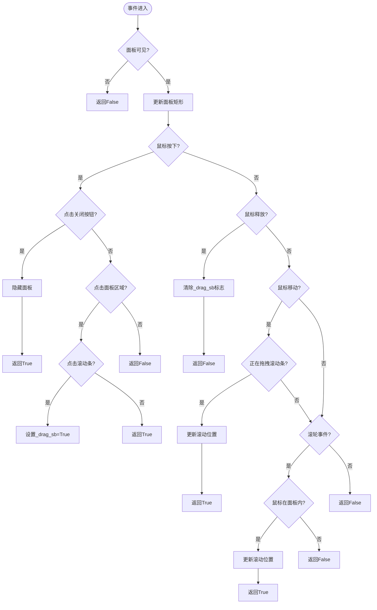
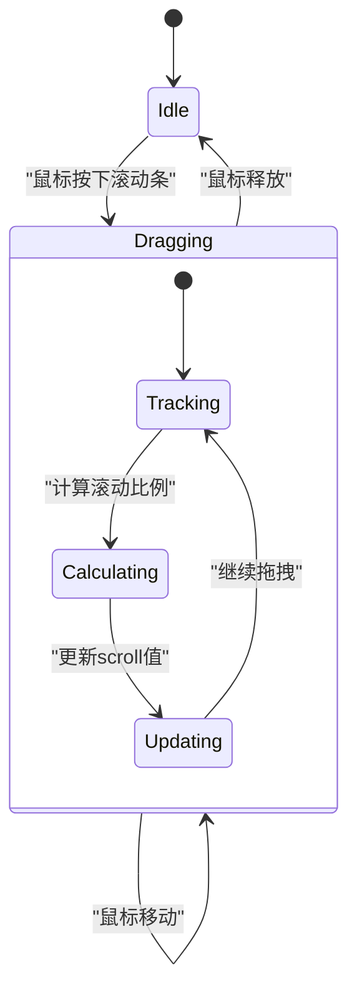
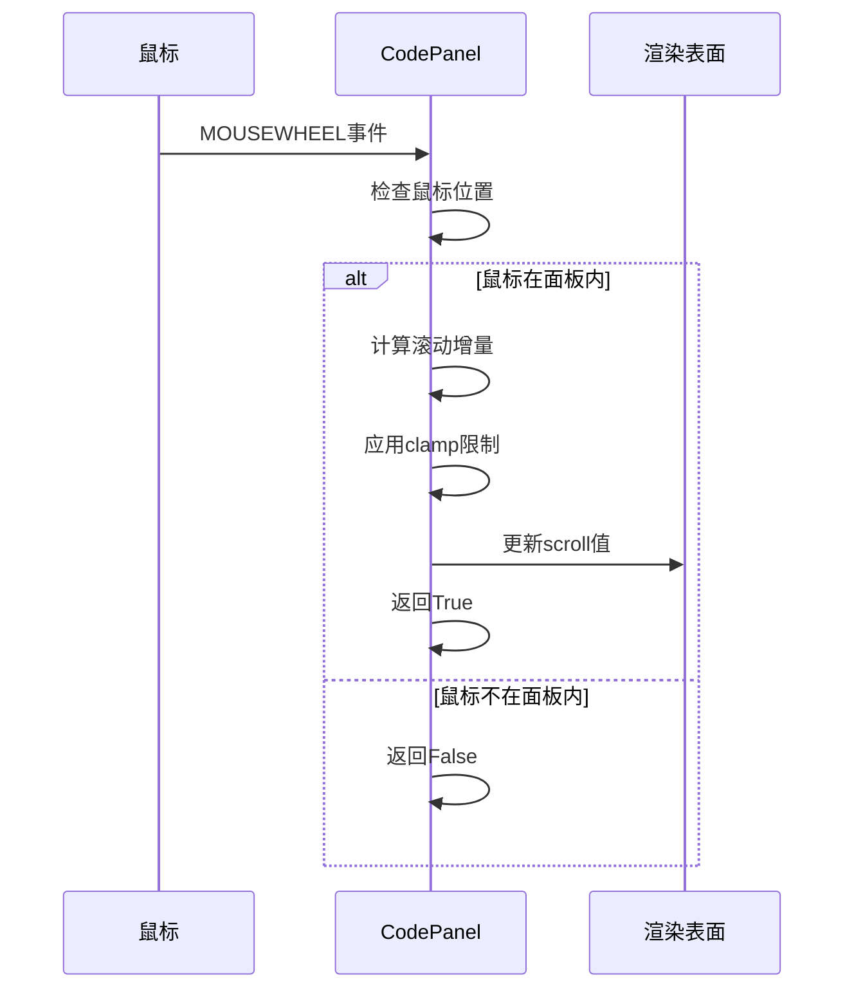
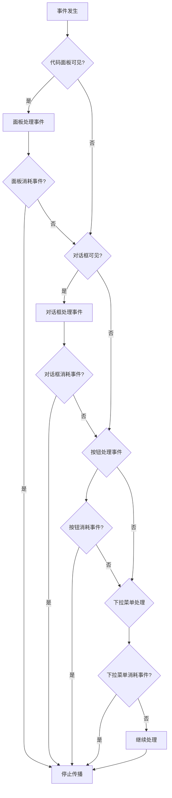
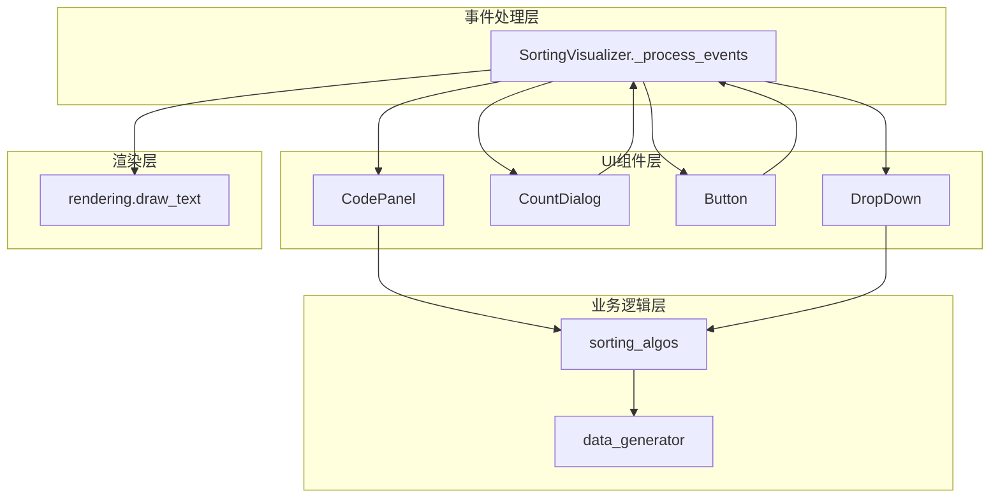
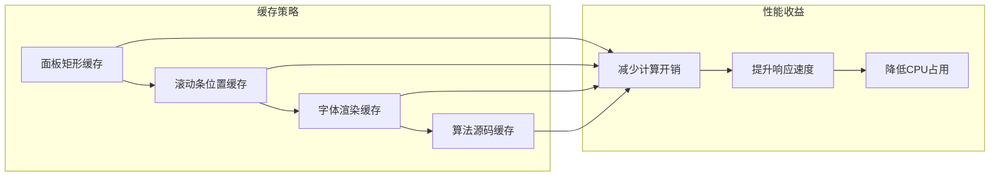

# 事件处理机制

<cite>
**本文档引用的文件**
- [sorting_visualizer.py](file://sorting_visualizer.py)
- [rendering.py](file://rendering.py)
- [sorting_algos.py](file://sorting_algos.py)
- [data_generator.py](file://data_generator.py)
</cite>

## 目录
1. [简介](#简介)
2. [项目结构](#项目结构)
3. [核心组件](#核心组件)
4. [架构概览](#架构概览)
5. [详细组件分析](#详细组件分析)
6. [依赖关系分析](#依赖关系分析)
7. [性能考虑](#性能考虑)
8. [故障排除指南](#故障排除指南)
9. [结论](#结论)

## 简介

本文档深入分析了Python数据可视化项目中的事件处理机制，重点解析了代码面板事件处理的核心实现。该系统基于Pygame框架构建，提供了完整的排序算法可视化功能，包括鼠标事件处理、键盘输入支持、滚动条拖拽管理和事件冒泡机制。

系统采用模块化设计，将UI组件、渲染逻辑和算法实现分离，形成了清晰的事件处理层次结构。事件处理机制是整个系统的中枢，负责协调用户交互与算法执行之间的关系。

## 项目结构

该项目采用清晰的模块化架构，主要分为以下几个核心模块：

**图表来源**
- [sorting_visualizer.py:146-177](file://sorting_visualizer.py#L146-L177)
- [rendering.py:110-279](file://rendering.py#L110-L279)

**章节来源**
- [sorting_visualizer.py:1-490](file://sorting_visualizer.py#L1-L490)
- [rendering.py:1-564](file://rendering.py#L1-L564)

## 核心组件

### 事件处理架构

系统采用分层事件处理架构，每个UI组件都有独立的事件处理能力：

**图表来源**
- [sorting_visualizer.py:386-461](file://sorting_visualizer.py#L386-L461)
- [rendering.py:241-278](file://rendering.py#L241-L278)

### 事件处理流程

事件处理遵循严格的优先级顺序：

1. **代码面板事件** - 首先检查代码面板是否可见
2. **数量对话框事件** - 检查对话框状态
3. **下拉菜单事件** - 处理算法选择
4. **按钮事件** - 处理各种控制按钮
5. **滚动条事件** - 处理滚动条拖拽

**章节来源**
- [sorting_visualizer.py:386-461](file://sorting_visualizer.py#L386-L461)

## 架构概览

### 事件处理层次结构

**图表来源**
- [sorting_visualizer.py:62-113](file://sorting_visualizer.py#L62-L113)
- [rendering.py:110-279](file://rendering.py#L110-L279)

## 详细组件分析

### 代码面板事件处理

#### handle_event方法实现

代码面板的`handle_event`方法是事件处理的核心，实现了完整的鼠标交互逻辑：

**图表来源**
- [rendering.py:241-278](file://rendering.py#L241-L278)

#### 鼠标点击检测算法

代码面板实现了精确的碰撞检测算法：

1. **关闭按钮检测**：使用`collidepoint()`方法检测鼠标坐标
2. **滚动条拖拽检测**：计算滚动条矩形位置并进行碰撞检测
3. **面板区域检测**：判断鼠标是否在有效交互区域内

#### 滚动条拖拽状态管理

滚动条拖拽通过`_drag_sb`标志位实现状态管理：

**图表来源**
- [rendering.py:247-267](file://rendering.py#L247-L267)

**章节来源**
- [rendering.py:241-278](file://rendering.py#L241-L278)

### 鼠标滚轮事件处理

滚轮事件处理实现了平滑的滚动体验：

**图表来源**
- [rendering.py:269-276](file://rendering.py#L269-L276)

### 键盘输入支持

虽然代码面板主要处理鼠标事件，但系统其他组件提供了完整的键盘输入支持：

- **ESC键**：取消对话框操作
- **回车键**：确认对话框输入
- **数字键**：对话框数字输入处理

**章节来源**
- [rendering.py:544-562](file://rendering.py#L544-L562)

### 事件冒泡和事件消耗机制

系统实现了智能的事件传递机制：

**图表来源**
- [sorting_visualizer.py:399-457](file://sorting_visualizer.py#L399-L457)

**章节来源**
- [sorting_visualizer.py:386-461](file://sorting_visualizer.py#L386-L461)

## 依赖关系分析

### 组件间依赖关系

**图表来源**
- [sorting_visualizer.py:386-461](file://sorting_visualizer.py#L386-L461)
- [rendering.py:110-279](file://rendering.py#L110-L279)

### 事件处理耦合度分析

系统采用了松耦合的设计原则：

- **低耦合**：每个UI组件独立处理自己的事件
- **高内聚**：事件处理逻辑集中在对应的组件中
- **清晰边界**：事件在不同组件间有明确的传递规则

**章节来源**
- [sorting_visualizer.py:146-177](file://sorting_visualizer.py#L146-L177)

## 性能考虑

### 事件过滤优化

系统实现了多层事件过滤机制：

1. **可见性检查**：首先检查组件是否可见
2. **区域检测**：使用高效的碰撞检测算法
3. **状态缓存**：缓存计算结果避免重复计算

### 状态缓存策略

**图表来源**
- [rendering.py:144-155](file://rendering.py#L144-L155)
- [sorting_algos.py:556-599](file://sorting_algos.py#L556-L599)

### 重绘优化

系统采用了智能的重绘策略：

- **按需重绘**：只重绘发生变化的区域
- **子表面优化**：使用`subsurface`减少重绘范围
- **状态变更检测**：避免不必要的重绘

**章节来源**
- [rendering.py:203-234](file://rendering.py#L203-L234)

## 故障排除指南

### 常见事件处理问题

#### 事件未正确传递

**症状**：用户点击按钮无反应

**可能原因**：
1. 代码面板遮挡了按钮区域
2. 事件被上层组件消耗
3. 碰撞检测区域计算错误

**解决方案**：
1. 检查`_process_events`方法的事件传递顺序
2. 验证`collidepoint`检测的准确性
3. 确认组件的z-index层级

#### 滚动条拖拽异常

**症状**：滚动条拖拽不灵敏或跳跃

**可能原因**：
1. `_drag_sb`标志位状态错误
2. 比例计算公式错误
3. 边界值处理不当

**解决方案**：
1. 检查鼠标移动事件的处理逻辑
2. 验证`clamp`函数的边界值
3. 确认滚动条尺寸计算

#### 键盘输入失效

**症状**：键盘输入无法响应

**可能原因**：
1. 对话框未处于激活状态
2. 事件类型处理错误
3. 输入验证逻辑问题

**解决方案**：
1. 检查`input_active`标志位
2. 验证`KEYDOWN`事件处理
3. 确认输入字符的合法性

**章节来源**
- [rendering.py:241-278](file://rendering.py#L241-L278)
- [rendering.py:491-563](file://rendering.py#L491-L563)

### 异常情况恢复策略

系统具备完善的错误处理机制：

1. **事件异常捕获**：使用try-catch处理渲染异常
2. **状态恢复**：在异常情况下恢复到安全状态
3. **降级处理**：在资源不足时提供简化功能

**章节来源**
- [rendering.py:203-213](file://rendering.py#L203-L213)

## 结论

该事件处理机制展现了优秀的软件工程实践：

### 设计优势

1. **模块化设计**：每个组件都有清晰的职责边界
2. **事件驱动架构**：采用响应式事件处理模式
3. **性能优化**：实现了多层次的性能优化策略
4. **可维护性**：代码结构清晰，易于理解和扩展

### 技术亮点

- **精确的碰撞检测**：使用高效的几何算法
- **智能的状态管理**：通过标志位管理复杂的交互状态
- **优雅的事件传递**：实现了合理的事件冒泡和消耗机制
- **完善的错误处理**：具备健壮的异常处理和恢复机制

### 改进建议

1. **事件日志记录**：添加事件处理日志便于调试
2. **性能监控**：集成性能指标监控
3. **单元测试**：为关键事件处理逻辑添加测试用例
4. **文档完善**：补充详细的API文档和使用说明

该事件处理机制为类似的数据可视化应用提供了优秀的参考模板，其设计理念和实现技巧值得在其他项目中借鉴和应用。