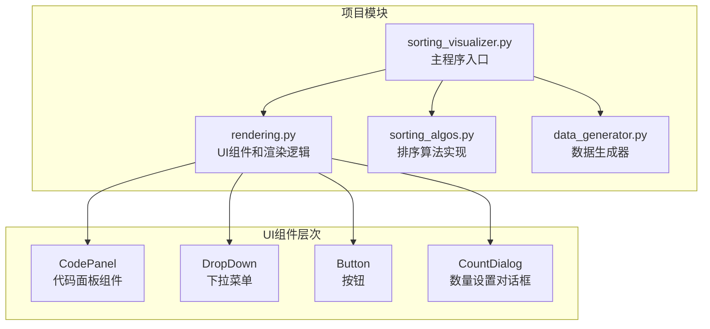
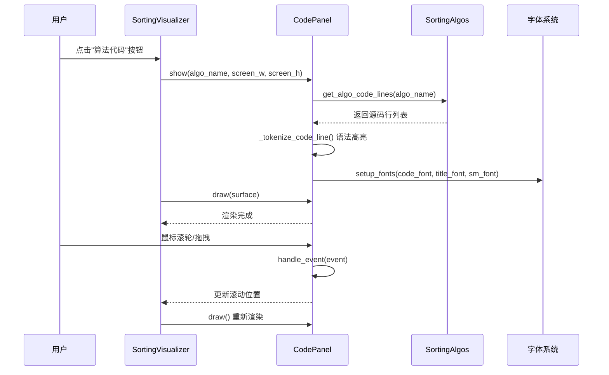
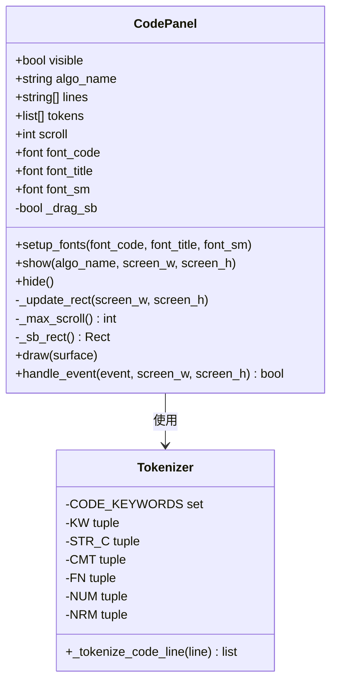
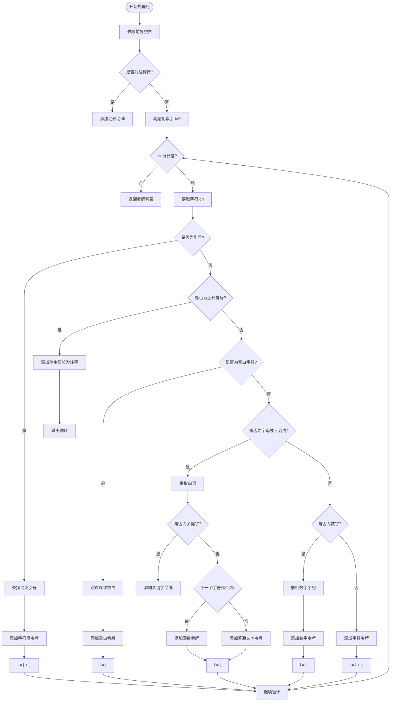
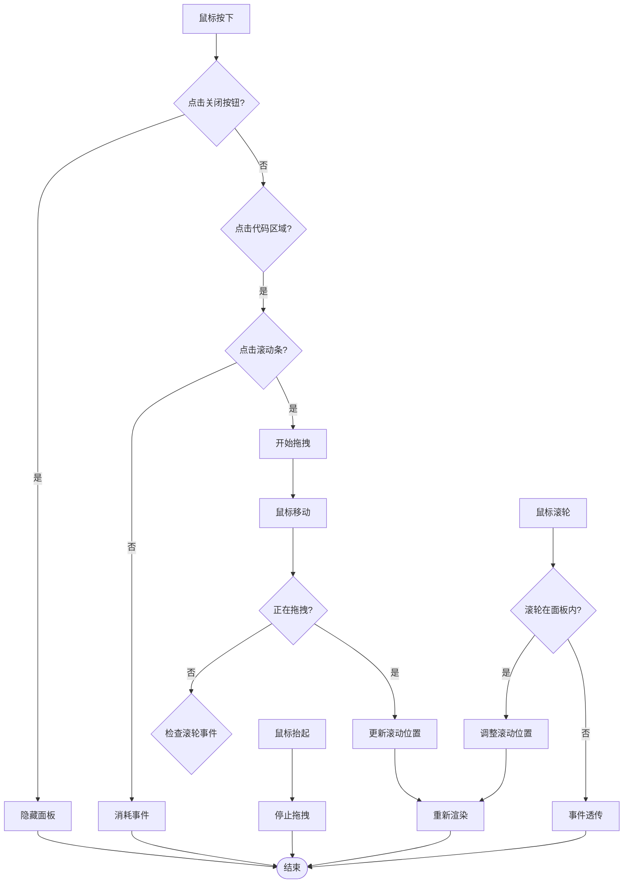
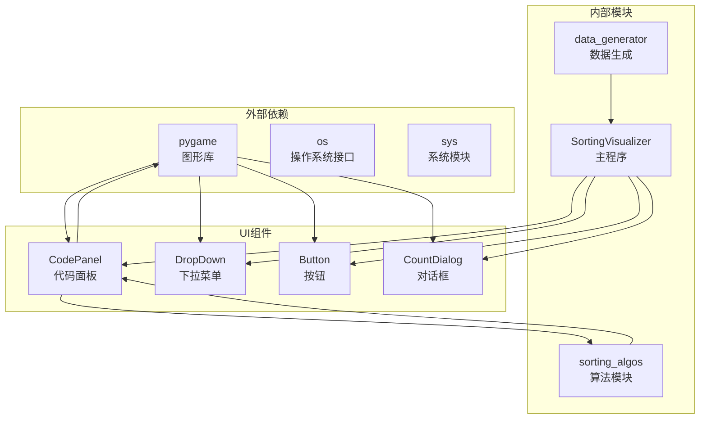

# 代码面板组件

<cite>
**本文档引用的文件**
- [rendering.py](file://rendering.py)
- [sorting_visualizer.py](file://sorting_visualizer.py)
- [sorting_algos.py](file://sorting_algos.py)
- [data_generator.py](file://data_generator.py)
</cite>

## 目录
1. [简介](#简介)
2. [项目结构](#项目结构)
3. [核心组件](#核心组件)
4. [架构概览](#架构概览)
5. [详细组件分析](#详细组件分析)
6. [依赖关系分析](#依赖关系分析)
7. [性能考虑](#性能考虑)
8. [故障排除指南](#故障排除指南)
9. [结论](#结论)

## 简介

代码面板组件是Python数据可视化项目中的一个关键UI组件，用于在可视化界面右侧显示排序算法的源代码。该组件实现了完整的语法高亮功能、滚动条系统、字体管理以及事件处理机制。它采用Pygame框架构建，提供了流畅的用户体验和丰富的视觉效果。

## 项目结构

该项目采用模块化设计，主要包含以下核心文件：

**图表来源**
- [sorting_visualizer.py:1-490](file://sorting_visualizer.py#L1-L490)
- [rendering.py:1-564](file://rendering.py#L1-L564)

**章节来源**
- [sorting_visualizer.py:1-490](file://sorting_visualizer.py#L1-L490)
- [rendering.py:1-564](file://rendering.py#L1-L564)

## 核心组件

代码面板组件的核心实现位于`rendering.py`文件中，包含以下关键要素：

### 语法高亮引擎
- **关键字识别**: 支持Python关键字的识别和着色
- **字符串匹配**: 处理单引号和双引号字符串
- **注释处理**: 识别并高亮行注释
- **数字识别**: 匹配整数和浮点数
- **函数名识别**: 通过括号判断函数调用

### 滚动条系统
- **轨道渲染**: 滚动条轨道的绘制和交互
- **滑块控制**: 拖拽式滚动条操作
- **平滑滚动**: 鼠标滚轮支持
- **边界处理**: 滚动范围的限制和验证

### 字体管理系统
- **多字体支持**: 代码字体、标题字体、辅助字体
- **动态加载**: 运行时字体选择和配置
- **回退机制**: 系统字体作为后备方案

**章节来源**
- [rendering.py:59-105](file://rendering.py#L59-L105)
- [rendering.py:110-280](file://rendering.py#L110-L280)

## 架构概览

代码面板组件在整个应用架构中扮演着重要的角色，与主程序和其他UI组件协同工作：

**图表来源**
- [sorting_visualizer.py:450-455](file://sorting_visualizer.py#L450-L455)
- [rendering.py:133-140](file://rendering.py#L133-L140)
- [rendering.py:167-241](file://rendering.py#L167-L241)

## 详细组件分析

### CodePanel 类结构

**图表来源**
- [rendering.py:110-280](file://rendering.py#L110-L280)
- [rendering.py:59-105](file://rendering.py#L59-L105)

### 语法高亮引擎实现

语法高亮引擎是代码面板的核心功能，采用状态机的方式处理不同类型的代码元素：

**图表来源**
- [rendering.py:59-105](file://rendering.py#L59-L105)

### 滚动条系统设计

滚动条系统提供了直观的滚动控制机制：

**图表来源**
- [rendering.py:241-279](file://rendering.py#L241-L279)

### 布局设计规范

代码面板采用清晰的分区布局设计：

| 区域 | 尺寸 | 功能 | 颜色主题 |
|------|------|------|----------|
| 标题栏 | 宽: 面板宽, 高: 34px | 显示算法名称和关闭按钮 | 深蓝色背景 |
| 行号区 | 宽: 40px, 高: 可变 | 显示行号 | 深灰色背景 |
| 代码区 | 宽: 面板宽-80px, 高: 可变 | 显示语法高亮代码 | 深蓝色背景 |
| 滚动条 | 宽: 8px, 高: 面板高-44px | 提供滚动控制 | 深色轨道 |

**章节来源**
- [rendering.py:110-166](file://rendering.py#L110-L166)
- [rendering.py:167-241](file://rendering.py#L167-L241)

## 依赖关系分析

代码面板组件与其他模块的依赖关系如下：

**图表来源**
- [sorting_visualizer.py:34-47](file://sorting_visualizer.py#L34-L47)
- [rendering.py:8-11](file://rendering.py#L8-L11)

**章节来源**
- [sorting_visualizer.py:34-47](file://sorting_visualizer.py#L34-L47)
- [rendering.py:8-11](file://rendering.py#L8-L11)

## 性能考虑

代码面板组件在设计时充分考虑了性能优化：

### 渲染优化策略
- **增量渲染**: 仅渲染可见行，避免全量重绘
- **子表面优化**: 使用`subsurface`减少绘制区域
- **令牌缓存**: 预先解析和缓存语法令牌
- **边界裁剪**: 只绘制可见区域内的文本

### 内存管理
- **对象池**: 复用渲染对象，减少垃圾回收压力
- **延迟加载**: 字体在首次需要时才加载
- **缓存机制**: 算法源码使用内存缓存

### 事件处理优化
- **事件短路**: 未命中区域的事件快速返回
- **状态最小化**: 最小化实例变量数量
- **算法复杂度**: 滚动条计算为O(1)时间复杂度

**章节来源**
- [rendering.py:215-234](file://rendering.py#L215-L234)
- [rendering.py:152-166](file://rendering.py#L152-L166)

## 故障排除指南

### 常见问题及解决方案

#### 1. 字体显示异常
**症状**: 代码显示为方块或乱码
**原因**: 字体文件缺失或损坏
**解决方法**:
- 检查字体文件路径是否存在
- 确认字体文件格式正确
- 验证字体文件权限

#### 2. 语法高亮失效
**症状**: 代码显示为单一颜色
**原因**: 令牌解析错误
**解决方法**:
- 检查`CODE_KEYWORDS`集合完整性
- 验证正则表达式匹配逻辑
- 确认字符编码正确

#### 3. 滚动条不响应
**症状**: 滚动条无法拖拽或滚动
**原因**: 事件处理冲突
**解决方法**:
- 检查事件捕获顺序
- 验证碰撞检测逻辑
- 确认鼠标坐标转换正确

#### 4. 内存泄漏
**症状**: 应用运行时间越长占用内存越多
**原因**: 对象未正确释放
**解决方法**:
- 检查Surface对象生命周期
- 确认不再使用的对象及时销毁
- 监控令牌缓存大小

**章节来源**
- [rendering.py:203-214](file://rendering.py#L203-L214)
- [rendering.py:261-267](file://rendering.py#L261-L267)

## 结论

代码面板组件是一个设计精良的UI组件，具有以下特点：

### 技术优势
- **模块化设计**: 清晰的职责分离和接口定义
- **性能优化**: 增量渲染和事件短路机制
- **可扩展性**: 支持自定义语法高亮规则
- **跨平台兼容**: 基于Pygame的跨平台支持

### 设计亮点
- **语法高亮引擎**: 实现了完整的Python语法分析
- **交互体验**: 直观的滚动控制和状态反馈
- **视觉设计**: 统一的颜色主题和布局规范
- **错误处理**: 完善的异常处理和降级机制

### 改进建议
- **性能监控**: 添加渲染性能指标
- **配置扩展**: 支持用户自定义主题
- **国际化**: 添加多语言支持
- **无障碍**: 增加键盘导航支持

该组件为整个排序算法可视化项目提供了重要的代码展示功能，是项目UI架构中的关键组成部分。