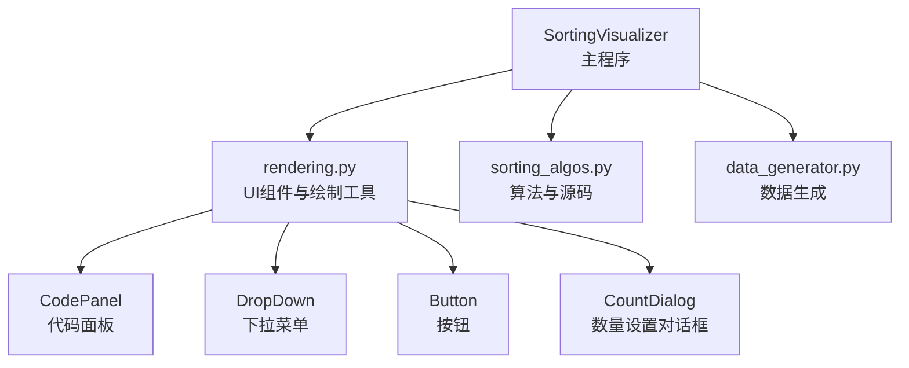
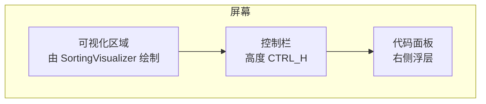
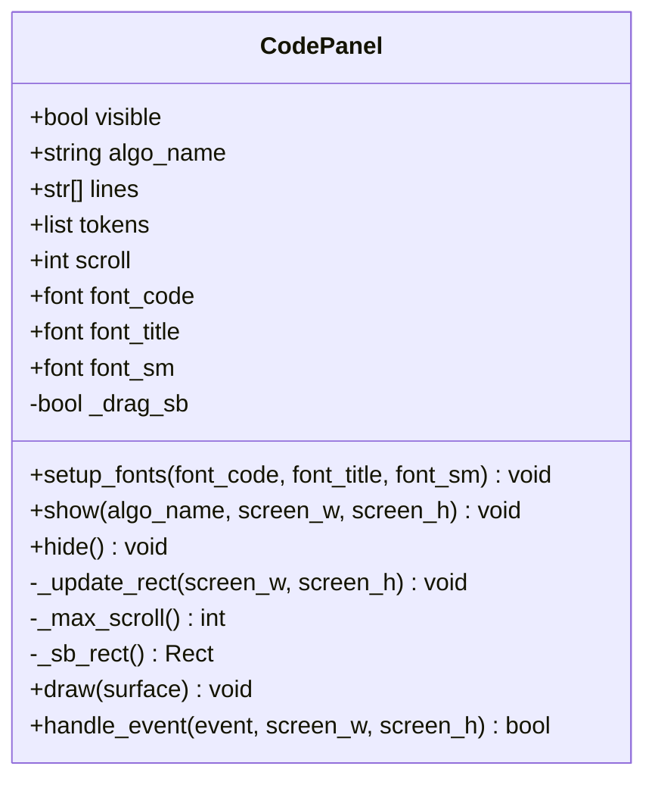
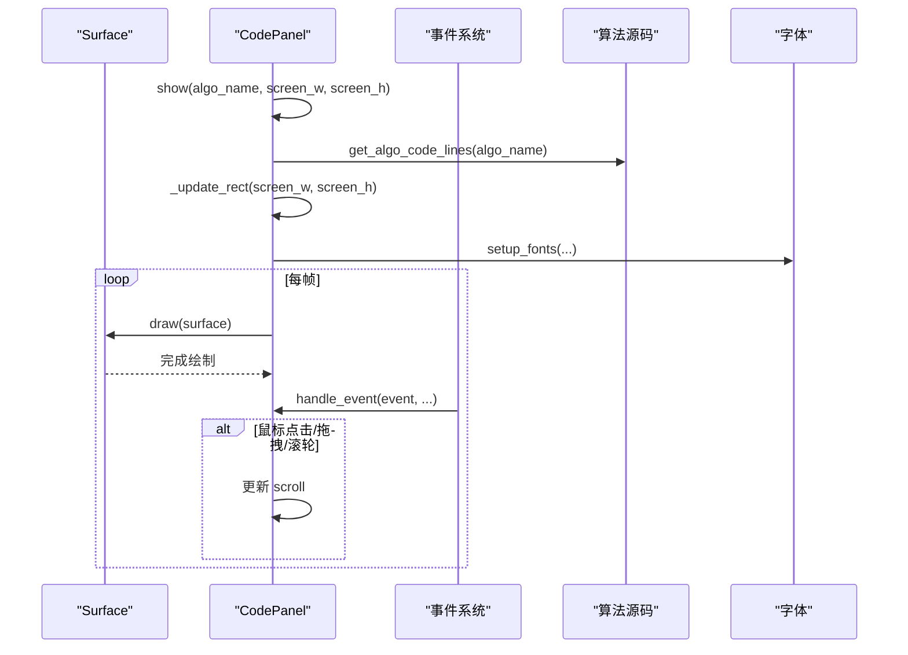
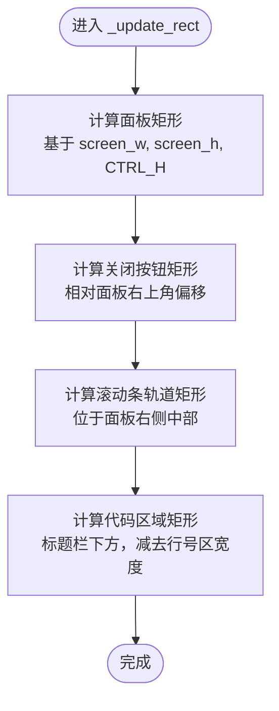
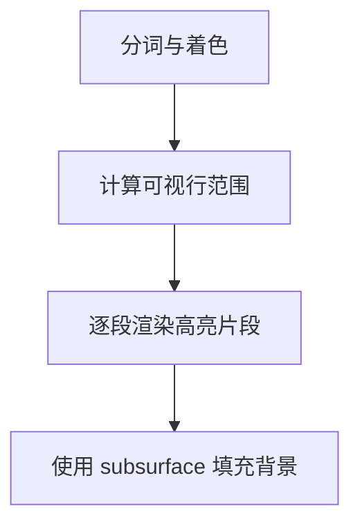
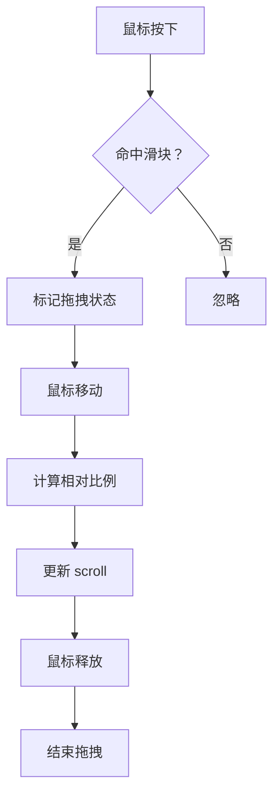
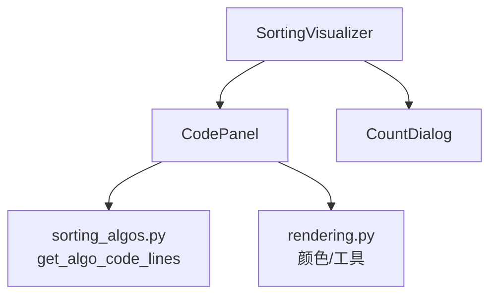

# 布局渲染系统

<cite>
**本文引用的文件**
- [rendering.py](file://rendering.py)
- [sorting_visualizer.py](file://sorting_visualizer.py)
- [sorting_algos.py](file://sorting_algos.py)
- [data_generator.py](file://data_generator.py)
</cite>

## 目录
1. [简介](#简介)
2. [项目结构](#项目结构)
3. [核心组件](#核心组件)
4. [架构总览](#架构总览)
5. [详细组件分析](#详细组件分析)
6. [依赖分析](#依赖分析)
7. [性能考虑](#性能考虑)
8. [故障排除指南](#故障排除指南)
9. [结论](#结论)

## 简介
本技术文档聚焦于代码面板布局渲染系统，深入解析 CodePanel 类的 draw 方法完整实现，涵盖：
- 面板背景绘制与标题栏设计
- 代码区域布局与语法高亮渲染
- 滚动条轨道与拖拽交互
- 坐标计算与矩形定位（含 _update_rect、btn_close、sb_track、code_area）
- 渲染层次与 Z-index 管理（背景层、前景层、交互层）
- 性能优化策略（子表面、按需渲染、批量绘制）
- 颜色系统设计理念（深色主题与高对比度）

## 项目结构
该项目采用模块化设计，主要文件职责如下：
- sorting_visualizer.py：主程序入口，负责窗口、字体、UI 构建、事件循环与渲染调度
- rendering.py：颜色常量、通用绘制工具、UI 组件（CodePanel、DropDown、Button、CountDialog）
- sorting_algos.py：19 种排序算法生成器与源码提取工具
- data_generator.py：随机数组生成

图表来源
- [sorting_visualizer.py:146-178](file://sorting_visualizer.py#L146-L178)
- [rendering.py:110-280](file://rendering.py#L110-L280)

章节来源
- [sorting_visualizer.py:1-497](file://sorting_visualizer.py#L1-L497)
- [rendering.py:1-564](file://rendering.py#L1-L564)

## 核心组件
本节聚焦 CodePanel 的布局与渲染机制，包括：
- 面板尺寸与位置计算
- 标题栏与关闭按钮
- 代码区域与行号区域
- 滚动条轨道与滑块
- 语法高亮与按需渲染
- 事件处理与滚动交互

章节来源
- [rendering.py:110-280](file://rendering.py#L110-L280)

## 架构总览
CodePanel 作为右侧浮层叠加在可视化区域之上，不影响控制栏。其渲染顺序遵循“背景层 → 代码前景层 → 交互层”的层次结构，确保标题栏与按钮始终覆盖在代码内容之上。

图表来源
- [sorting_visualizer.py:320-363](file://sorting_visualizer.py#L320-L363)
- [rendering.py:144-151](file://rendering.py#L144-L151)

## 详细组件分析

### CodePanel 类与渲染流程
CodePanel 负责右侧浮层的绘制与交互，关键方法包括：
- show/hide：控制可见性与数据加载
- _update_rect：根据屏幕尺寸计算面板矩形与子区域
- draw：执行背景、标题栏、代码区、滚动条与按钮的绘制
- handle_event：处理鼠标与滚轮事件，支持拖拽滚动与关闭

图表来源
- [rendering.py:110-280](file://rendering.py#L110-L280)

#### draw 方法完整流程
- 条件检查：仅在可见且字体已准备时绘制
- 面板背景：绘制深色背景与蓝色边框线
- 标题栏：绘制浅蓝背景与分隔线，并渲染算法标题
- 关闭按钮：根据鼠标悬停状态切换颜色，渲染“X”
- 代码区：
  - 计算代码区域与行号区域矩形
  - 使用 subsurface 对行号区与代码区分别填充背景
  - 按需渲染可见行，逐段渲染语法高亮片段
- 滚动条：绘制轨道与滑块，支持拖拽

图表来源
- [rendering.py:133-140](file://rendering.py#L133-L140)
- [rendering.py:167-240](file://rendering.py#L167-L240)
- [rendering.py:241-278](file://rendering.py#L241-L278)

#### 坐标计算与矩形定位
- 面板矩形（_update_rect）：基于屏幕宽度与控制栏高度，计算面板左上角与尺寸
- 关闭按钮（btn_close）：位于面板右上角，相对面板右边界与顶部偏移固定像素
- 滚动条轨道（sb_track）：位于面板右侧中部，高度与面板内容区高度相关
- 代码区域（code_area）：位于标题栏下方，占据剩余高度与宽度，减去行号区宽度

图表来源
- [rendering.py:144-151](file://rendering.py#L144-L151)

章节来源
- [rendering.py:144-151](file://rendering.py#L144-L151)
- [rendering.py:167-240](file://rendering.py#L167-L240)

#### 渲染层次与 Z-index 管理
- 背景层：面板整体背景与标题栏背景
- 前景色：代码内容与行号背景
- 交互层：关闭按钮与滚动条滑块
- 绘制顺序：先背景后前景再交互，确保交互元素始终覆盖在内容之上

图表来源
- [rendering.py:173-193](file://rendering.py#L173-L193)
- [rendering.py:203-240](file://rendering.py#L203-L240)

章节来源
- [rendering.py:173-193](file://rendering.py#L173-L193)
- [rendering.py:203-240](file://rendering.py#L203-L240)

#### 语法高亮与按需渲染
- 词法分析：对每行代码进行分词，区分关键字、字符串、注释、函数名、数字与普通文本
- 语法高亮：为不同类别分配颜色常量
- 按需渲染：仅渲染可视范围内的行，减少绘制开销
- 子表面优化：对行号区与代码区分别创建 subsurface，独立填充背景，避免重复绘制

图表来源
- [rendering.py:59-104](file://rendering.py#L59-L104)
- [rendering.py:215-234](file://rendering.py#L215-L234)
- [rendering.py:203-214](file://rendering.py#L203-L214)

章节来源
- [rendering.py:59-104](file://rendering.py#L59-L104)
- [rendering.py:203-234](file://rendering.py#L203-L234)

#### 滚动条与交互
- 滚动条轨道：固定宽度与高度，位于面板右侧
- 滑块尺寸：根据总高度与可视高度计算，最小高度阈值保护
- 滚动计算：根据滑块位置换算 scroll 偏移，限制在最大滚动范围内
- 交互事件：鼠标按下检测滑块命中；拖拽更新 scroll；滚轮在面板区域内滚动

图表来源
- [rendering.py:241-278](file://rendering.py#L241-L278)
- [rendering.py:157-165](file://rendering.py#L157-L165)

章节来源
- [rendering.py:241-278](file://rendering.py#L241-L278)
- [rendering.py:157-165](file://rendering.py#L157-L165)

## 依赖分析
- CodePanel 依赖：
  - 颜色常量与工具函数（来自 rendering.py）
  - 算法源码提取（来自 sorting_algos.py）
  - 字体资源（由 SortingVisualizer 在运行时注入）
- 事件链路：
  - SortingVisualizer 处理全局事件，优先交由 CodePanel 与 CountDialog 处理
  - 事件处理结果影响 CodePanel 的可见性与滚动状态

图表来源
- [sorting_visualizer.py:406-468](file://sorting_visualizer.py#L406-L468)
- [rendering.py:133-139](file://rendering.py#L133-L139)
- [sorting_algos.py:590-600](file://sorting_algos.py#L590-L600)

章节来源
- [sorting_visualizer.py:406-468](file://sorting_visualizer.py#L406-L468)
- [rendering.py:133-139](file://rendering.py#L133-L139)
- [sorting_algos.py:590-600](file://sorting_algos.py#L590-L600)

## 性能考虑
- 子表面（subsurface）使用
  - 将行号区与代码区分别创建 subsurface，独立填充背景，避免重复绘制面板背景
  - 仅在可见范围内渲染代码片段，减少 blit 次数
- 按需渲染
  - 仅渲染可视行，首行与可见行数由面板高度与行高决定
  - 逐段渲染语法高亮片段，避免一次性渲染整段文本
- 批量绘制
  - 同一帧内按顺序绘制背景、前景与交互层，减少状态切换
- 滚动优化
  - 滚动条滑块尺寸与位置按比例计算，避免频繁重绘轨道
  - 拖拽滚动时仅更新 scroll 并重绘受影响区域

章节来源
- [rendering.py:203-214](file://rendering.py#L203-L214)
- [rendering.py:215-234](file://rendering.py#L215-L234)
- [rendering.py:235-240](file://rendering.py#L235-L240)

## 故障排除指南
- 面板不显示
  - 检查 visible 标志与字体是否已准备
  - 确认 show 调用与 _update_rect 计算正确
- 滚动无效
  - 检查鼠标命中滑块与拖拽状态切换
  - 确认最大滚动值与比例换算逻辑
- 文本渲染异常
  - 检查 subsurface 创建与异常捕获
  - 确认字体可用性与字号设置
- 交互冲突
  - 确保事件优先级：CodePanel → CountDialog → 其他控件
  - 避免弹窗开启当帧误关闭

章节来源
- [rendering.py:167-169](file://rendering.py#L167-L169)
- [rendering.py:241-278](file://rendering.py#L241-L278)
- [rendering.py:203-214](file://rendering.py#L203-L214)
- [sorting_visualizer.py:406-418](file://sorting_visualizer.py#L406-L418)

## 结论
代码面板布局渲染系统通过清晰的层次划分与高效的按需渲染策略，在保证良好用户体验的同时兼顾了性能表现。其核心优势包括：
- 精确的坐标计算与矩形定位，确保 UI 元素稳定布局
- 深色主题与高对比度色彩搭配，提升可读性
- 子表面与按需渲染相结合，降低绘制成本
- 交互层覆盖前景层的设计，确保按钮与滚动条始终可操作