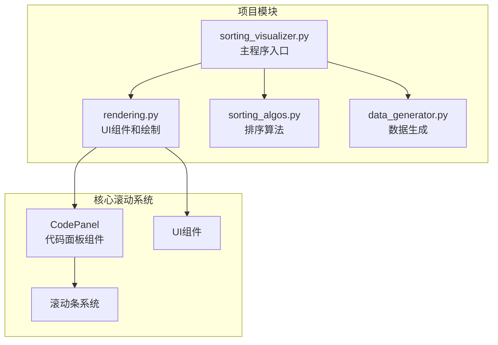
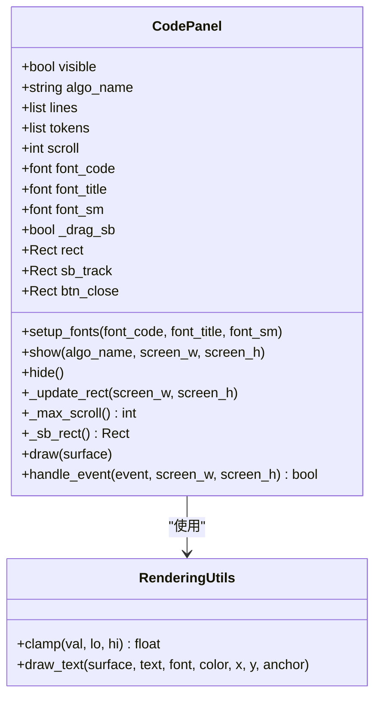
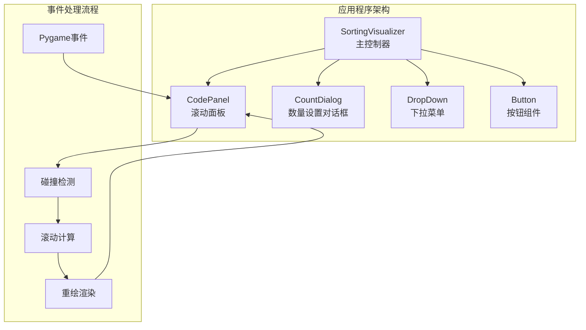
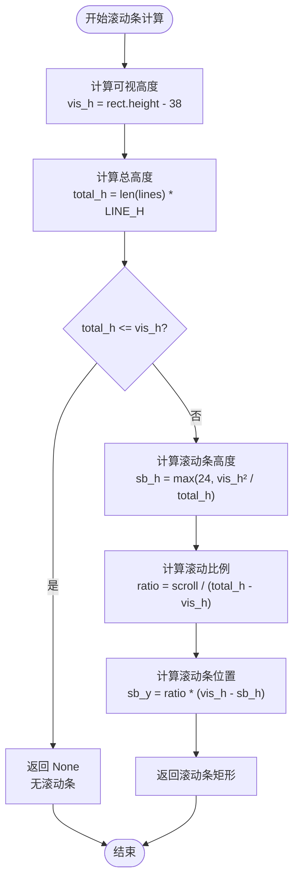
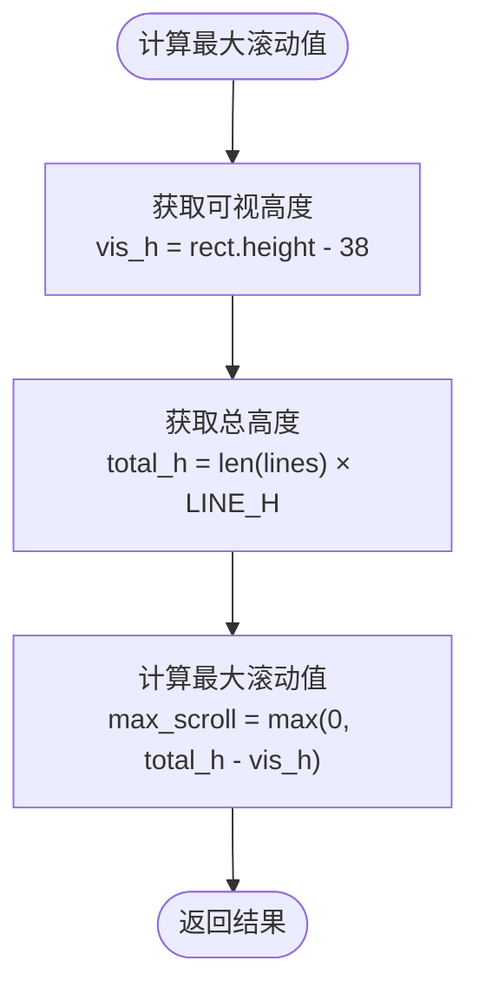
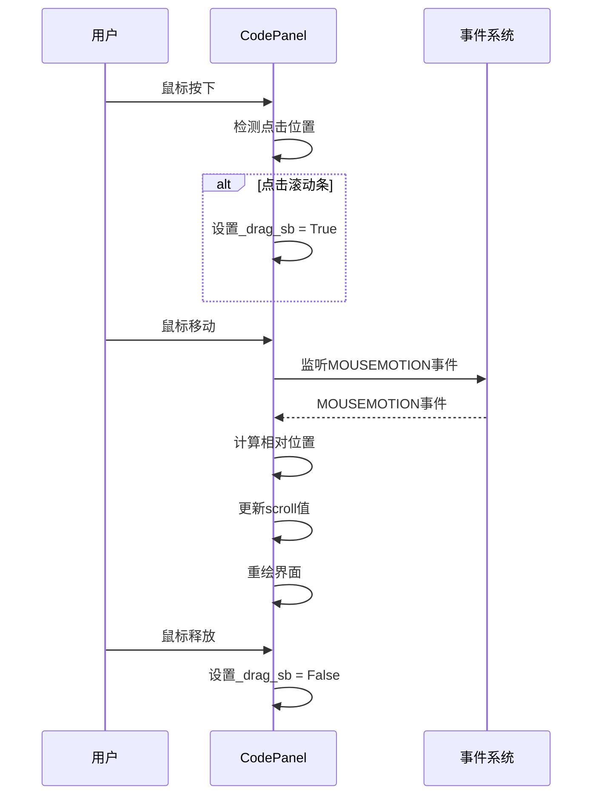
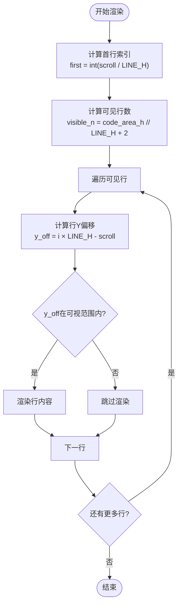
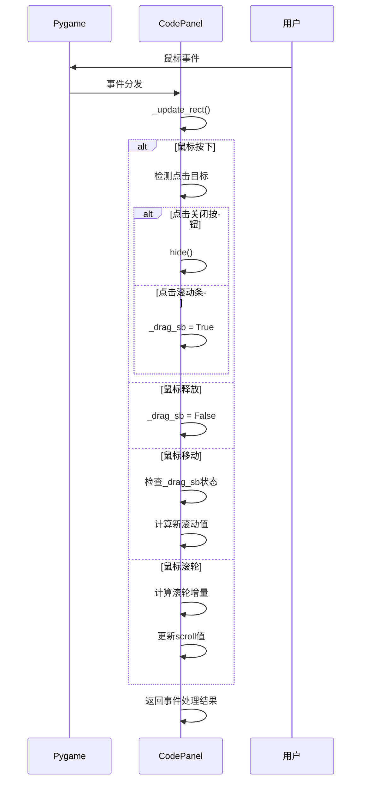
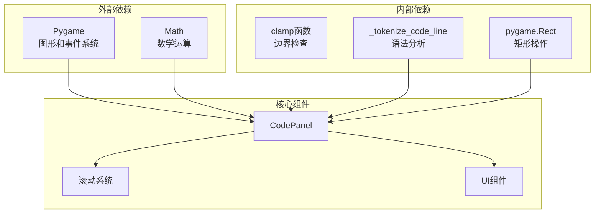
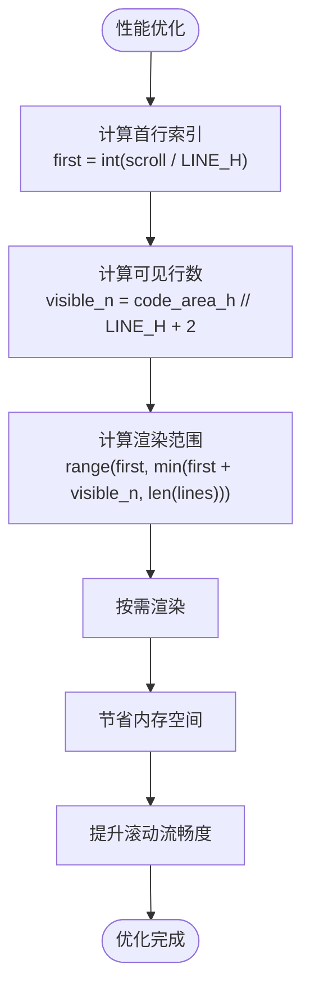

# 滚动系统

<cite>
**本文档引用的文件**
- [rendering.py](file://rendering.py)
- [sorting_visualizer.py](file://sorting_visualizer.py)
- [sorting_algos.py](file://sorting_algos.py)
- [data_generator.py](file://data_generator.py)
</cite>

## 目录
1. [简介](#简介)
2. [项目结构](#项目结构)
3. [核心组件](#核心组件)
4. [架构概览](#架构概览)
5. [详细组件分析](#详细组件分析)
6. [依赖关系分析](#依赖关系分析)
7. [性能考虑](#性能考虑)
8. [故障排除指南](#故障排除指南)
9. [结论](#结论)

## 简介

本文档深入解析了Python数据可视化项目中的代码面板滚动系统实现。该系统提供了完整的滚动条功能，包括轨道计算、滚动位置更新、拖拽交互处理和鼠标滚轮支持。系统采用Pygame框架构建，实现了高效的按需渲染和内存管理策略。

滚动系统的核心是CodePanel类，它负责显示算法源代码并提供流畅的滚动体验。系统实现了精确的几何计算公式，确保滚动条与内容高度的正确映射，并提供了多种用户交互方式。

## 项目结构

该项目采用模块化设计，将不同功能分离到独立的文件中：



**图表来源**
- [sorting_visualizer.py:62-490](file://sorting_visualizer.py#L62-L490)
- [rendering.py:110-280](file://rendering.py#L110-L280)

**章节来源**
- [sorting_visualizer.py:1-490](file://sorting_visualizer.py#L1-L490)
- [rendering.py:1-564](file://rendering.py#L1-L564)

## 核心组件

滚动系统的核心组件是CodePanel类，它包含了完整的滚动功能实现：

### CodePanel类结构



**图表来源**
- [rendering.py:110-280](file://rendering.py#L110-L280)

### 关键属性说明

| 属性 | 类型 | 描述 | 默认值 |
|------|------|------|--------|
| visible | bool | 面板可见性标志 | False |
| algo_name | string | 当前算法名称 | "" |
| lines | list | 源代码行列表 | [] |
| tokens | list | 语法标记列表 | [] |
| scroll | int | 滚动偏移量（像素） | 0 |
| font_code | font | 代码字体 | None |
| font_title | font | 标题字体 | None |
| font_sm | font | 小字体 | None |
| _drag_sb | bool | 拖拽状态标志 | False |

**章节来源**
- [rendering.py:110-140](file://rendering.py#L110-L140)

## 架构概览

滚动系统在整个应用程序架构中扮演着重要角色，作为UI组件的一部分为用户提供源代码浏览功能。



**图表来源**
- [sorting_visualizer.py:386-461](file://sorting_visualizer.py#L386-L461)
- [rendering.py:241-278](file://rendering.py#L241-L278)

## 详细组件分析

### 滚动条轨道计算系统

滚动条轨道计算是整个滚动系统的核心，负责将内容高度映射到可视区域。

#### 轨道计算公式



**图表来源**
- [rendering.py:157-165](file://rendering.py#L157-L165)

#### 几何计算详解

滚动条轨道计算涉及以下关键公式：

1. **可视高度计算**：
   ```
   可视高度 = 面板高度 - 标题栏高度 - 上下边距
   ```

2. **总高度计算**：
   ```
   总高度 = 代码行数 × 每行高度
   ```

3. **滚动条高度计算**：
   ```
   滚动条高度 = max(最小高度, (可视高度²) / 总高度)
   ```

4. **滚动位置映射**：
   ```
   滚动条Y坐标 = (滚动偏移 / (总高度 - 可视高度)) × (可视高度 - 滚动条高度)
   ```

**章节来源**
- [rendering.py:152-165](file://rendering.py#L152-L165)

### 滚动位置更新系统

滚动位置更新系统负责维护和计算当前的滚动状态。

#### 最大滚动值计算



**图表来源**
- [rendering.py:152-155](file://rendering.py#L152-L155)

#### 边界处理机制

系统实现了严格的边界处理，确保滚动位置始终在有效范围内：

- **最小值边界**：`max(0, ...)` 确保不出现负值
- **最大值边界**：`total_h - vis_h` 防止过度滚动
- **Clamp函数**：统一的边界检查机制

**章节来源**
- [rendering.py:152-155](file://rendering.py#L152-L155)

### 拖拽交互处理系统

拖拽交互系统提供了直观的鼠标拖拽滚动体验。

#### 拖拽状态管理



**图表来源**
- [rendering.py:241-278](file://rendering.py#L241-L278)

#### 拖拽计算逻辑

拖拽交互的关键计算步骤：

1. **相对位置计算**：
   ```
   相对位置 = 鼠标Y坐标 - 滚动条轨道Y坐标
   ```

2. **比例计算**：
   ```
   比例 = clamp(相对位置 / 可视高度, 0, 1)
   ```

3. **滚动值更新**：
   ```
   新滚动值 = int(比例 × (总高度 - 可视高度))
   ```

**章节来源**
- [rendering.py:261-267](file://rendering.py#L261-L267)

### 鼠标滚轮支持系统

鼠标滚轮支持提供了便捷的快速滚动功能。

#### 滚轮事件处理

```mermaid
flowchart TD
WheelEvent[鼠标滚轮事件] --> CheckHover{鼠标是否悬停在面板上?}
CheckHover --> |否| PassThrough[传递给其他组件]
CheckHover --> |是| CalcDelta[计算滚动增量<br/>delta = -event.y × LINE_H × 3]
CalcDelta --> UpdateScroll[更新scroll值<br/>scroll = clamp(scroll + delta, 0, max_scroll)]
UpdateScroll --> Redraw[触发重绘]
PassThrough --> End([结束])
Redraw --> End
```

**图表来源**
- [rendering.py:269-276](file://rendering.py#L269-L276)

#### 滚轮灵敏度配置

滚轮系统具有可配置的灵敏度参数：

- **步长系数**：`LINE_H × 3`（每轮滚动3行）
- **方向处理**：`-event.y` 实现自然滚动方向
- **边界保护**：使用clamp函数防止越界

**章节来源**
- [rendering.py:269-276](file://rendering.py#L269-L276)

### 可见行数计算系统

为了优化性能，系统实现了智能的可见行数计算。

#### 按需渲染算法



**图表来源**
- [rendering.py:215-234](file://rendering.py#L215-L234)

#### 性能优化策略

系统采用了多项性能优化措施：

1. **可见区域裁剪**：只渲染可视范围内的行
2. **缓冲区扩展**：额外渲染2行以改善滚动平滑度
3. **子表面优化**：使用subsurface减少绘制开销
4. **异常容错**：捕获渲染异常，保证系统稳定性

**章节来源**
- [rendering.py:215-234](file://rendering.py#L215-L234)

### 事件处理流程

滚动系统实现了完整的事件处理机制，确保响应性和用户体验。

#### 事件处理序列图



**图表来源**
- [rendering.py:241-278](file://rendering.py#L241-L278)

**章节来源**
- [rendering.py:241-278](file://rendering.py#L241-L278)

## 依赖关系分析

滚动系统与其他组件的依赖关系体现了清晰的模块化设计。



**图表来源**
- [rendering.py:8-11](file://rendering.py#L8-L11)
- [rendering.py:38-47](file://rendering.py#L38-L47)
- [rendering.py:59-104](file://rendering.py#L59-L104)

### 外部依赖分析

滚动系统主要依赖于以下外部库：

- **Pygame**：提供图形渲染、事件处理和输入设备支持
- **Math模块**：提供数学运算功能（如平方根等）

### 内部依赖分析

系统内部实现了多个辅助函数：

- **clamp函数**：统一的边界检查机制
- **_tokenize_code_line函数**：代码语法分析和着色
- **draw_text函数**：文本渲染工具

**章节来源**
- [rendering.py:8-11](file://rendering.py#L8-L11)
- [rendering.py:38-47](file://rendering.py#L38-L47)
- [rendering.py:59-104](file://rendering.py#L59-L104)

## 性能考虑

滚动系统在设计时充分考虑了性能优化，采用了多种策略来确保流畅的用户体验。

### 可见行数计算优化

系统通过智能的可见行数计算减少了不必要的渲染工作：



**图表来源**
- [rendering.py:215-218](file://rendering.py#L215-L218)

### 内存管理策略

系统采用了有效的内存管理策略：

1. **按需分配**：只在需要时创建和销毁对象
2. **对象复用**：重用现有的字体和颜色对象
3. **异常处理**：捕获渲染异常，防止内存泄漏
4. **资源清理**：及时释放不再使用的Surface对象

### 渲染性能优化

渲染系统实现了多项优化技术：

- **子表面渲染**：使用subsurface减少绘制调用
- **批量绘制**：合并相似的绘制操作
- **延迟渲染**：只在必要时进行重绘
- **缓存机制**：缓存计算结果避免重复计算

**章节来源**
- [rendering.py:203-234](file://rendering.py#L203-L234)

## 故障排除指南

### 常见问题及解决方案

#### 滚动条不显示

**问题描述**：当内容较短时滚动条不显示

**原因分析**：
- 总高度小于等于可视高度
- 系统自动隐藏滚动条以节省空间

**解决方案**：
- 增加内容长度或减小面板尺寸
- 检查LINE_H和面板高度的设置

#### 滚动位置异常

**问题描述**：滚动位置超出预期范围

**原因分析**：
- 边界检查逻辑错误
- 滚动条高度计算异常

**解决方案**：
- 检查clamp函数的使用
- 验证滚动条高度计算公式

#### 拖拽响应迟缓

**问题描述**：拖拽滚动条时响应不灵敏

**原因分析**：
- 事件处理频率过高
- 计算复杂度过高

**解决方案**：
- 优化事件处理逻辑
- 减少不必要的重绘操作

### 调试技巧

1. **启用日志输出**：添加调试信息跟踪滚动状态变化
2. **可视化边界**：临时绘制滚动区域边界以验证计算
3. **性能监控**：使用Pygame的性能工具监控渲染时间
4. **单元测试**：为关键计算函数编写测试用例

**章节来源**
- [rendering.py:203-234](file://rendering.py#L203-L234)

## 结论

滚动系统作为Python数据可视化项目的重要组成部分，展现了优秀的工程实践。系统通过精确的几何计算、高效的按需渲染和完善的事件处理机制，为用户提供了流畅的代码浏览体验。

### 技术亮点

1. **精确的几何计算**：实现了准确的滚动条映射算法
2. **智能的性能优化**：通过可见行数计算和按需渲染提升性能
3. **完整的交互支持**：支持拖拽、滚轮等多种交互方式
4. **稳健的错误处理**：具备良好的异常处理和容错能力

### 设计优势

- **模块化设计**：清晰的职责分离和接口定义
- **可扩展性**：易于添加新的滚动行为和交互方式
- **跨平台兼容**：基于Pygame框架，支持多平台部署
- **性能友好**：优化的渲染策略确保流畅的用户体验

该滚动系统为类似的数据可视化应用提供了优秀的参考实现，展示了如何在有限的资源下实现高质量的用户界面交互。