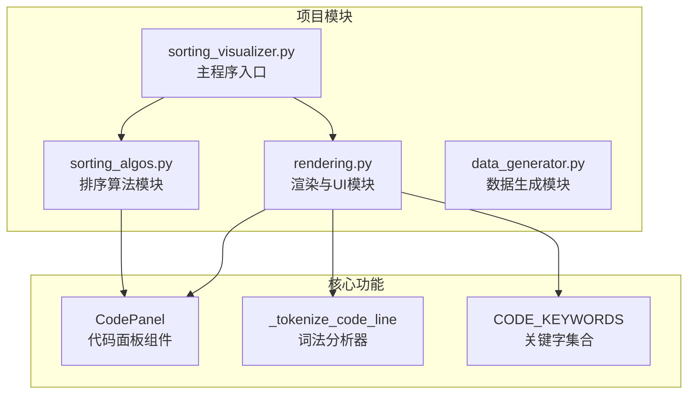
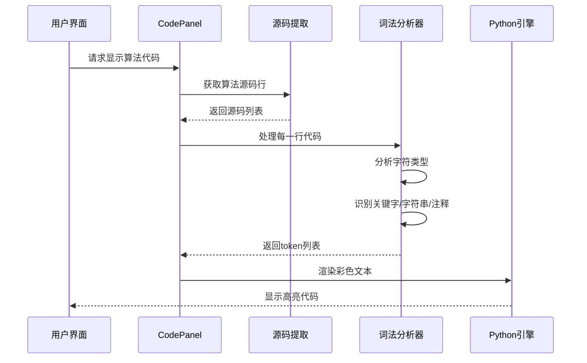
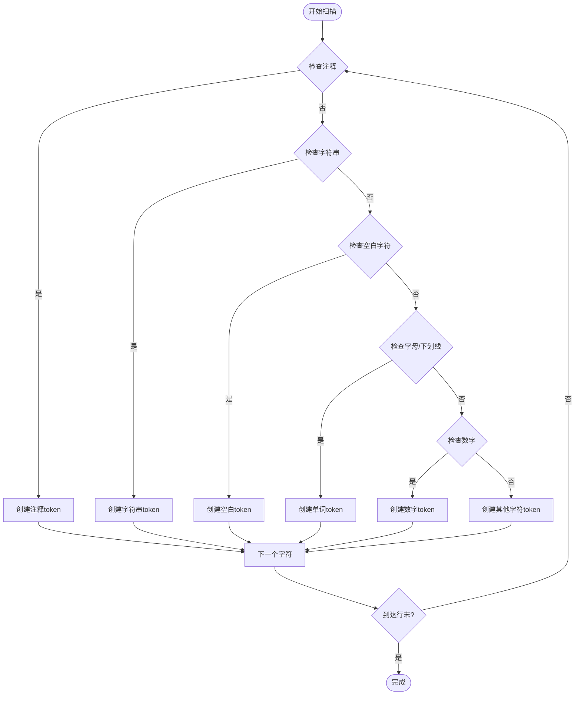
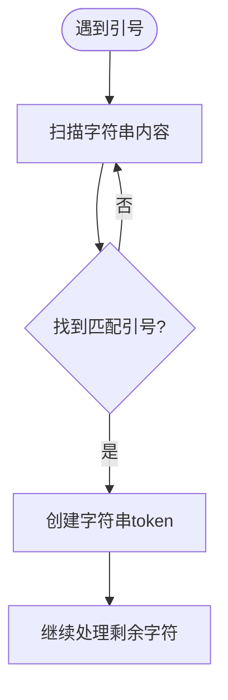
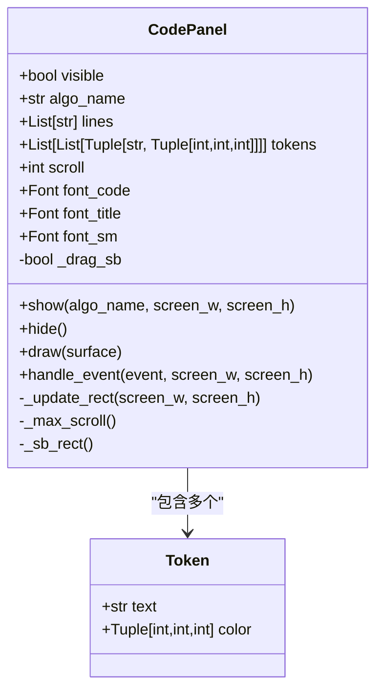
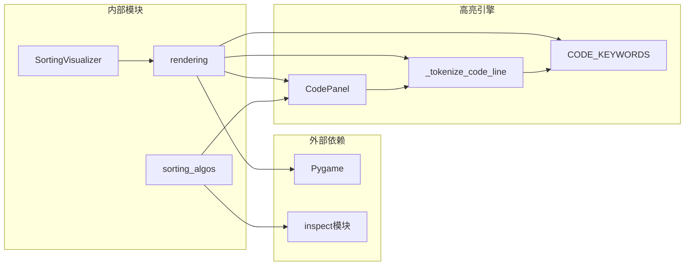

# 语法高亮引擎

<cite>
**本文档引用的文件**
- [rendering.py](file://rendering.py)
- [sorting_algos.py](file://sorting_algos.py)
- [sorting_visualizer.py](file://sorting_visualizer.py)
- [data_generator.py](file://data_generator.py)
</cite>

## 目录
1. [简介](#简介)
2. [项目结构](#项目结构)
3. [核心组件](#核心组件)
4. [架构概览](#架构概览)
5. [详细组件分析](#详细组件分析)
6. [依赖关系分析](#依赖关系分析)
7. [性能考虑](#性能考虑)
8. [故障排除指南](#故障排除指南)
9. [结论](#结论)

## 简介

本文档深入分析了Python数据可视化项目中的语法高亮引擎实现。该引擎负责对排序算法源代码进行实时语法高亮显示，提供丰富的视觉反馈，帮助用户更好地理解算法实现细节。

项目采用Pygame作为图形界面框架，包含19种不同的排序算法，支持实时可视化演示。语法高亮功能是其中的重要组成部分，为用户提供清晰的代码阅读体验。

## 项目结构

该项目采用模块化设计，主要包含以下核心模块：



**图表来源**
- [sorting_visualizer.py:1-490](file://sorting_visualizer.py#L1-L490)
- [rendering.py:1-564](file://rendering.py#L1-L564)
- [sorting_algos.py:1-600](file://sorting_algos.py#L1-L600)

**章节来源**
- [sorting_visualizer.py:1-490](file://sorting_visualizer.py#L1-L490)
- [rendering.py:1-564](file://rendering.py#L1-L564)
- [sorting_algos.py:1-600](file://sorting_algos.py#L1-L600)
- [data_generator.py:1-48](file://data_generator.py#L1-L48)

## 核心组件

语法高亮引擎的核心由三个主要组件构成：

### 1. 词法分析器 `_tokenize_code_line`
这是语法高亮系统的心脏，负责将单行Python代码转换为带有颜色标记的token序列。

### 2. 关键字集合 `CODE_KEYWORDS`
预定义的Python关键字集合，用于识别语言的关键元素。

### 3. 代码面板 `CodePanel`
UI组件，负责渲染高亮后的代码内容。

**章节来源**
- [rendering.py:59-104](file://rendering.py#L59-L104)
- [rendering.py:52-57](file://rendering.py#L52-L57)
- [rendering.py:110-279](file://rendering.py#L110-L279)

## 架构概览

语法高亮系统的整体架构如下：



**图表来源**
- [rendering.py:133-139](file://rendering.py#L133-L139)
- [rendering.py:136](file://rendering.py#L136)
- [rendering.py:225-233](file://rendering.py#L225-L233)

## 详细组件分析

### 词法分析器 `_tokenize_code_line` 实现详解

#### 函数签名与返回值
```python
def _tokenize_code_line(line: str) -> List[Tuple[str, Tuple[int, int, int]]]:
    """返回 [(text, color), ...]"""
```

该函数接收一行Python代码字符串，返回一个元组列表，每个元组包含文本片段和对应的RGB颜色值。

#### 状态机设计

词法分析器采用简单的状态机模型，通过字符扫描实现token分类：



**图表来源**
- [rendering.py:59-104](file://rendering.py#L59-L104)

#### 关键字识别算法

使用预定义的 `CODE_KEYWORDS` 集合进行关键字识别：

```python
CODE_KEYWORDS = {
    "def","return","yield","if","else","elif","for","while",
    "in","not","and","or","True","False","None","import",
    "from","class","pass","break","continue","try","except",
    "with","as","global","nonlocal","lambda","raise",
}
```

关键字识别流程：
1. 识别标识符后检查是否在关键字集合中
2. 如果是关键字，使用蓝色主题色显示
3. 如果不是关键字，继续后续分类判断

#### 字符串匹配机制

支持单引号和双引号字符串的完整识别：



**图表来源**
- [rendering.py:77-82](file://rendering.py#L77-L82)

#### 注释识别逻辑

单行注释识别采用简单而高效的方法：
- 检查行首是否有 `#` 字符
- 如果存在注释，将注释前的空白字符单独处理
- 整行注释统一使用绿色显示

#### 函数名检测规则

函数名识别基于括号位置的启发式规则：
- 识别标识符后检查下一个字符是否为 `(`
- 如果是左括号，认为是函数调用，使用浅黄色显示
- 否则视为普通标识符，使用默认颜色

#### 数字识别规则

数字识别支持整数和小数：
- 连续的数字字符组成数字token
- 允许小数点出现在数字中间
- 使用浅绿色主题色显示

**章节来源**
- [rendering.py:59-104](file://rendering.py#L59-L104)
- [rendering.py:52-57](file://rendering.py#L52-L57)

### 颜色配置方案

语法高亮引擎采用精心设计的颜色方案，每种语法元素都有明确的视觉标识：

| 语法元素 | 颜色值(RGB) | 颜色描述 | 设计理念 |
|---------|------------|----------|----------|
| 关键字(KW) | (86, 156, 214) | 蓝色 | 语义核心，突出重要性 |
| 字符串(STR_C) | (206, 145, 120) | 橙色 | 文本内容，温暖醒目 |
| 注释(CMT) | (106, 153, 85) | 绿色 | 辅助信息，柔和不刺眼 |
| 函数名(FN) | (220, 220, 170) | 黄白 | 调用标识，清晰易辨 |
| 数字(NUM) | (181, 206, 168) | 浅绿 | 数据元素，简洁明了 |
| 普通文本(NRM) | (212, 212, 212) | 灰白 | 默认基色，平衡对比 |

设计理念：
- **可读性优先**：确保在深色背景下有足够的对比度
- **语义区分**：不同语法元素使用不同颜色编码
- **视觉层次**：关键字最突出，注释相对柔和
- **一致性**：相同类型的元素使用统一颜色

**章节来源**
- [rendering.py:61-66](file://rendering.py#L61-L66)

### 代码面板组件 `CodePanel`

代码面板是一个完整的UI组件，负责渲染高亮后的代码：



**图表来源**
- [rendering.py:110-279](file://rendering.py#L110-L279)

#### 组件特性
- **响应式布局**：根据屏幕尺寸动态调整面板大小
- **滚动支持**：内置垂直滚动条，支持鼠标拖拽
- **字体管理**：支持多种字体配置，包括等宽字体
- **事件处理**：完整的鼠标交互支持

**章节来源**
- [rendering.py:110-279](file://rendering.py#L110-L279)

## 依赖关系分析

语法高亮引擎的依赖关系相对简单，主要涉及模块间的协作：



**图表来源**
- [sorting_visualizer.py:34-47](file://sorting_visualizer.py#L34-L47)
- [rendering.py:10](file://rendering.py#L10)
- [sorting_algos.py:564-587](file://sorting_algos.py#L564-L587)

**章节来源**
- [sorting_visualizer.py:34-47](file://sorting_visualizer.py#L34-L47)
- [rendering.py:10](file://rendering.py#L10)
- [sorting_algos.py:564-587](file://sorting_algos.py#L564-L587)

## 性能考虑

### 时间复杂度分析

词法分析器的时间复杂度为 O(n)，其中 n 是行长度：
- 每个字符最多被访问一次
- 字符串扫描使用线性搜索，但通常很快
- 关键字查找使用集合操作，平均 O(1)

### 空间复杂度分析

- 输出token列表的空间需求与输入长度成正比
- 关键字集合占用固定内存空间
- 缓存机制减少重复计算

### 优化技巧

1. **早期退出**：注释行直接返回，避免不必要的处理
2. **批量处理**：代码面板一次性处理整段代码
3. **缓存机制**：算法源码使用字典缓存
4. **增量更新**：只在算法切换时重新计算token

### 实际应用示例

以下是一些典型语法元素的识别效果：

| 代码示例 | 识别结果 | 颜色用途 |
|---------|---------|----------|
| `def bubble_sort(arr):` | 关键字: def(蓝色)<br/>标识符: bubble_sort(默认)<br/>参数: arr(默认) | 函数定义标识 |
| `"冒泡排序"` | 字符串: "冒泡排序"(橙色) | 文本内容展示 |
| `# 冒泡排序实现` | 注释: 整行(绿色) | 辅助说明 |
| `arr[j] > arr[j+1]` | 标识符: arr(默认)<br/>数字: 1(绿色) | 表达式元素 |
| `yield arr, [j, j+1]` | 关键字: yield(蓝色)<br/>数字: 1(绿色) | 生成器语法 |

**章节来源**
- [rendering.py:59-104](file://rendering.py#L59-L104)

## 故障排除指南

### 常见问题及解决方案

1. **颜色显示异常**
   - 检查RGB颜色值格式是否正确
   - 确认Pygame版本兼容性
   - 验证字体渲染是否正常

2. **语法高亮不准确**
   - 检查 `CODE_KEYWORDS` 集合完整性
   - 验证字符串边界检测逻辑
   - 确认注释识别规则

3. **性能问题**
   - 优化token缓存机制
   - 减少不必要的字符串复制
   - 考虑使用更高效的字符串处理方法

4. **UI渲染问题**
   - 检查代码面板布局计算
   - 验证滚动条位置计算
   - 确认事件处理逻辑

**章节来源**
- [rendering.py:203-233](file://rendering.py#L203-L233)
- [rendering.py:241-278](file://rendering.py#L241-L278)

## 结论

语法高亮引擎通过简洁而高效的实现，成功地为排序算法可视化提供了强大的代码展示能力。其设计特点包括：

1. **模块化设计**：清晰的职责分离，便于维护和扩展
2. **性能优化**：线性时间复杂度，适合实时渲染场景
3. **用户体验**：直观的颜色编码，提升代码可读性
4. **可扩展性**：易于添加新的语法元素识别规则

该引擎不仅满足了当前项目的需求，也为类似的数据可视化应用提供了良好的参考实现。通过合理的架构设计和优化策略，能够在保证性能的同时提供优秀的用户体验。