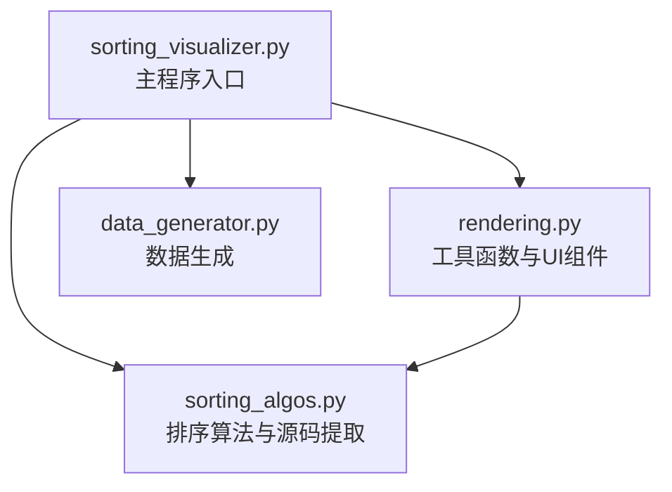
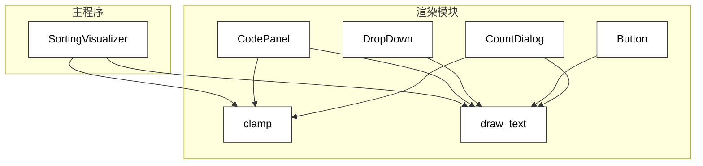
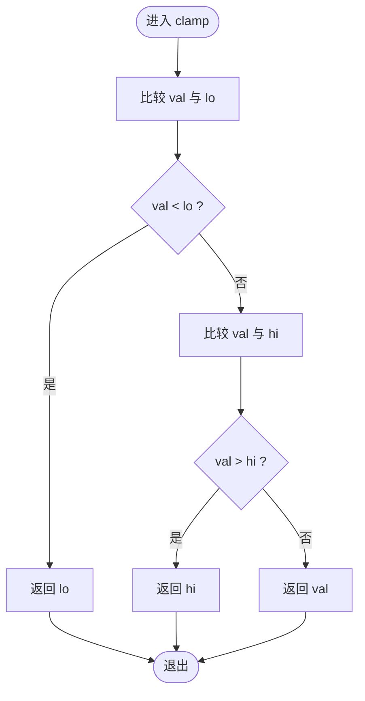
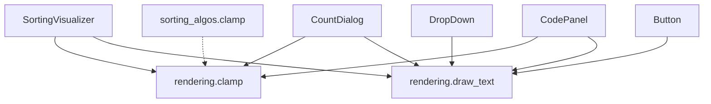

# 工具函数

<cite>
**本文引用的文件**
- [rendering.py](file://rendering.py)
- [sorting_visualizer.py](file://sorting_visualizer.py)
- [sorting_algos.py](file://sorting_algos.py)
- [data_generator.py](file://data_generator.py)
</cite>

## 目录
1. [简介](#简介)
2. [项目结构](#项目结构)
3. [核心组件](#核心组件)
4. [架构总览](#架构总览)
5. [详细组件分析](#详细组件分析)
6. [依赖关系分析](#依赖关系分析)
7. [性能考量](#性能考量)
8. [故障排查指南](#故障排查指南)
9. [结论](#结论)
10. [附录](#附录)

## 简介
本文件聚焦于工具函数的实现与使用，特别是渲染模块中的辅助函数：clamp 数值限制函数、draw_text 文本渲染函数以及颜色处理工具。我们将深入解析这些函数的边界检查机制、锚点定位系统、字体渲染流程与文本对齐方式，并提供使用示例、性能考虑与扩展开发指导，帮助开发者在 Pygame 环境中高效地进行 UI 渲染与交互。

## 项目结构
该项目采用模块化设计，核心功能分布在多个文件中：
- rendering.py：颜色常量、工具函数（clamp、draw_text）、UI 组件（下拉菜单、按钮、对话框、代码面板）
- sorting_visualizer.py：主程序入口，负责窗口初始化、事件循环、渲染管线与 UI 组装
- sorting_algos.py：19 种排序算法的生成器实现及源码提取工具
- data_generator.py：随机数组生成与可视化状态初始化



图表来源
- [sorting_visualizer.py:34-47](file://sorting_visualizer.py#L34-L47)
- [rendering.py:10](file://rendering.py#L10)
- [sorting_algos.py:1-25](file://sorting_algos.py#L1-L25)

章节来源
- [sorting_visualizer.py:1-490](file://sorting_visualizer.py#L1-L490)
- [rendering.py:1-564](file://rendering.py#L1-L564)
- [sorting_algos.py:1-600](file://sorting_algos.py#L1-L600)
- [data_generator.py:1-48](file://data_generator.py#L1-L48)

## 核心组件
本节重点介绍工具函数及其在项目中的应用位置与职责：
- clamp：统一的数值边界限制工具，广泛用于速度索引、滚动位置、滑块值等场景
- draw_text：基于 Pygame 字体系统的文本渲染工具，支持多种锚点定位与对齐
- 颜色常量：预定义的 RGB 颜色集合，用于 UI 组件与可视化元素的颜色管理

章节来源
- [rendering.py:38-47](file://rendering.py#L38-L47)
- [rendering.py:16-30](file://rendering.py#L16-L30)
- [sorting_visualizer.py:37-46](file://sorting_visualizer.py#L37-L46)

## 架构总览
工具函数在渲染模块中承担“底层渲染基础设施”的角色，被上层 UI 组件与主程序广泛调用。下图展示了工具函数与主要组件之间的调用关系：



图表来源
- [rendering.py:38-47](file://rendering.py#L38-L47)
- [rendering.py:110-279](file://rendering.py#L110-L279)
- [rendering.py:284-349](file://rendering.py#L284-L349)
- [rendering.py:354-379](file://rendering.py#L354-L379)
- [rendering.py:384-564](file://rendering.py#L384-L564)
- [sorting_visualizer.py:313-383](file://sorting_visualizer.py#L313-L383)

## 详细组件分析

### clamp 数值限制函数
clamp 是一个通用的边界检查与数值范围控制工具，其核心逻辑是将输入值限制在一个给定范围内，确保不会越界。

- 实现要点
  - 输入参数：目标值 val 与上下界 lo、hi
  - 处理流程：先取 val 与 hi 的较小者，再取该结果与 lo 的较大者
  - 返回值：位于 [lo, hi] 区间内的合法值
- 应用场景
  - 速度索引调整：限制速度级别索引在有效范围内
  - 滚动位置约束：限制滚动条位置不超过最大可滚动范围
  - 滑块值映射：将屏幕坐标转换为合法的数据量范围
  - 算法内部边界：如桶排序中桶索引的边界保护
- 边界检查机制
  - 当 val < lo 时，返回 lo
  - 当 val > hi 时，返回 hi
  - 否则返回 val
- 性能特征
  - 时间复杂度：O(1)
  - 空间复杂度：O(1)
  - 适合高频调用的场景，如事件处理与动画帧循环



图表来源
- [rendering.py:38-39](file://rendering.py#L38-L39)
- [sorting_visualizer.py:233](file://sorting_visualizer.py#L233)
- [rendering.py:265](file://rendering.py#L265)
- [rendering.py:272-275](file://rendering.py#L272-L275)
- [rendering.py:423-424](file://rendering.py#L423-L424)
- [rendering.py:559-561](file://rendering.py#L559-L561)

章节来源
- [rendering.py:38-39](file://rendering.py#L38-L39)
- [sorting_visualizer.py:233](file://sorting_visualizer.py#L233)
- [rendering.py:265](file://rendering.py#L265)
- [rendering.py:272-275](file://rendering.py#L272-L275)
- [rendering.py:423-424](file://rendering.py#L423-L424)
- [rendering.py:559-561](file://rendering.py#L559-L561)

### draw_text 文本渲染函数
draw_text 是一个封装了 Pygame 字体渲染与锚点定位的便捷工具，简化了文本绘制的一致性与可读性。

- 实现要点
  - 字体渲染：使用传入的字体对象渲染文本，得到表面与尺寸
  - 锚点定位：通过 rect.anchor 将文本矩形的特定锚点定位到 (x, y)
  - 绘制输出：将渲染后的表面 blit 到目标 surface 上
- 锚点系统
  - 支持多种锚点位置，如 "topleft"、"midtop"、"center" 等
  - 通过 setattr(rect, anchor, (x, y)) 将锚点设置到目标坐标
  - 适用于 UI 组件的居中、左对齐、右对齐等多种布局需求
- 字体渲染流程
  - 调用 font.render(text, True, color) 获取文本表面
  - 通过 surf.get_rect() 获取文本矩形
  - 设置锚点后，使用 surface.blit(surf, rect) 完成绘制
- 文本对齐方式
  - 通过锚点参数控制对齐：例如 "midleft" 实现左对齐但垂直居中
  - 在 UI 组件中广泛用于标签、按钮文字、下拉菜单项等
- 性能特征
  - 每次调用都会进行一次字体渲染与 blit 操作
  - 建议在需要频繁更新的场景中减少不必要的重复渲染
  - 对于大量文本，可考虑批量渲染或缓存策略

```mermaid
sequenceDiagram
participant Caller as "调用方"
participant Font as "字体对象"
participant Surface as "目标表面"
participant Rect as "文本矩形"
Caller->>Font : render(text, True, color)
Font-->>Caller : surf(文本表面)
Caller->>Caller : surf.get_rect()
Caller->>Rect : setattr(anchor, (x, y))
Caller->>Surface : blit(surf, rect)
Surface-->>Caller : 绘制完成
```

图表来源
- [rendering.py:42-46](file://rendering.py#L42-L46)
- [rendering.py:298-302](file://rendering.py#L298-L302)
- [rendering.py:369-370](file://rendering.py#L369-L370)
- [rendering.py:444-447](file://rendering.py#L444-L447)
- [sorting_visualizer.py:319-339](file://sorting_visualizer.py#L319-L339)

章节来源
- [rendering.py:42-46](file://rendering.py#L42-L46)
- [rendering.py:298-302](file://rendering.py#L298-L302)
- [rendering.py:369-370](file://rendering.py#L369-L370)
- [rendering.py:444-447](file://rendering.py#L444-L447)
- [sorting_visualizer.py:319-339](file://sorting_visualizer.py#L319-L339)

### 颜色处理工具
渲染模块提供了丰富的颜色常量，便于统一管理 UI 与可视化元素的颜色风格。

- 颜色常量
  - 基础色：BLACK、WHITE、BLUE、YELLOW、GREEN、RED、CYAN、PURPLE、GRAY、LGRAY、DKBLUE、TEAL、PINK
  - 调色板：ORANGE、DKBLUE 等用于不同 UI 组件的区分
- 使用建议
  - 在 UI 组件中保持一致的颜色主题，提升用户体验
  - 对于高对比度场景，优先使用 WHITE、LGRAY 等浅色作为前景色
  - 对于强调色，可使用 YELLOW、CYAN 等突出重要信息
- 与 draw_text 的配合
  - draw_text 的 color 参数可直接使用上述常量
  - 在状态栏、按钮、下拉菜单等组件中统一颜色风格

章节来源
- [rendering.py:16-30](file://rendering.py#L16-L30)
- [rendering.py:298-302](file://rendering.py#L298-L302)
- [rendering.py:369-370](file://rendering.py#L369-L370)
- [rendering.py:444-447](file://rendering.py#L444-L447)

## 依赖关系分析
工具函数在项目中的依赖关系清晰且集中，主要体现在以下方面：
- 主程序 SortingVisualizer 导入并使用 clamp 与 draw_text
- UI 组件（DropDown、Button、CountDialog、CodePanel）内部也多次调用 clamp 与 draw_text
- 算法模块 sorting_algos.py 中存在同名 clamp 函数，但与渲染模块的 clamp 功能一致，互不冲突



图表来源
- [sorting_visualizer.py:37-46](file://sorting_visualizer.py#L37-L46)
- [rendering.py:284-349](file://rendering.py#L284-L349)
- [rendering.py:354-379](file://rendering.py#L354-L379)
- [rendering.py:384-564](file://rendering.py#L384-L564)
- [sorting_algos.py:27-28](file://sorting_algos.py#L27-L28)

章节来源
- [sorting_visualizer.py:37-46](file://sorting_visualizer.py#L37-L46)
- [rendering.py:284-349](file://rendering.py#L284-L349)
- [rendering.py:354-379](file://rendering.py#L354-L379)
- [rendering.py:384-564](file://rendering.py#L384-L564)
- [sorting_algos.py:27-28](file://sorting_algos.py#L27-L28)

## 性能考量
- clamp 的性能
  - 作为 O(1) 操作，可在事件循环与动画帧中高频调用
  - 建议在边界检查前尽量减少重复计算，避免不必要的中间变量
- draw_text 的性能
  - 每次调用都会进行字体渲染，建议在需要频繁更新的场景中合并绘制或使用缓存
  - 对于大量文本，可考虑批量渲染策略，减少 surface.blit 的调用次数
- 颜色常量的使用
  - 颜色常量为全局常量，访问成本极低，适合在渲染循环中直接使用
- UI 组件优化
  - 下拉菜单、按钮、对话框等组件内部已内置锚点定位与对齐逻辑，减少额外计算
  - 滚动条与代码面板在可见区域外的文本不进行渲染，降低开销

## 故障排查指南
- 锚点定位异常
  - 确认 anchor 参数是否为有效的 Pygame Rect 锚点属性（如 "midleft"、"center" 等）
  - 检查 (x, y) 坐标是否在屏幕范围内
- 文本渲染失败
  - 确保字体对象已正确初始化，且支持所需字符集
  - 检查颜色参数是否为合法的 RGB 元组
- 滚动条越界
  - 使用 clamp 限制滚动位置不超过最大可滚动范围
  - 检查可见高度与总高度的计算是否正确
- 滑块值溢出
  - 在滑块拖动或键盘输入时，始终使用 clamp 限制值在最小与最大范围内
- 速度索引越界
  - 使用 clamp 限制速度索引在有效范围内，避免访问越界

章节来源
- [rendering.py:42-46](file://rendering.py#L42-L46)
- [rendering.py:265](file://rendering.py#L265)
- [rendering.py:272-275](file://rendering.py#L272-L275)
- [rendering.py:423-424](file://rendering.py#L423-L424)
- [rendering.py:559-561](file://rendering.py#L559-L561)

## 结论
工具函数在本项目中扮演着“底层渲染基础设施”的关键角色。clamp 提供了可靠的边界检查与数值范围控制，draw_text 实现了灵活的锚点定位与文本对齐，颜色常量则保证了 UI 风格的一致性。通过合理使用这些工具函数，开发者可以高效地构建稳定、易维护的可视化界面，并在性能与可扩展性之间取得良好平衡。

## 附录
- 使用示例（路径参考）
  - 速度索引调整：[sorting_visualizer.py:233](file://sorting_visualizer.py#L233)
  - 滚动条位置约束：[rendering.py:265-266](file://rendering.py#L265-L266)
  - 滑块值映射：[rendering.py:423-424](file://rendering.py#L423-L424)
  - 文本对齐与锚点：[rendering.py:298-302](file://rendering.py#L298-L302)
  - 颜色常量使用：[rendering.py:16-30](file://rendering.py#L16-L30)
- 扩展开发指导
  - 新增 UI 组件时，优先复用 draw_text 的锚点系统，减少重复逻辑
  - 对于需要频繁更新的数值，使用 clamp 进行边界保护
  - 在字体渲染密集的场景中，考虑缓存策略或批量渲染以提升性能