# 按钮组件

<cite>
**本文档引用的文件**
- [rendering.py](file://rendering.py)
- [sorting_visualizer.py](file://sorting_visualizer.py)
- [data_generator.py](file://data_generator.py)
- [sorting_algos.py](file://sorting_algos.py)
</cite>

## 目录
1. [简介](#简介)
2. [项目结构](#项目结构)
3. [核心组件](#核心组件)
4. [架构概览](#架构概览)
5. [详细组件分析](#详细组件分析)
6. [依赖关系分析](#依赖关系分析)
7. [性能考虑](#性能考虑)
8. [故障排除指南](#故障排除指南)
9. [结论](#结论)

## 简介

本文档深入解析了Python数据可视化项目中的按钮组件实现。该按钮组件是排序算法可视化界面的核心交互元素，提供了完整的用户界面反馈机制，包括悬停效果、点击检测、圆角渲染和文本居中显示等功能。

按钮组件采用面向对象设计，实现了标准的UI控件接口，支持多种视觉状态和交互行为。通过Pygame库进行图形渲染，提供了流畅的用户体验和丰富的视觉反馈。

## 项目结构

该项目采用模块化架构，将不同的功能职责分离到独立的文件中：

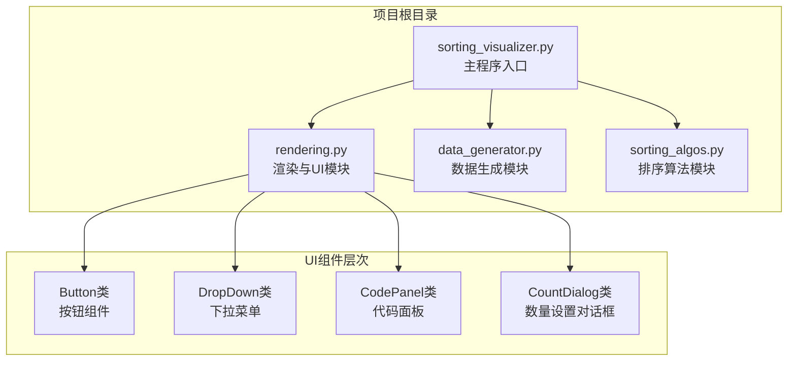

**图表来源**
- [sorting_visualizer.py:146-178](file://sorting_visualizer.py#L146-L178)
- [rendering.py:354-379](file://rendering.py#L354-L379)

**章节来源**
- [sorting_visualizer.py:146-178](file://sorting_visualizer.py#L146-L178)
- [rendering.py:354-379](file://rendering.py#L354-L379)

## 核心组件

按钮组件是整个可视化界面中最常用的交互元素，负责处理用户的点击操作并提供即时的视觉反馈。

### Button类设计特点

按钮组件具有以下核心特性：
- **状态管理**：维护悬停状态和点击状态
- **视觉反馈**：根据状态动态调整颜色和边框
- **文本渲染**：支持居中对齐的文本显示
- **事件处理**：集成完整的鼠标事件处理机制

**章节来源**
- [rendering.py:354-379](file://rendering.py#L354-L379)

## 架构概览

按钮组件在整个应用架构中扮演着关键角色，作为用户界面的基础构建块：

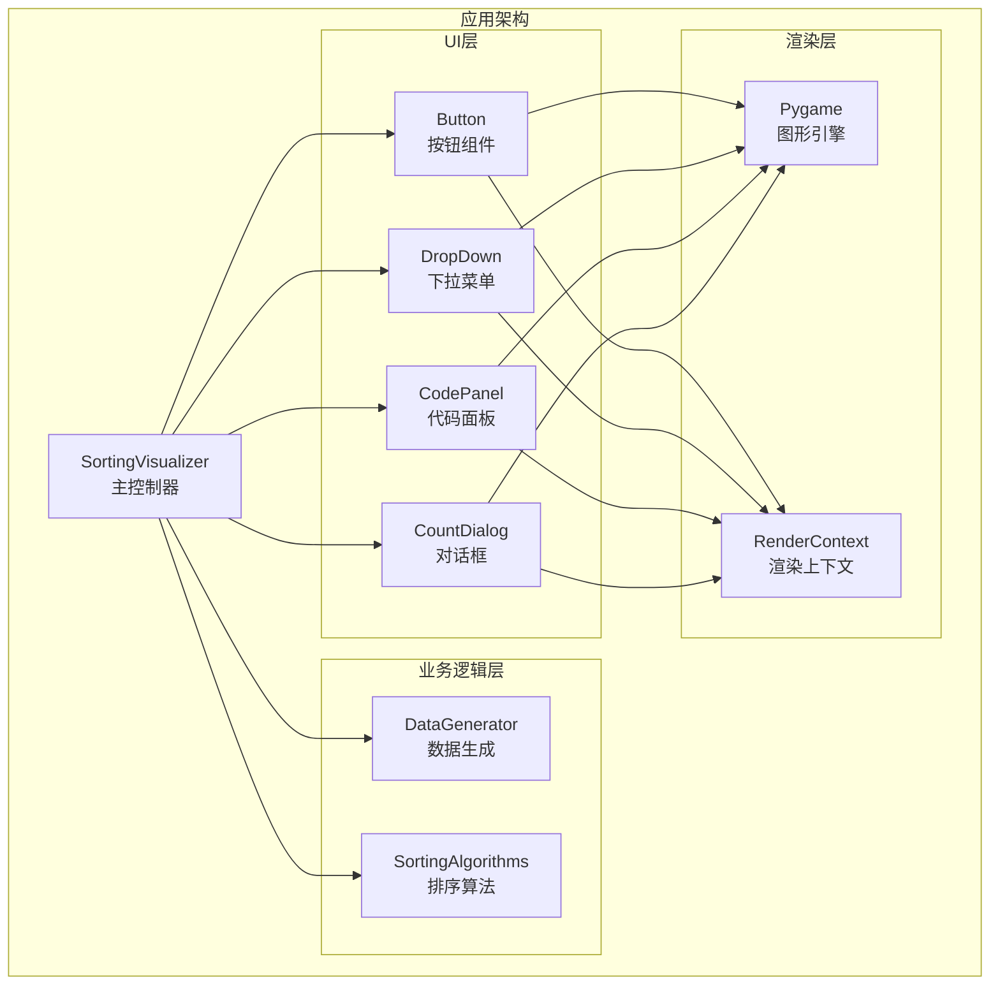

**图表来源**
- [sorting_visualizer.py:62-113](file://sorting_visualizer.py#L62-L113)
- [rendering.py:354-379](file://rendering.py#L354-L379)

## 详细组件分析

### Button类实现详解

#### 类结构设计

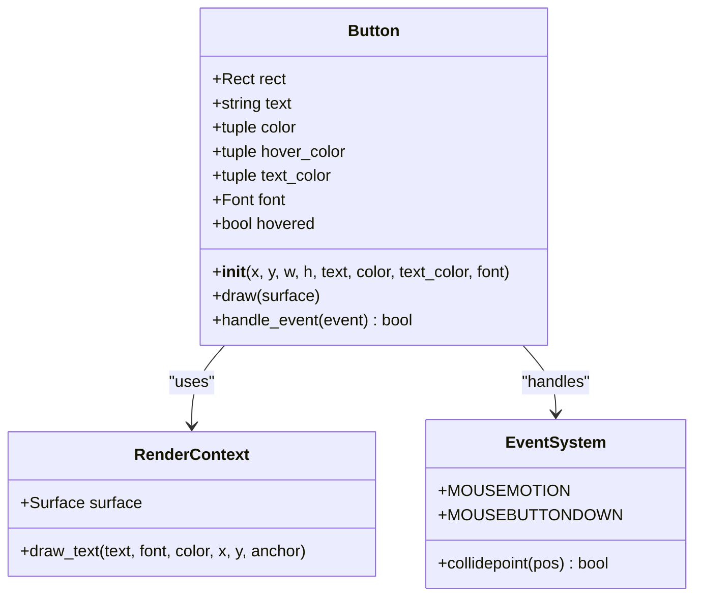

**图表来源**
- [rendering.py:354-379](file://rendering.py#L354-L379)

#### 悬停效果实现

按钮的悬停效果通过动态计算悬停颜色来实现：

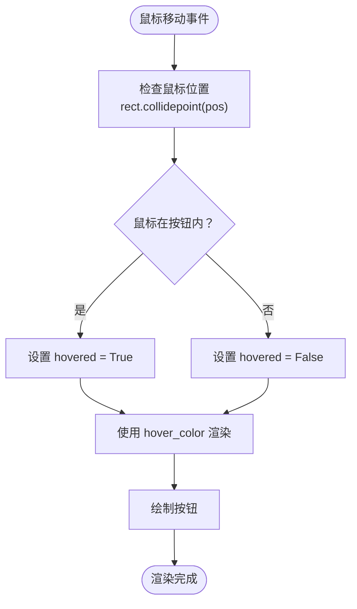

**图表来源**
- [rendering.py:372-378](file://rendering.py#L372-L378)

#### 点击检测机制

按钮的点击检测采用了精确的碰撞检测算法：

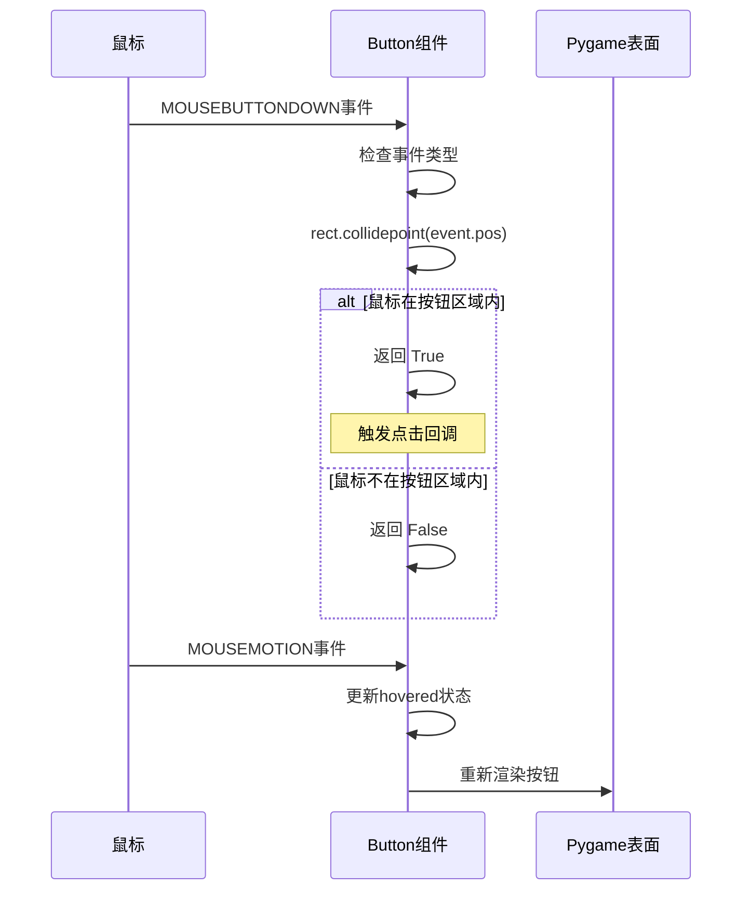

**图表来源**
- [rendering.py:372-378](file://rendering.py#L372-L378)

#### 圆角渲染技术

按钮的圆角渲染通过Pygame的border_radius参数实现：

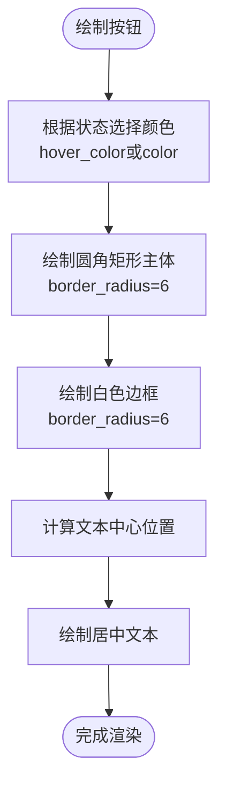

**图表来源**
- [rendering.py:364-370](file://rendering.py#L364-L370)

#### 文本居中显示

按钮文本的居中显示通过Pygame的锚点系统实现：

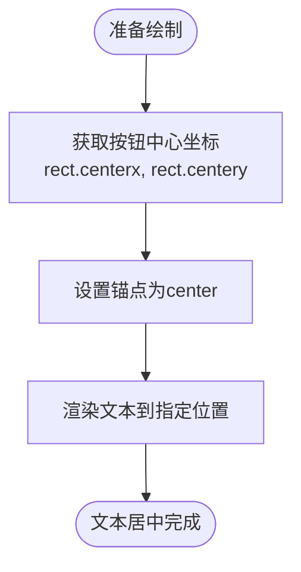

**图表来源**
- [rendering.py:368-370](file://rendering.py#L368-L370)

### 视觉反馈机制

#### hover_color计算算法

按钮的悬停颜色计算采用了简单的亮度增强算法：

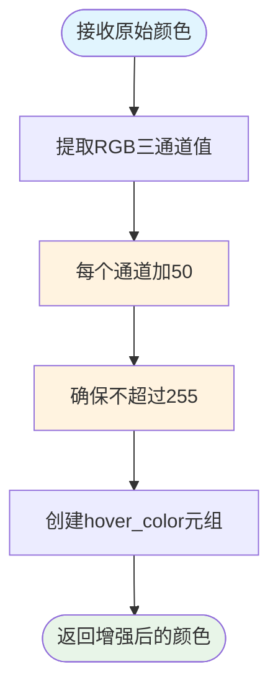

**图表来源**
- [rendering.py:359](file://rendering.py#L359)

#### 边框绘制策略

按钮的边框绘制采用了双层边框设计：

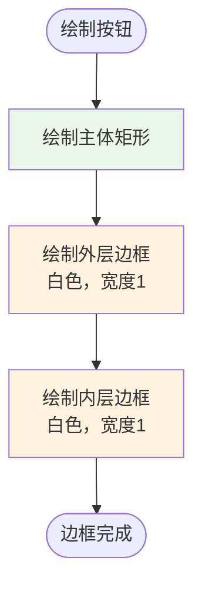

**图表来源**
- [rendering.py:366-367](file://rendering.py#L366-L367)

### 事件处理流程

#### 完整事件处理序列

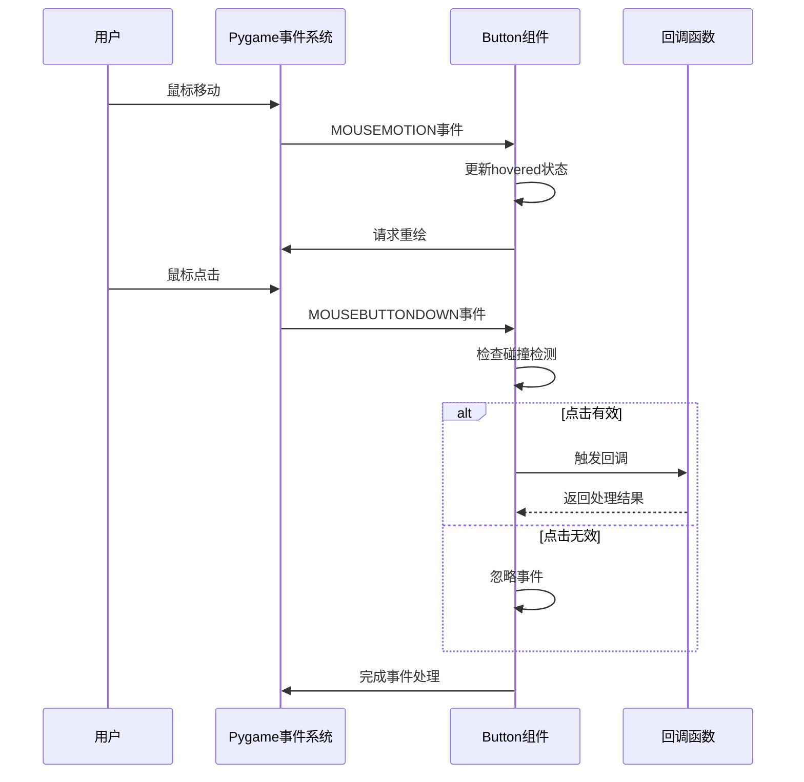

**图表来源**
- [rendering.py:372-378](file://rendering.py#L372-L378)

**章节来源**
- [rendering.py:354-379](file://rendering.py#L354-L379)

## 依赖关系分析

### 组件间依赖关系

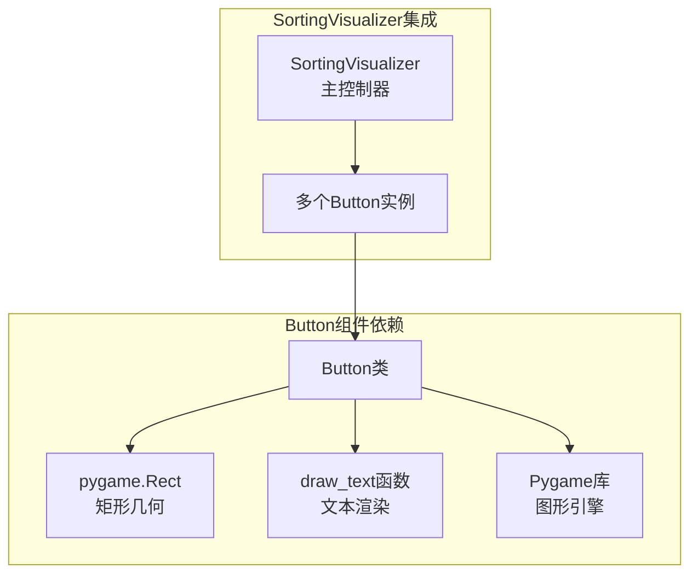

**图表来源**
- [rendering.py:354-379](file://rendering.py#L354-L379)
- [sorting_visualizer.py:146-178](file://sorting_visualizer.py#L146-L178)

### 外部依赖分析

按钮组件主要依赖于以下外部库和模块：

| 依赖项 | 用途 | 版本要求 |
|--------|------|----------|
| Pygame | 图形渲染和事件处理 | >= 1.9.0 |
| Python标准库 | 基础功能支持 | >= 3.6 |

**章节来源**
- [rendering.py:8](file://rendering.py#L8)
- [sorting_visualizer.py:17](file://sorting_visualizer.py#L17)

## 性能考虑

### 渲染性能优化

按钮组件在性能方面采用了多项优化策略：

1. **最小化重绘**：仅在状态变化时触发重绘
2. **高效的碰撞检测**：使用Pygame内置的collidepoint方法
3. **批量绘制**：与其他UI组件一起批量渲染

### 内存使用分析

按钮组件的内存占用相对较小：
- 每个按钮实例约占用几百字节
- 颜色数据以元组形式存储，内存效率高
- 字体对象可共享使用

## 故障排除指南

### 常见问题及解决方案

#### 问题1：按钮点击无响应
**症状**：鼠标点击按钮但没有触发回调
**可能原因**：
- 事件坐标与按钮位置不匹配
- 按钮尺寸设置错误
- 事件处理顺序问题

**解决方法**：
1. 检查按钮rect的坐标和尺寸
2. 确认事件坐标转换正确
3. 验证事件处理链路

#### 问题2：悬停效果异常
**症状**：按钮悬停颜色显示不正确
**可能原因**：
- hover_color计算错误
- 状态更新时机不当
- 颜色值超出范围

**解决方法**：
1. 检查hover_color的计算逻辑
2. 确保状态更新在正确的事件中进行
3. 验证颜色值的边界检查

#### 问题3：文本显示位置不正确
**症状**：按钮文本不在中心位置
**可能原因**：
- 锚点设置错误
- 中心坐标计算错误
- 字体渲染问题

**解决方法**：
1. 确认使用"center"锚点
2. 检查rect.centerx和rect.centery的使用
3. 验证字体对象的有效性

**章节来源**
- [rendering.py:364-370](file://rendering.py#L364-L370)
- [rendering.py:372-378](file://rendering.py#L372-L378)

## 结论

按钮组件作为Python数据可视化项目的核心UI元素，展现了优秀的软件工程实践：

### 设计优势

1. **简洁的API设计**：直观的方法命名和参数设置
2. **完整的功能覆盖**：包含了现代UI组件所需的所有基本功能
3. **良好的可扩展性**：易于添加新的视觉效果和交互行为
4. **高效的性能表现**：优化的渲染和事件处理机制

### 技术亮点

- **状态驱动的渲染**：通过状态变化驱动视觉更新
- **事件驱动的交互**：响应式的用户交互体验
- **模块化的架构**：清晰的职责分离和依赖管理
- **跨平台兼容**：基于Pygame的跨平台图形支持

### 发展建议

1. **增加动画效果**：可以考虑添加平滑的颜色过渡动画
2. **支持图标按钮**：扩展支持图标和文本组合的按钮样式
3. **键盘导航支持**：添加键盘快捷键和焦点管理
4. **主题系统**：实现可配置的主题和样式系统

按钮组件为整个排序算法可视化项目提供了坚实的基础，其设计理念和实现方式值得在其他类似的GUI应用程序中借鉴和应用。