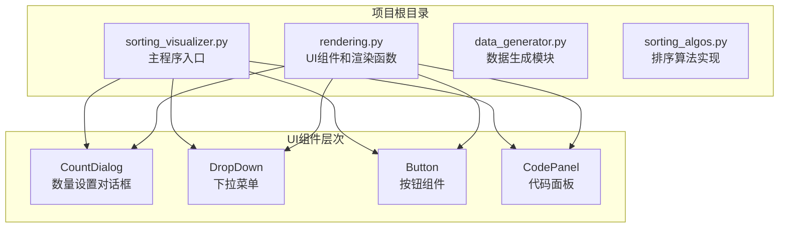
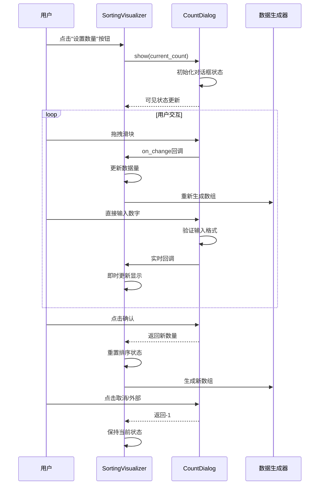
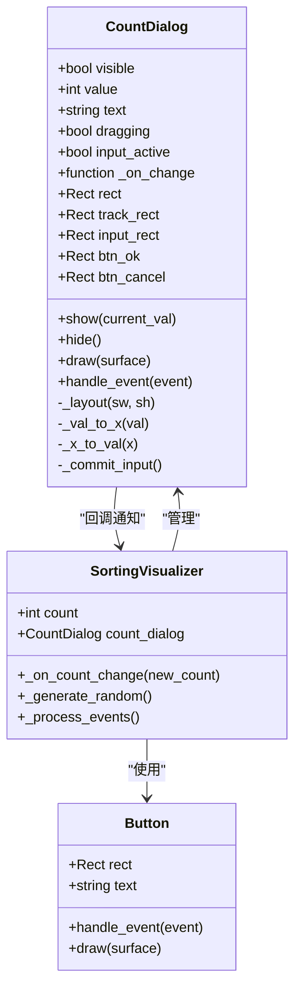
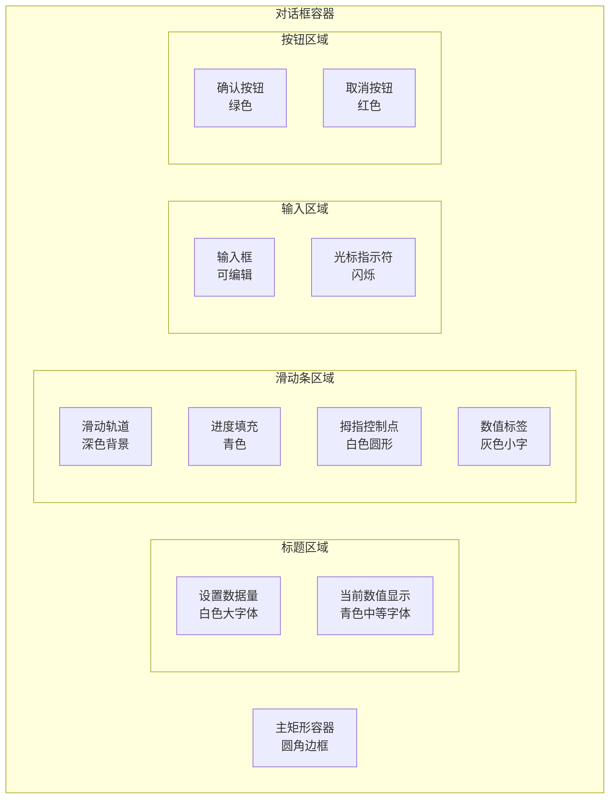
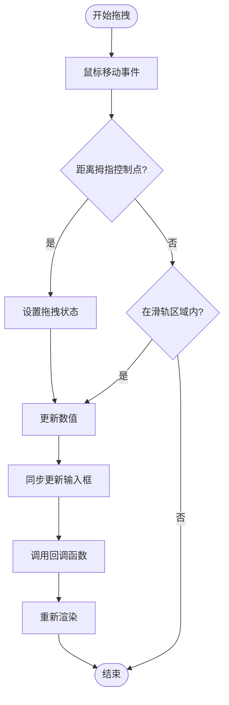
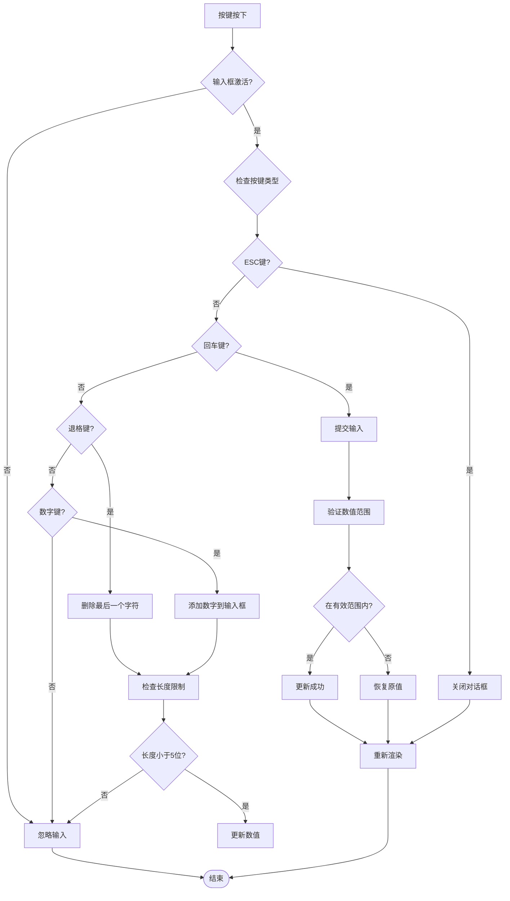
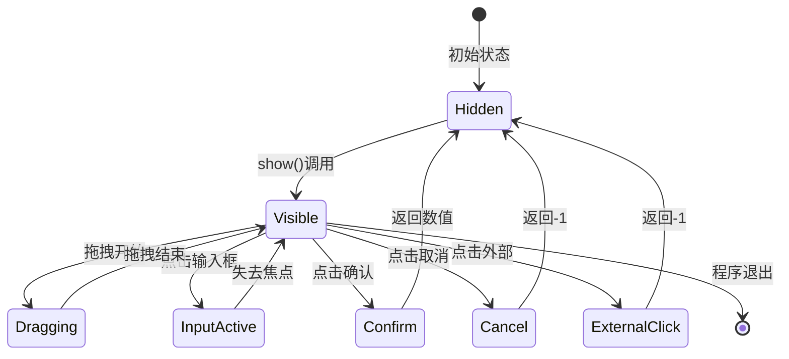
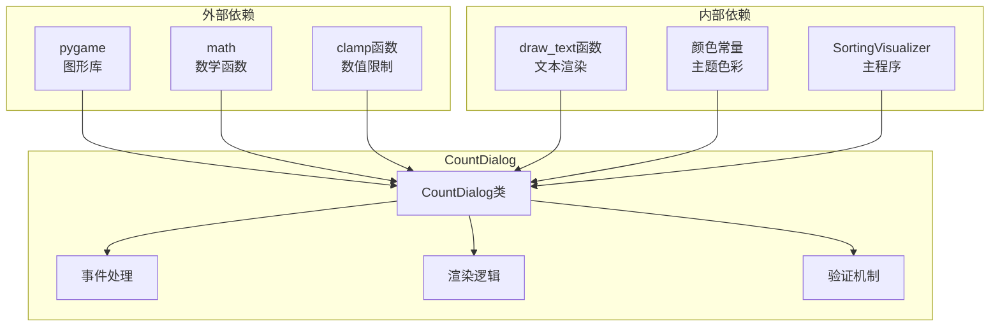

# 数量设置对话框

<cite>
**本文档引用的文件**
- [sorting_visualizer.py](file://sorting_visualizer.py)
- [rendering.py](file://rendering.py)
- [data_generator.py](file://data_generator.py)
- [sorting_algos.py](file://sorting_algos.py)
</cite>

## 目录
1. [简介](#简介)
2. [项目结构](#项目结构)
3. [核心组件](#核心组件)
4. [架构概览](#架构概览)
5. [详细组件分析](#详细组件分析)
6. [依赖关系分析](#依赖关系分析)
7. [性能考虑](#性能考虑)
8. [故障排除指南](#故障排除指南)
9. [结论](#结论)

## 简介

数量设置对话框是Python数据可视化项目中的一个关键UI组件，用于让用户设置排序算法的数据量。该对话框提供了两种输入模式：滑动条拖拽和直接文本输入，支持实时预览和确认取消操作。本文档将深入分析CountDialog类的完整实现，包括其交互逻辑、布局设计和用户体验优化。

## 项目结构

该项目采用模块化架构，主要包含以下核心文件：

**图表来源**
- [sorting_visualizer.py:34-47](file://sorting_visualizer.py#L34-L47)
- [rendering.py:384-564](file://rendering.py#L384-L564)

**章节来源**
- [sorting_visualizer.py:1-50](file://sorting_visualizer.py#L1-L50)
- [rendering.py:1-50](file://rendering.py#L1-L50)

## 核心组件

CountDialog类是本项目中最复杂的UI组件之一，它实现了完整的数量设置功能。该类继承了pygame的事件处理机制，提供了直观的用户交互体验。

### 主要特性

1. **双模式输入机制**：
   - 滑动条拖拽输入
   - 文本框直接输入
   - 实时数值预览

2. **完整的交互生命周期**：
   - 显示/隐藏控制
   - 拖拽交互处理
   - 键盘输入处理
   - 确认/取消逻辑

3. **视觉反馈系统**：
   - 滑动轨道进度显示
   - 拇指控制点渲染
   - 输入框焦点状态
   - 按钮状态变化

**章节来源**
- [rendering.py:384-564](file://rendering.py#L384-L564)

## 架构概览

CountDialog类在整个应用程序架构中扮演着重要的角色，它与主程序、其他UI组件协同工作，形成完整的可视化界面。

**图表来源**
- [sorting_visualizer.py:174-176](file://sorting_visualizer.py#L174-L176)
- [sorting_visualizer.py:402-411](file://sorting_visualizer.py#L402-L411)
- [rendering.py:491-564](file://rendering.py#L491-L564)

## 详细组件分析

### CountDialog类结构

CountDialog类采用了面向对象的设计模式，封装了完整的对话框功能。该类的核心方法包括初始化、布局计算、绘制和事件处理。

**图表来源**
- [rendering.py:384-564](file://rendering.py#L384-L564)
- [sorting_visualizer.py:62-113](file://sorting_visualizer.py#L62-L113)

### 布局设计与渲染

CountDialog的布局设计遵循响应式原则，能够适应不同的屏幕尺寸。对话框采用居中定位，确保在各种分辨率下都有良好的视觉效果。

#### 布局参数定义

| 参数 | 默认值 | 描述 |
|------|--------|------|
| 对话框宽度 | 460px | 包含内边距的总宽度 |
| 对话框高度 | 200px | 包含标题、滑块、输入框和按钮区域 |
| 滑轨宽度 | 360px | 轨道占对话框宽度的比例 |
| 滑轨高度 | 8px | 进度条厚度 |
| 输入框尺寸 | 140×34px | 宽×高，居中对齐 |
| 按钮尺寸 | 100×34px | 确认和取消按钮 |

#### 视觉层次结构

**图表来源**
- [rendering.py:401-416](file://rendering.py#L401-L416)
- [rendering.py:449-482](file://rendering.py#L449-L482)

### 滑动条交互机制

滑动条是CountDialog的核心交互组件，实现了精确的数值映射和流畅的拖拽体验。

#### 数值映射算法

**图表来源**
- [rendering.py:537-543](file://rendering.py#L537-L543)
- [rendering.py:417-424](file://rendering.py#L417-L424)

#### 数值转换函数

滑动条使用线性插值算法将像素位置转换为数值：

- **像素到数值**：`value = min_val + (max_val - min_val) × (x - track_x) / track_width`
- **数值到像素**：`x = track_x + track_width × (value - min_val) / (max_val - min_val)`

### 文本输入与验证机制

CountDialog支持直接文本输入，提供了完整的输入验证和错误处理机制。

#### 输入处理流程

**图表来源**
- [rendering.py:544-562](file://rendering.py#L544-L562)
- [rendering.py:483-490](file://rendering.py#L483-L490)

#### 验证规则

1. **格式验证**：只接受数字字符
2. **范围验证**：1 ≤ 数值 ≤ 10000
3. **长度限制**：最多5位数字
4. **实时反馈**：输入过程中即时验证

### 确认取消逻辑

CountDialog实现了完整的确认取消机制，确保用户操作的明确性和安全性。

#### 事件处理流程

**图表来源**
- [rendering.py:491-564](file://rendering.py#L491-L564)

### 遮罩层渲染机制

CountDialog采用无遮罩层设计，这与传统的模态对话框不同。这种设计选择有其特定的考虑。

#### 渲染策略对比

| 特性 | CountDialog | 传统模态对话框 |
|------|-------------|----------------|
| 遮罩层 | 无 | 有半透明遮罩 |
| 可视化区域 | 保持可见 | 被禁用 |
| 性能影响 | 无额外渲染开销 | 需要额外绘制 |
| 用户体验 | 实时预览 | 需要确认后才能看到效果 |
| 交互复杂度 | 较低 | 较高 |

#### 设计优势

1. **性能优化**：避免了额外的遮罩层渲染
2. **实时反馈**：滑块拖拽时实时更新可视化
3. **简洁性**：减少了UI层级复杂度
4. **一致性**：与整体应用风格保持一致

**章节来源**
- [rendering.py:440-442](file://rendering.py#L440-L442)

## 依赖关系分析

CountDialog类与其他组件之间的依赖关系体现了清晰的模块化设计。

**图表来源**
- [rendering.py:8-11](file://rendering.py#L8-L11)
- [rendering.py:38-39](file://rendering.py#L38-L39)
- [rendering.py:42-47](file://rendering.py#L42-L47)

### 与主程序的集成

CountDialog与SortingVisualizer类的集成体现了松耦合的设计原则：

1. **回调机制**：通过`on_change`回调实现解耦
2. **事件委托**：主程序统一处理事件分发
3. **状态共享**：通过共享变量实现状态同步

**章节来源**
- [sorting_visualizer.py:174-176](file://sorting_visualizer.py#L174-L176)
- [sorting_visualizer.py:180-184](file://sorting_visualizer.py#L180-L184)

## 性能考虑

CountDialog在设计时充分考虑了性能优化，特别是在高频事件处理场景下的表现。

### 事件处理优化

1. **事件过滤**：只处理必要的事件类型
2. **状态缓存**：避免重复计算相同的值
3. **最小化重绘**：仅在必要时重新渲染

### 内存管理

1. **对象复用**：避免频繁创建销毁对象
2. **资源管理**：合理管理字体和表面资源
3. **垃圾回收**：及时释放不再使用的资源

### 渲染优化

1. **批量绘制**：减少绘制调用次数
2. **区域更新**：只更新变化的区域
3. **缓存机制**：缓存计算结果

## 故障排除指南

### 常见问题及解决方案

#### 问题1：滑块拖拽不灵敏
**症状**：拖拽时数值更新缓慢或不连续
**原因**：事件处理频率过高或数值计算错误
**解决**：检查鼠标位置计算和数值映射函数

#### 问题2：文本输入无效
**症状**：键盘输入无法响应
**原因**：输入框未激活或事件处理异常
**解决**：确认点击事件正确触发输入激活

#### 问题3：数值超出范围
**症状**：输入超过1-10000范围的数值
**原因**：验证逻辑失效
**解决**：检查clamp函数调用和异常处理

#### 问题4：对话框无法关闭
**症状**：点击外部区域无法关闭
**原因**：事件坐标计算错误
**解决**：验证碰撞检测逻辑

**章节来源**
- [rendering.py:500-505](file://rendering.py#L500-L505)
- [rendering.py:513-519](file://rendering.py#L513-L519)

## 结论

CountDialog类展现了优秀的UI组件设计实践，它成功地结合了多种交互模式，提供了直观且高效的用户体验。该组件的设计体现了以下特点：

1. **用户友好性**：双模式输入满足不同用户的偏好
2. **性能效率**：优化的事件处理和渲染机制
3. **可维护性**：清晰的代码结构和模块化设计
4. **扩展性**：灵活的回调机制便于功能扩展

通过深入分析CountDialog的实现细节，我们可以看到现代UI组件开发的最佳实践，包括事件驱动编程、状态管理和用户体验优化等方面。这个组件为整个数据可视化项目提供了重要的交互基础，是项目架构中的关键一环。