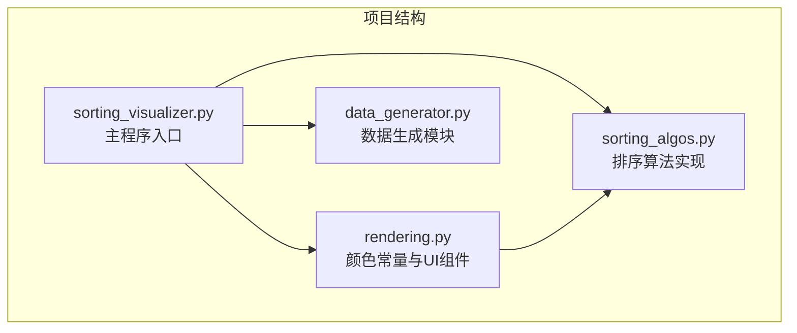
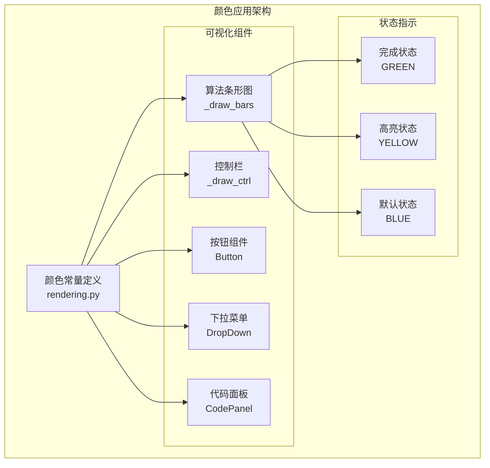
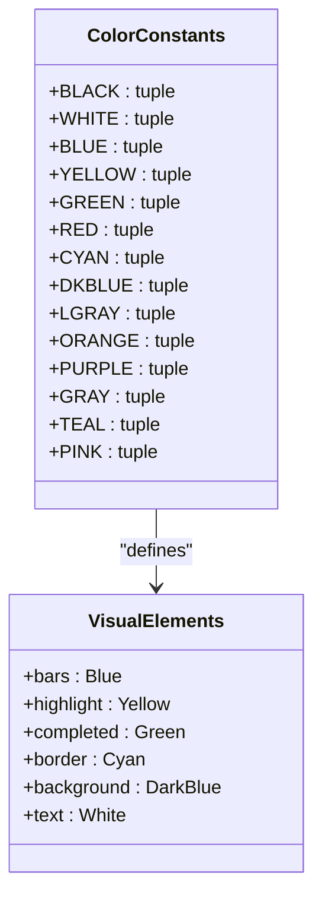
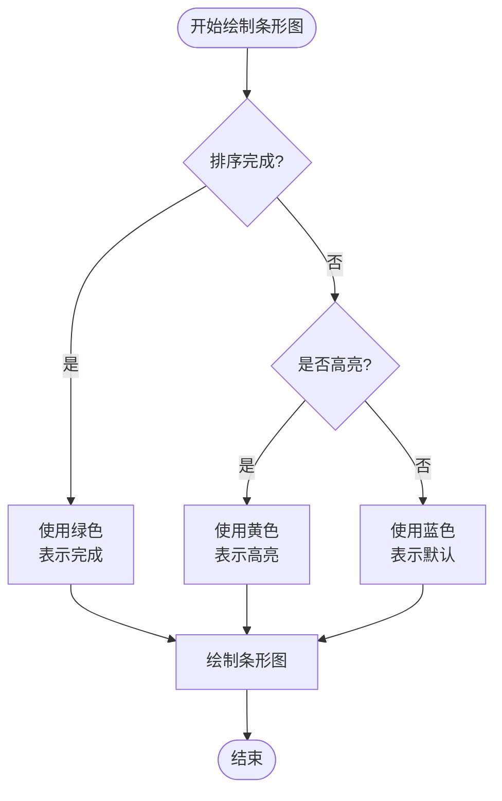
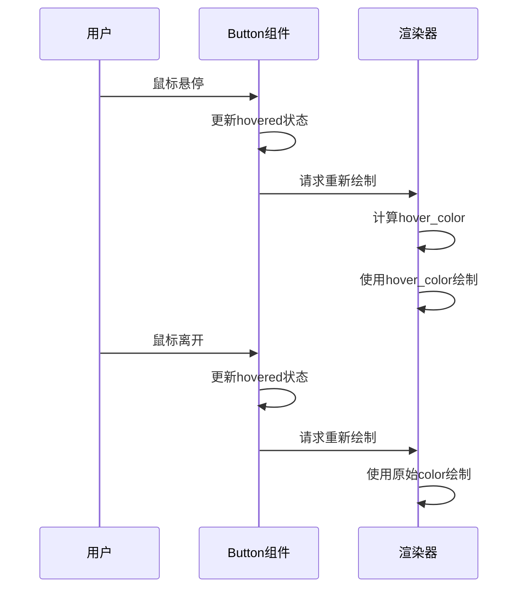
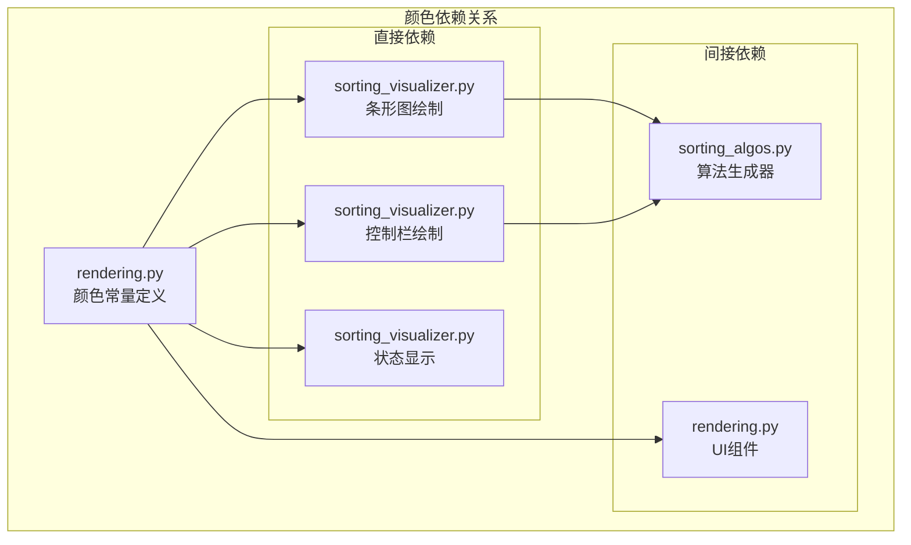

# 颜色方案设计

<cite>
**本文档引用的文件**
- [rendering.py](file://rendering.py)
- [sorting_visualizer.py](file://sorting_visualizer.py)
- [sorting_algos.py](file://sorting_algos.py)
- [data_generator.py](file://data_generator.py)
</cite>

## 目录
1. [简介](#简介)
2. [项目结构](#项目结构)
3. [核心组件](#核心组件)
4. [架构概览](#架构概览)
5. [详细组件分析](#详细组件分析)
6. [依赖分析](#依赖分析)
7. [性能考虑](#性能考虑)
8. [故障排除指南](#故障排除指南)
9. [结论](#结论)

## 简介

本项目是一个基于Pygame的数据可视化应用程序，专门用于展示各种排序算法的执行过程。颜色方案设计是该应用的核心视觉元素之一，它不仅影响用户体验，还承担着重要的信息传达功能。本文档将深入分析rendering.py中定义的颜色常量系统，包括基础颜色、状态颜色和主题色彩的设计原则和应用场景。

## 项目结构

该项目采用模块化设计，主要包含以下核心文件：

**图表来源**
- [sorting_visualizer.py:1-50](file://sorting_visualizer.py#L1-L50)
- [rendering.py:1-50](file://rendering.py#L1-L50)

**章节来源**
- [sorting_visualizer.py:1-50](file://sorting_visualizer.py#L1-L50)
- [rendering.py:1-50](file://rendering.py#L1-L50)

## 核心组件

### 颜色常量系统

项目定义了完整的颜色常量系统，涵盖基础颜色、状态颜色和主题色彩三个层次：

#### 基础颜色（Base Colors）
- **BLACK** (0, 0, 0): 用于背景和阴影效果
- **WHITE** (255, 255, 255): 用于文字和高对比度元素
- **BLUE** (30, 100, 255): 主要的算法可视化颜色
- **YELLOW** (255, 220, 0): 用于高亮显示和交互元素

#### 状态颜色（Status Colors）
- **GREEN** (0, 220, 80): 表示已完成状态和成功操作
- **RED** (220, 50, 50): 表示错误状态和警告
- **CYAN** (0, 220, 220): 用于边框和强调元素

#### 主题色彩（Theme Colors）
- **DKBLUE** (10, 30, 80): 深蓝色背景色
- **LGRAY** (140, 140, 140): 浅灰色辅助色
- **其他颜色**: ORANGE、PURPLE、GRAY、TEAL、PINK等

**章节来源**
- [rendering.py:16-29](file://rendering.py#L16-L29)

## 架构概览

颜色方案在整个系统中的应用架构如下：

**图表来源**
- [rendering.py:294-312](file://rendering.py#L294-L312)
- [sorting_visualizer.py:304-311](file://sorting_visualizer.py#L304-L311)

## 详细组件分析

### 颜色常量定义与设计原则

#### 设计原则分析

1. **对比度优先原则**
   - 背景色与前景色之间保持足够的亮度差
   - 文字颜色与背景色形成清晰对比
   - 交互元素与背景形成明显区分

2. **语义化颜色映射**
   - 绿色系：成功、完成、稳定
   - 红色系：错误、警告、危险
   - 蓝色系：算法主体、信息、基础
   - 黄色系：高亮、选中、重要

3. **可访问性考虑**
   - 色盲友好：避免仅依赖颜色区分信息
   - 高对比度：确保在不同设备上的可读性
   - 一致性：相同语义使用相同颜色

#### 颜色选择的具体实现

**图表来源**
- [rendering.py:16-29](file://rendering.py#L16-L29)
- [sorting_visualizer.py:304-311](file://sorting_visualizer.py#L304-L311)

### 颜色在UI组件中的应用

#### 条形图颜色系统

条形图是算法可视化的主要表现形式，颜色系统在其中发挥关键作用：

**图表来源**
- [sorting_visualizer.py:304-311](file://sorting_visualizer.py#L304-L311)

#### 控制栏颜色应用

控制栏使用深色背景配合亮色文字，营造专业的控制界面氛围：

- **背景色**: (10, 15, 35) - 深蓝黑色
- **边框色**: CYAN (0, 220, 220) - 蓝绿色边框
- **文字色**: WHITE (255, 255, 255) - 纯白色文字
- **状态色**: (0, 255, 127) - 浅绿色状态指示

**章节来源**
- [sorting_visualizer.py:316-356](file://sorting_visualizer.py#L316-L356)

### 按钮组件的颜色逻辑

按钮组件实现了动态颜色变化机制：

**图表来源**
- [rendering.py:354-379](file://rendering.py#L354-L379)

**章节来源**
- [rendering.py:359](file://rendering.py#L359)

### 下拉菜单的颜色设计

下拉菜单采用层次化的颜色体系：

- **基础背景**: DKBLUE (10, 30, 80) - 深蓝色
- **边框强调**: CYAN (0, 220, 220) - 蓝绿色边框
- **文字颜色**: WHITE (255, 255, 255) - 白色文字
- **悬停状态**: (50, 80, 150) - 浅蓝色悬停背景
- **箭头颜色**: CYAN (0, 220, 220) - 蓝绿色箭头

**章节来源**
- [rendering.py:294-316](file://rendering.py#L294-L316)

### 代码面板的颜色方案

代码面板采用深色主题设计，突出代码内容：

- **面板背景**: (12, 16, 38) - 深蓝黑色
- **标题栏**: (20, 28, 60) - 深蓝色标题
- **行号区域**: (28, 32, 55) - 深灰色行号
- **代码区域**: (14, 18, 40) - 更深的背景
- **滚动条**: (28, 32, 52) - 中性灰色轨道
- **滚动条手柄**: (70, 85, 130) - 浅灰色手柄

**章节来源**
- [rendering.py:174-240](file://rendering.py#L174-L240)

## 依赖分析

颜色系统在整个项目中的依赖关系：

**图表来源**
- [sorting_visualizer.py:35-46](file://sorting_visualizer.py#L35-L46)
- [rendering.py:8-10](file://rendering.py#L8-L10)

**章节来源**
- [sorting_visualizer.py:35-46](file://sorting_visualizer.py#L35-L46)

## 性能考虑

### 颜色渲染优化

1. **颜色缓存**: 颜色常量作为全局变量，避免重复创建
2. **批量绘制**: 同类型元素使用相同颜色，减少状态切换
3. **渐变计算**: 按钮悬停颜色通过简单数学运算计算

### 内存使用分析

- 颜色元组占用内存极小
- 字体渲染缓存避免重复创建
- 图像表面(subsurface)复用提高效率

## 故障排除指南

### 常见颜色问题

1. **颜色显示异常**
   - 检查Pygame版本兼容性
   - 确认颜色值范围在0-255之间
   - 验证颜色格式为RGB元组

2. **对比度不足**
   - 调整背景与文字颜色组合
   - 使用更高对比度的颜色方案
   - 考虑色盲友好的颜色选择

3. **性能问题**
   - 减少不必要的颜色切换
   - 批量处理相似颜色的元素
   - 优化渲染循环中的颜色计算

**章节来源**
- [rendering.py:38-46](file://rendering.py#L38-L46)

## 结论

本项目的颜色方案设计体现了专业性和实用性相结合的特点。通过精心设计的基础颜色、状态颜色和主题色彩，以及合理的应用策略，成功实现了：

1. **清晰的信息传达**: 不同颜色准确表达算法状态和交互反馈
2. **良好的用户体验**: 高对比度和一致性的视觉设计
3. **可维护性**: 模块化的颜色管理，便于修改和扩展
4. **可访问性**: 考虑了色盲用户的需求和不同显示设备的兼容性

这种颜色方案设计为类似的数据可视化项目提供了优秀的参考模板，特别是在算法演示和教育场景中具有很高的实用价值。