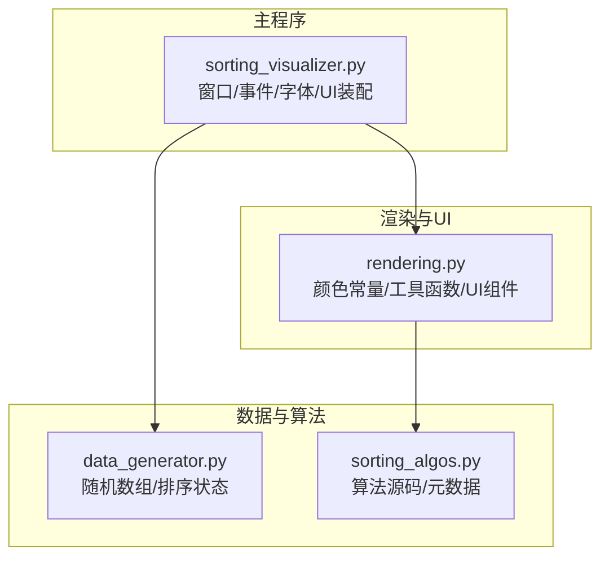
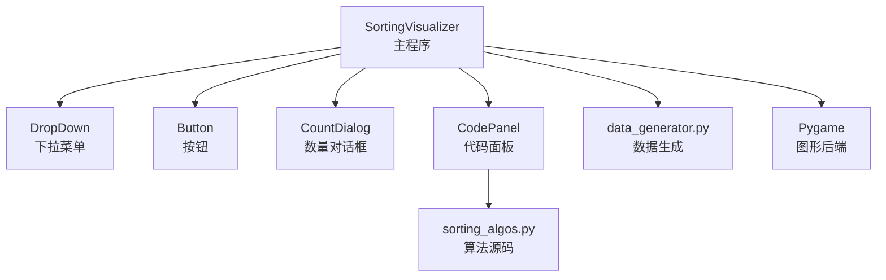
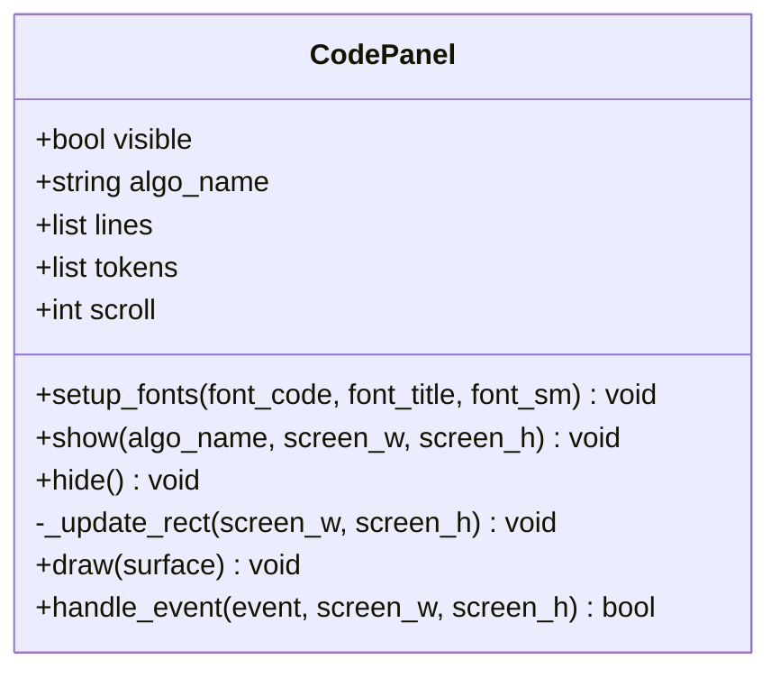
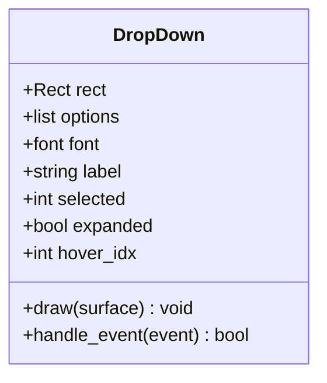
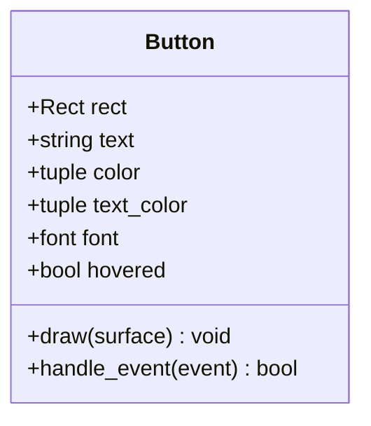
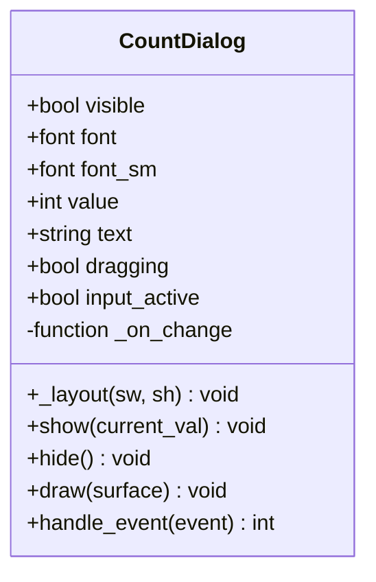
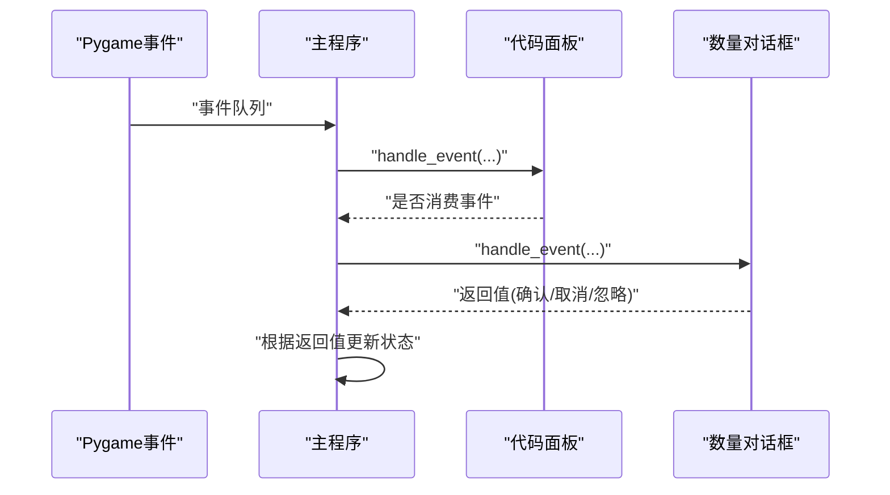
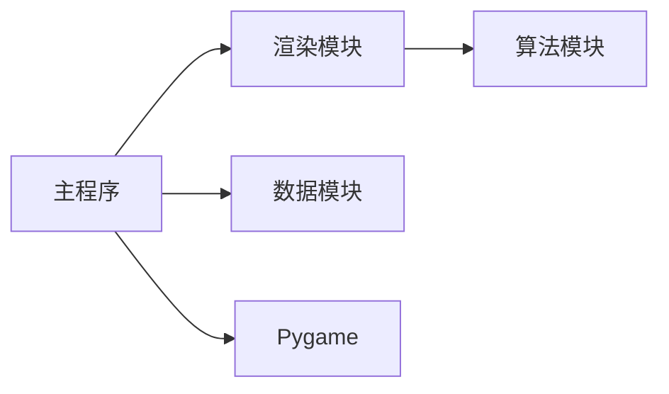

# UI组件扩展指南

<cite>
**本文档引用的文件**
- [rendering.py](file://rendering.py)
- [sorting_visualizer.py](file://sorting_visualizer.py)
- [data_generator.py](file://data_generator.py)
- [sorting_algos.py](file://sorting_algos.py)
</cite>

## 目录
1. [简介](#简介)
2. [项目结构](#项目结构)
3. [核心组件](#核心组件)
4. [架构总览](#架构总览)
5. [详细组件分析](#详细组件分析)
6. [依赖分析](#依赖分析)
7. [性能考量](#性能考量)
8. [故障排查指南](#故障排查指南)
9. [结论](#结论)
10. [附录](#附录)

## 简介
本指南面向希望在现有Python可视化项目中扩展UI组件的开发者。项目采用Pygame作为图形后端，围绕排序算法演示构建了可交互的可视化界面。核心UI组件包括代码面板、下拉菜单、按钮和数量设置对话框等。本文将系统讲解组件架构与设计模式、新组件开发流程、样式与主题适配、组件间通信、响应式布局与跨平台兼容性、测试与调试最佳实践，以及如何集成第三方UI库或自定义组件。

## 项目结构
项目采用“功能分层 + 组件化”的组织方式：
- 渲染与UI模块：集中于渲染相关逻辑与UI组件实现
- 视觉器主程序：负责事件循环、窗口管理、字体加载与UI装配
- 数据生成与算法：为可视化提供数据源与算法代码
- 算法代码与资源：提供排序算法源码以供展示

图表来源
- [rendering.py:1-110](file://rendering.py#L1-L110)
- [sorting_visualizer.py:125-144](file://sorting_visualizer.py#L125-L144)
- [data_generator.py:10-25](file://data_generator.py#L10-L25)
- [sorting_algos.py:564-578](file://sorting_algos.py#L564-L578)

章节来源
- [rendering.py:1-110](file://rendering.py#L1-L110)
- [sorting_visualizer.py:125-144](file://sorting_visualizer.py#L125-L144)
- [data_generator.py:10-25](file://data_generator.py#L10-L25)
- [sorting_algos.py:564-578](file://sorting_algos.py#L564-L578)

## 核心组件
本项目的核心UI组件均位于渲染模块中，遵循统一的接口风格：构造函数接收位置、尺寸、字体与选项；提供绘制方法用于渲染到表面；提供事件处理方法以响应用户交互。组件之间通过事件冒泡与返回值进行协作。

- 颜色常量与工具函数：提供统一的颜色与文本绘制工具，便于主题一致化
- 代码面板：用于展示算法源码，支持滚动与关闭
- 下拉菜单：支持标签、选项列表、悬停与展开状态
- 按钮：支持悬停检测与点击事件
- 数量设置对话框：支持滑动条与文本输入两种交互模式

章节来源
- [rendering.py:13-33](file://rendering.py#L13-L33)
- [rendering.py:38-47](file://rendering.py#L38-L47)
- [rendering.py:109-279](file://rendering.py#L109-L279)
- [rendering.py:283-379](file://rendering.py#L283-L379)
- [rendering.py:353-371](file://rendering.py#L353-L371)
- [rendering.py:383-460](file://rendering.py#L383-L460)

## 架构总览
主程序负责窗口初始化、字体加载、UI组件装配与事件循环；渲染模块提供UI组件与绘制工具；数据与算法模块提供数据与算法源码。组件间通过事件处理与回调进行解耦协作。

图表来源
- [sorting_visualizer.py:146-170](file://sorting_visualizer.py#L146-L170)
- [rendering.py:109-279](file://rendering.py#L109-L279)
- [rendering.py:283-379](file://rendering.py#L283-L379)
- [rendering.py:353-371](file://rendering.py#L353-L371)
- [rendering.py:383-460](file://rendering.py#L383-L460)
- [sorting_algos.py:564-578](file://sorting_algos.py#L564-L578)
- [data_generator.py:10-25](file://data_generator.py#L10-L25)

## 详细组件分析

### 代码面板（CodePanel）
职责与特性
- 负责算法源码的展示与语法高亮
- 支持显示/隐藏、滚动控制与关闭按钮
- 根据屏幕尺寸动态计算面板位置与滚动条区域

实现要点
- 属性：可见性、算法名、代码行、词法标记、滚动偏移、字体集合
- 方法：显示/隐藏、更新矩形、绘制、事件处理（滚动与关闭）
- 依赖：算法源码获取函数与词法标记工具

图表来源
- [rendering.py:109-151](file://rendering.py#L109-L151)
- [rendering.py:166-240](file://rendering.py#L166-L240)
- [rendering.py:240-279](file://rendering.py#L240-L279)

章节来源
- [rendering.py:109-151](file://rendering.py#L109-L151)
- [rendering.py:166-240](file://rendering.py#L166-L240)
- [rendering.py:240-279](file://rendering.py#L240-L279)

### 下拉菜单（DropDown）
职责与特性
- 提供选项选择与展开/收起交互
- 支持标签显示、悬停高亮与选中项渲染
- 事件处理返回布尔值表示是否消费事件

实现要点
- 属性：矩形区域、选项列表、字体、标签、选中索引、展开状态、悬停索引
- 方法：绘制、事件处理（鼠标移动/按下）
- 设计：通过返回值告知上层是否已处理事件，避免重复处理

图表来源
- [rendering.py:283-316](file://rendering.py#L283-L316)
- [rendering.py:372-379](file://rendering.py#L372-L379)

章节来源
- [rendering.py:283-316](file://rendering.py#L283-L316)
- [rendering.py:372-379](file://rendering.py#L372-L379)

### 按钮（Button）
职责与特性
- 响应悬停与点击事件
- 提供统一的绘制样式与事件反馈

实现要点
- 属性：矩形区域、文本、背景色、文本色、字体、悬停状态
- 方法：绘制、事件处理（悬停检测、点击判定）

图表来源
- [rendering.py:353-371](file://rendering.py#L353-L371)

章节来源
- [rendering.py:353-371](file://rendering.py#L353-L371)

### 数量设置对话框（CountDialog）
职责与特性
- 提供数据规模设置：滑动条与文本输入双模式
- 支持实时回调与确认提交
- 响应显示/隐藏与输入焦点切换

实现要点
- 属性：可见性、字体、当前值、文本、拖拽状态、输入焦点、回调、布局矩形
- 方法：布局计算、绘制、事件处理（滑块拖拽、键盘输入、确认/取消）
- 设计：通过返回值区分不同交互结果（确认值/取消/忽略）

图表来源
- [rendering.py:383-460](file://rendering.py#L383-L460)

章节来源
- [rendering.py:383-460](file://rendering.py#L383-L460)

### 组件间通信与事件流
事件在主程序中统一收集与分发，各组件按需消费事件并返回状态，确保事件不被重复处理。

图表来源
- [sorting_visualizer.py:386-407](file://sorting_visualizer.py#L386-L407)
- [rendering.py:240-279](file://rendering.py#L240-L279)
- [rendering.py:400-425](file://rendering.py#L400-L425)

章节来源
- [sorting_visualizer.py:386-407](file://sorting_visualizer.py#L386-L407)
- [rendering.py:240-279](file://rendering.py#L240-L279)
- [rendering.py:400-425](file://rendering.py#L400-L425)

## 依赖分析
- 主程序依赖渲染模块提供的UI组件与工具函数
- 代码面板依赖算法模块以获取源码
- 字体加载与回退策略由主程序统一处理
- 数据生成模块为可视化提供初始数据

图表来源
- [sorting_visualizer.py:125-144](file://sorting_visualizer.py#L125-L144)
- [rendering.py:109-151](file://rendering.py#L109-L151)
- [sorting_algos.py:564-578](file://sorting_algos.py#L564-L578)
- [data_generator.py:10-25](file://data_generator.py#L10-L25)

章节来源
- [sorting_visualizer.py:125-144](file://sorting_visualizer.py#L125-L144)
- [rendering.py:109-151](file://rendering.py#L109-L151)
- [sorting_algos.py:564-578](file://sorting_algos.py#L564-L578)
- [data_generator.py:10-25](file://data_generator.py#L10-L25)

## 性能考量
- 绘制优化：尽量减少每帧绘制调用次数，合并绘制批次，避免不必要的重绘
- 事件处理：组件内部尽早判断事件类型与命中区域，快速返回未命中以减少上层负担
- 字体与资源：字体加载失败时使用系统回退字体，避免阻塞主线程
- 动态布局：在窗口尺寸变化时仅重新计算受影响组件的布局
- 滚动与裁剪：对大段文本或长列表进行可视区域裁剪，降低绘制成本

## 故障排查指南
常见问题与建议
- 字体加载失败：检查字体路径与可用性，确保有系统回退方案
- 事件未响应：确认组件事件处理返回值与上层事件分发逻辑一致
- 颜色与主题不一致：统一使用颜色常量与工具函数，避免硬编码颜色
- 对话框无法关闭：检查可见性状态与事件消费逻辑
- 滚动异常：核对滚动边界与滚动条矩形计算

章节来源
- [sorting_visualizer.py:125-144](file://sorting_visualizer.py#L125-L144)
- [rendering.py:38-47](file://rendering.py#L38-L47)
- [rendering.py:240-279](file://rendering.py#L240-L279)
- [rendering.py:400-425](file://rendering.py#L400-L425)

## 结论
本项目的UI组件以简洁的接口与清晰的职责划分实现了良好的可扩展性。通过统一的事件处理与绘制模型，新增组件可以快速融入现有体系。建议在扩展时严格遵循现有模式，保持主题一致性与事件消费语义的一致性。

## 附录

### 新UI组件开发流程
- 类设计
  - 定义构造参数：位置、尺寸、字体、选项、回调等
  - 明确属性：状态字段、几何矩形、渲染所需资源
  - 实现方法：绘制与事件处理
- 继承与组合
  - 若与现有组件语义相近，优先复用现有基类或工具函数
  - 否则保持独立类，但遵循相同的事件返回约定
- 属性与事件
  - 使用统一的事件返回值约定（如布尔值表示是否消费事件）
  - 在主程序中按顺序分发事件，避免重复处理
- 样式与主题
  - 使用颜色常量与工具函数，确保主题一致
  - 提供可配置的主题参数（如主色、辅色、字体族）
- 响应式与跨平台
  - 在主程序中监听窗口尺寸变化，重新布局组件
  - 对字体加载失败进行回退处理，保证跨平台可用性
- 测试与调试
  - 单元测试：针对事件处理与布局计算的关键分支
  - 集成测试：在主程序事件循环中验证组件行为
  - 调试技巧：打印事件类型与坐标，逐步跟踪事件流向

### 样式定制与主题适配
- 颜色体系：统一使用颜色常量，必要时提供主题切换函数
- 字体策略：优先加载本地字体，失败时回退系统字体
- 组件样式：通过构造参数传入颜色与字体，避免硬编码

章节来源
- [rendering.py:13-33](file://rendering.py#L13-L33)
- [rendering.py:38-47](file://rendering.py#L38-L47)
- [sorting_visualizer.py:125-144](file://sorting_visualizer.py#L125-L144)

### 组件间数据传递与通信
- 事件驱动：组件通过事件返回值向主程序表明是否消费事件
- 回调机制：部分组件提供回调（如滑动条的实时变更回调），用于联动更新
- 状态同步：主程序根据组件返回值更新全局状态（如数据规模、算法选择）

章节来源
- [rendering.py:372-379](file://rendering.py#L372-L379)
- [rendering.py:400-425](file://rendering.py#L400-L425)
- [sorting_visualizer.py:386-407](file://sorting_visualizer.py#L386-L407)

### 响应式设计与跨平台兼容
- 响应式布局：监听窗口尺寸变化，重新计算组件位置与尺寸
- 字体兼容：优先使用系统字体，失败时回退到默认字体
- 平台差异：注意不同平台的字体路径与可用性差异

章节来源
- [sorting_visualizer.py:392-398](file://sorting_visualizer.py#L392-L398)
- [sorting_visualizer.py:125-144](file://sorting_visualizer.py#L125-L144)

### 第三方UI库与自定义组件集成
- 集成原则：保持事件返回约定一致，避免破坏现有事件分发逻辑
- 自定义组件：遵循现有类结构与方法命名，确保与主程序无缝衔接
- 外部库：若引入外部UI库，需在主程序中进行适配与桥接

### 示例参考路径
- 代码面板显示与事件处理：[rendering.py:133-140](file://rendering.py#L133-L140), [rendering.py:240-279](file://rendering.py#L240-L279)
- 下拉菜单绘制与事件：[rendering.py:294-316](file://rendering.py#L294-L316), [rendering.py:372-379](file://rendering.py#L372-L379)
- 按钮事件处理：[rendering.py:372-379](file://rendering.py#L372-L379)
- 数量对话框布局与事件：[rendering.py:401-425](file://rendering.py#L401-L425), [rendering.py:425-460](file://rendering.py#L425-L460)
- 主程序事件分发与字体加载：[sorting_visualizer.py:386-407](file://sorting_visualizer.py#L386-L407), [sorting_visualizer.py:125-144](file://sorting_visualizer.py#L125-L144)