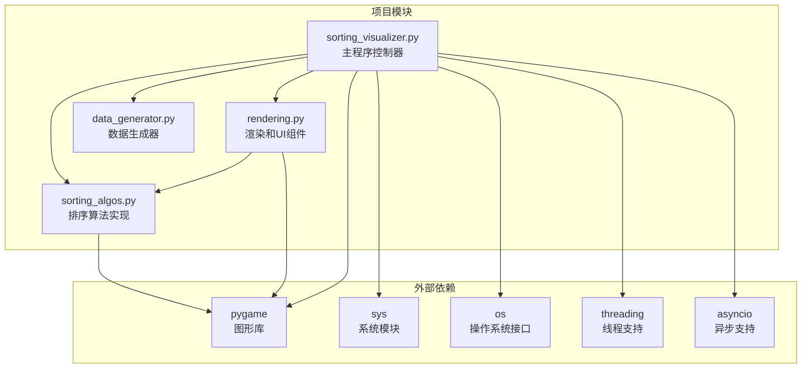
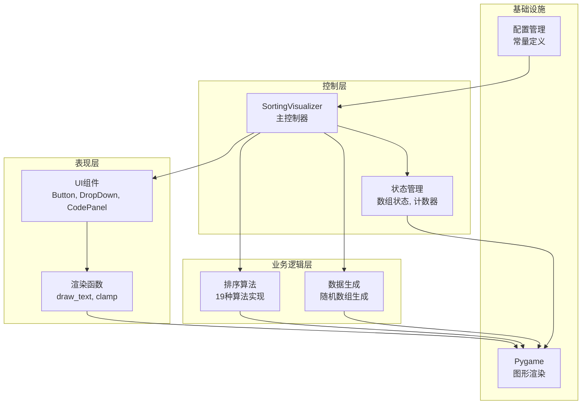
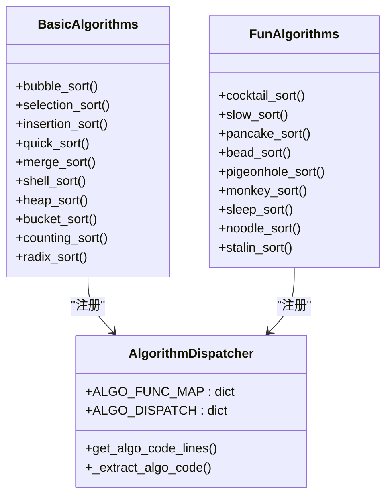
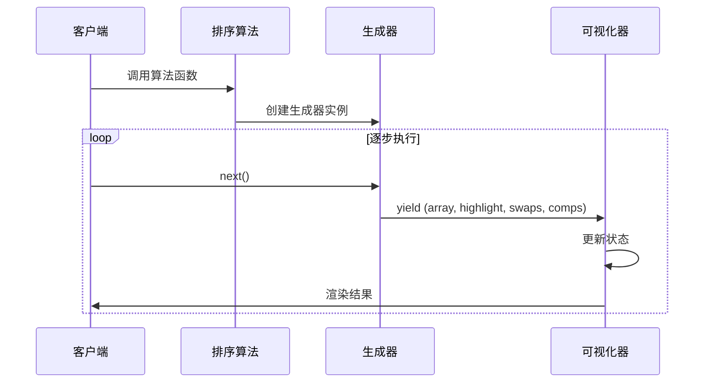
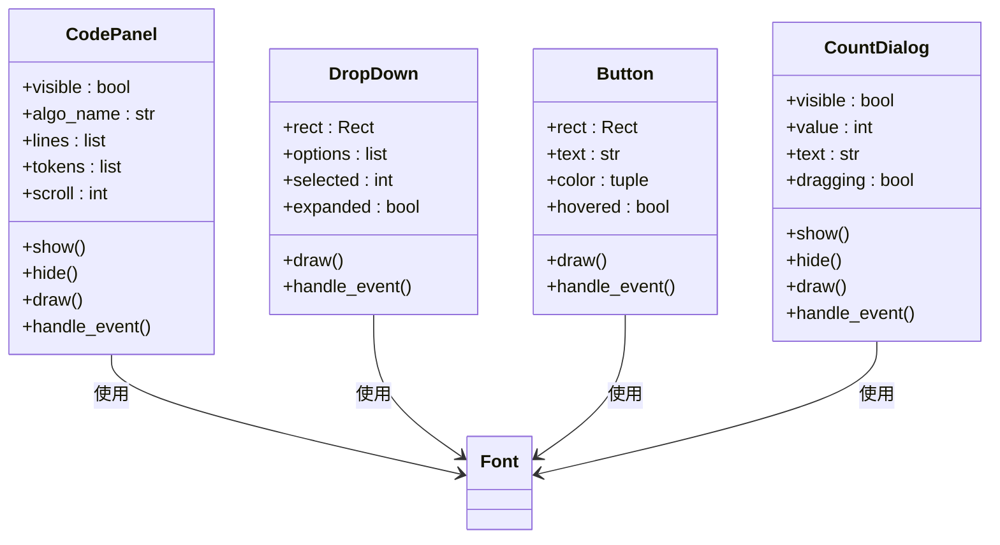
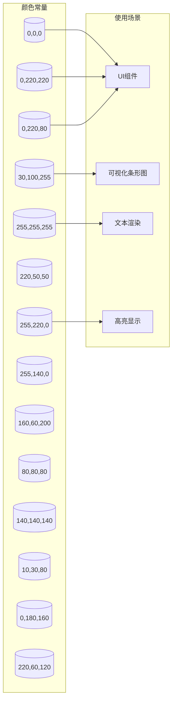
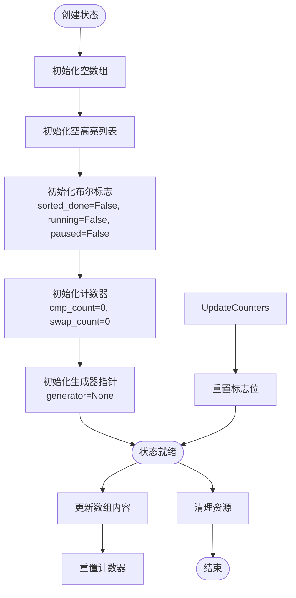
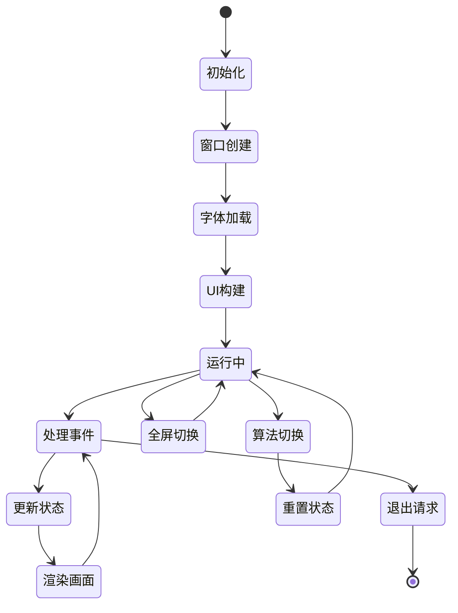
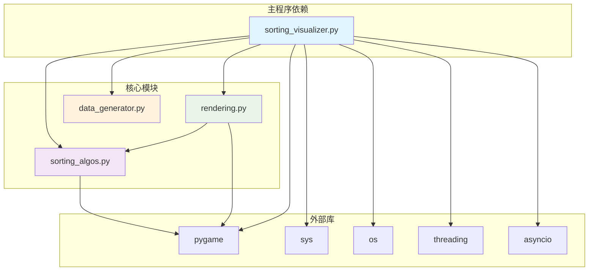

# 代码贡献规范

<cite>
**本文档引用的文件**
- [data_generator.py](file://data_generator.py)
- [rendering.py](file://rendering.py)
- [sorting_algos.py](file://sorting_algos.py)
- [sorting_visualizer.py](file://sorting_visualizer.py)
</cite>

## 目录
1. [简介](#简介)
2. [项目结构](#项目结构)
3. [核心组件](#核心组件)
4. [架构概览](#架构概览)
5. [详细组件分析](#详细组件分析)
6. [依赖关系分析](#依赖关系分析)
7. [性能考虑](#性能考虑)
8. [故障排除指南](#故障排除指南)
9. [结论](#结论)

## 简介

这是一个基于Pygame的排序算法可视化工具项目。项目采用模块化设计，包含数据生成、算法实现、渲染界面和可视化控制器四个主要模块。该项目提供了19种不同的排序算法的可视化演示，包括经典的排序算法和一些趣味性算法。

## 项目结构

项目采用清晰的模块化架构，每个文件负责特定的功能领域：

**图表来源**
- [sorting_visualizer.py:34-48](file://sorting_visualizer.py#L34-L48)
- [sorting_algos.py:9](file://sorting_algos.py#L9)
- [rendering.py:8](file://rendering.py#L8)

**章节来源**
- [sorting_visualizer.py:1-15](file://sorting_visualizer.py#L1-L15)
- [sorting_algos.py:1-8](file://sorting_algos.py#L1-L8)
- [rendering.py:1-6](file://rendering.py#L1-L6)
- [data_generator.py:1-6](file://data_generator.py#L1-L6)

## 核心组件

### 数据生成模块
负责生成排序可视化所需的随机数组数据，提供基本的数据结构和状态管理功能。

### 排序算法模块  
包含19种不同的排序算法实现，每种算法都以生成器函数的形式提供，支持逐步执行和状态追踪。

### 渲染模块
提供完整的UI组件和绘制工具，包括颜色常量、工具函数、各种UI组件类和代码面板功能。

### 可视化控制器
主程序控制器，负责协调各个模块的工作，管理用户交互和动画效果。

**章节来源**
- [data_generator.py:11-48](file://data_generator.py#L11-L48)
- [sorting_algos.py:13-24](file://sorting_algos.py#L13-L24)
- [rendering.py:14-32](file://rendering.py#L14-L32)
- [sorting_visualizer.py:62-113](file://sorting_visualizer.py#L62-L113)

## 架构概览

项目采用分层架构设计，具有清晰的关注点分离：

**图表来源**
- [sorting_visualizer.py:62-113](file://sorting_visualizer.py#L62-L113)
- [rendering.py:110-279](file://rendering.py#L110-L279)
- [sorting_algos.py:35-300](file://sorting_algos.py#L35-L300)
- [data_generator.py:11-48](file://data_generator.py#L11-L48)

## 详细组件分析

### 排序算法模块分析

#### 算法分类结构
项目将排序算法分为两大类：

**图表来源**
- [sorting_algos.py:13-24](file://sorting_algos.py#L13-L24)
- [sorting_algos.py:507-550](file://sorting_algos.py#L507-L550)

#### 生成器模式实现
所有算法都采用生成器模式，提供渐进式执行能力：

**图表来源**
- [sorting_algos.py:35-48](file://sorting_algos.py#L35-L48)
- [sorting_visualizer.py:269-287](file://sorting_visualizer.py#L269-L287)

**章节来源**
- [sorting_algos.py:35-300](file://sorting_algos.py#L35-L300)
- [sorting_algos.py:507-600](file://sorting_algos.py#L507-L600)

### 渲染模块分析

#### UI组件体系
渲染模块提供了完整的UI组件库：

**图表来源**
- [rendering.py:110-279](file://rendering.py#L110-L279)
- [rendering.py:284-349](file://rendering.py#L284-L349)
- [rendering.py:354-379](file://rendering.py#L354-L379)
- [rendering.py:384-564](file://rendering.py#L384-L564)

#### 颜色管理系统
项目采用统一的颜色常量定义：

**图表来源**
- [rendering.py:16-30](file://rendering.py#L16-L30)

**章节来源**
- [rendering.py:110-564](file://rendering.py#L110-L564)

### 数据生成模块分析

#### 状态管理结构
数据生成模块提供了完整的状态管理功能：

**图表来源**
- [data_generator.py:26-48](file://data_generator.py#L26-L48)

**章节来源**
- [data_generator.py:11-48](file://data_generator.py#L11-L48)

### 可视化控制器分析

#### 主控制器架构
主控制器负责协调整个应用程序的运行：

**图表来源**
- [sorting_visualizer.py:464-490](file://sorting_visualizer.py#L464-L490)
- [sorting_visualizer.py:386-462](file://sorting_visualizer.py#L386-L462)

**章节来源**
- [sorting_visualizer.py:62-490](file://sorting_visualizer.py#L62-L490)

## 依赖关系分析

项目采用松耦合的设计，模块间依赖关系清晰：

**图表来源**
- [sorting_visualizer.py:34-48](file://sorting_visualizer.py#L34-L48)
- [sorting_algos.py:9](file://sorting_algos.py#L9)
- [rendering.py:8](file://rendering.py#L8)

**章节来源**
- [sorting_visualizer.py:34-48](file://sorting_visualizer.py#L34-L48)
- [sorting_algos.py:9](file://sorting_algos.py#L9)
- [rendering.py:8](file://rendering.py#L8)

## 性能考虑

### 算法性能特性
项目中的排序算法展现了不同的性能特征：

| 算法类型 | 时间复杂度 | 空间复杂度 | 特点 |
|---------|-----------|-----------|------|
| 基础排序 | O(n²) | O(1) | 简单易懂，适合教学 |
| 快速排序 | O(n log n) | O(log n) | 平均性能优秀 |
| 归并排序 | O(n log n) | O(n) | 稳定排序 |
| 堆排序 | O(n log n) | O(1) | 原地排序 |
| 计数排序 | O(n+k) | O(k) | 非比较排序 |
| 基数排序 | O(d×n) | O(n+k) | 非比较排序 |

### 渲染性能优化
渲染模块采用了多项性能优化技术：

1. **增量渲染**：只渲染变化的部分，减少不必要的重绘
2. **对象池**：复用UI组件对象，避免频繁创建销毁
3. **批量绘制**：使用subsurface进行局部绘制优化
4. **滚动优化**：智能滚动条计算，避免全量重绘

### 内存管理
项目实现了有效的内存管理策略：

- 使用生成器模式避免一次性加载大量数据
- 及时清理不再使用的临时变量
- 合理使用浅拷贝和深拷贝
- 控制算法状态的最大深度

## 故障排除指南

### 常见问题及解决方案

#### Pygame兼容性问题
**问题描述**：在某些环境中Pygame初始化失败
**解决方案**：
1. 确保Pygame版本兼容
2. 检查图形驱动程序
3. 尝试降级或升级Pygame版本

#### 字体加载失败
**问题描述**：应用程序无法加载自定义字体
**解决方案**：
1. 检查字体文件路径
2. 验证字体文件完整性
3. 使用系统默认字体作为后备方案

#### 算法执行异常
**问题描述**：某些算法在特定输入下出现异常
**解决方案**：
1. 添加输入验证和边界检查
2. 实现异常捕获和恢复机制
3. 提供算法参数的合理范围提示

#### 内存泄漏问题
**问题描述**：长时间运行后内存占用持续增长
**解决方案**：
1. 检查生成器的正确使用
2. 确保及时释放不再使用的对象
3. 监控关键数据结构的生命周期

**章节来源**
- [sorting_visualizer.py:115-144](file://sorting_visualizer.py#L115-L144)
- [rendering.py:203-214](file://rendering.py#L203-L214)
- [sorting_algos.py:434-452](file://sorting_algos.py#L434-L452)

## 结论

本项目展示了Python数据可视化应用的最佳实践，具有以下特点：

1. **模块化设计**：清晰的职责分离和良好的封装
2. **性能优化**：采用生成器模式和增量渲染技术
3. **用户体验**：丰富的交互功能和直观的界面设计
4. **可扩展性**：易于添加新的算法和UI组件
5. **跨平台支持**：同时支持桌面和Web环境

项目为学习Python数据可视化和算法实现提供了优秀的参考案例，其架构设计和代码组织方式值得其他类似项目借鉴。