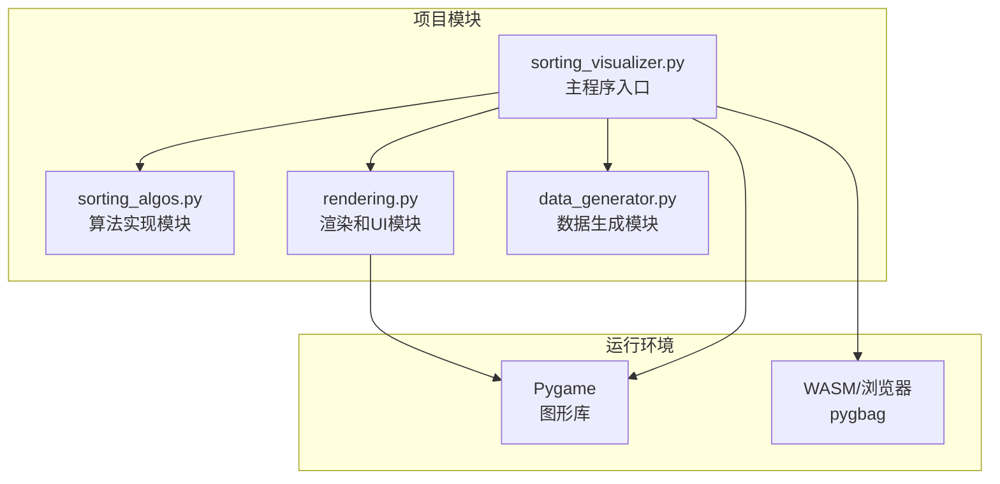
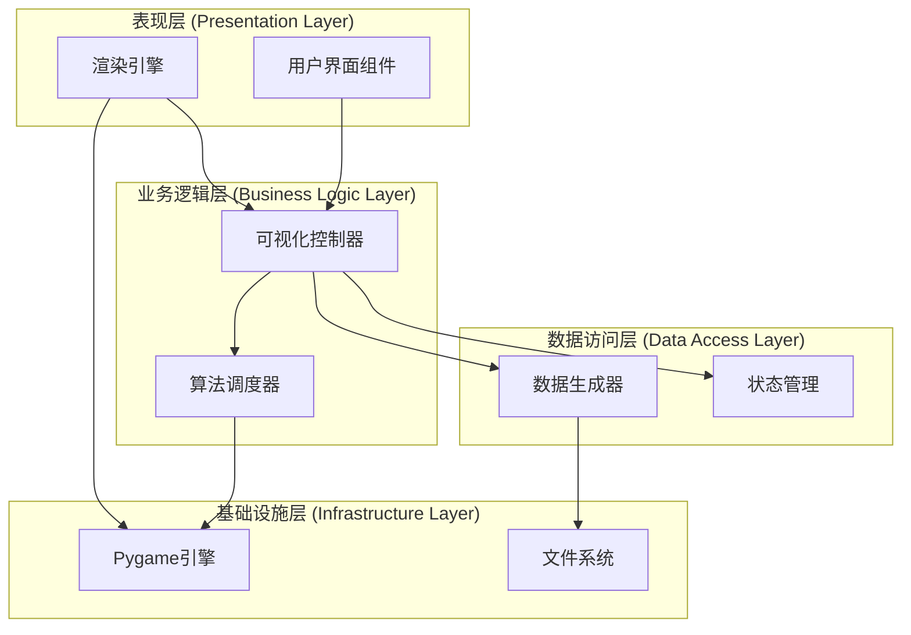
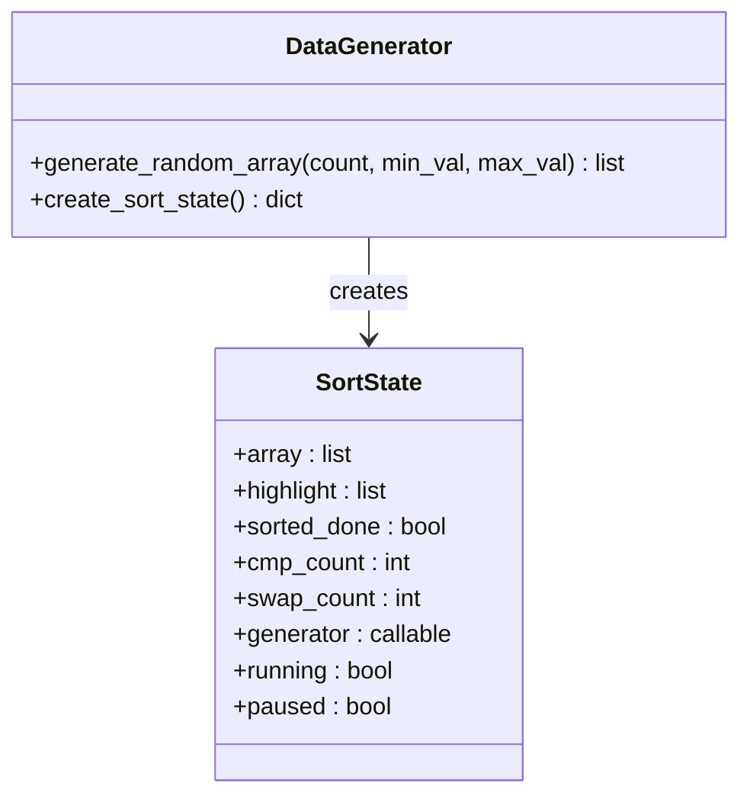
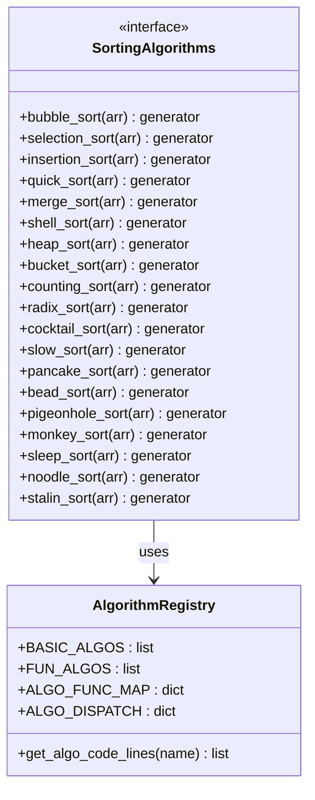
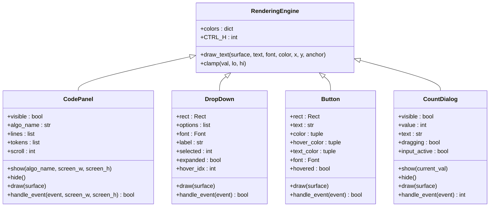
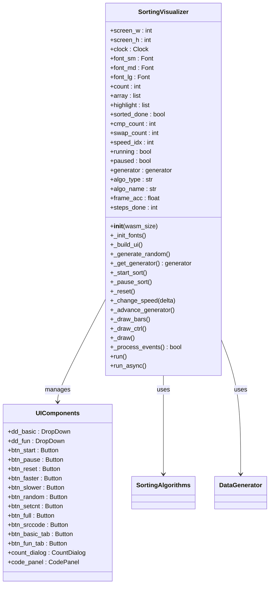
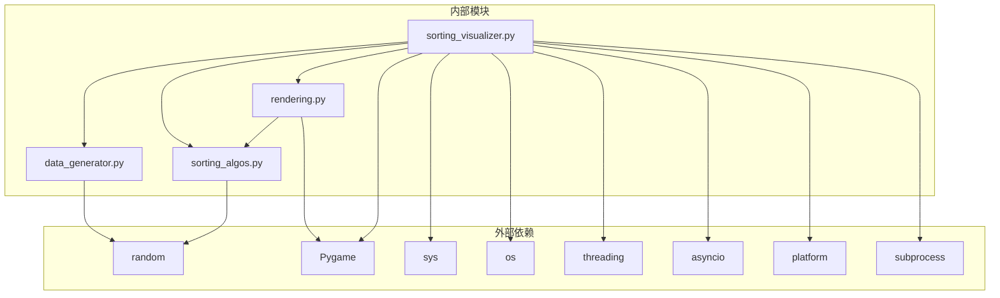

# 开发指南

<cite>
**本文档引用的文件**
- [data_generator.py](file://data_generator.py)
- [rendering.py](file://rendering.py)
- [sorting_algos.py](file://sorting_algos.py)
- [sorting_visualizer.py](file://sorting_visualizer.py)
</cite>

## 目录
1. [简介](#简介)
2. [项目结构](#项目结构)
3. [核心组件](#核心组件)
4. [架构概览](#架构概览)
5. [详细组件分析](#详细组件分析)
6. [依赖关系分析](#依赖关系分析)
7. [性能考虑](#性能考虑)
8. [调试技巧](#调试技巧)
9. [测试验证方法](#测试验证方法)
10. [UI组件扩展指南](#ui组件扩展指南)
11. [算法添加流程](#算法添加流程)
12. [代码贡献规范](#代码贡献规范)
13. [版本兼容性说明](#版本兼容性说明)
14. [故障排除指南](#故障排除指南)
15. [结论](#结论)

## 简介

这是一个基于Pygame的数据结构可视化项目，专注于排序算法的动态演示。项目采用模块化设计，将数据生成、算法实现、渲染逻辑和用户界面分离，提供了19种不同的排序算法可视化展示。

该项目的核心特色包括：
- 实时算法可视化，支持多种排序算法的动态演示
- 可交互的用户界面，支持算法选择、速度控制、数据量调整
- 代码面板功能，可查看当前算法的源码实现
- 支持桌面和Web浏览器两种运行环境

## 项目结构

项目采用清晰的模块化架构，每个文件都有明确的职责分工：



**图表来源**
- [sorting_visualizer.py:1-50](file://sorting_visualizer.py#L1-L50)
- [sorting_algos.py:1-25](file://sorting_algos.py#L1-L25)
- [rendering.py:1-35](file://rendering.py#L1-L35)
- [data_generator.py:1-15](file://data_generator.py#L1-L15)

**章节来源**
- [sorting_visualizer.py:1-50](file://sorting_visualizer.py#L1-L50)
- [sorting_algos.py:1-25](file://sorting_algos.py#L1-L25)
- [rendering.py:1-35](file://rendering.py#L1-L35)
- [data_generator.py:1-15](file://data_generator.py#L1-L15)

## 核心组件

### 数据生成器 (Data Generator)
负责生成排序算法所需的随机数组数据，提供标准化的数据格式和状态管理。

### 排序算法模块 (Sorting Algorithms)
包含19种不同的排序算法实现，所有算法均采用生成器函数模式，支持渐进式可视化展示。

### 渲染模块 (Rendering)
提供完整的UI组件系统，包括颜色常量、绘制工具函数和各种交互式UI组件。

### 主可视化器 (Sorting Visualizer)
应用程序的核心控制器，负责协调各个模块的工作流程和状态管理。

**章节来源**
- [data_generator.py:11-48](file://data_generator.py#L11-L48)
- [sorting_algos.py:12-25](file://sorting_algos.py#L12-L25)
- [rendering.py:13-557](file://rendering.py#L13-L557)
- [sorting_visualizer.py:62-113](file://sorting_visualizer.py#L62-L113)

## 架构概览

项目采用分层架构设计，实现了良好的关注点分离：



**图表来源**
- [sorting_visualizer.py:62-113](file://sorting_visualizer.py#L62-L113)
- [rendering.py:13-557](file://rendering.py#L13-L557)
- [data_generator.py:11-48](file://data_generator.py#L11-L48)

## 详细组件分析

### 数据生成器组件分析

数据生成器提供了两个核心功能：
1. 随机数组生成：支持自定义长度和数值范围
2. 排序状态初始化：创建标准化的状态字典



**图表来源**
- [data_generator.py:11-48](file://data_generator.py#L11-L48)

**章节来源**
- [data_generator.py:11-48](file://data_generator.py#L11-L48)

### 排序算法组件分析

算法模块实现了19种不同的排序算法，分为基础排序和趣味排序两大类：



**图表来源**
- [sorting_algos.py:12-25](file://sorting_algos.py#L12-L25)
- [sorting_algos.py:507-550](file://sorting_algos.py#L507-L550)

**章节来源**
- [sorting_algos.py:12-25](file://sorting_algos.py#L12-L25)
- [sorting_algos.py:507-550](file://sorting_algos.py#L507-L550)

### 渲染组件分析

渲染模块提供了完整的UI组件系统，包括代码面板、下拉菜单、按钮和对话框：



**图表来源**
- [rendering.py:13-557](file://rendering.py#L13-L557)

**章节来源**
- [rendering.py:13-557](file://rendering.py#L13-L557)

### 主可视化器组件分析

主可视化器是整个应用的核心控制器，负责协调各个模块的工作：



**图表来源**
- [sorting_visualizer.py:62-487](file://sorting_visualizer.py#L62-L487)

**章节来源**
- [sorting_visualizer.py:62-487](file://sorting_visualizer.py#L62-L487)

## 依赖关系分析

项目具有清晰的单向依赖关系，避免了循环依赖：



**图表来源**
- [sorting_visualizer.py:17-48](file://sorting_visualizer.py#L17-L48)
- [rendering.py:8-10](file://rendering.py#L8-L10)
- [data_generator.py:8](file://data_generator.py#L8)
- [sorting_algos.py:9](file://sorting_algos.py#L9)

**章节来源**
- [sorting_visualizer.py:17-48](file://sorting_visualizer.py#L17-L48)
- [rendering.py:8-10](file://rendering.py#L8-L10)
- [data_generator.py:8](file://data_generator.py#L8)
- [sorting_algos.py:9](file://sorting_algos.py#L9)

## 性能考虑

### 算法性能特性

不同排序算法具有不同的时间复杂度和空间复杂度：

| 算法类型 | 时间复杂度(平均) | 时间复杂度(最坏) | 空间复杂度 | 稳定性 |
|---------|-----------------|-----------------|------------|--------|
| 基础排序 | O(n²) | O(n²) | O(1) | 稳定 |
| 快速排序 | O(n log n) | O(n²) | O(log n) | 不稳定 |
| 归并排序 | O(n log n) | O(n log n) | O(n) | 稳定 |
| 堆排序 | O(n log n) | O(n log n) | O(1) | 不稳定 |
| 计数排序 | O(n+k) | O(n+k) | O(k) | 稳定 |
| 基数排序 | O(d×n) | O(d×n) | O(n+k) | 稳定 |

### 渲染性能优化

1. **批量绘制**：使用Pygame的subsurface进行局部更新
2. **增量更新**：只更新发生变化的条形图区域
3. **字体缓存**：预加载和缓存常用字体
4. **事件节流**：控制帧率和处理频率

### 内存管理

1. **生成器模式**：算法实现使用生成器，避免一次性加载大量中间结果
2. **状态复用**：重用数组和状态对象，减少内存分配
3. **缓存策略**：算法源码使用内存缓存

## 调试技巧

### 常见问题诊断

1. **字体显示问题**
   - 检查字体文件路径
   - 验证字体文件完整性
   - 备用字体降级方案

2. **算法执行异常**
   - 检查生成器函数的yield语句
   - 验证参数传递和状态更新
   - 确认边界条件处理

3. **UI组件响应问题**
   - 检查事件坐标转换
   - 验证碰撞检测逻辑
   - 确认组件状态管理

### 调试工具和方法

1. **日志记录**：在关键位置添加日志输出
2. **断点调试**：使用IDE断点调试生成器函数
3. **性能分析**：监控帧率和内存使用情况
4. **单元测试**：为算法函数编写测试用例

## 测试验证方法

### 单元测试策略

1. **算法正确性测试**
   ```python
   # 测试用例模板
   def test_sorting_algorithm():
       # 生成测试数据
       original = [64, 34, 25, 12, 22, 11, 90]
       expected = sorted(original)
       
       # 执行算法
       result = list(algorithm(original))
       
       # 验证结果
       assert result[-1] == expected
   ```

2. **生成器行为测试**
   - 验证yield语句的数量和顺序
   - 检查状态变量的正确更新
   - 确认StopIteration的正确触发

3. **UI组件测试**
   - 事件处理测试
   - 状态变化验证
   - 边界条件处理

### 性能测试

1. **基准测试**：测量不同数据规模下的执行时间
2. **内存泄漏检测**：监控长时间运行的内存使用
3. **帧率稳定性**：确保UI响应的流畅性

## UI组件扩展指南

### 新增UI组件的步骤

1. **定义组件类**
   - 继承基础的渲染接口
   - 定义必要的属性和方法
   - 实现draw和handle_event方法

2. **集成到主程序**
   - 在构造函数中初始化组件
   - 在事件处理中调用组件方法
   - 在绘制阶段调用组件的draw方法

3. **样式和布局**
   - 使用现有的颜色常量
   - 遵循统一的字体大小规范
   - 考虑响应式布局适配

### 组件设计原则

1. **单一职责**：每个组件只负责特定的功能
2. **状态封装**：内部状态对外部透明
3. **事件隔离**：组件间通过消息传递通信
4. **资源管理**：合理管理字体、图片等资源

## 算法添加流程

### 新算法实现规范

1. **生成器函数要求**
   - 必须是生成器函数（使用yield）
   - 每次迭代返回四元组：(array, highlight_indices, swap_count, cmp_count)
   - 不能修改原始数组，应该返回数组副本
   - 正确更新比较和交换计数器

2. **算法命名约定**
   - 使用中文名称作为算法标识
   - 保持算法名称的唯一性和清晰性
   - 遵循现有命名风格

3. **实现最佳实践**
   - 提供清晰的注释和文档字符串
   - 包含适当的边界条件检查
   - 使用生成器模式进行渐进式展示
   - 避免不必要的内存分配

### 注册新算法

1. **添加到算法列表**
   ```python
   # 添加到基础算法或趣味算法列表
   BASIC_ALGOS.append("新算法名称")
   ```

2. **建立映射关系**
   ```python
   # 更新函数映射
   ALGO_FUNC_MAP["新算法名称"] = "new_algorithm_function"
   ALGO_DISPATCH["新算法名称"] = new_algorithm_function
   ```

3. **源码提取支持**
   - 确保算法函数有完整的文档字符串
   - 支持inspect模块自动提取源码
   - 考虑WASM环境的源码回退机制

### 测试验证步骤

1. **基本功能测试**
   - 验证算法对空数组的处理
   - 测试单元素数组的情况
   - 验证已排序和逆序数组

2. **生成器行为测试**
   - 检查生成器的完整执行
   - 验证yield语句的正确性
   - 确认状态计数器的准确性

3. **可视化集成测试**
   - 在主程序中注册新算法
   - 验证UI选择功能
   - 测试算法执行动画

**章节来源**
- [sorting_algos.py:35-500](file://sorting_algos.py#L35-L500)
- [sorting_algos.py:507-600](file://sorting_algos.py#L507-L600)

## 代码贡献规范

### 编码标准

1. **命名约定**
   - 函数和变量：使用下划线分隔的小写命名
   - 类名：使用帕斯卡命名法
   - 常量：使用全大写字母和下划线
   - 模块名：使用简短的小写命名

2. **代码格式**
   - 使用4个空格进行缩进
   - 行长度不超过88个字符
   - 函数之间留两个空行
   - 类之间留三个空行

3. **注释规范**
   - 模块顶部包含描述性注释
   - 复杂函数包含详细的文档字符串
   - 关键代码段添加简要注释

### 代码审查清单

1. **功能性验证**
   - 算法正确性
   - 边界条件处理
   - 错误处理机制

2. **性能考虑**
   - 时间复杂度分析
   - 内存使用优化
   - 生成器模式的正确使用

3. **可维护性**
   - 代码可读性
   - 模块化程度
   - 文档完整性

## 版本兼容性说明

### Python版本要求

- **最低版本**：Python 3.6+
- **推荐版本**：Python 3.8+
- **特性支持**：使用f-string、类型提示等现代Python特性

### Pygame版本兼容性

- **桌面环境**：Pygame 2.0+
- **WASM环境**：pygbag 0.1+
- **功能差异**：WASM环境禁用某些桌面特性

### 平台兼容性

1. **操作系统支持**
   - Windows：完整功能支持
   - macOS：完整功能支持
   - Linux：完整功能支持
   - Web浏览器：部分功能受限

2. **字体兼容性**
   - Windows：支持中文字体
   - macOS：支持系统字体
   - Linux：支持FreeType字体
   - Web：使用Web字体回退

## 故障排除指南

### 常见错误和解决方案

1. **字体加载失败**
   ```
   解决方案：检查字体文件路径，使用备用字体降级
   ```

2. **算法执行异常**
   ```
   解决方案：验证生成器函数的yield语句，检查状态变量更新
   ```

3. **UI组件无响应**
   ```
   解决方案：检查事件坐标转换，验证碰撞检测逻辑
   ```

4. **内存使用过高**
   ```
   解决方案：检查生成器是否正确清理，优化数据结构
   ```

### 性能问题诊断

1. **帧率下降**
   - 检查是否有过多的绘制操作
   - 验证事件处理效率
   - 监控内存使用情况

2. **CPU占用过高**
   - 分析算法复杂度
   - 检查不必要的计算
   - 优化渲染循环

### 调试工具

1. **Python内置工具**
   - 使用pdb进行断点调试
   - 利用cProfile进行性能分析
   - 使用memory_profiler监控内存

2. **第三方工具**
   - Pygame自带的调试功能
   - IDE的可视化调试器
   - 性能分析工具如snakeviz

## 结论

本开发指南为扩展和维护这个排序算法可视化项目提供了全面的技术指导。通过遵循模块化设计原则、生成器模式和组件化架构，项目实现了良好的可扩展性和可维护性。

关键要点包括：
- **模块化设计**：清晰的职责分离便于功能扩展
- **生成器模式**：支持渐进式算法演示
- **组件化UI**：易于扩展和定制用户界面
- **跨平台兼容**：同时支持桌面和Web环境

对于新算法的添加、UI组件的扩展和代码贡献，都提供了详细的流程和规范。这使得项目能够持续发展，为用户提供更好的学习和演示体验。