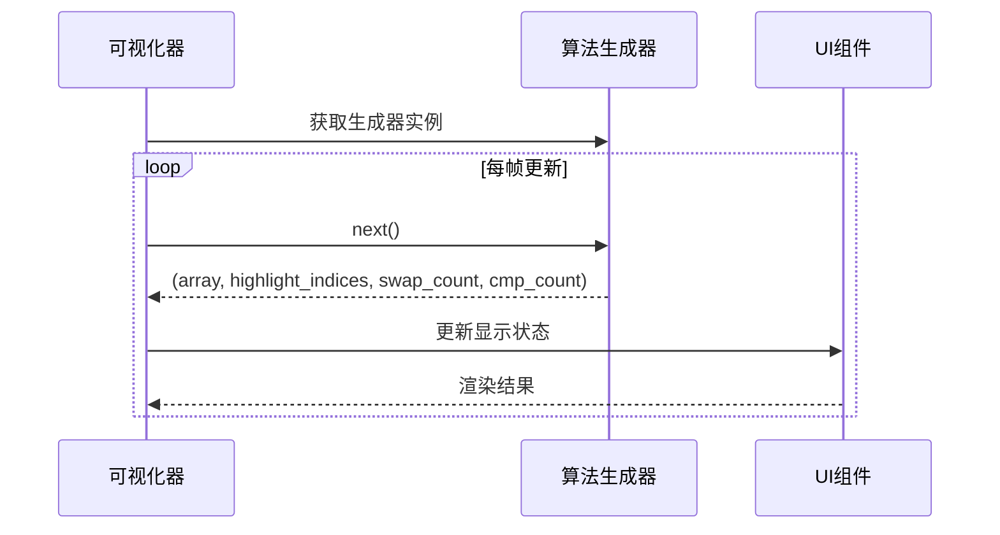
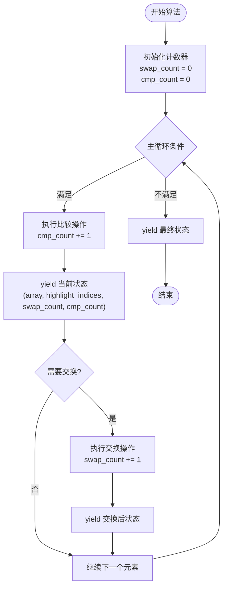
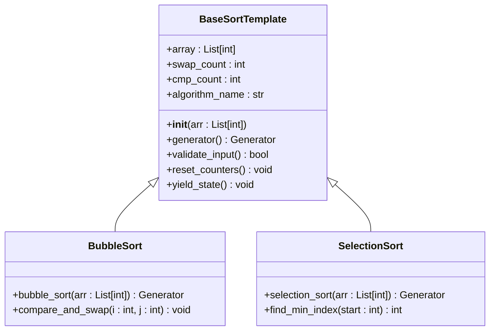
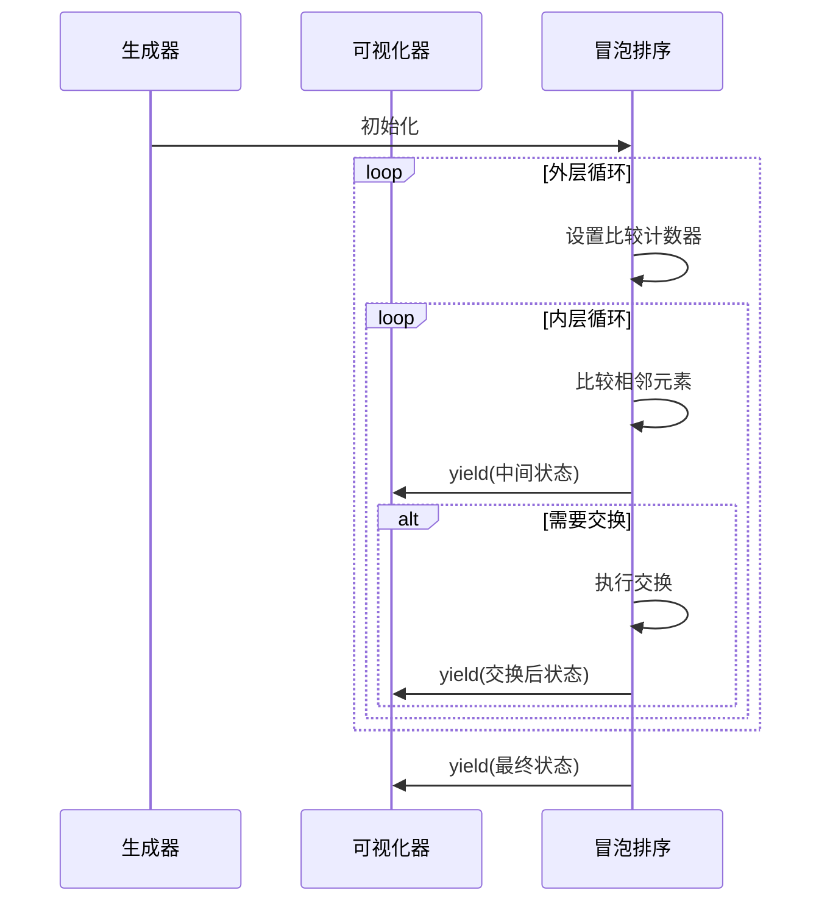
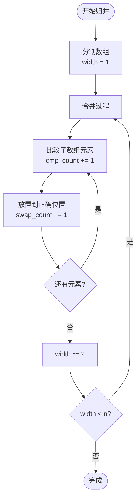
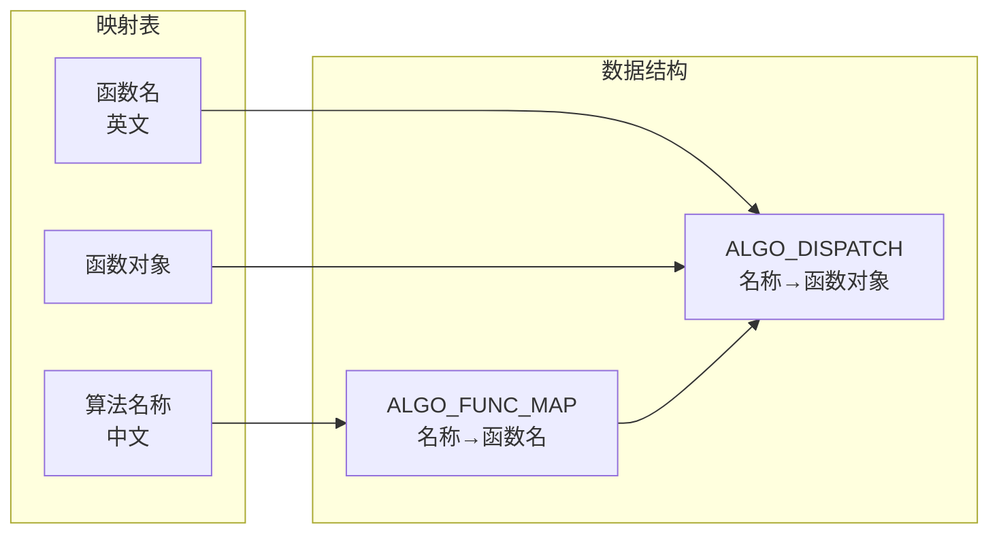
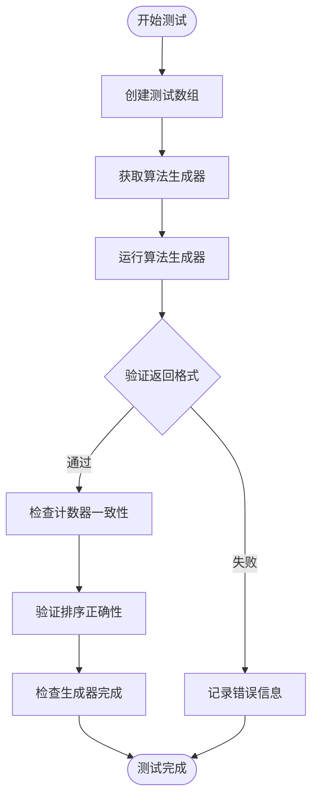
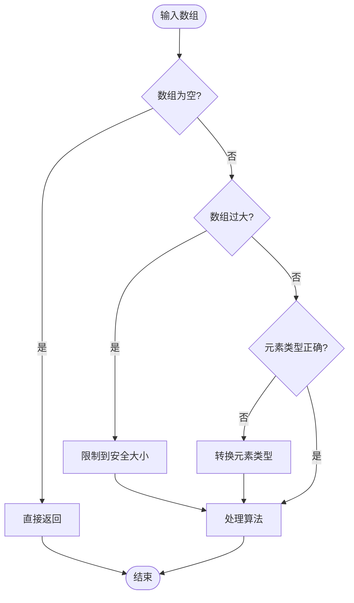

# 新算法添加指南

<cite>
**本文档引用的文件**
- [sorting_algos.py](file://sorting_algos.py)
- [sorting_visualizer.py](file://sorting_visualizer.py)
- [rendering.py](file://rendering.py)
- [data_generator.py](file://data_generator.py)
</cite>

## 目录
1. [简介](#简介)
2. [项目架构概览](#项目架构概览)
3. [算法生成器标准接口规范](#算法生成器标准接口规范)
4. [算法实现要求](#算法实现要求)
5. [完整算法模板](#完整算法模板)
6. [最佳实践示例](#最佳实践示例)
7. [算法名称与函数映射关系](#算法名称与函数映射关系)
8. [算法测试验证流程](#算法测试验证流程)
9. [调试技巧](#调试技巧)
10. [边界情况处理](#边界情况处理)
11. [算法复杂度分析](#算法复杂度分析)
12. [性能优化建议](#性能优化建议)
13. [结论](#结论)

## 简介

本指南详细说明了如何向Python数据可视化项目中添加新的排序算法。该项目采用生成器模式实现排序算法可视化，每个算法都必须遵循统一的接口规范，以确保与可视化系统的兼容性。

## 项目架构概览

项目采用模块化设计，主要包含以下四个核心模块：

```mermaid
graph TB
subgraph "可视化系统"
SV[SortingVisualizer<br/>主控制器]
R[rendering.py<br/>UI组件]
DG[data_generator.py<br/>数据生成]
end
subgraph "算法核心"
SA.sorting_algos.py<br/>19种排序算法]
AM[算法映射表]
end
SV --> SA
SV --> R
SV --> DG
SA --> AM
```

**图表来源**
- [sorting_visualizer.py:62-113](file://sorting_visualizer.py#L62-L113)
- [sorting_algos.py:12-24](file://sorting_algos.py#L12-L24)

**章节来源**
- [sorting_visualizer.py:1-490](file://sorting_visualizer.py#L1-L490)
- [sorting_algos.py:1-600](file://sorting_algos.py#L1-L600)

## 算法生成器标准接口规范

### 必须返回的元组格式

所有排序算法生成器必须严格遵循以下返回格式：
`(array, highlight_indices, swap_count, cmp_count)`

其中：
- `array`: 当前状态下的数组副本
- `highlight_indices`: 需要高亮显示的索引列表
- `swap_count`: 交换操作总次数
- `cmp_count`: 比较操作总次数

### 生成器协议要求



**图表来源**
- [sorting_visualizer.py:269-287](file://sorting_visualizer.py#L269-L287)
- [sorting_algos.py:35-48](file://sorting_algos.py#L35-L48)

**章节来源**
- [sorting_algos.py:6](file://sorting_algos.py#L6)
- [sorting_visualizer.py:269-287](file://sorting_visualizer.py#L269-L287)

## 算法实现要求

### yield语句的正确使用

每个算法实现必须在关键操作点使用yield语句，确保可视化能够实时显示算法执行过程：



**图表来源**
- [sorting_algos.py:35-48](file://sorting_algos.py#L35-L48)
- [sorting_algos.py:49-66](file://sorting_algos.py#L49-L66)

### 状态更新时机

状态更新必须遵循严格的时机顺序：
1. **比较操作后**：先增加比较计数器，再yield中间状态
2. **交换操作后**：先增加交换计数器，再yield中间状态
3. **循环结束时**：yield最终完成状态

### 性能考虑

- **内存效率**：始终使用`arr[:]`创建数组副本，避免修改原始数组
- **计算复杂度**：合理管理cmp_count和swap_count的增量
- **可视化流畅度**：在密集操作中适当增加yield频率

**章节来源**
- [sorting_algos.py:35-300](file://sorting_algos.py#L35-L300)

## 完整算法模板

### 基础算法模板



**图表来源**
- [sorting_algos.py:35-66](file://sorting_algos.py#L35-L66)
- [sorting_algos.py:68-87](file://sorting_algos.py#L68-L87)

### 算法模板实现要点

1. **初始化阶段**：设置计数器和算法标识
2. **主循环**：遍历数组元素，执行核心逻辑
3. **状态检查**：在每次关键操作后检查数组完整性
4. **清理阶段**：确保最终状态的正确性

**章节来源**
- [sorting_algos.py:35-300](file://sorting_algos.py#L35-L300)

## 最佳实践示例

### 已实现算法的参考模式

#### 冒泡排序模式


**图表来源**
- [sorting_algos.py:35-48](file://sorting_algos.py#L35-L48)

#### 归并排序模式


**图表来源**
- [sorting_algos.py:123-152](file://sorting_algos.py#L123-L152)

**章节来源**
- [sorting_algos.py:35-300](file://sorting_algos.py#L35-L300)

## 算法名称与函数映射关系

### 映射表结构

项目使用两个主要映射表来维护算法名称与函数的关系：



**图表来源**
- [sorting_algos.py:507-550](file://sorting_algos.py#L507-L550)

### 添加新算法的步骤

1. **实现算法函数**：在`sorting_algos.py`中添加新算法
2. **更新映射表**：在`ALGO_FUNC_MAP`和`ALGO_DISPATCH`中注册
3. **更新算法列表**：在`BASIC_ALGOS`或`FUN_ALGOS`中添加名称
4. **测试验证**：确保生成器返回正确的元组格式

**章节来源**
- [sorting_algos.py:507-550](file://sorting_algos.py#L507-L550)

## 算法测试验证流程

### 自动化测试框架



### 关键验证点

1. **元组格式验证**：确保返回值符合`(array, highlight_indices, swap_count, cmp_count)`格式
2. **类型检查**：验证各字段的数据类型正确性
3. **范围检查**：确保索引在有效范围内
4. **单调性检查**：验证计数器的单调递增特性
5. **最终状态**：确保生成器正常结束且数组已排序

**章节来源**
- [sorting_visualizer.py:269-287](file://sorting_visualizer.py#L269-L287)

## 调试技巧

### 常见问题诊断

#### 生成器异常处理
```python
# 在算法实现中添加调试输出
def debug_yield(state):
    array, indices, swaps, compares = state
    print(f"Debug: Array length={len(array)}, Indices={indices}")
    print(f"Debug: Swaps={swaps}, Compares={compares}")
    return state
```

#### 性能监控
- **帧率监控**：观察算法执行速度对帧率的影响
- **内存使用**：注意数组副本的内存开销
- **CPU负载**：评估算法复杂度对性能的影响

### 调试工具使用

1. **日志输出**：在关键节点添加print语句
2. **断点调试**：使用IDE设置断点跟踪执行流程
3. **性能分析**：使用cProfile分析算法性能瓶颈

## 边界情况处理

### 异常输入处理



### 特殊场景处理

1. **空数组**：直接返回，避免不必要的处理
2. **单元素数组**：立即完成，无需比较
3. **重复元素**：正确处理相等元素的比较
4. **逆序数组**：确保算法在最坏情况下仍能正确工作
5. **已排序数组**：优化最佳情况的性能表现

**章节来源**
- [sorting_algos.py:228-230](file://sorting_algos.py#L228-L230)
- [sorting_algos.py:252-253](file://sorting_algos.py#L252-L253)

## 算法复杂度分析

### 时间复杂度分类

| 算法类别 | 平均时间复杂度 | 最坏时间复杂度 | 空间复杂度 |
|---------|---------------|---------------|-----------|
| 基础排序 | O(n²) | O(n²) | O(1) |
| 快速排序 | O(n log n) | O(n²) | O(log n) |
| 归并排序 | O(n log n) | O(n log n) | O(n) |
| 堆排序 | O(n log n) | O(n log n) | O(1) |

### 可视化性能影响

1. **生成器频率**：频繁yield会影响性能，需要平衡可视化效果
2. **数组大小**：大数据集会显著增加渲染负担
3. **算法复杂度**：复杂度高的算法会产生更多中间状态

## 性能优化建议

### 生成器优化策略

1. **批量yield**：在密集操作中批量处理，减少yield调用频率
2. **延迟计算**：推迟不必要的计算，只在需要时进行
3. **内存复用**：重用数据结构，避免频繁分配内存

### 可视化优化

1. **渲染优化**：只重绘变化的部分，避免全屏重绘
2. **帧率控制**：根据算法复杂度动态调整渲染频率
3. **资源管理**：及时释放不再使用的资源

### 算法层面优化

1. **早期终止**：在已排序的情况下提前结束
2. **分支优化**：减少不必要的比较操作
3. **缓存利用**：利用局部性原理提高访问效率

## 结论

添加新算法到排序可视化系统需要严格遵循生成器协议和接口规范。通过参考现有算法的实现模式，使用标准的映射表机制，并进行全面的测试验证，可以确保新算法与现有系统的无缝集成。同时，需要充分考虑性能优化和边界情况处理，以提供良好的用户体验。