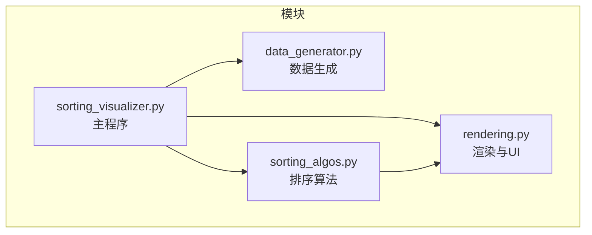
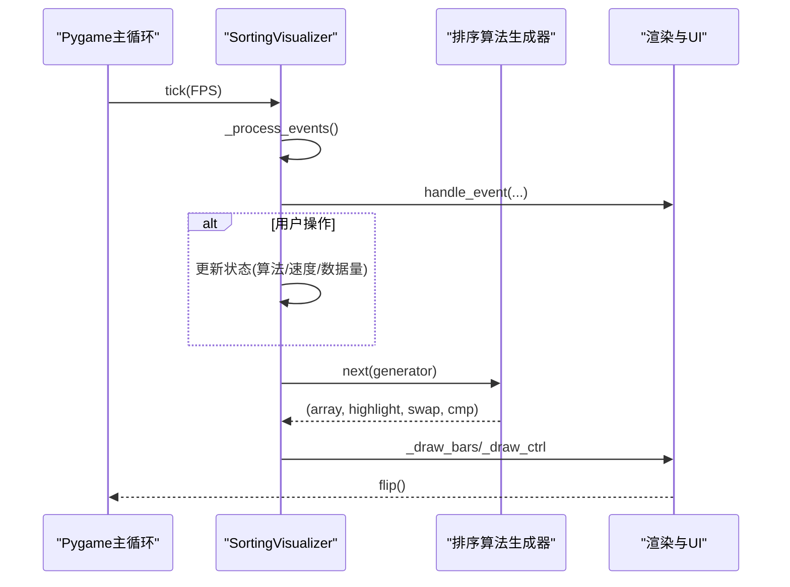
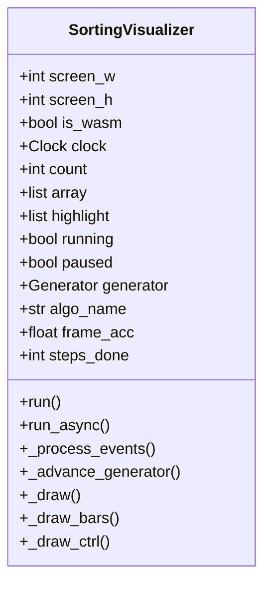
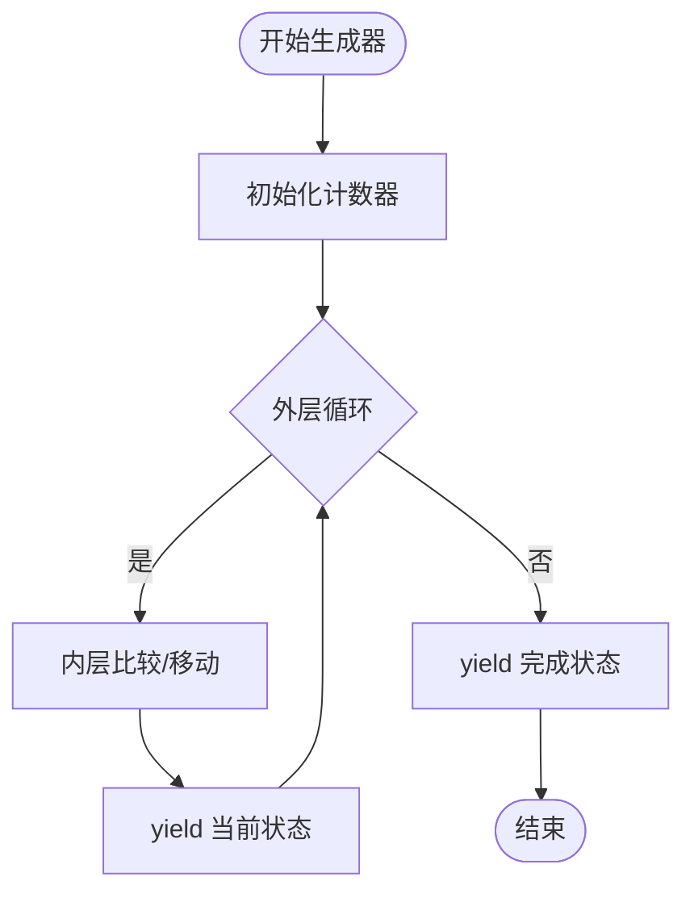
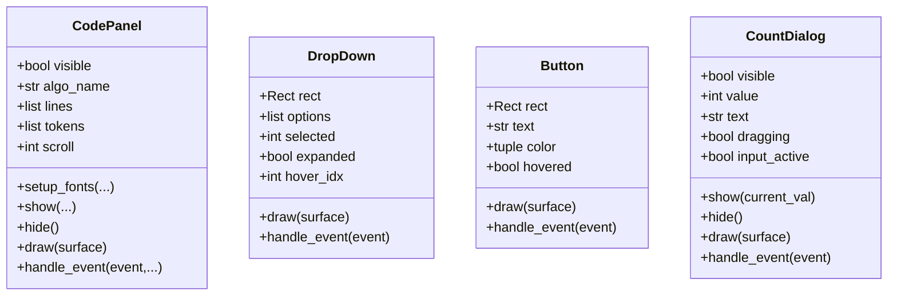
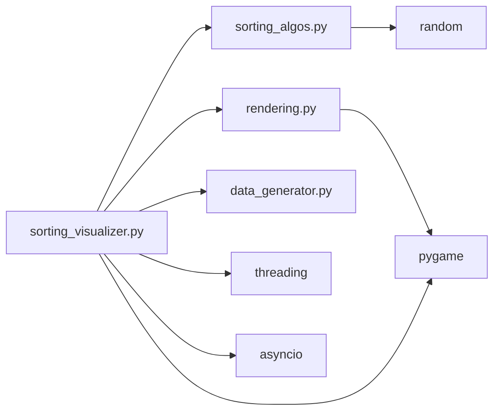

# 调试与性能优化

<cite>
**本文引用的文件**
- [data_generator.py](file://data_generator.py)
- [rendering.py](file://rendering.py)
- [sorting_algos.py](file://sorting_algos.py)
- [sorting_visualizer.py](file://sorting_visualizer.py)
</cite>

## 目录
1. [简介](#简介)
2. [项目结构](#项目结构)
3. [核心组件](#核心组件)
4. [架构总览](#架构总览)
5. [详细组件分析](#详细组件分析)
6. [依赖关系分析](#依赖关系分析)
7. [性能考虑](#性能考虑)
8. [故障排查指南](#故障排查指南)
9. [结论](#结论)
10. [附录](#附录)

## 简介
本指南围绕排序算法可视化系统的调试与性能优化展开，结合项目中的生成器驱动的动画框架、Pygame渲染管线、UI交互与算法实现，提供：
- 算法可视化调试技巧（状态断点、变量监控、执行流追踪）
- 性能瓶颈识别（复杂度分析、内存使用优化）
- Pygame相关优化策略（渲染、事件、资源管理）
- 内存泄漏检测与修复
- 多线程与异步最佳实践
- 日志与错误处理机制
- 性能测试与基准方法
- 不同平台差异与优化策略

## 项目结构
该项目采用模块化设计，按职责拆分为四个主要模块：
- 数据生成：负责随机数组生成与初始状态字典创建
- 排序算法：提供19种排序算法的生成器实现，支持计数统计
- 渲染与UI：封装颜色常量、绘制工具、UI组件（下拉菜单、按钮、对话框、代码面板）
- 可视化器：主程序，整合算法、渲染与UI，驱动Pygame主循环

图表来源
- [sorting_visualizer.py:62-113](file://sorting_visualizer.py#L62-L113)
- [rendering.py:13-32](file://rendering.py#L13-L32)
- [data_generator.py:11-47](file://data_generator.py#L11-L47)
- [sorting_algos.py:13-24](file://sorting_algos.py#L13-L24)

章节来源
- [sorting_visualizer.py:17-48](file://sorting_visualizer.py#L17-L48)
- [rendering.py:13-32](file://rendering.py#L13-L32)
- [data_generator.py:11-47](file://data_generator.py#L11-L47)
- [sorting_algos.py:13-24](file://sorting_algos.py#L13-L24)

## 核心组件
- SortingVisualizer：主控制器，管理窗口、状态、事件、渲染与生成器推进
- 排序算法生成器：每个算法以生成器形式逐步产出状态元组，便于可视化与计数
- 渲染与UI组件：CodePanel、DropDown、Button、CountDialog等
- 数据生成器：随机数组生成与初始状态字典

章节来源
- [sorting_visualizer.py:62-113](file://sorting_visualizer.py#L62-L113)
- [sorting_algos.py:35-300](file://sorting_algos.py#L35-L300)
- [rendering.py:110-279](file://rendering.py#L110-279)
- [data_generator.py:11-47](file://data_generator.py#L11-L47)

## 架构总览
系统采用“生成器驱动”的可视化架构：算法以生成器逐步产出状态，主循环按帧推进生成器并渲染。UI组件响应事件，改变状态并触发重绘。

图表来源
- [sorting_visualizer.py:269-287](file://sorting_visualizer.py#L269-L287)
- [sorting_visualizer.py:386-461](file://sorting_visualizer.py#L386-L461)
- [rendering.py:289-383](file://rendering.py#L289-L383)

## 详细组件分析

### SortingVisualizer 主控制器
- 窗口与帧率管理：初始化Pygame、设置窗口尺寸、时钟与帧率
- 状态管理：数组、高亮索引、比较/交换计数、运行/暂停标志、生成器实例
- 事件处理：统一处理退出、窗口调整、UI交互、算法切换、速度调节、全屏切换
- 生成器推进：按速度倍率推进若干步，捕获StopIteration并标记完成
- 渲染：绘制条形图、控制栏、弹窗与代码面板

图表来源
- [sorting_visualizer.py:62-113](file://sorting_visualizer.py#L62-L113)
- [sorting_visualizer.py:269-287](file://sorting_visualizer.py#L269-L287)
- [sorting_visualizer.py:386-461](file://sorting_visualizer.py#L386-L461)

章节来源
- [sorting_visualizer.py:62-113](file://sorting_visualizer.py#L62-L113)
- [sorting_visualizer.py:269-287](file://sorting_visualizer.py#L269-L287)
- [sorting_visualizer.py:386-461](file://sorting_visualizer.py#L386-L461)

### 排序算法生成器
- 19种算法均以生成器实现，逐步yield当前数组、高亮索引、交换次数、比较次数
- 支持基础与趣味两类算法集合
- 提供源码提取工具，用于右侧代码面板展示

图表来源
- [sorting_algos.py:35-48](file://sorting_algos.py#L35-L48)
- [sorting_algos.py:89-121](file://sorting_algos.py#L89-L121)
- [sorting_algos.py:123-152](file://sorting_algos.py#L123-L152)

章节来源
- [sorting_algos.py:13-24](file://sorting_algos.py#L13-L24)
- [sorting_algos.py:35-300](file://sorting_algos.py#L35-L300)
- [sorting_algos.py:556-600](file://sorting_algos.py#L556-L600)

### 渲染与UI组件
- 颜色常量与工具函数：clamp、draw_text
- 代码面板：语法高亮、滚动条、关闭按钮、字体适配
- 下拉菜单：选项选择、悬停高亮
- 按钮：悬停态、点击反馈
- 数量设置对话框：滑块拖动与文本输入双模式

图表来源
- [rendering.py:110-279](file://rendering.py#L110-279)
- [rendering.py:284-349](file://rendering.py#L284-349)
- [rendering.py:354-379](file://rendering.py#L354-379)
- [rendering.py:384-564](file://rendering.py#L384-564)

章节来源
- [rendering.py:13-32](file://rendering.py#L13-L32)
- [rendering.py:110-279](file://rendering.py#L110-L279)
- [rendering.py:284-349](file://rendering.py#L284-349)
- [rendering.py:354-379](file://rendering.py#L354-379)
- [rendering.py:384-564](file://rendering.py#L384-L564)

### 数据生成模块
- 随机数组生成：指定长度与范围
- 初始状态字典：包含数组、高亮、完成标志、计数器、生成器、运行/暂停标志

章节来源
- [data_generator.py:11-23](file://data_generator.py#L11-L23)
- [data_generator.py:26-47](file://data_generator.py#L26-L47)

## 依赖关系分析
- SortingVisualizer 依赖 sorting_algos（算法映射）、rendering（颜色/工具/UI）、data_generator（数据）
- sorting_algos 依赖 random；rendering 依赖 pygame；sorting_visualizer 依赖 pygame、threading、asyncio

图表来源
- [sorting_visualizer.py:34-47](file://sorting_visualizer.py#L34-L47)
- [sorting_algos.py:9](file://sorting_algos.py#L9)
- [rendering.py:8](file://rendering.py#L8)
- [sorting_visualizer.py:20-22](file://sorting_visualizer.py#L20-L22)

章节来源
- [sorting_visualizer.py:34-47](file://sorting_visualizer.py#L34-L47)
- [sorting_algos.py:9](file://sorting_algos.py#L9)
- [rendering.py:8](file://rendering.py#L8)
- [sorting_visualizer.py:20-22](file://sorting_visualizer.py#L20-L22)

## 性能考虑

### 算法复杂度与可视化开销
- 生成器推进：每帧按速度倍率推进若干步，避免一次性完整执行造成卡顿
- 条形图绘制：按数组长度遍历，复杂度O(n)，注意bar宽度与最大值计算
- UI组件：下拉菜单、按钮、对话框的碰撞检测与绘制，复杂度与选项数量/可见项有关
- 源码面板：逐行tokenize与渲染，复杂度与行数相关

优化建议
- 降低每帧推进步数：通过速度级别动态调整
- 减少不必要的重绘：仅在状态变化时更新
- 合理设置窗口尺寸与字体，避免过大绘制区域
- 滚动条与子表面：减少无效blit，仅对可见区域进行绘制

章节来源
- [sorting_visualizer.py:269-287](file://sorting_visualizer.py#L269-L287)
- [sorting_visualizer.py:289-312](file://sorting_visualizer.py#L289-L312)
- [rendering.py:167-240](file://rendering.py#L167-L240)
- [rendering.py:59-104](file://rendering.py#L59-L104)

### Pygame渲染优化
- 使用subsurface进行局部绘制，减少整体blit
- 控制栏与可视化区域分离绘制，避免重复填充
- 字体加载失败回退到系统字体，保证可用性
- 全屏切换与窗口调整时重建UI布局，确保组件位置正确

章节来源
- [rendering.py:203-214](file://rendering.py#L203-L214)
- [rendering.py:313-356](file://rendering.py#L313-L356)
- [sorting_visualizer.py:362-382](file://sorting_visualizer.py#L362-L382)
- [sorting_visualizer.py:245-261](file://sorting_visualizer.py#L245-L261)

### 事件处理优化
- 事件循环中优先级判断：先处理代码面板与对话框事件，再处理其他UI
- 弹窗开启当帧防误触：通过标志位跳过开启帧事件
- 速度调节与算法切换即时生效，但避免频繁重置生成器

章节来源
- [sorting_visualizer.py:386-461](file://sorting_visualizer.py#L386-L461)
- [rendering.py:241-278](file://rendering.py#L241-L278)
- [rendering.py:491-564](file://rendering.py#L491-L564)

### 资源管理与内存使用
- 字体加载：优先捆绑字体，其次系统字体，失败则回退到默认字体
- 代码面板字体：首次绘制时尝试多种字体路径，失败回退
- 生成器生命周期：停止后清空引用，避免残留状态影响后续运行

章节来源
- [sorting_visualizer.py:115-144](file://sorting_visualizer.py#L115-L144)
- [sorting_visualizer.py:362-382](file://sorting_visualizer.py#L362-L382)
- [sorting_visualizer.py:282-286](file://sorting_visualizer.py#L282-L286)

### 多线程与异步最佳实践
- 桌面模式：主线程运行同步主循环
- 浏览器WASM模式：使用异步主循环，tick后await让出CPU
- 源码页面：在独立线程启动，避免阻塞主窗口
- 平台检测：根据系统类型决定功能启用

章节来源
- [sorting_visualizer.py:464-479](file://sorting_visualizer.py#L464-L479)
- [sorting_visualizer.py:235-244](file://sorting_visualizer.py#L235-L244)
- [sorting_visualizer.py:23-29](file://sorting_visualizer.py#L23-L29)

### 平台差异与优化策略
- 桌面：支持全屏、可调整窗口大小、多线程启动源码页面
- 浏览器：禁用全屏与多线程，使用异步主循环，字体路径差异
- 字体路径：Windows系统常见字体路径，WASM环境回退到默认字体

章节来源
- [sorting_visualizer.py:70-85](file://sorting_visualizer.py#L70-L85)
- [sorting_visualizer.py:23-29](file://sorting_visualizer.py#L23-L29)
- [sorting_visualizer.py:115-144](file://sorting_visualizer.py#L115-L144)

## 故障排查指南

### 调试技巧与断点设置
- 状态断点：在生成器yield处设置断点，观察array、highlight、swap_count、cmp_count的变化
- 变量监控：关注Running/Paused/Sorted_done标志，以及速度级别与帧累计
- 执行流追踪：在事件处理链路中设置断点，确认UI交互是否正确传递到状态更新

章节来源
- [sorting_visualizer.py:269-287](file://sorting_visualizer.py#L269-L287)
- [sorting_visualizer.py:386-461](file://sorting_visualizer.py#L386-L461)

### 性能瓶颈定位
- 生成器推进：若速度过快导致卡顿，降低速度级别或减少每帧推进步数
- 绘制热点：条形图绘制与UI组件绘制，检查是否有过度重绘
- 字体加载：字体路径失败时回退到默认字体，避免异常导致卡死

章节来源
- [sorting_visualizer.py:269-287](file://sorting_visualizer.py#L269-L287)
- [sorting_visualizer.py:289-312](file://sorting_visualizer.py#L289-L312)
- [sorting_visualizer.py:115-144](file://sorting_visualizer.py#L115-L144)

### 内存泄漏检测与修复
- 生成器引用：StopIteration后确保generator引用被清空
- UI组件：隐藏面板与对话框时清理状态，避免残留引用
- 字体与资源：避免重复加载相同字体，必要时复用已加载对象

章节来源
- [sorting_visualizer.py:282-286](file://sorting_visualizer.py#L282-L286)
- [rendering.py:133-140](file://rendering.py#L133-L140)

### 错误处理机制
- 字体加载异常：捕获异常并回退到系统字体或默认字体
- 代码面板子表面异常：使用try/except保护subsurface操作
- 事件处理异常：忽略不可识别事件，保证主循环稳定

章节来源
- [sorting_visualizer.py:115-144](file://sorting_visualizer.py#L115-L144)
- [rendering.py:203-214](file://rendering.py#L203-L214)
- [rendering.py:491-564](file://rendering.py#L491-L564)

### 性能测试与基准方法
- 帧率测量：使用Clock.tick(FPS)与frame_acc统计实际帧耗时
- 算法计数：利用生成器提供的cmp_count/swap_count评估算法效率
- 数据量对比：在不同count下测量帧耗时，绘制性能曲线
- 平台对比：桌面与WASM分别测试，记录差异

章节来源
- [sorting_visualizer.py:88](file://sorting_visualizer.py#L88)
- [sorting_visualizer.py:108-109](file://sorting_visualizer.py#L108-L109)
- [sorting_visualizer.py:322-330](file://sorting_visualizer.py#L322-L330)

## 结论
本项目通过生成器驱动的可视化架构，实现了清晰的状态管理与高效的渲染流程。针对调试与性能优化的关键在于：
- 在生成器yield点设置断点，配合变量监控与执行流追踪
- 通过速度级别与帧推进步数控制渲染压力
- 优化Pygame绘制与事件处理，合理管理资源与字体
- 在多线程与异步场景下遵循平台特性，避免阻塞与异常
- 建立性能测试与基准方法，持续评估与改进

## 附录

### 快速参考清单
- 调试：在生成器yield与事件处理关键节点设置断点
- 性能：降低速度级别、减少重绘、优化字体加载
- 渲染：使用subsurface、分离绘制区域、避免过度blit
- 事件：优先处理弹窗与面板事件、防误触
- 资源：复用字体、及时释放生成器引用
- 平台：桌面启用全屏与多线程，WASM使用异步主循环