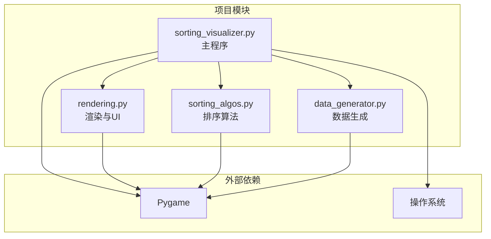
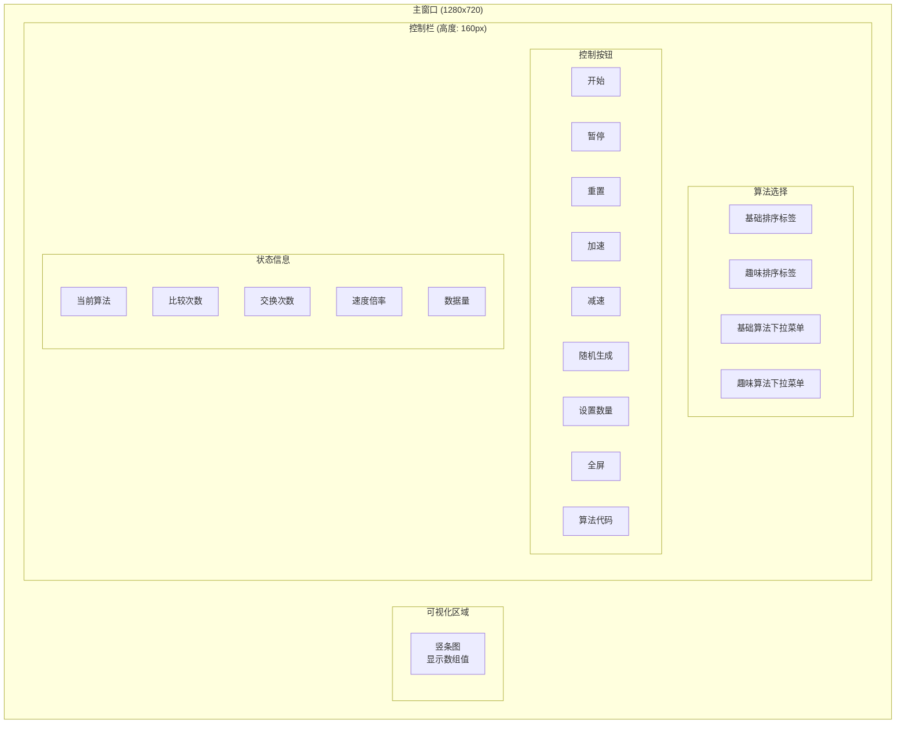
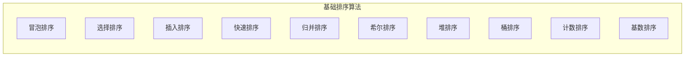
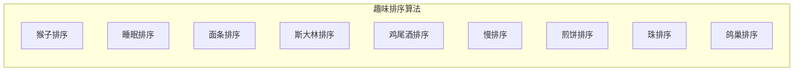

# 快速开始

<cite>
**本文档引用的文件**
- [sorting_visualizer.py](file://sorting_visualizer.py)
- [sorting_algos.py](file://sorting_algos.py)
- [rendering.py](file://rendering.py)
- [data_generator.py](file://data_generator.py)
</cite>

## 目录
1. [简介](#简介)
2. [项目结构](#项目结构)
3. [环境准备](#环境准备)
4. [安装步骤](#安装步骤)
5. [首次运行](#首次运行)
6. [基本操作界面](#基本操作界面)
7. [常用功能演示](#常用功能演示)
8. [算法类型概览](#算法类型概览)
9. [常见问题排查](#常见问题排查)
10. [操作系统特定指南](#操作系统特定指南)
11. [故障排除指南](#故障排除指南)
12. [结论](#结论)

## 简介

这是一个基于Python和Pygame开发的排序算法可视化工具。该项目通过图形化界面直观地展示各种排序算法的工作原理，帮助用户深入理解不同排序算法的时间复杂度、空间复杂度和执行过程。

该工具提供了19种不同的排序算法，包括经典的10种基础排序算法和9种趣味排序算法，能够实时显示算法执行过程中的数组变化、比较次数和交换次数等关键指标。

## 项目结构

项目采用模块化设计，将功能分解为四个主要模块：



**图表来源**
- [sorting_visualizer.py:1-480](file://sorting_visualizer.py#L1-L480)
- [sorting_algos.py:1-600](file://sorting_algos.py#L1-L600)
- [rendering.py:1-552](file://rendering.py#L1-L552)
- [data_generator.py:1-48](file://data_generator.py#L1-L48)

**章节来源**
- [sorting_visualizer.py:1-480](file://sorting_visualizer.py#L1-L480)
- [sorting_algos.py:1-600](file://sorting_algos.py#L1-L600)
- [rendering.py:1-552](file://rendering.py#L1-L552)
- [data_generator.py:1-48](file://data_generator.py#L1-L48)

## 环境准备

### Python环境要求

- **Python版本**: Python 3.x (推荐3.7及以上版本)
- **操作系统**: Windows、macOS、Linux均可运行
- **内存要求**: 至少4GB RAM (建议8GB以上)
- **显卡要求**: 集成显卡即可，无需专用GPU

### Pygame库安装

Pygame是该项目的核心依赖库，用于图形界面渲染和用户交互。

**安装命令**:
```bash
pip install pygame
```

**验证安装**:
```bash
python -c "import pygame; print('Pygame版本:', pygame.version.ver)"
```

### 字体文件准备

项目内置了中文字体支持，但为了最佳显示效果，建议准备以下字体文件：

**必需字体文件**:
- `msyh.ttc` - 微软雅黑字体
- `simhei.ttf` - 黑体字体

**字体文件位置**:
- Windows系统: `C:/Windows/Fonts/`
- macOS系统: `/System/Library/Fonts/`
- Linux系统: `/usr/share/fonts/`

**字体文件路径**:
项目会自动搜索以下路径：
- 当前目录: `./msyh.ttc`, `./simhei.ttf`
- 系统字体目录: `C:/Windows/Fonts/`
- 备用字体: `C:/Windows/Fonts/msyhbd.ttc`, `C:/Windows/Fonts/simsun.ttc`

## 安装步骤

### Windows系统安装

1. **安装Python**
   - 访问python.org下载Python 3.x安装包
   - 安装时勾选"Add to PATH"选项
   - 验证安装: `python --version`

2. **安装Pygame**
   ```cmd
   pip install pygame
   ```

3. **准备字体文件**
   - 将`msyh.ttc`和`simhei.ttf`复制到项目根目录
   - 或确保系统已安装相应字体

4. **验证安装**
   ```cmd
   python sorting_visualizer.py
   ```

### macOS系统安装

1. **安装Python**
   ```bash
   brew install python
   ```

2. **安装Pygame**
   ```bash
   pip install pygame
   ```

3. **准备字体文件**
   ```bash
   sudo cp /System/Library/Fonts/Supplemental/Microsoft\ YaHei.ttc ./msyh.ttc
   sudo cp /System/Library/Fonts/Supplemental/SimHei.ttf ./simhei.ttf
   ```

4. **验证安装**
   ```bash
   python3 sorting_visualizer.py
   ```

### Linux系统安装

1. **安装Python和依赖**
   ```bash
   # Ubuntu/Debian
   sudo apt update
   sudo apt install python3 python3-pip
   
   # CentOS/RHEL/Fedora
   sudo yum install python3 python3-pip
   ```

2. **安装Pygame**
   ```bash
   pip3 install pygame
   ```

3. **安装字体支持**
   ```bash
   # Ubuntu/Debian
   sudo apt install fonts-noto-cjk
   
   # CentOS/RHEL/Fedora
   sudo yum install google-noto-fonts
   ```

4. **验证安装**
   ```bash
   python3 sorting_visualizer.py
   ```

## 首次运行

### 启动应用程序

1. **打开终端/命令提示符**
   - Windows: 打开命令提示符(cmd)或PowerShell
   - macOS/Linux: 打开终端

2. **导航到项目目录**
   ```bash
   cd 
   ```

3. **启动可视化工具**
   ```bash
   python sorting_visualizer.py
   ```

### 首次运行界面

启动后会出现一个1280x720像素的窗口，包含以下主要区域：

1. **可视化区域** (上方): 显示数组的竖条图
2. **控制栏** (下方): 包含各种控制按钮和状态信息
3. **算法选择** (顶部): 基础排序和趣味排序两个标签页

### 基本操作

- **开始/暂停**: 控制排序过程的开始和暂停
- **重置**: 重新生成随机数组
- **加速/减速**: 调整动画播放速度
- **随机生成**: 生成新的随机数组
- **设置数量**: 调整数组大小
- **全屏**: 切换全屏模式
- **算法代码**: 查看当前算法的源代码

## 基本操作界面

### 界面布局详解



**图表来源**
- [sorting_visualizer.py:52-86](file://sorting_visualizer.py#L52-L86)
- [sorting_visualizer.py:146-177](file://sorting_visualizer.py#L146-L177)

### 颜色编码说明

- **蓝色竖条**: 正常状态的数组元素
- **黄色高亮**: 当前正在比较或交换的元素
- **绿色完成**: 排序完成后显示完成状态

### 控制按钮功能

| 按钮 | 功能 | 默认状态 |
|------|------|----------|
| 开始 | 开始/继续排序过程 | 可用 |
| 暂停 | 暂停/恢复排序过程 | 可用 |
| 重置 | 重新生成随机数组 | 可用 |
| 加速 | 提高速度倍率 (+1) | 可用 |
| 减速 | 降低速度倍率 (-1) | 可用 |
| 随机生成 | 生成新的随机数组 | 可用 |
| 设置数量 | 弹出对话框设置数组大小 | 可用 |
| 全屏 | 切换全屏显示 | 可用 |
| 算法代码 | 显示当前算法源代码 | 可用 |

**章节来源**
- [sorting_visualizer.py:306-376](file://sorting_visualizer.py#L306-L376)
- [rendering.py:354-378](file://rendering.py#L354-L378)

## 常用功能演示

### 基础排序算法演示

1. **冒泡排序**
   - 时间复杂度: O(n²)
   - 特点: 相邻元素两两比较
   - 适合: 教学演示

2. **选择排序**
   - 时间复杂度: O(n²)
   - 特点: 每次选择最小元素
   - 交换次数最少

3. **插入排序**
   - 时间复杂度: O(n²)
   - 特点: 类似整理扑克牌
   - 对部分有序数组效率较高

4. **快速排序**
   - 时间复杂度: 平均O(n log n)
   - 特点: 分治算法，基准元素分割
   - 实际应用中最常用的排序算法

5. **归并排序**
   - 时间复杂度: O(n log n)
   - 特点: 稳定排序，分治思想
   - 性能稳定，适合大数据集

### 趣味排序算法演示

1. **猴子排序**
   - 特点: 随机打乱直到有序
   - 效率极低，仅用于娱乐

2. **睡眠排序**
   - 特点: 模拟"睡眠"时间排序
   - 基于值的大小分配等待时间

3. **面条排序**
   - 特点: 视觉模拟，直接插入展示
   - 形象地展示插入排序过程

4. **斯大林排序**
   - 特点: 删除不符合条件的元素
   - 展示算法的不同设计理念

### 演示流程

1. **选择算法**: 在下拉菜单中选择目标算法
2. **调整参数**: 设置数组大小和播放速度
3. **开始演示**: 点击"开始"按钮观察排序过程
4. **暂停观察**: 点击"暂停"按钮详细查看当前状态
5. **重置对比**: 点击"重置"生成新数组进行对比

**章节来源**
- [sorting_algos.py:13-24](file://sorting_algos.py#L13-L24)
- [sorting_algos.py:507-550](file://sorting_algos.py#L507-L550)

## 算法类型概览

### 基础排序算法 (10种)



**特点**:
- 时间复杂度范围: O(n) 到 O(n²)
- 空间复杂度: O(1) 到 O(n)
- 稳定性: 部分算法稳定，部分不稳定

### 趣味排序算法 (9种)



**特点**:
- 主要用于教学和娱乐
- 大多数效率较低
- 展示不同的算法思维

**章节来源**
- [sorting_algos.py:12-24](file://sorting_algos.py#L12-L24)

## 常见问题排查

### Pygame安装问题

**问题**: `ModuleNotFoundError: No module named 'pygame'`
**解决方法**:
```bash
pip install --upgrade pip
pip install pygame
```

**问题**: `ImportError: DLL load failed`
**解决方法**:
- 确保Python版本与Pygame兼容
- 重新安装Python和Pygame
- 检查系统架构(32位vs64位)

### 字体显示问题

**问题**: 中文字符显示为方块
**解决方法**:
1. 确认字体文件存在
2. 检查字体文件路径
3. 手动指定字体路径

**问题**: 字体显示模糊
**解决方法**:
- 使用更高分辨率的显示器
- 调整窗口大小
- 检查系统DPI设置

### 性能问题

**问题**: 窗口响应缓慢
**解决方法**:
1. 降低数组大小
2. 减慢播放速度
3. 关闭不必要的后台程序
4. 升级硬件配置

**问题**: 内存占用过高
**解决方法**:
- 减少数组长度
- 重启应用程序
- 检查系统内存使用情况

### 界面显示问题

**问题**: 窗口无法全屏
**解决方法**:
- 检查显示器连接
- 更新显卡驱动
- 以管理员权限运行

**问题**: 按钮点击无响应
**解决方法**:
- 确保鼠标指针在按钮区域内
- 检查窗口焦点
- 重新启动应用程序

## 操作系统特定指南

### Windows系统优化

**字体配置**:
```python
# Windows字体路径
font_paths = [
    "./msyh.ttc",
    "./simhei.ttf",
    "C:/Windows/Fonts/msyh.ttc",
    "C:/Windows/Fonts/simhei.ttf"
]
```

**性能优化**:
- 关闭Windows特效
- 调整电源管理设置
- 关闭不必要的启动程序

**兼容性**:
- 支持Windows 7/8/10/11
- 兼容不同分辨率显示器
- 支持多显示器环境

### macOS系统优化

**字体配置**:
```python
# macOS字体路径
font_paths = [
    "/System/Library/Fonts/Supplemental/Microsoft YaHei.ttc",
    "/System/Library/Fonts/Supplemental/SimHei.ttf",
    "/System/Library/Fonts/Helvetica.ttc"
]
```

**性能优化**:
- 关闭SIP(如需要)
- 调整系统完整性保护
- 使用最新版本的Python

**兼容性**:
- 支持macOS Mojave及以上版本
- 兼容Intel和Apple Silicon芯片
- 支持Retina显示器

### Linux系统优化

**字体配置**:
```bash
# Ubuntu/Debian
sudo apt install fonts-noto-cjk fonts-liberation

# CentOS/RHEL/Fedora  
sudo yum install google-noto-fonts liberation-fonts
```

**依赖安装**:
```bash
# Ubuntu/Debian
sudo apt install python3-pygame python3-tk

# CentOS/RHEL/Fedora
sudo yum install pygame tkinter
```

**性能优化**:
- 配置X11或Wayland
- 调整图形驱动
- 优化系统资源分配

## 故障排除指南

### 启动失败诊断

**步骤1: 基础检查**
```bash
# 检查Python版本
python --version

# 检查Pygame安装
python -c "import pygame; print(pygame.version.ver)"

# 检查文件完整性
ls -la sorting_visualizer.py
```

**步骤2: 权限检查**
```bash
# Windows
icacls sorting_visualizer.py /grant Everyone:F

# macOS/Linux
chmod +x sorting_visualizer.py
```

**步骤3: 环境变量检查**
```bash
# 检查Python路径
which python
echo $PYTHONPATH

# 检查Pygame路径
python -c "import pygame; print(pygame.__file__)"
```

### 运行时错误处理

**错误类型1: 内存不足**
```
MemoryError: Unable to allocate array with shape (n,) and data type int64
```
**解决方案**:
- 减少数组大小
- 关闭其他应用程序
- 增加虚拟内存

**错误类型2: 字体加载失败**
```
pygame.error: Unable to load font file
```
**解决方案**:
- 检查字体文件完整性
- 验证文件路径正确性
- 使用系统默认字体

**错误类型3: Pygame初始化失败**
```
pygame.error: video system not initialized
```
**解决方案**:
- 检查显示驱动
- 重启图形服务
- 以管理员权限运行

### 调试技巧

**启用调试输出**:
```python
import logging
logging.basicConfig(level=logging.DEBUG)
```

**性能监控**:
```python
import psutil
import time

def monitor_performance():
    process = psutil.Process()
    cpu_percent = process.cpu_percent()
    memory_usage = process.memory_info().rss / 1024 / 1024
    return cpu_percent, memory_usage
```

**日志记录**:
```python
import datetime

def log_event(message):
    timestamp = datetime.datetime.now().strftime("%Y-%m-%d %H:%M:%S")
    with open("debug.log", "a") as f:
        f.write(f"[{timestamp}] {message}\n")
```

## 结论

通过本快速开始指南，您应该能够成功安装和运行Python排序算法可视化工具。该项目提供了丰富的排序算法演示，是学习和理解算法原理的优秀工具。

### 学习建议

1. **从简单开始**: 先学习冒泡排序和插入排序
2. **对比分析**: 同时运行多个算法对比性能差异
3. **参数调整**: 改变数组大小和速度观察影响
4. **源码学习**: 查看算法实现理解算法细节
5. **扩展实践**: 尝试实现自己的排序算法

### 进一步学习

- 深入研究每种算法的时间复杂度和空间复杂度
- 探索算法优化技巧和变种
- 学习算法在实际应用中的选择策略
- 了解并查集、堆、平衡树等高级数据结构

### 技术支持

如果遇到技术问题，请参考以下资源：
- Pygame官方文档
- Python标准库文档
- GitHub Issues页面
- 社区论坛和技术问答网站

祝您学习愉快，算法之路越走越精彩！