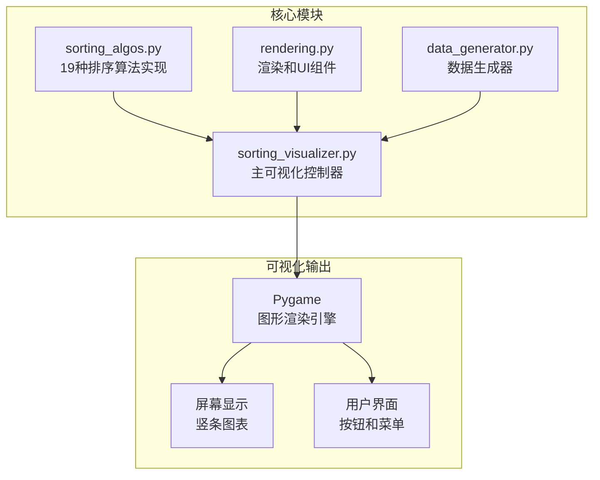
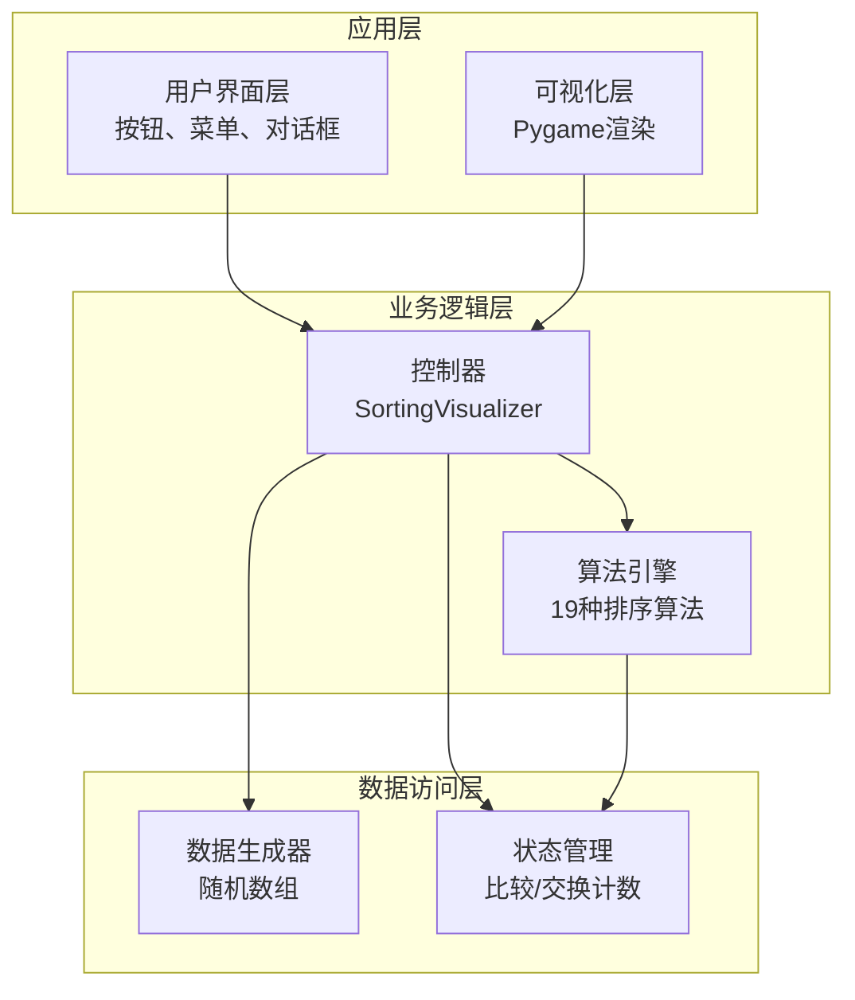
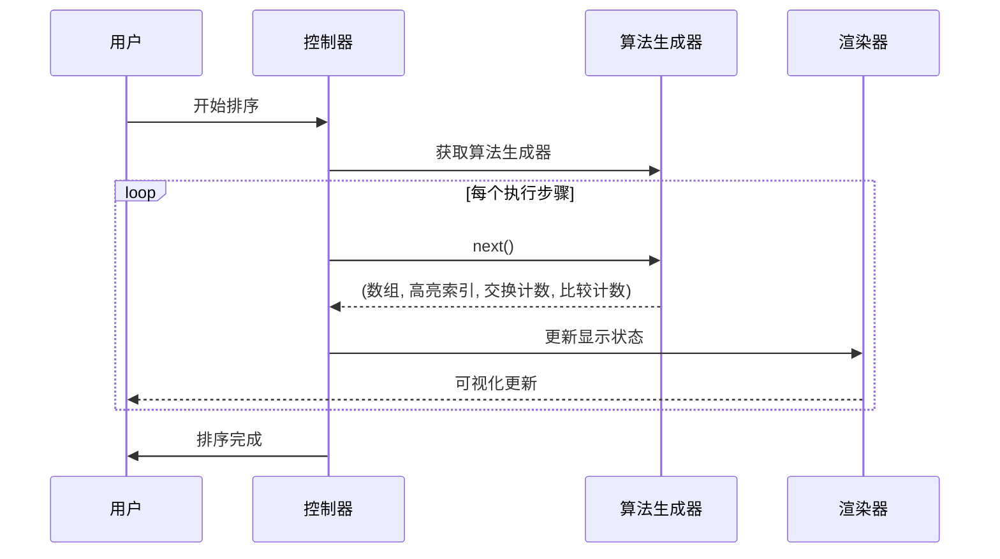
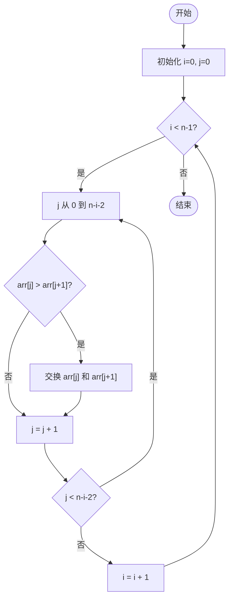
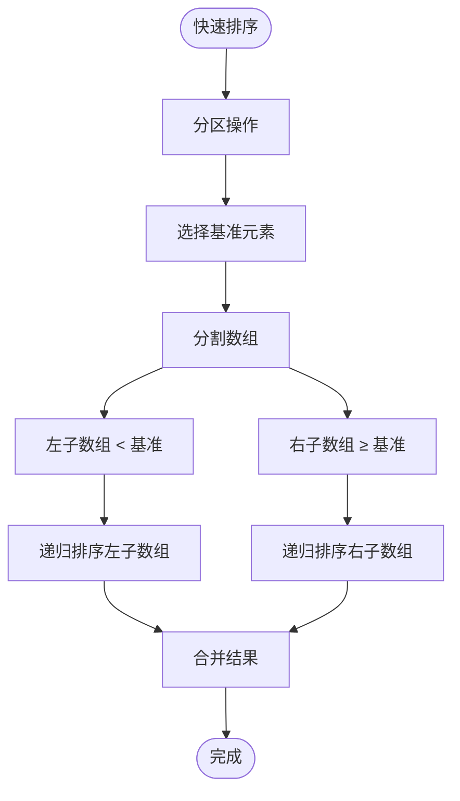
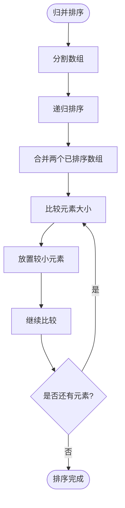
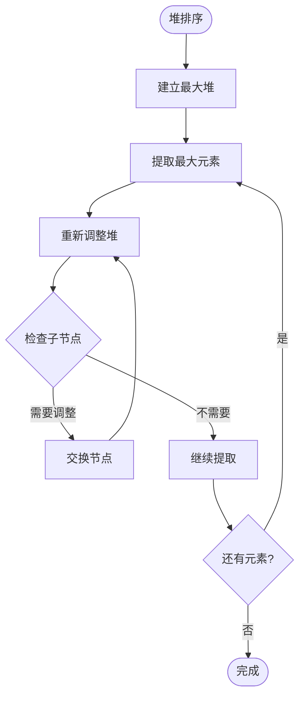
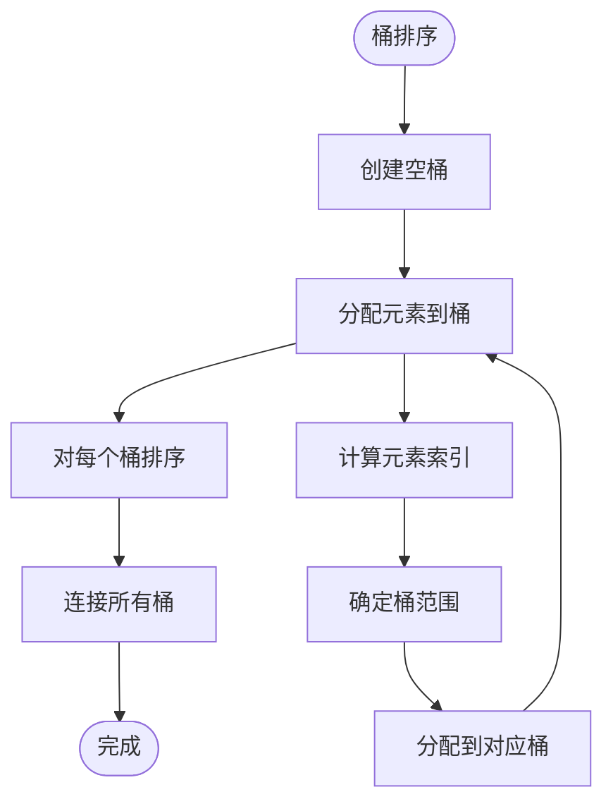
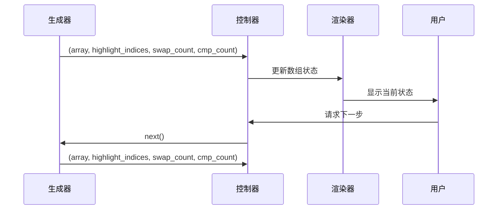

# 基础排序算法

<cite>
**本文档引用的文件**
- [sorting_algos.py](file://sorting_algos.py)
- [sorting_visualizer.py](file://sorting_visualizer.py)
- [rendering.py](file://rendering.py)
- [data_generator.py](file://data_generator.py)
</cite>

## 目录
1. [简介](#简介)
2. [项目结构](#项目结构)
3. [核心组件](#核心组件)
4. [架构概览](#架构概览)
5. [详细组件分析](#详细组件分析)
6. [算法复杂度分析](#算法复杂度分析)
7. [可视化状态机制](#可视化状态机制)
8. [算法适用场景](#算法适用场景)
9. [性能比较指南](#性能比较指南)
10. [故障排除指南](#故障排除指南)
11. [结论](#结论)

## 简介

这是一个基于Python和Pygame开发的排序算法可视化教学工具。该项目实现了10种经典基础排序算法和9种趣味排序算法，提供了直观的动画演示和交互式学习体验。通过生成器模式，每个算法都可以逐步展示其执行过程，包括比较操作、交换操作和状态高亮显示。

该工具特别适合算法教学、性能比较研究和可视化学习，帮助用户深入理解各种排序算法的工作原理和性能特征。

## 项目结构

项目采用模块化设计，分为四个主要模块：

**图表来源**
- [sorting_algos.py:1-600](file://sorting_algos.py#L1-L600)
- [sorting_visualizer.py:1-490](file://sorting_visualizer.py#L1-L490)
- [rendering.py:1-564](file://rendering.py#L1-L564)
- [data_generator.py:1-48](file://data_generator.py#L1-L48)

**章节来源**
- [sorting_algos.py:1-600](file://sorting_algos.py#L1-L600)
- [sorting_visualizer.py:1-490](file://sorting_visualizer.py#L1-L490)
- [rendering.py:1-564](file://rendering.py#L1-L564)
- [data_generator.py:1-48](file://data_generator.py#L1-L48)

## 核心组件

### 基础排序算法集合

项目实现了完整的10种基础排序算法，每种算法都采用生成器模式实现：

- **冒泡排序**：相邻元素两两比较，大的元素逐渐"冒泡"到末尾
- **选择排序**：每次选择最小元素放到已排序部分的末尾
- **插入排序**：将元素插入到已排序序列的正确位置
- **快速排序**：分治算法，选择基准元素进行分区
- **归并排序**：分治算法，将数组分成两半分别排序后合并
- **希尔排序**：插入排序的改进版本，使用间隔序列
- **堆排序**：基于二叉堆数据结构的排序算法
- **桶排序**：将元素分配到多个桶中分别排序
- **计数排序**：统计每个值出现次数的非比较排序
- **基数排序**：按位数进行多轮排序的非比较排序

### 趣味排序算法集合

除了基础算法外，还包含了9种具有教学意义的趣味算法：

- **猴子排序**：随机打乱直到数组有序
- **睡眠排序**：模拟值越小越早排到前面
- **面条排序**：直接插入排序的视觉模拟
- **斯大林排序**：删除不符合条件的元素
- **鸡尾酒排序**：双向冒泡排序
- **慢排序**：故意低效的递归排序
- **煎饼排序**：通过翻转操作排序
- **珠排序**：重力排序的模拟
- **鸽巢排序**：基于值范围的排序

**章节来源**
- [sorting_algos.py:12-24](file://sorting_algos.py#L12-L24)
- [sorting_algos.py:35-300](file://sorting_algos.py#L35-L300)

## 架构概览

系统采用分层架构设计，实现了清晰的关注点分离：

**图表来源**
- [sorting_visualizer.py:62-490](file://sorting_visualizer.py#L62-L490)
- [sorting_algos.py:35-600](file://sorting_algos.py#L35-L600)
- [data_generator.py:11-48](file://data_generator.py#L11-L48)

### 算法执行流程

每个排序算法都遵循统一的生成器模式：

**图表来源**
- [sorting_visualizer.py:269-287](file://sorting_visualizer.py#L269-L287)
- [sorting_algos.py:35-300](file://sorting_algos.py#L35-L300)

**章节来源**
- [sorting_visualizer.py:62-490](file://sorting_visualizer.py#L62-L490)
- [sorting_algos.py:35-600](file://sorting_algos.py#L35-L600)

## 详细组件分析

### 冒泡排序 (Bubble Sort)

冒泡排序是最简单的排序算法之一，通过重复遍历数组，比较相邻元素并交换位置来实现排序。

**图表来源**
- [sorting_algos.py:35-48](file://sorting_algos.py#L35-L48)

### 快速排序 (Quick Sort)

快速排序采用分治策略，选择一个基准元素将数组分割成两个子数组，然后递归地对子数组进行排序。

**图表来源**
- [sorting_algos.py:89-121](file://sorting_algos.py#L89-L121)

### 归并排序 (Merge Sort)

归并排序同样采用分治策略，但通过合并两个已排序的子数组来实现整体排序。

**图表来源**
- [sorting_algos.py:123-152](file://sorting_algos.py#L123-L152)

### 堆排序 (Heap Sort)

堆排序利用二叉堆的数据结构特性，通过建立最大堆和重复提取最大元素来实现排序。

**图表来源**
- [sorting_algos.py:179-221](file://sorting_algos.py#L179-L221)

### 桶排序 (Bucket Sort)

桶排序将数组元素分配到多个桶中，对每个桶内的元素进行排序，最后按顺序连接所有桶。

**图表来源**
- [sorting_algos.py:223-246](file://sorting_algos.py#L223-L246)

**章节来源**
- [sorting_algos.py:35-300](file://sorting_algos.py#L35-L300)

## 算法复杂度分析

### 时间复杂度对比

| 算法 | 最佳情况 | 平均情况 | 最坏情况 | 空间复杂度 |
|------|----------|----------|----------|------------|
| 冒泡排序 | O(n) | O(n²) | O(n²) | O(1) |
| 选择排序 | O(n²) | O(n²) | O(n²) | O(1) |
| 插入排序 | O(n) | O(n²) | O(n²) | O(1) |
| 快速排序 | O(n log n) | O(n log n) | O(n²) | O(log n) |
| 归并排序 | O(n log n) | O(n log n) | O(n log n) | O(n) |
| 希尔排序 | O(n log²n) | O(n log²n) | O(n²) | O(1) |
| 堆排序 | O(n log n) | O(n log n) | O(n log n) | O(1) |
| 桶排序 | O(n+k) | O(n+k) | O(n²) | O(n+k) |
| 计数排序 | O(n+k) | O(n+k) | O(n+k) | O(k) |
| 基数排序 | O(d(n+k)) | O(d(n+k)) | O(d(n+k)) | O(n+k) |

### 性能特征说明

- **稳定性**：冒泡排序、插入排序、归并排序、桶排序、计数排序、基数排序是稳定的；快速排序、选择排序、堆排序、希尔排序、斯大林排序是不稳定的
- **原地排序**：除归并排序、桶排序、计数排序、基数排序外都是原地排序
- **适用场景**：
  - 小规模数据：插入排序、冒泡排序
  - 大规模数据：快速排序、归并排序、堆排序
  - 特殊数据类型：桶排序、计数排序、基数排序适用于整数或有限范围数据
  - 近似有序：插入排序、冒泡排序表现较好

**章节来源**
- [sorting_algos.py:12-24](file://sorting_algos.py#L12-L24)

## 可视化状态机制

### 状态生成器模式

所有排序算法都采用生成器模式，通过逐步产生状态来实现可视化：

**图表来源**
- [sorting_visualizer.py:269-287](file://sorting_visualizer.py#L269-L287)
- [sorting_algos.py:35-300](file://sorting_algos.py#L35-L300)

### 高亮显示机制

可视化系统通过不同的颜色和状态来表示算法执行的不同阶段：

- **蓝色竖条**：正常状态的数组元素
- **黄色高亮**：当前正在比较或操作的元素
- **绿色完成**：排序完成后显示完成状态
- **动态计数**：实时显示比较次数和交换次数

### 交互控制机制

系统提供了丰富的交互功能：

- **速度控制**：支持10个速度级别（0.25x到128x）
- **算法切换**：可选择基础算法或趣味算法
- **数据量调节**：支持1到1000个元素的动态调整
- **暂停/继续**：可随时暂停和恢复算法执行
- **代码查看**：可查看当前算法的完整源码

**章节来源**
- [sorting_visualizer.py:269-383](file://sorting_visualizer.py#L269-L383)
- [rendering.py:110-279](file://rendering.py#L110-L279)

## 算法适用场景

### 教学场景

- **初学者友好**：冒泡排序、插入排序等简单直观
- **算法对比**：同时展示多种算法的执行过程
- **性能分析**：通过计数器分析不同算法的效率
- **可视化学习**：直观展示算法的工作原理

### 实际应用场景

- **小规模数据**：插入排序在小数组上表现优异
- **近似有序数据**：插入排序和冒泡排序适合处理接近有序的数据
- **特殊数据类型**：计数排序和基数排序适合处理整数数据
- **内存受限环境**：原地排序算法如快速排序、堆排序更合适

### 性能优化建议

- **混合算法**：在快速排序中对小数组使用插入排序
- **三数取中**：在快速排序中使用三数取中法选择基准
- **尾递归优化**：减少快速排序的栈空间使用
- **自适应算法**：根据数据特征选择最优算法

## 性能比较指南

### 基准测试方法

为了进行有效的算法性能比较，建议采用以下方法：

1. **相同数据集**：使用相同长度和相同范围的随机数据
2. **多次测量**：对每个算法运行多次取平均值
3. **控制变量**：确保硬件和软件环境一致
4. **统计指标**：记录执行时间、比较次数、交换次数

### 性能特征观察

通过可视化界面可以观察到：

- **执行时间**：不同算法的相对速度差异
- **比较频率**：算法的比较操作次数
- **交换频率**：算法的交换操作次数
- **内存使用**：算法的空间复杂度表现

### 学习要点

- **渐进分析**：理解算法的时间复杂度概念
- **实际性能**：认识到理论复杂度与实际性能的差异
- **算法选择**：根据具体应用场景选择合适的算法
- **优化技巧**：学习常见的算法优化方法

## 故障排除指南

### 常见问题及解决方案

**问题1：算法执行过慢**
- 检查速度设置是否过高
- 确认数据量是否过大
- 考虑使用更高效的算法

**问题2：内存不足**
- 减少数据量
- 选择原地排序算法
- 关闭不必要的可视化效果

**问题3：界面显示异常**
- 检查Pygame版本兼容性
- 确认字体文件存在
- 重启应用程序

**问题4：算法结果错误**
- 验证算法实现的正确性
- 检查边界条件处理
- 对比标准排序结果

### 调试技巧

- **逐步执行**：使用较低速度观察每一步操作
- **状态监控**：关注比较次数和交换次数的变化
- **数据验证**：定期检查数组的有序性
- **日志记录**：添加必要的调试信息

**章节来源**
- [sorting_visualizer.py:386-461](file://sorting_visualizer.py#L386-L461)

## 结论

这个排序算法可视化项目为算法学习和教学提供了强大的工具。通过19种不同类型的排序算法实现，用户可以：

1. **深入理解**各种排序算法的工作原理和执行过程
2. **直观比较**不同算法的性能特征和适用场景
3. **掌握优化**技巧和最佳实践
4. **培养直觉**对算法复杂度和性能的理解

项目的设计充分考虑了教学需求，提供了丰富的交互功能和可视化效果。无论是初学者还是有经验的开发者，都能从中获得有价值的学习体验。

通过持续的使用和探索，用户可以建立对排序算法的全面认识，为后续学习更复杂的算法和数据结构打下坚实的基础。