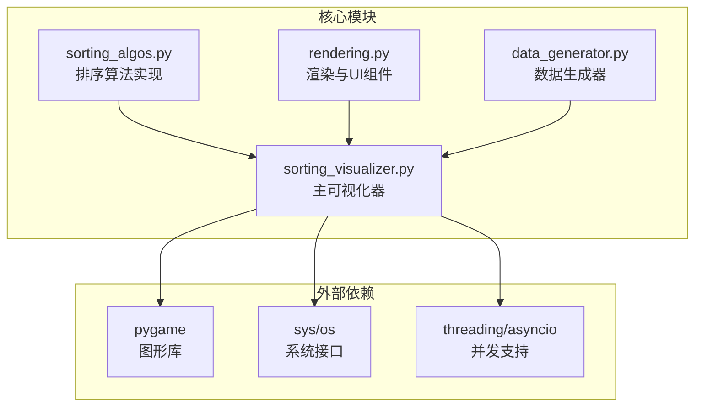
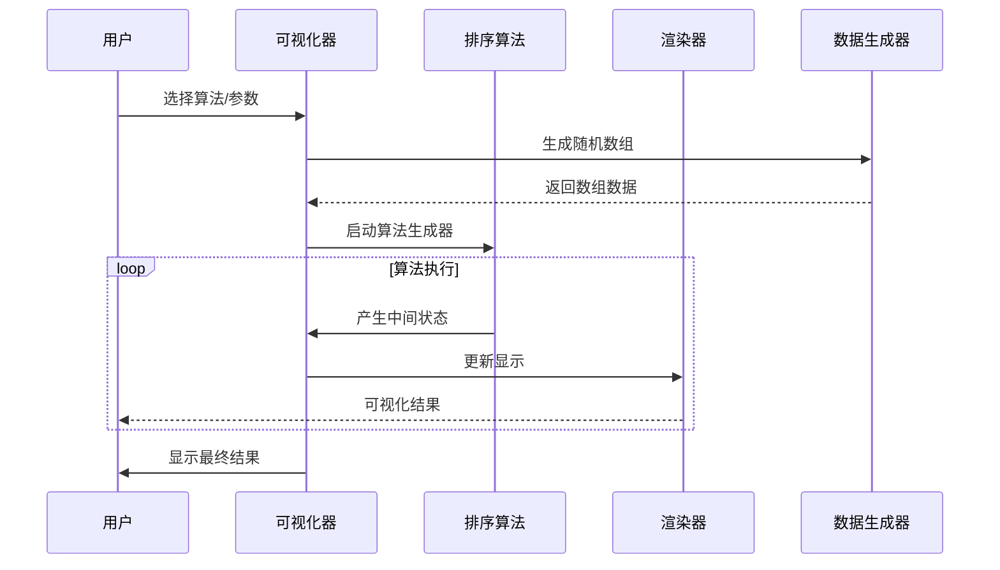
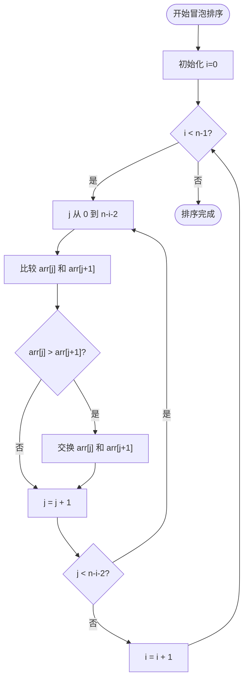
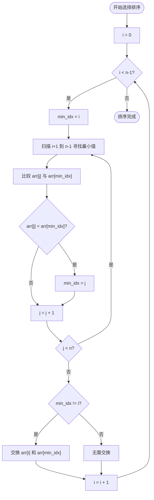
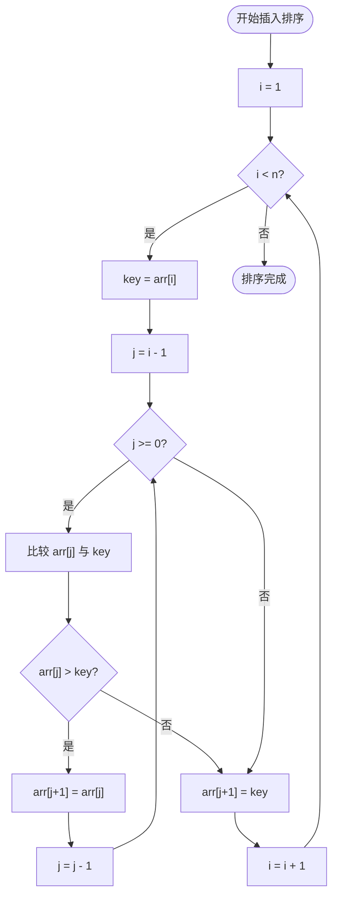
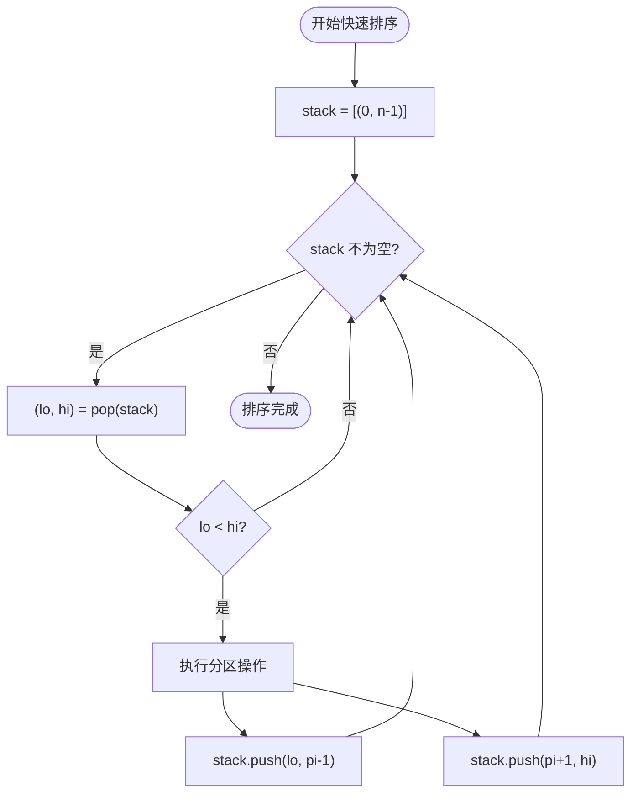
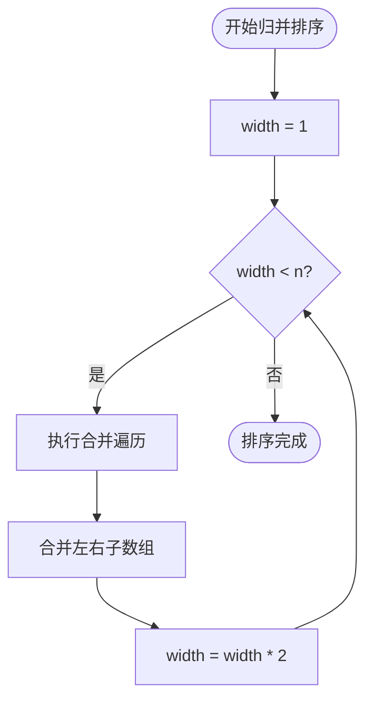
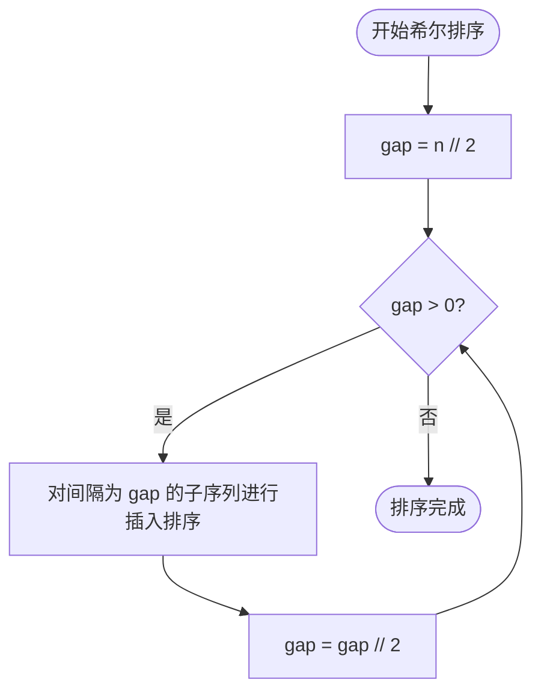
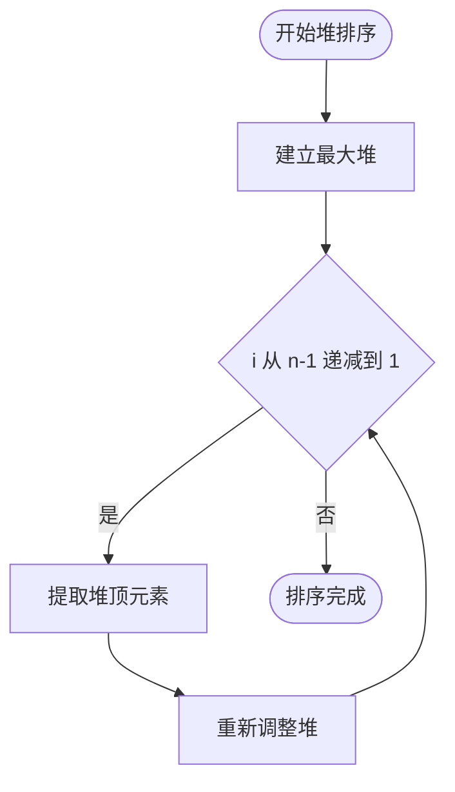
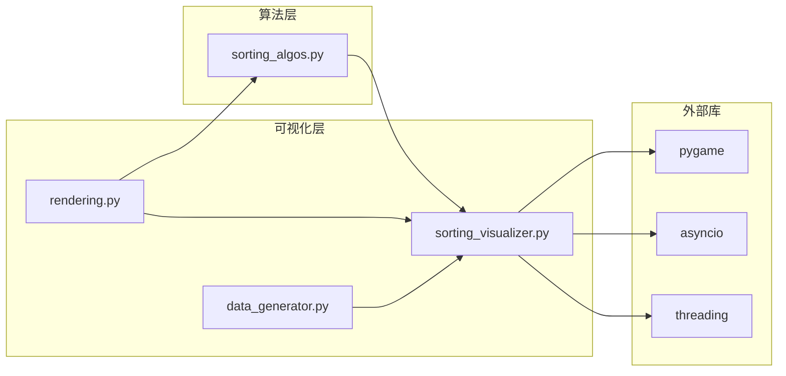

# 比较排序算法

<cite>
**本文引用的文件**
- [sorting_algos.py](file://sorting_algos.py)
- [sorting_visualizer.py](file://sorting_visualizer.py)
- [rendering.py](file://rendering.py)
- [data_generator.py](file://data_generator.py)
</cite>

## 目录
1. [简介](#简介)
2. [项目结构](#项目结构)
3. [核心组件](#核心组件)
4. [架构总览](#架构总览)
5. [详细组件分析](#详细组件分析)
6. [依赖关系分析](#依赖关系分析)
7. [性能考量](#性能考量)
8. [故障排除指南](#故障排除指南)
9. [结论](#结论)
10. [附录](#附录)

## 简介
本项目是一个基于Python的排序算法可视化系统，专注于比较排序算法的教学与演示。系统实现了7种经典的基于元素比较的排序算法：冒泡排序、选择排序、插入排序、快速排序、归并排序、希尔排序和堆排序。通过Pygame图形界面，用户可以直观地观察算法的执行过程，包括比较操作和交换操作的可视化呈现，同时统计比较次数和交换次数，帮助理解不同算法的时间复杂度和性能差异。

该项目采用生成器模式实现算法，每个算法都是一个生成器函数，逐步产生中间状态，使得动画播放更加流畅可控。系统还提供了丰富的交互功能，包括速度调节、算法切换、数据量设置等。

## 项目结构
项目采用模块化设计，主要包含以下四个核心模块：

**图表来源**
- [sorting_algos.py:1-600](file://sorting_algos.py#L1-L600)
- [sorting_visualizer.py:1-490](file://sorting_visualizer.py#L1-L490)
- [rendering.py:1-564](file://rendering.py#L1-L564)
- [data_generator.py:1-48](file://data_generator.py#L1-L48)

**章节来源**
- [sorting_algos.py:1-600](file://sorting_algos.py#L1-L600)
- [sorting_visualizer.py:1-490](file://sorting_visualizer.py#L1-L490)
- [rendering.py:1-564](file://rendering.py#L1-L564)
- [data_generator.py:1-48](file://data_generator.py#L1-L48)

## 核心组件
本项目的核心组件包括7种基础排序算法和相应的可视化支持组件：

### 基础排序算法集合
项目定义了两个算法类别：
- **基础排序算法**（7种）：冒泡排序、选择排序、插入排序、快速排序、归并排序、希尔排序、堆排序
- **趣味排序算法**（9种）：猴子排序、睡眠排序、面条排序、斯大林排序等

### 生成器模式实现
所有排序算法都采用生成器模式实现，返回元组格式的状态信息：
- `array`: 当前数组状态
- `highlight_indices`: 高亮显示的索引位置
- `swap_count`: 交换操作次数
- `cmp_count`: 比较操作次数

这种设计使得算法执行过程可以被精确控制和可视化展示。

**章节来源**
- [sorting_algos.py:12-24](file://sorting_algos.py#L12-L24)
- [sorting_algos.py:35-221](file://sorting_algos.py#L35-L221)

## 架构总览
系统的整体架构采用分层设计，清晰分离了算法逻辑、可视化渲染和用户交互三个层面：

**图表来源**
- [sorting_visualizer.py:198-286](file://sorting_visualizer.py#L198-L286)
- [sorting_algos.py:35-221](file://sorting_algos.py#L35-L221)

系统的关键特性包括：
- **模块化设计**：算法实现与可视化完全解耦
- **生成器驱动**：算法执行过程可中断、可恢复
- **实时统计**：自动跟踪比较和交换操作次数
- **交互友好**：提供多种控制选项和状态反馈

**章节来源**
- [sorting_visualizer.py:62-113](file://sorting_visualizer.py#L62-L113)
- [sorting_visualizer.py:269-287](file://sorting_visualizer.py#L269-L287)

## 详细组件分析

### 冒泡排序（Bubble Sort）
冒泡排序是最简单的比较排序算法，通过重复遍历数组，比较相邻元素并交换位置来实现排序。

**图表来源**
- [sorting_algos.py:35-48](file://sorting_algos.py#L35-L48)

**算法特点**：
- 时间复杂度：最坏O(n²)，最好O(n²)，平均O(n²)
- 空间复杂度：O(1)
- 稳定性：稳定
- 适用场景：教学演示、小规模数据

### 选择排序（Selection Sort）
选择排序每次从未排序部分选择最小元素，放到已排序部分的末尾。

**图表来源**
- [sorting_algos.py:50-66](file://sorting_algos.py#L50-L66)

**算法特点**：
- 时间复杂度：最坏O(n²)，最好O(n²)，平均O(n²)
- 空间复杂度：O(1)
- 稳定性：不稳定
- 适用场景：内存写入成本高的环境

### 插入排序（Insertion Sort）
插入排序将数组分为已排序和未排序两部分，逐个将未排序元素插入到已排序部分的正确位置。

**图表来源**
- [sorting_algos.py:68-86](file://sorting_algos.py#L68-L86)

**算法特点**：
- 时间复杂度：最坏O(n²)，最好O(n)，平均O(n²)
- 空间复杂度：O(1)
- 稳定性：稳定
- 适用场景：小规模数据、部分有序数据

### 快速排序（Quick Sort）
快速排序采用分治策略，选择基准元素将数组分割为两部分，然后递归排序。

**图表来源**
- [sorting_algos.py:89-121](file://sorting_algos.py#L89-L121)

**算法特点**：
- 时间复杂度：最坏O(n²)，平均O(n log n)
- 空间复杂度：O(log n)
- 稳定性：不稳定
- 适用场景：大规模数据、通用排序

### 归并排序（Merge Sort）
归并排序采用分治策略，将数组递归分割为子数组，然后合并已排序的子数组。

**图表来源**
- [sorting_algos.py:123-152](file://sorting_algos.py#L123-L152)

**算法特点**：
- 时间复杂度：最坏O(n log n)，最好O(n log n)，平均O(n log n)
- 空间复杂度：O(n)
- 稳定性：稳定
- 适用场景：需要稳定性的场合

### 希尔排序（Shell Sort）
希尔排序是插入排序的改进版本，通过使用间隔序列来减少数据移动次数。

**图表来源**
- [sorting_algos.py:155-176](file://sorting_algos.py#L155-L176)

**算法特点**：
- 时间复杂度：最坏O(n²)，平均O(n^(3/2))
- 空间复杂度：O(1)
- 稳定性：不稳定
- 适用场景：中等规模数据

### 堆排序（Heap Sort）
堆排序利用堆这种数据结构来进行排序，通过建立最大堆和重复提取最大元素实现排序。

**图表来源**
- [sorting_algos.py:179-221](file://sorting_algos.py#L179-L221)

**算法特点**：
- 时间复杂度：最坏O(n log n)，最好O(n log n)，平均O(n log n)
- 空间复杂度：O(1)
- 稳定性：不稳定
- 适用场景：内存受限的环境

## 依赖关系分析
系统采用松耦合的设计，各模块之间的依赖关系清晰明确：

**图表来源**
- [sorting_visualizer.py:34-47](file://sorting_visualizer.py#L34-L47)
- [rendering.py:10](file://rendering.py#L10)

**章节来源**
- [sorting_visualizer.py:34-47](file://sorting_visualizer.py#L34-L47)
- [rendering.py:10](file://rendering.py#L10)

## 性能考量
系统在性能方面采用了多项优化措施：

### 生成器模式的优势
- **内存效率**：算法执行过程中只保存当前状态
- **响应性**：用户可以随时暂停和继续算法执行
- **可视化流畅性**：通过帧累加机制控制动画速度

### 复杂度分析
基于算法实现的复杂度分析：

| 算法 | 最好时间 | 平均时间 | 最坏时间 | 空间复杂度 | 稳定性 |
|------|----------|----------|----------|------------|--------|
| 冒泡排序 | O(n) | O(n²) | O(n²) | O(1) | 稳定 |
| 选择排序 | O(n²) | O(n²) | O(n²) | O(1) | 不稳定 |
| 插入排序 | O(n) | O(n²) | O(n²) | O(1) | 稳定 |
| 快速排序 | O(n log n) | O(n log n) | O(n²) | O(log n) | 不稳定 |
| 归并排序 | O(n log n) | O(n log n) | O(n log n) | O(n) | 稳定 |
| 希尔排序 | O(n log n) | O(n^(3/2)) | O(n²) | O(1) | 不稳定 |
| 堆排序 | O(n log n) | O(n log n) | O(n log n) | O(1) | 不稳定 |

### 性能优化策略
1. **速度控制**：通过速度级别数组实现10档速度调节
2. **批量推进**：根据速度倍率批量推进生成器
3. **状态缓存**：算法源码采用缓存机制避免重复提取
4. **内存管理**：使用浅拷贝避免不必要的数据复制

**章节来源**
- [sorting_visualizer.py:56](file://sorting_visualizer.py#L56)
- [sorting_visualizer.py:269-287](file://sorting_visualizer.py#L269-L287)

## 故障排除指南
系统提供了完善的错误处理和调试支持：

### 常见问题及解决方案
1. **Pygame安装问题**
   - 症状：导入失败或显示异常
   - 解决方案：确保正确安装pygame库

2. **字体显示问题**
   - 症状：中文字符显示为方块
   - 解决方案：检查字体文件路径和可用性

3. **算法执行异常**
   - 症状：排序结果错误或无限循环
   - 解决方案：检查算法实现和边界条件

### 调试工具
- **源码面板**：实时查看算法实现代码
- **状态监控**：显示比较次数和交换次数
- **速度调节**：便于观察算法细节

**章节来源**
- [sorting_visualizer.py:115-144](file://sorting_visualizer.py#L115-L144)
- [rendering.py:110-140](file://rendering.py#L110-L140)

## 结论
本项目成功实现了7种经典比较排序算法的可视化演示，具有以下突出特点：

### 技术优势
- **完整的算法覆盖**：涵盖从基础到高级的7种排序算法
- **优秀的可视化效果**：直观展示比较和交换操作
- **良好的用户体验**：丰富的交互功能和控制选项
- **教育价值高**：适合算法教学和性能对比学习

### 应用价值
- **教学辅助**：帮助学生理解算法原理和执行过程
- **性能对比**：直观展示不同算法的性能差异
- **算法研究**：为算法优化和改进提供参考
- **技术展示**：演示Python生成器模式和Pygame应用开发

### 改进建议
1. **算法扩展**：可添加更多排序算法如基数排序、计数排序等
2. **性能分析**：增加更详细的性能统计数据
3. **交互增强**：提供更多算法参数和自定义选项
4. **移动端支持**：适配移动设备的触摸操作

## 附录

### 算法复杂度总结表
| 算法 | 比较次数 | 交换次数 | 时间复杂度 | 空间复杂度 | 稳定性 |
|------|----------|----------|------------|------------|--------|
| 冒泡排序 | O(n²) | O(n²) | O(n²) | O(1) | 稳定 |
| 选择排序 | O(n²) | O(n) | O(n²) | O(1) | 不稳定 |
| 插入排序 | O(n²) | O(n²) | O(n²) | O(1) | 稳定 |
| 快速排序 | O(n log n) | O(n log n) | O(n log n) | O(log n) | 不稳定 |
| 归并排序 | O(n log n) | O(n log n) | O(n log n) | O(n) | 稳定 |
| 希尔排序 | O(n^(3/2)) | O(n^(3/2)) | O(n^(3/2)) | O(1) | 不稳定 |
| 堆排序 | O(n log n) | O(n log n) | O(n log n) | O(1) | 不稳定 |

### 使用指南
1. **安装依赖**：`pip install pygame`
2. **运行程序**：`python sorting_visualizer.py`
3. **选择算法**：通过下拉菜单选择目标算法
4. **调整参数**：设置数据量和执行速度
5. **观察结果**：通过颜色变化观察比较和交换过程