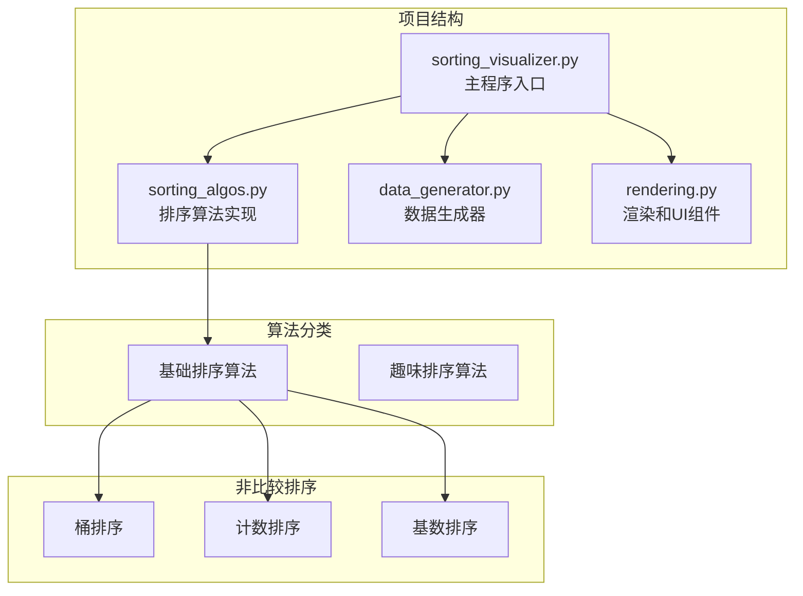
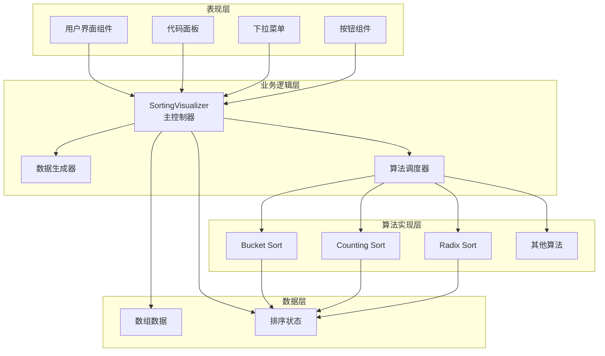
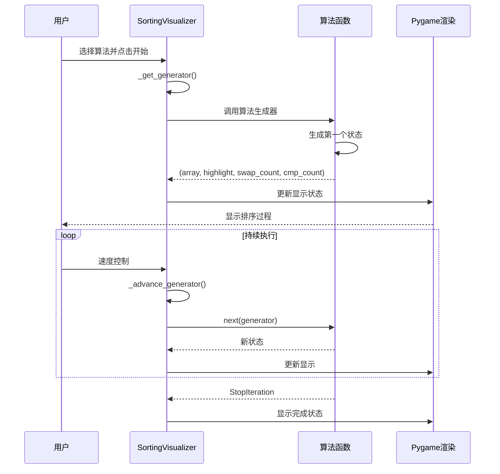
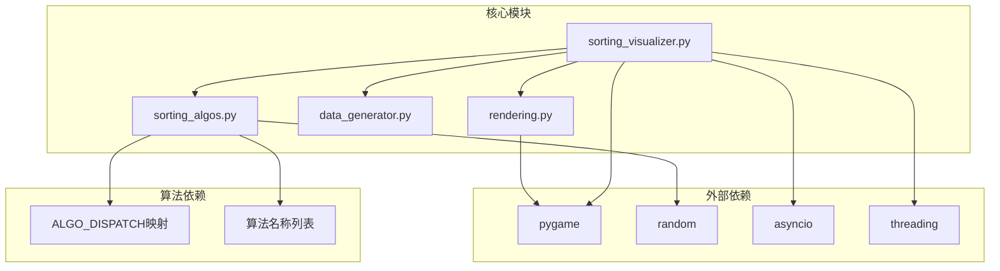
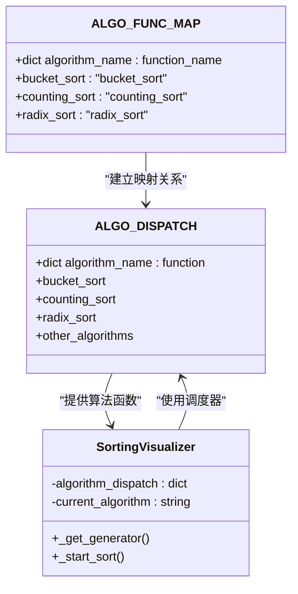

# 非比较排序算法

<cite>
**本文档引用的文件**
- [sorting_algos.py](file://sorting_algos.py)
- [sorting_visualizer.py](file://sorting_visualizer.py)
- [rendering.py](file://rendering.py)
- [data_generator.py](file://data_generator.py)
</cite>

## 目录
1. [简介](#简介)
2. [项目结构](#项目结构)
3. [核心组件](#核心组件)
4. [架构概览](#架构概览)
5. [详细组件分析](#详细组件分析)
6. [依赖关系分析](#依赖关系分析)
7. [性能考虑](#性能考虑)
8. [故障排除指南](#故障排除指南)
9. [结论](#结论)

## 简介

本项目是一个基于Python的排序算法可视化工具，专注于展示各种排序算法的工作原理。特别地，该项目实现了三种重要的非比较排序算法：桶排序、计数排序和基数排序。这些算法不依赖于元素之间的直接比较，而是利用数据的特殊性质来实现高效的排序。

非比较排序算法具有线性时间复杂度O(n+k)，其中n是元素数量，k是数据范围。这种特性使得它们在处理大量数据时比传统的比较排序算法（如快速排序、归并排序等）具有显著优势。

## 项目结构

该项目采用模块化设计，将不同的功能职责分离到独立的文件中：



**图表来源**
- [sorting_visualizer.py:1-490](file://sorting_visualizer.py#L1-L490)
- [sorting_algos.py:1-600](file://sorting_algos.py#L1-L600)

**章节来源**
- [sorting_visualizer.py:1-490](file://sorting_visualizer.py#L1-L490)
- [sorting_algos.py:1-600](file://sorting_algos.py#L1-L600)

## 核心组件

### 排序算法模块

sorting_algos.py模块包含了19种不同的排序算法，其中3种是非比较排序算法：

1. **桶排序 (Bucket Sort)** - O(n+k) 时间复杂度
2. **计数排序 (Counting Sort)** - O(n+k) 时间复杂度  
3. **基数排序 (Radix Sort)** - O(d×n) 时间复杂度，其中d是数字位数

这些算法都遵循相同的生成器模式，通过yield语句逐步产生排序过程的状态。

**章节来源**
- [sorting_algos.py:12-25](file://sorting_algos.py#L12-L25)
- [sorting_algos.py:223-300](file://sorting_algos.py#L223-L300)

### 可视化主程序

sorting_visualizer.py作为应用程序的入口点，负责：
- 初始化Pygame图形界面
- 管理用户交互和事件处理
- 协调算法执行和渲染
- 提供算法选择和参数配置

**章节来源**
- [sorting_visualizer.py:62-113](file://sorting_visualizer.py#L62-L113)

### 渲染和UI组件

rendering.py模块提供了完整的用户界面组件：
- 颜色常量定义
- 文本渲染工具函数
- 下拉菜单组件
- 按钮组件
- 代码面板组件
- 对话框组件

**章节来源**
- [rendering.py:13-564](file://rendering.py#L13-L564)

## 架构概览

该系统的整体架构采用分层设计，确保了良好的可维护性和扩展性：



**图表来源**
- [sorting_visualizer.py:34-47](file://sorting_visualizer.py#L34-L47)
- [sorting_algos.py:507-550](file://sorting_algos.py#L507-L550)

## 详细组件分析

### 桶排序 (Bucket Sort)

桶排序是一种分布式排序算法，它将数组分到有限数量的桶中，每个桶再分别排序，最后合并结果。

#### 算法工作原理

```mermaid
flowchart TD
START([开始桶排序]) --> CHECK[检查数组是否为空]
CHECK --> |空数组| END([结束])
CHECK --> |非空| FIND_RANGE[找到最大值和最小值]
FIND_RANGE --> CALC_BUCKET[计算桶范围]
CALC_BUCKET --> CREATE_BUCKETS[创建空桶]
CREATE_BUCKETS --> DISTRIBUTE[将元素分配到桶中]
DISTRIBUTE --> SORT_EACH[对每个桶内部排序]
SORT_EACH --> FLATTEN[扁平化桶中的元素]
FLATTEN --> COPY_BACK[复制回原数组]
COPY_BACK --> END
DISTRIBUTE --> CALC_INDEX[计算元素索引:<br/>floor((value - min) / bucket_range)]
CALC_INDEX --> CLAMP_INDEX[边界约束:<br/>clamp(index, 0, n-1)]
CLAMP_INDEX --> ADD_TO_BUCKET[添加到对应桶]
```

**图表来源**
- [sorting_algos.py:223-247](file://sorting_algos.py#L223-L247)

#### 关键实现特点

1. **动态桶大小**：使用`(max_val - min_val) / n + 1`确保至少有n个桶
2. **边界处理**：通过`clamp`函数确保索引在有效范围内
3. **渐进式可视化**：每个桶排序后立即更新显示

#### 复杂度分析

- **时间复杂度**：O(n+k)，其中k取决于数据分布
- **空间复杂度**：O(n+k)
- **稳定性**：取决于桶内排序算法

**章节来源**
- [sorting_algos.py:223-247](file://sorting_algos.py#L223-L247)

### 计数排序 (Counting Sort)

计数排序通过统计每个元素出现的次数来实现排序，适用于已知数据范围的情况。

#### 算法工作原理

```mermaid
flowchart TD
START([开始计数排序]) --> CHECK[检查数组是否为空]
CHECK --> |空数组| END([结束])
CHECK --> |非空| FIND_RANGE[找到最大值和最小值]
FIND_RANGE --> CALC_SIZE[计算计数数组大小:<br/>max_val - min_val + 1]
CALC_SIZE --> INIT_COUNT[初始化计数数组为0]
INIT_COUNT --> COUNT_ELEMENTS[遍历数组统计频次]
COUNT_ELEMENTS --> RECONSTRUCT[按计数重建数组]
RECONSTRUCT --> UPDATE_DISPLAY[更新显示状态]
UPDATE_DISPLAY --> NEXT_ELEMENT{还有元素吗?}
NEXT_ELEMENT --> |是| RECONSTRUCT
NEXT_ELEMENT --> |否| END
COUNT_ELEMENTS --> INC_COUNT[count[value - offset]++]
INC_COUNT --> CMP_COUNT[cmp_count++]
CMP_COUNT --> INC_COUNT
```

**图表来源**
- [sorting_algos.py:249-271](file://sorting_algos.py#L249-L271)

#### 关键实现特点

1. **偏移量处理**：使用`offset = min_val`支持负数
2. **原地重建**：直接在原数组上重建排序结果
3. **渐进式更新**：每次放置元素都产生可视化效果

#### 复杂度分析

- **时间复杂度**：O(n+k)
- **空间复杂度**：O(k)
- **稳定性**：稳定排序

**章节来源**
- [sorting_algos.py:249-271](file://sorting_algos.py#L249-L271)

### 基数排序 (Radix Sort)

基数排序按照数字的每一位进行排序，通常使用计数排序作为稳定的子排序器。

#### 算法工作原理

```mermaid
flowchart TD
START([开始基数排序]) --> CHECK[检查数组是否为空]
CHECK --> |空数组| END([结束])
CHECK --> |非空| FIND_MAX[找到最大值]
FIND_MAX --> INIT_EXP[exp = 1]
INIT_EXP --> DIGIT_SORT[按当前位进行排序]
DIGIT_SORT --> COUNTING_SORT[使用计数排序按digit位排序]
COUNTING_SORT --> NEXT_DIGIT{还有更高位吗?}
NEXT_DIGIT --> |是| MULTIPLY[exp *= 10]
MULTIPLY --> DIGIT_SORT
NEXT_DIGIT --> |否| END
COUNTING_SORT --> CALC_DIGIT[计算当前位:<br/>digit = (arr[i] // exp) % 10]
CALC_DIGIT --> UPDATE_OUTPUT[更新输出数组]
UPDATE_OUTPUT --> UPDATE_COUNT[更新计数数组]
UPDATE_COUNT --> UPDATE_OUTPUT
```

**图表来源**
- [sorting_algos.py:273-300](file://sorting_algos.py#L273-L300)

#### 关键实现特点

1. **LSD策略**：从最低有效位开始排序
2. **稳定子排序**：使用计数排序保证稳定性
3. **原地处理**：使用输出数组避免额外空间

#### 复杂度分析

- **时间复杂度**：O(d×n)，其中d是最大数的位数
- **空间复杂度**：O(n+k)
- **稳定性**：稳定排序

**章节来源**
- [sorting_algos.py:273-300](file://sorting_algos.py#L273-L300)

### 算法可视化序列图



**图表来源**
- [sorting_visualizer.py:269-287](file://sorting_visualizer.py#L269-L287)
- [sorting_algos.py:223-300](file://sorting_algos.py#L223-L300)

## 依赖关系分析

### 模块间依赖关系



**图表来源**
- [sorting_visualizer.py:34-47](file://sorting_visualizer.py#L34-L47)
- [sorting_algos.py:507-550](file://sorting_algos.py#L507-L550)

### 算法调度机制

项目使用映射表来管理算法调度：



**图表来源**
- [sorting_algos.py:507-550](file://sorting_algos.py#L507-L550)
- [sorting_visualizer.py:198-205](file://sorting_visualizer.py#L198-L205)

**章节来源**
- [sorting_algos.py:507-550](file://sorting_algos.py#L507-L550)
- [sorting_visualizer.py:198-205](file://sorting_visualizer.py#L198-L205)

## 性能考虑

### 时间复杂度对比

| 算法 | 最好情况 | 平均情况 | 最坏情况 | 稳定性 |
|------|----------|----------|----------|--------|
| 桶排序 | O(n+k) | O(n+k) | O(n²) | 不稳定 |
| 计数排序 | O(n+k) | O(n+k) | O(n+k) | 稳定 |
| 基数排序 | O(d×n) | O(d×n) | O(d×n) | 稳定 |

### 空间复杂度权衡

1. **桶排序**：需要额外的桶空间，空间复杂度O(n+k)
2. **计数排序**：需要计数数组，空间复杂度O(k)
3. **基数排序**：需要输出数组，空间复杂度O(n+k)

### 数据分布要求

1. **桶排序**：适合均匀分布的数据
2. **计数排序**：适合数据范围相对较小的整数
3. **基数排序**：适合非负整数或可以转换为数字的数据

### 实际应用场景

1. **大数据处理**：当数据量很大且满足条件时
2. **嵌入式系统**：内存受限但数据范围已知的情况
3. **实时系统**：需要可预测性能的场景
4. **教育演示**：直观展示非比较排序概念

## 故障排除指南

### 常见问题及解决方案

#### 1. 算法不适用的数据类型

**问题**：使用桶排序处理浮点数或负数
**解决方案**：确保数据类型符合算法要求，或预处理数据

#### 2. 内存不足问题

**问题**：计数排序在数据范围很大时占用过多内存
**解决方案**：考虑使用桶排序或其他替代算法

#### 3. 性能异常

**问题**：算法执行速度不符合预期
**解决方案**：检查数据分布和算法选择是否合适

#### 4. 可视化显示问题

**问题**：数组过大时显示效果不佳
**解决方案**：调整数据量或屏幕分辨率

**章节来源**
- [sorting_algos.py:223-300](file://sorting_algos.py#L223-L300)
- [sorting_visualizer.py:186-196](file://sorting_visualizer.py#L186-L196)

## 结论

本项目成功实现了三种重要的非比较排序算法，并提供了完整的可视化界面。通过生成器模式，用户可以清晰地观察到每种算法的执行过程。

### 主要优势

1. **教育价值**：直观展示非比较排序的核心思想
2. **性能优势**：在合适的数据条件下提供线性时间复杂度
3. **可视化效果**：实时显示排序过程，便于理解算法原理
4. **扩展性强**：模块化设计便于添加新的算法

### 应用建议

1. **选择合适的算法**：根据数据特征选择最适合的排序算法
2. **注意数据预处理**：确保数据格式符合算法要求
3. **监控资源使用**：关注内存和时间复杂度的影响
4. **结合实际需求**：在理论性能和实际应用之间找到平衡

通过这个项目，开发者可以深入理解非比较排序算法的原理和应用，为处理大规模数据排序需求提供专业的技术指导。