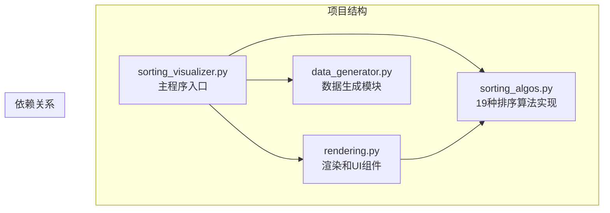
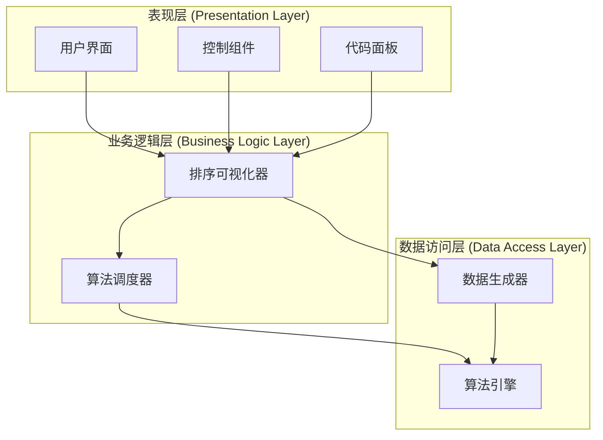
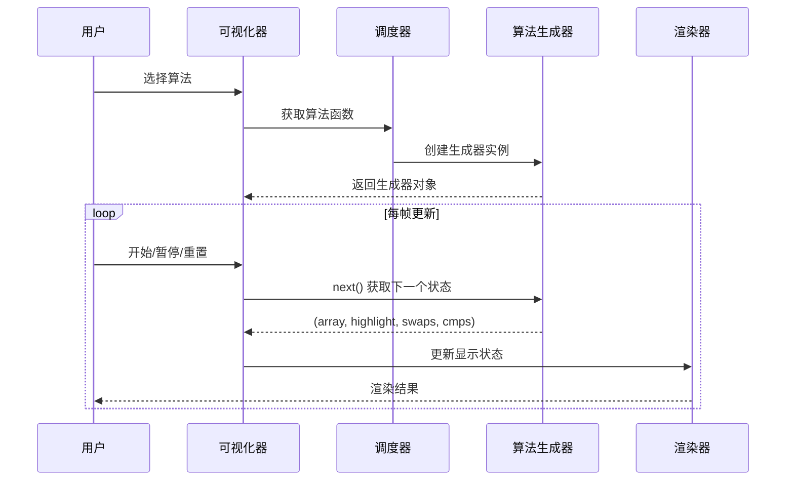
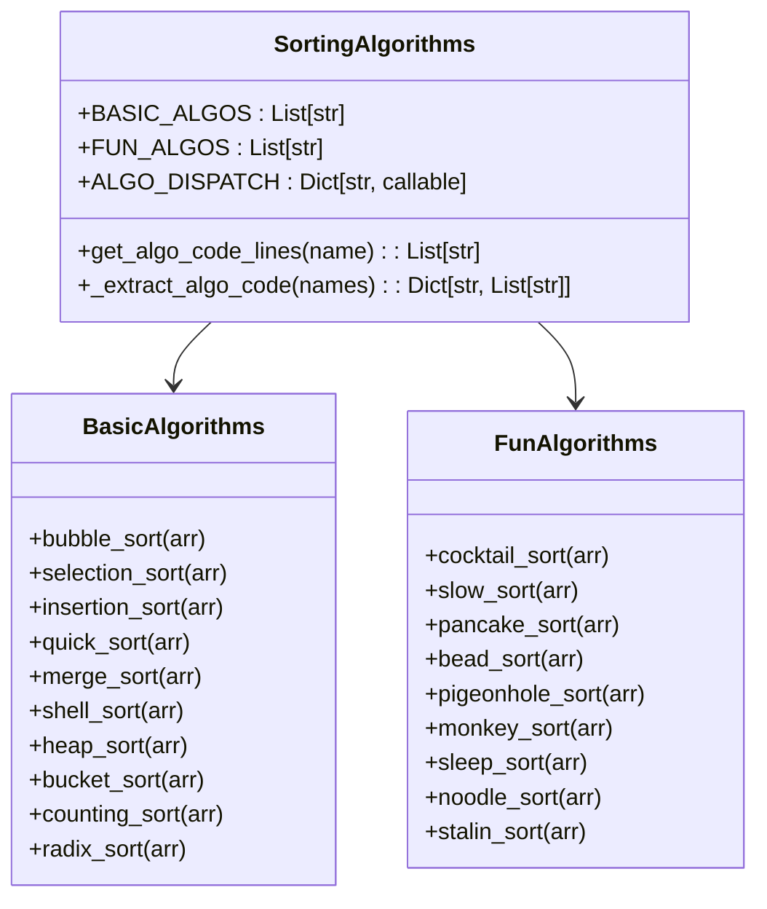
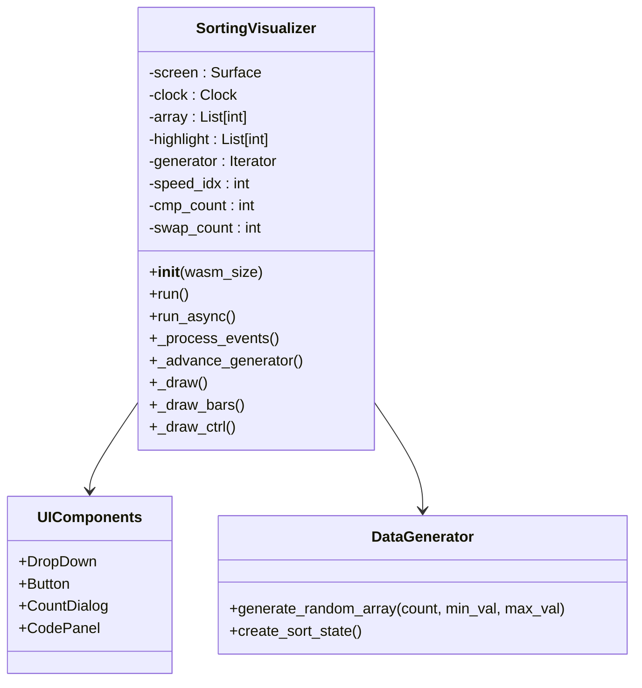
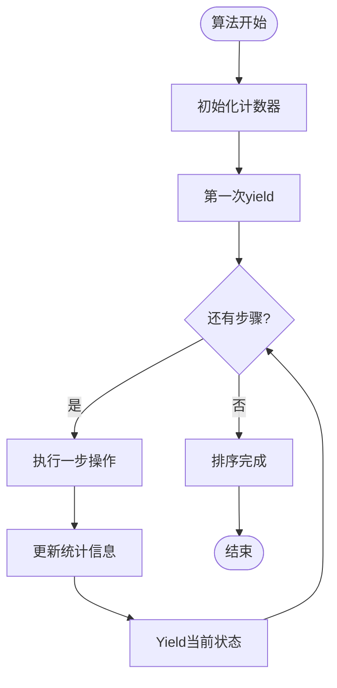
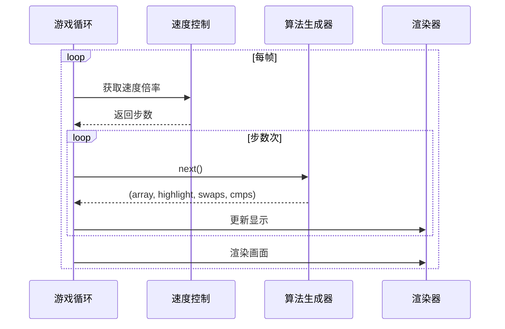

# 排序算法可视化

<cite>
**本文档引用的文件**
- [sorting_algos.py](file://sorting_algos.py)
- [sorting_visualizer.py](file://sorting_visualizer.py)
- [rendering.py](file://rendering.py)
- [data_generator.py](file://data_generator.py)
</cite>

## 目录
1. [简介](#简介)
2. [项目结构](#项目结构)
3. [核心组件](#核心组件)
4. [架构概览](#架构概览)
5. [详细组件分析](#详细组件分析)
6. [算法实现详解](#算法实现详解)
7. [可视化原理](#可视化原理)
8. [性能统计与分析](#性能统计与分析)
9. [使用指南](#使用指南)
10. [故障排除](#故障排除)
11. [结论](#结论)

## 简介

这是一个基于Python和Pygame开发的排序算法可视化系统，提供了19种不同类型的排序算法的交互式演示。该系统不仅展示了经典的10种基础排序算法（冒泡排序、选择排序、插入排序、希尔排序、归并排序、快速排序、堆排序、计数排序、桶排序、基数排序），还包括9种趣味排序算法（猴子排序、睡眠排序、面条排序、斯大林排序、鸡尾酒排序、慢排序、煎饼排序、珠排序、鸽巢排序）。

该可视化系统的核心特色在于其生成器驱动的算法实现，每个算法都以生成器函数的形式提供，能够逐步产生排序过程中的中间状态，从而实现流畅的动画效果和实时性能统计。

## 项目结构

该项目采用模块化设计，将功能清晰地分离到不同的文件中：



**图表来源**
- [sorting_visualizer.py:1-480](file://sorting_visualizer.py#L1-L480)
- [sorting_algos.py:1-600](file://sorting_algos.py#L1-L600)
- [rendering.py:1-557](file://rendering.py#L1-L557)
- [data_generator.py:1-48](file://data_generator.py#L1-L48)

**章节来源**
- [sorting_visualizer.py:1-480](file://sorting_visualizer.py#L1-L480)
- [sorting_algos.py:1-600](file://sorting_algos.py#L1-L600)
- [rendering.py:1-557](file://rendering.py#L1-L557)
- [data_generator.py:1-48](file://data_generator.py#L1-L48)

## 核心组件

### 排序算法模块 (sorting_algos.py)

该模块是整个系统的算法核心，包含了19种不同的排序算法，全部实现为生成器函数。每个生成器函数都会逐步产生排序过程中的状态，格式为 `(array, highlight_indices, swap_count, cmp_count)`。

**主要特性：**
- **生成器驱动**：每个算法都是生成器，支持逐步执行
- **统一接口**：所有算法返回相同格式的状态元组
- **性能统计**：内置比较次数和交换次数统计
- **状态高亮**：支持对当前操作元素进行高亮显示

**章节来源**
- [sorting_algos.py:12-550](file://sorting_algos.py#L12-L550)

### 可视化主程序 (sorting_visualizer.py)

主程序类 `SortingVisualizer` 是整个应用的核心控制器，负责管理用户界面、事件处理、算法执行和渲染。

**核心功能：**
- **算法调度**：根据用户选择调用相应的排序算法
- **状态管理**：维护数组状态、计数器和执行状态
- **事件处理**：处理用户输入和界面交互
- **渲染控制**：协调各个渲染组件的工作

**章节来源**
- [sorting_visualizer.py:62-480](file://sorting_visualizer.py#L62-L480)

### 渲染与UI模块 (rendering.py)

提供完整的用户界面和渲染功能，包括颜色定义、UI组件和代码面板。

**主要组件：**
- **颜色常量**：定义了丰富的颜色用于不同的可视化效果
- **UI组件**：下拉菜单、按钮、对话框等交互元素
- **代码面板**：语法高亮的算法源码显示面板
- **绘制工具**：文本渲染和图形绘制辅助函数

**章节来源**
- [rendering.py:13-557](file://rendering.py#L13-L557)

### 数据生成模块 (data_generator.py)

负责生成排序算法所需的随机数据，确保每次运行都有新的数据集。

**功能特点：**
- **随机数组生成**：支持自定义范围和长度的随机数组
- **状态初始化**：提供标准化的排序状态字典
- **参数配置**：可配置最小值、最大值和数组长度

**章节来源**
- [data_generator.py:11-48](file://data_generator.py#L11-L48)

## 架构概览

系统采用分层架构设计，实现了清晰的关注点分离：



**图表来源**
- [sorting_visualizer.py:62-480](file://sorting_visualizer.py#L62-L480)
- [sorting_algos.py:507-550](file://sorting_algos.py#L507-L550)
- [data_generator.py:11-48](file://data_generator.py#L11-L48)

### 算法调度机制



**图表来源**
- [sorting_visualizer.py:191-280](file://sorting_visualizer.py#L191-L280)
- [sorting_algos.py:507-550](file://sorting_algos.py#L507-L550)

## 详细组件分析

### 排序算法实现架构



**图表来源**
- [sorting_algos.py:12-550](file://sorting_algos.py#L12-L550)

### 可视化器核心架构



**图表来源**
- [sorting_visualizer.py:62-480](file://sorting_visualizer.py#L62-L480)
- [rendering.py:284-557](file://rendering.py#L284-L557)
- [data_generator.py:11-48](file://data_generator.py#L11-L48)

**章节来源**
- [sorting_visualizer.py:62-480](file://sorting_visualizer.py#L62-L480)
- [rendering.py:107-557](file://rendering.py#L107-L557)

## 算法实现详解

### 基础排序算法

#### 冒泡排序 (Bubble Sort)
冒泡排序是最简单的排序算法之一，通过重复遍历数组，比较相邻元素并交换位置来实现排序。

**时间复杂度：** O(n²)  
**空间复杂度：** O(1)  
**适用场景：** 教学演示、小规模数据

#### 选择排序 (Selection Sort)
选择排序每次从未排序部分选择最小元素放到已排序部分的末尾。

**时间复杂度：** O(n²)  
**空间复杂度：** O(1)  
**适用场景：** 内存写入成本高的环境

#### 插入排序 (Insertion Sort)
插入排序将每个元素插入到已排序部分的正确位置。

**时间复杂度：** O(n²)  
**空间复杂度：** O(1)  
**适用场景：** 小规模数据、部分有序数据

#### 快速排序 (Quick Sort)
快速排序采用分治策略，选择基准元素将数组分为两部分，然后递归排序。

**时间复杂度：** 平均O(n log n)，最坏O(n²)  
**空间复杂度：** O(log n)  
**适用场景：** 大多数情况下的通用排序

#### 归并排序 (Merge Sort)
归并排序将数组分成两半，分别排序后再合并。

**时间复杂度：** O(n log n)  
**空间复杂度：** O(n)  
**适用场景：** 需要稳定排序的场合

#### 希尔排序 (Shell Sort)
希尔排序是插入排序的改进版本，通过间隔序列减少数据移动。

**时间复杂度：** O(n^(3/2)) 到 O(n log²n)  
**空间复杂度：** O(1)  
**适用场景：** 中等规模数据

#### 堆排序 (Heap Sort)
堆排序利用堆这种数据结构进行排序，保证O(n log n)的时间复杂度。

**时间复杂度：** O(n log n)  
**空间复杂度：** O(1)  
**适用场景：** 内存受限的环境

#### 桶排序 (Bucket Sort)
桶排序将数组分配到多个桶中，对每个桶单独排序。

**时间复杂度：** 平均O(n + k)，最坏O(n²)  
**空间复杂度：** O(n + k)  
**适用场景：** 数据分布相对均匀的情况

#### 计数排序 (Counting Sort)
计数排序通过统计元素出现次数来进行排序。

**时间复杂度：** O(n + k)  
**空间复杂度：** O(k)  
**适用场景：** 整数范围较小的数据

#### 基数排序 (Radix Sort)
基数排序按位数对数据进行排序，通常从最低位开始。

**时间复杂度：** O(d × n)  
**空间复杂度：** O(n + k)  
**适用场景：** 固定长度的整数或字符串

### 趣味排序算法

#### 鸡尾酒排序 (Cocktail Sort)
鸡尾酒排序是冒泡排序的双向版本，交替从两个方向进行冒泡。

**时间复杂度：** O(n²)  
**空间复杂度：** O(1)  
**特点：** 对于某些特定数据模式有轻微优化

#### 慢排序 (Slow Sort)
慢排序是一种故意设计得非常低效的递归算法。

**时间复杂度：** 极高（指数级）  
**空间复杂度：** O(n)  
**用途：** 教学演示算法效率的重要性

#### 煎饼排序 (Pancake Sort)
煎饼排序通过翻转操作将数组排序，模拟用夹子翻转煎饼的过程。

**时间复杂度：** O(n²)  
**空间复杂度：** O(1)  
**特点：** 与实际烹饪过程相关联

#### 珠排序 (Bead Sort)
珠排序模拟算盘或珠排序的过程，利用重力效果。

**时间复杂度：** O(sum)  
**空间复杂度：** O(n × max_value)  
**特点：** 物理直觉强，但空间需求大

#### 鸽巢排序 (Pigeonhole Sort)
鸽巢排序基于鸽巢原理，将元素放入对应的"鸽巢"中。

**时间复杂度：** O(n + k)  
**空间复杂度：** O(k)  
**适用场景：** 元素范围有限的情况

#### 猴子排序 (Monkey Sort)
猴子排序通过随机打乱数组直到排序完成。

**时间复杂度：** 期望无限  
**空间复杂度：** O(n)  
**特点：** 概率性算法，主要用于教学

#### 睡眠排序 (Sleep Sort)
睡眠排序通过延迟输出来实现排序效果。

**时间复杂度：** O(max_value + n)  
**空间复杂度：** O(n)  
**特点：** 概念性强，实际不可行

#### 面条排序 (Noodle Sort)
面条排序通过物理直觉展示插入排序的概念。

**时间复杂度：** O(n²)  
**空间复杂度：** O(1)  
**特点：** 视觉化程度高

#### 斯大林排序 (Stalin Sort)
斯大林排序删除不符合条件的元素，保留"合格"的元素。

**时间复杂度：** O(n)  
**空间复杂度：** O(1)  
**特点：** 会改变原始数据

**章节来源**
- [sorting_algos.py:35-600](file://sorting_algos.py#L35-L600)

## 可视化原理

### 状态生成机制

每个排序算法都实现为生成器，逐步产生排序过程中的状态。生成器返回的元组包含以下信息：



**图表来源**
- [sorting_algos.py:35-300](file://sorting_algos.py#L35-L300)

### 动画过渡实现

系统通过帧率控制和速度调节实现平滑的动画效果：



**图表来源**
- [sorting_visualizer.py:262-280](file://sorting_visualizer.py#L262-L280)

### 性能统计系统

系统实时跟踪和显示以下性能指标：

| 指标 | 含义 | 更新时机 |
|------|------|----------|
| 比较次数 | 元素间比较的总次数 | 每次比较操作后 |
| 交换次数 | 元素位置交换的总次数 | 每次交换操作后 |
| 当前算法 | 正在执行的排序算法名称 | 算法切换时 |
| 数据量 | 数组元素个数 | 数据重新生成时 |
| 速度倍率 | 动画播放速度（0.25x-128x） | 速度调整时 |

**章节来源**
- [sorting_visualizer.py:315-323](file://sorting_visualizer.py#L315-L323)
- [sorting_algos.py:35-600](file://sorting_algos.py#L35-L600)

## 性能统计与分析

### 时间复杂度对比

| 算法类型 | 最好情况 | 平均情况 | 最坏情况 | 空间复杂度 |
|----------|----------|----------|----------|------------|
| 基础排序 | O(n²) | O(n²) | O(n²) | O(1) |
| 快速排序 | O(n log n) | O(n log n) | O(n²) | O(log n) |
| 归并排序 | O(n log n) | O(n log n) | O(n log n) | O(n) |
| 堆排序 | O(n log n) | O(n log n) | O(n log n) | O(1) |
| 计数排序 | O(n + k) | O(n + k) | O(n + k) | O(k) |
| 桶排序 | O(n + k) | O(n + k) | O(n²) | O(n + k) |
| 基数排序 | O(d × n) | O(d × n) | O(d × n) | O(n + k) |

### 实际性能测试

由于算法的性能受多种因素影响，建议通过以下方式进行实际测试：

1. **数据规模测试**：从10到1000个元素的不同规模
2. **数据分布测试**：随机、已排序、逆序、部分排序
3. **硬件环境测试**：不同CPU、内存配置下的表现
4. **算法组合测试**：同时运行多个算法进行对比

### 性能优化建议

1. **算法选择**：
   - 小规模数据：插入排序或选择排序
   - 大规模数据：快速排序、归并排序或堆排序
   - 特殊数据：计数排序、桶排序或基数排序

2. **实现优化**：
   - 使用生成器减少内存占用
   - 避免不必要的数组复制
   - 优化比较操作

3. **可视化优化**：
   - 合理设置刷新频率
   - 使用高效的渲染方法
   - 优化UI组件的绘制

## 使用指南

### 安装和运行

1. **环境要求**：
   - Python 3.6+
   - Pygame库

2. **安装命令**：
   ```bash
   pip install pygame
   ```

3. **运行方式**：
   ```bash
   python sorting_visualizer.py
   ```

### 界面操作说明

#### 主界面元素

| 组件 | 功能 | 快捷键/操作 |
|------|------|-------------|
| 算法下拉菜单 | 选择排序算法 | 点击展开选择 |
| 开始按钮 | 开始/继续排序 | 点击 |
| 暂停按钮 | 暂停/恢复排序 | 点击 |
| 重置按钮 | 重新生成数据 | 点击 |
| 加速按钮 | 提高速度 | 点击 |
| 减速按钮 | 降低速度 | 点击 |
| 随机生成 | 重新生成随机数据 | 点击 |
| 设置数量 | 修改数据规模 | 点击弹出对话框 |
| 全屏 | 切换全屏模式 | 点击 |
| 算法代码 | 显示算法源码 | 点击弹出代码面板 |

#### 速度控制

系统支持10个速度级别，从0.25x到128x：

- **0.25x**：极慢，适合学习算法步骤
- **1.0x**：正常速度
- **16.0x**：较快，适合快速预览
- **128.0x**：极快，仅用于演示

### 算法选择建议

#### 教学用途

1. **初学者**：冒泡排序、选择排序、插入排序
2. **进阶学习**：快速排序、归并排序、堆排序
3. **高级研究**：希尔排序、计数排序、基数排序

#### 比较分析

1. **稳定性对比**：插入排序、归并排序、桶排序
2. **效率对比**：快速排序、堆排序、归并排序
3. **内存使用**：原地排序 vs 辅助空间

### 自定义扩展

#### 添加新算法

1. 在 `sorting_algos.py` 中添加算法函数
2. 更新算法列表和映射表
3. 在UI中注册新算法

#### 修改可视化效果

1. 调整颜色常量
2. 修改渲染参数
3. 自定义UI布局

**章节来源**
- [sorting_visualizer.py:52-57](file://sorting_visualizer.py#L52-L57)
- [sorting_visualizer.py:425-448](file://sorting_visualizer.py#L425-L448)

## 故障排除

### 常见问题及解决方案

#### 问题1：Pygame安装失败

**症状**：安装过程中出现编译错误

**解决方案**：
1. 使用预编译包：
   ```bash
   pip install pygame --only-binary=all
   ```
2. 检查Python版本兼容性
3. 确保系统有必要的编译工具

#### 问题2：字体显示异常

**症状**：界面文字显示为方块或乱码

**解决方案**：
1. 确保字体文件存在
2. 检查字体路径配置
3. 使用系统默认字体作为后备

#### 问题3：算法执行过慢

**症状**：大数组排序时响应缓慢

**解决方案**：
1. 降低数据规模
2. 提高速度倍率
3. 使用更高效的算法

#### 问题4：内存使用过高

**症状**：长时间运行后内存占用增加

**解决方案**：
1. 优化算法实现
2. 及时释放不需要的对象
3. 考虑使用更节省内存的算法

### 调试技巧

1. **日志输出**：在关键位置添加调试信息
2. **性能监控**：使用Python的time模块测量执行时间
3. **内存检查**：使用memory_profiler监控内存使用
4. **算法验证**：添加断言确保排序结果正确

**章节来源**
- [sorting_visualizer.py:115-144](file://sorting_visualizer.py#L115-L144)
- [rendering.py:110-140](file://rendering.py#L110-L140)

## 结论

这个排序算法可视化系统成功地将复杂的算法概念转化为直观的视觉演示，为算法学习和教学提供了强大的工具。通过19种不同类型的排序算法展示，用户可以：

1. **深入理解算法原理**：通过可视化过程观察算法的执行步骤
2. **比较算法性能**：在同一界面上对比不同算法的效率差异
3. **掌握算法适用场景**：了解各种算法在不同数据条件下的表现
4. **培养算法思维**：通过交互式学习提高算法分析能力

系统的模块化设计使其具有良好的可扩展性和可维护性，为后续的功能扩展和算法添加奠定了坚实的基础。无论是教育工作者还是编程爱好者，都能从这个系统中获得宝贵的学习体验。

未来的发展方向包括：
- 添加更多高级算法和机器学习相关的可视化
- 支持多语言界面
- 增强交互功能和个性化定制
- 优化性能以支持更大规模的数据集