# 算法可视化原理

<cite>
**本文档引用的文件**
- [sorting_visualizer.py](file://sorting_visualizer.py)
- [sorting_algos.py](file://sorting_algos.py)
- [rendering.py](file://rendering.py)
- [data_generator.py](file://data_generator.py)
</cite>

## 目录
1. [引言](#引言)
2. [项目结构](#项目结构)
3. [核心组件](#核心组件)
4. [架构概览](#架构概览)
5. [详细组件分析](#详细组件分析)
6. [依赖关系分析](#依赖关系分析)
7. [性能考虑](#性能考虑)
8. [故障排除指南](#故障排除指南)
9. [结论](#结论)

## 引言

本项目是一个基于Python和Pygame的排序算法可视化系统，展示了19种不同排序算法的执行过程。该系统的核心创新在于使用生成器函数来实现算法的渐进式可视化，通过状态传递协议将算法执行过程分解为可观察的步骤序列。

该可视化系统不仅提供了直观的算法演示，更重要的是建立了一套完整的算法可视化理论框架，包括生成器函数的使用、状态传递协议、动画渲染原理等核心技术。

## 项目结构

项目采用模块化设计，将功能清晰分离：

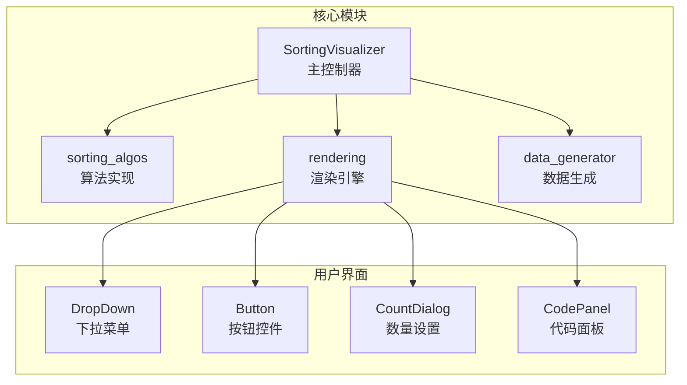

**图表来源**
- [sorting_visualizer.py:62-113](file://sorting_visualizer.py#L62-L113)
- [sorting_algos.py:12-25](file://sorting_algos.py#L12-L25)
- [rendering.py:284-380](file://rendering.py#L284-380)

**章节来源**
- [sorting_visualizer.py:1-490](file://sorting_visualizer.py#L1-L490)
- [sorting_algos.py:1-600](file://sorting_algos.py#L1-L600)
- [rendering.py:1-564](file://rendering.py#L1-L564)
- [data_generator.py:1-48](file://data_generator.py#L1-L48)

## 核心组件

### 生成器函数架构

所有排序算法都实现了生成器函数模式，这是整个可视化系统的核心机制：

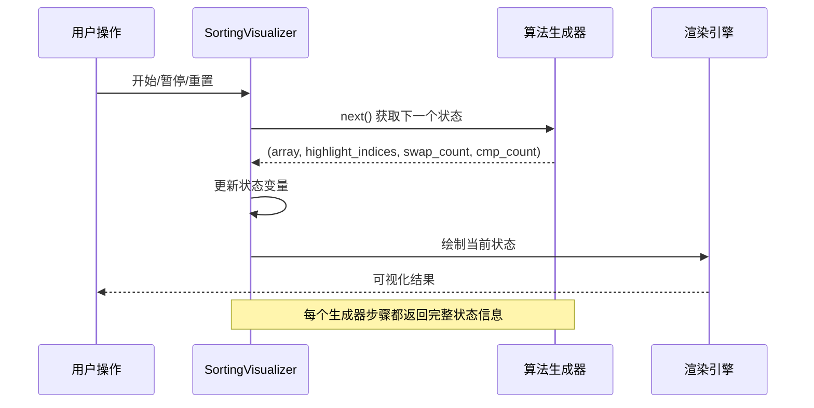

**图表来源**
- [sorting_visualizer.py:269-287](file://sorting_visualizer.py#L269-L287)
- [sorting_algos.py:35-48](file://sorting_algos.py#L35-L48)

### 状态传递协议

每个算法生成器遵循统一的状态传递协议，返回四元组：
- `array`: 当前数组状态
- `highlight_indices`: 高亮显示的索引列表
- `swap_count`: 交换操作计数
- `cmp_count`: 比较操作计数

这种协议确保了所有算法的可视化行为一致性。

**章节来源**
- [sorting_algos.py:6-7](file://sorting_algos.py#L6-L7)
- [sorting_visualizer.py:269-287](file://sorting_visualizer.py#L269-L287)

## 架构概览

系统采用分层架构设计，实现了关注点分离：

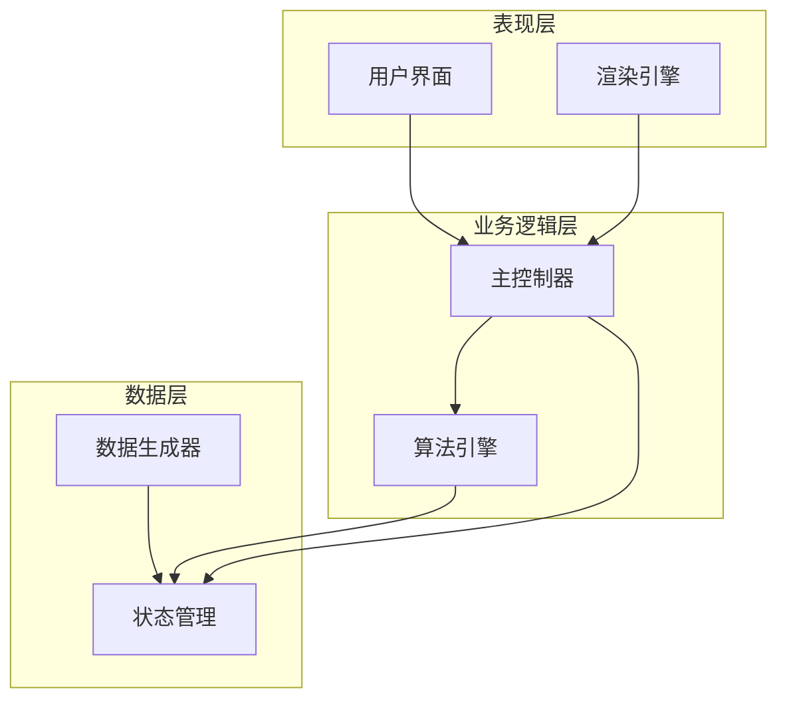

**图表来源**
- [sorting_visualizer.py:62-113](file://sorting_visualizer.py#L62-L113)
- [sorting_algos.py:12-25](file://sorting_algos.py#L12-L25)

### 数据流图

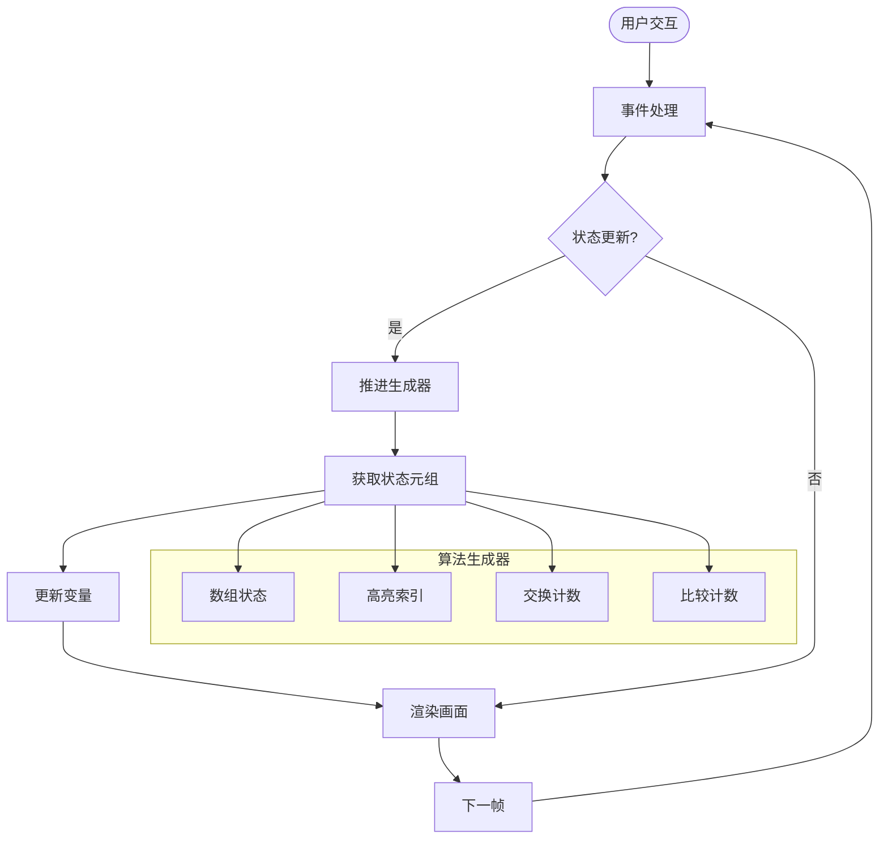

**图表来源**
- [sorting_visualizer.py:386-461](file://sorting_visualizer.py#L386-L461)
- [sorting_algos.py:35-48](file://sorting_algos.py#L35-L48)

## 详细组件分析

### SortingVisualizer 主控制器

主控制器是整个系统的中枢，负责协调各个组件的工作：

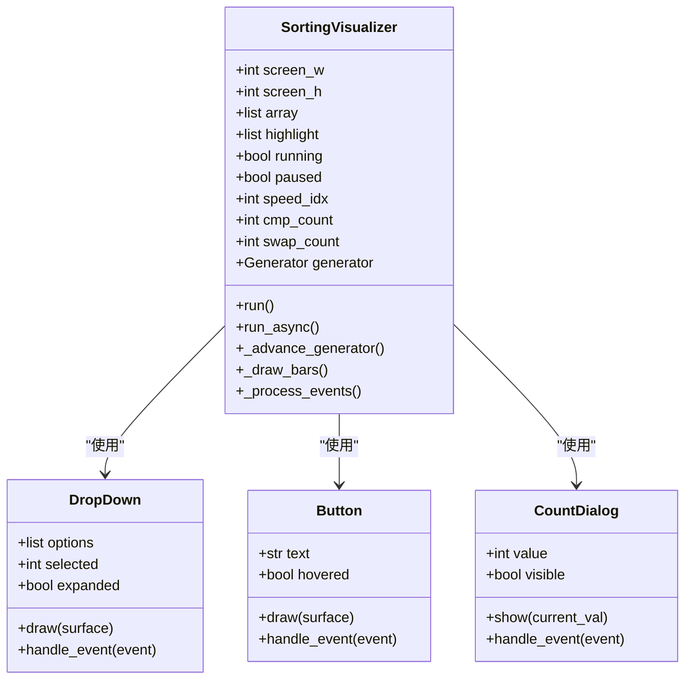

**图表来源**
- [sorting_visualizer.py:62-113](file://sorting_visualizer.py#L62-L113)
- [rendering.py:284-380](file://rendering.py#L284-380)

#### 状态管理机制

主控制器维护着完整的算法执行状态：

| 状态变量 | 类型 | 描述 | 更新时机 |
|---------|------|------|----------|
| `array` | list | 当前数组状态 | 每次生成器步骤后 |
| `highlight` | list | 高亮索引列表 | 每次生成器步骤后 |
| `running` | bool | 是否正在运行 | 开始/暂停/停止时 |
| `paused` | bool | 是否暂停 | 暂停/恢复时 |
| `cmp_count` | int | 比较次数 | 每次比较操作后 |
| `swap_count` | int | 交换次数 | 每次交换操作后 |
| `speed_idx` | int | 速度级别索引 | 加速/减速时 |

**章节来源**
- [sorting_visualizer.py:93-113](file://sorting_visualizer.py#L93-L113)
- [sorting_visualizer.py:269-287](file://sorting_visualizer.py#L269-L287)

### 算法生成器系统

所有排序算法都实现了相同的生成器接口，确保了可视化的一致性：

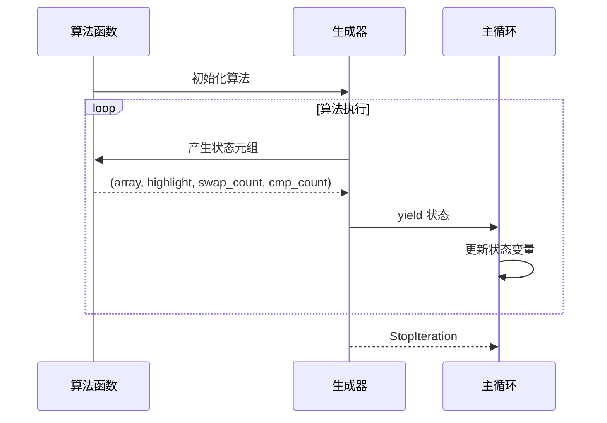

**图表来源**
- [sorting_algos.py:35-48](file://sorting_algos.py#L35-L48)
- [sorting_visualizer.py:269-287](file://sorting_visualizer.py#L269-L287)

#### 生成器函数实现模式

以冒泡排序为例，展示了标准的生成器实现模式：

1. **初始化阶段**：设置计数器和状态变量
2. **执行阶段**：在每次关键操作前后产生中间状态
3. **状态产出**：返回四元组 `(array, highlight_indices, swap_count, cmp_count)`
4. **继续执行**：使用 `yield` 暂停并等待下一步

**章节来源**
- [sorting_algos.py:35-48](file://sorting_algos.py#L35-L48)

### 渲染引擎

渲染引擎负责将算法状态转换为可视化的图形输出：

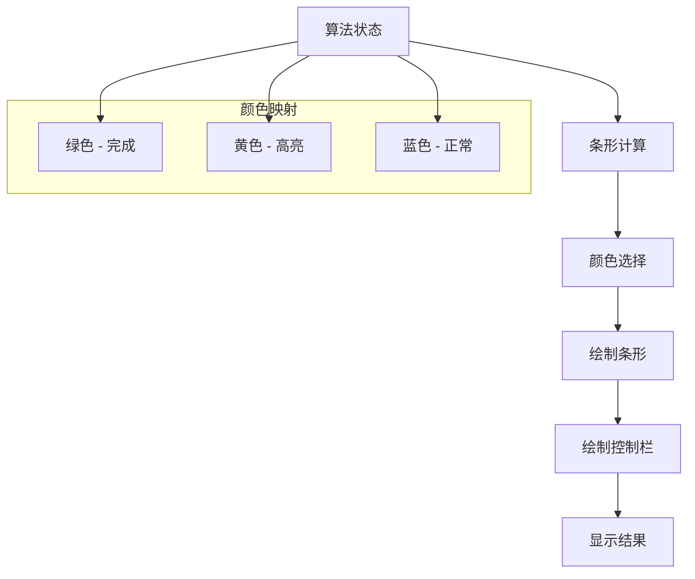

**图表来源**
- [sorting_visualizer.py:289-312](file://sorting_visualizer.py#L289-L312)
- [sorting_visualizer.py:313-356](file://sorting_visualizer.py#L313-L356)

#### 高亮显示机制

高亮显示是算法可视化的关键特性，通过以下机制实现：

1. **索引识别**：算法生成器明确标识需要高亮的元素索引
2. **状态传递**：高亮索引列表通过生成器协议传递给主控制器
3. **实时更新**：渲染引擎根据当前高亮状态动态调整颜色
4. **视觉反馈**：使用醒目的黄色突出显示关键元素

**章节来源**
- [sorting_visualizer.py:306-311](file://sorting_visualizer.py#L306-L311)

### UI组件系统

系统包含多个可复用的UI组件，支持完整的用户交互：

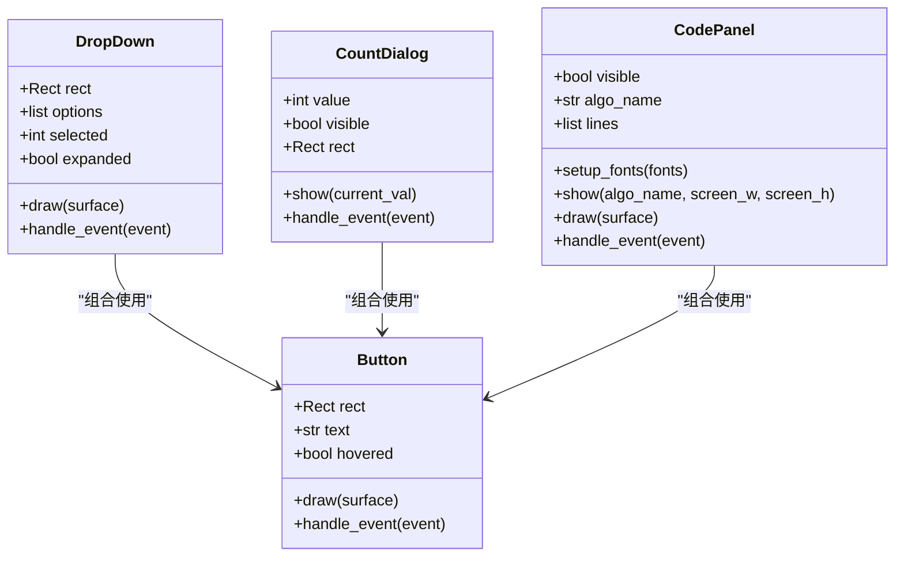

**图表来源**
- [rendering.py:284-380](file://rendering.py#L284-380)
- [rendering.py:110-279](file://rendering.py#L110-279)

**章节来源**
- [rendering.py:110-279](file://rendering.py#L110-L279)
- [rendering.py:284-380](file://rendering.py#L284-L380)

## 依赖关系分析

系统采用松耦合的设计，各模块间依赖关系清晰：

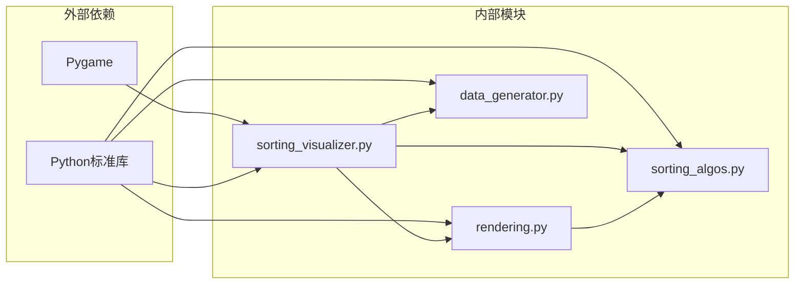

**图表来源**
- [sorting_visualizer.py:34-47](file://sorting_visualizer.py#L34-L47)
- [sorting_algos.py:9](file://sorting_algos.py#L9)

### 模块间交互

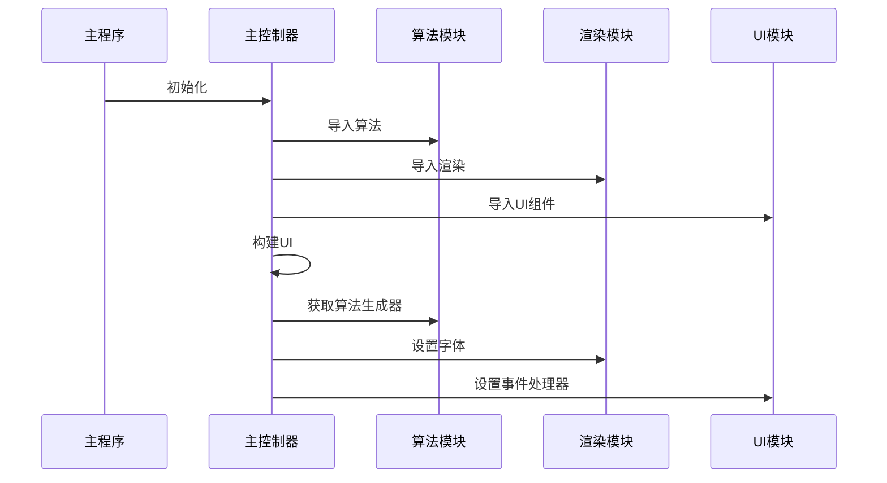

**图表来源**
- [sorting_visualizer.py:34-47](file://sorting_visualizer.py#L34-L47)

**章节来源**
- [sorting_visualizer.py:34-47](file://sorting_visualizer.py#L34-L47)
- [sorting_algos.py:507-550](file://sorting_algos.py#L507-L550)

## 性能考虑

### 生成器性能优化

生成器函数的使用带来了显著的性能优势：

1. **内存效率**：只保存当前状态，不需要存储完整的执行历史
2. **延迟计算**：按需计算下一个状态，避免不必要的工作
3. **状态压缩**：通过四元组传递最小必要信息

### 渲染性能优化

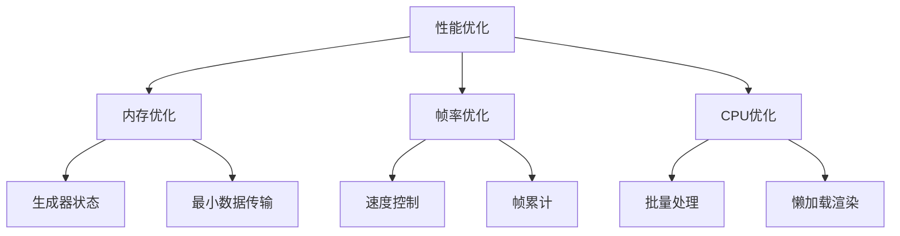

**图表来源**
- [sorting_visualizer.py:269-287](file://sorting_visualizer.py#L269-L287)
- [sorting_visualizer.py:56](file://sorting_visualizer.py#L56)

### 复杂度可视化

算法复杂度在可视化中的体现方式：

| 复杂度类型 | 可视化特征 | 实现方式 |
|-----------|-----------|----------|
| O(n²) | 条形密集移动 | 双重循环嵌套 |
| O(n log n) | 分治式分区 | 递归/分治策略 |
| O(n) | 线性扫描 | 单次遍历 |
| O(log n) | 对数级操作 | 迭代减半 |

**章节来源**
- [sorting_algos.py:12-25](file://sorting_algos.py#L12-L25)
- [sorting_visualizer.py:56](file://sorting_visualizer.py#L56)

## 故障排除指南

### 常见问题及解决方案

| 问题类型 | 症状描述 | 可能原因 | 解决方案 |
|---------|---------|---------|---------|
| 界面无响应 | 按钮点击无效 | 事件处理冲突 | 检查事件优先级 |
| 图像显示异常 | 条形高度错误 | 数值缩放问题 | 验证最大值计算 |
| 性能问题 | 帧率下降 | 渲染开销过大 | 优化绘制调用 |
| 算法卡死 | 生成器无输出 | 无限循环 | 检查终止条件 |

### 调试技巧

1. **状态监控**：通过控制台输出当前状态变量
2. **逐步调试**：使用单步模式观察每一步变化
3. **性能分析**：测量渲染时间和生成器执行时间
4. **边界测试**：测试空数组、单元素数组等边界情况

**章节来源**
- [sorting_visualizer.py:386-461](file://sorting_visualizer.py#L386-L461)

## 结论

本算法可视化系统通过生成器函数和状态传递协议，成功地将复杂的排序算法转化为直观的可视化演示。其核心价值体现在：

1. **理论完整性**：建立了完整的算法可视化理论框架
2. **实现优雅性**：使用生成器模式实现了高效的渐进式可视化
3. **扩展性强**：模块化设计便于添加新的算法和功能
4. **教育价值**：为算法学习和教学提供了优秀的可视化工具

该系统不仅展示了Python编程的最佳实践，更为算法可视化领域提供了可复用的技术方案和理论指导。通过深入理解其工作机制，开发者可以更好地扩展和改进算法可视化功能，为算法教育和研究提供更强大的工具。