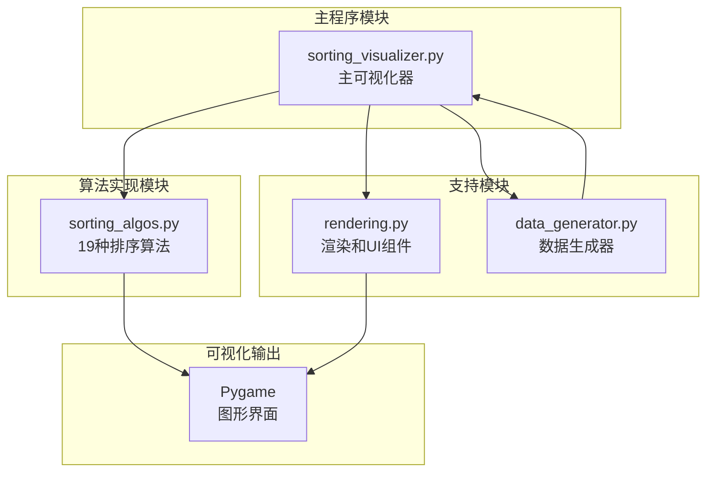
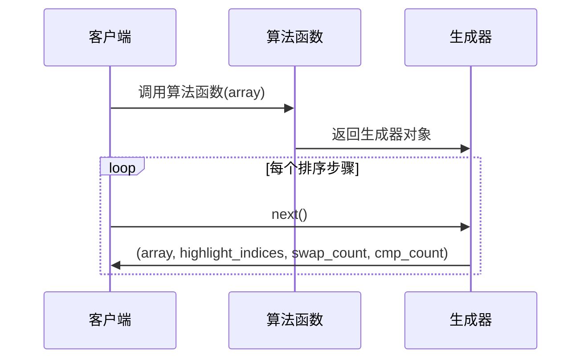
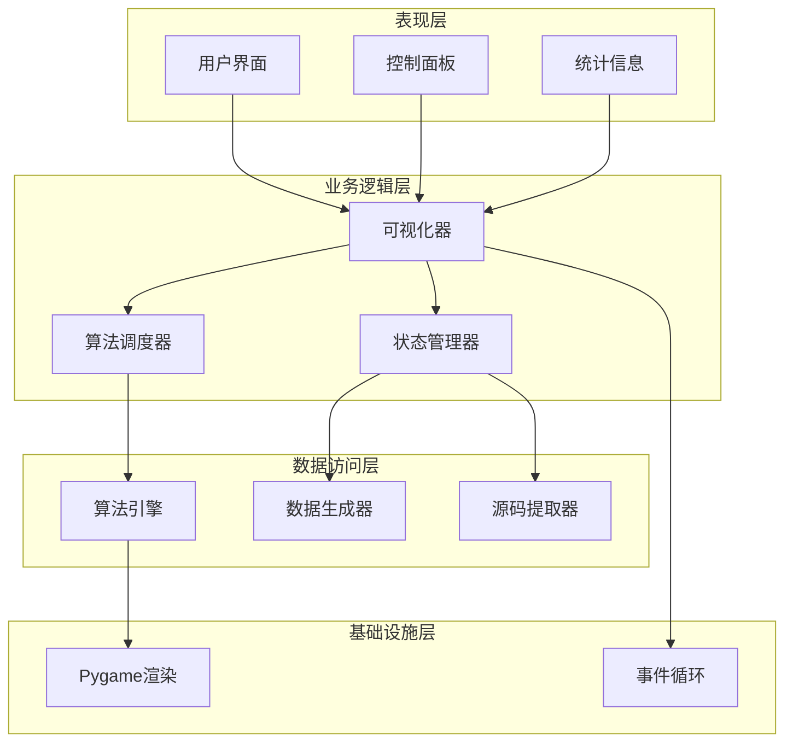
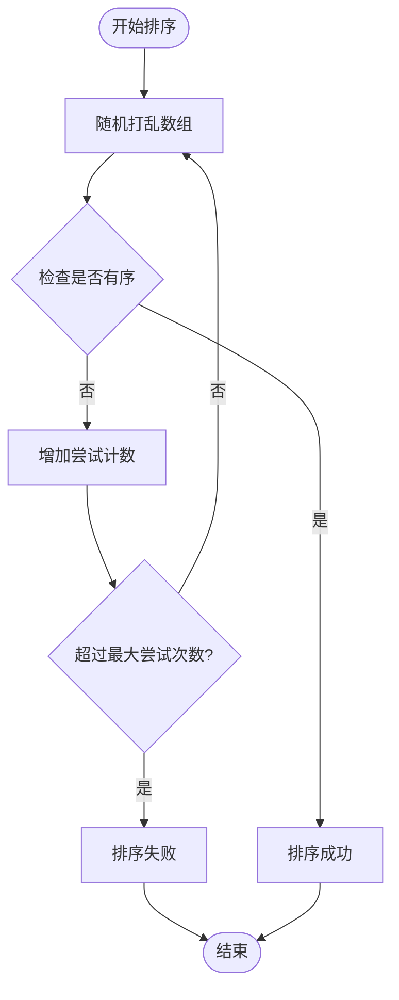
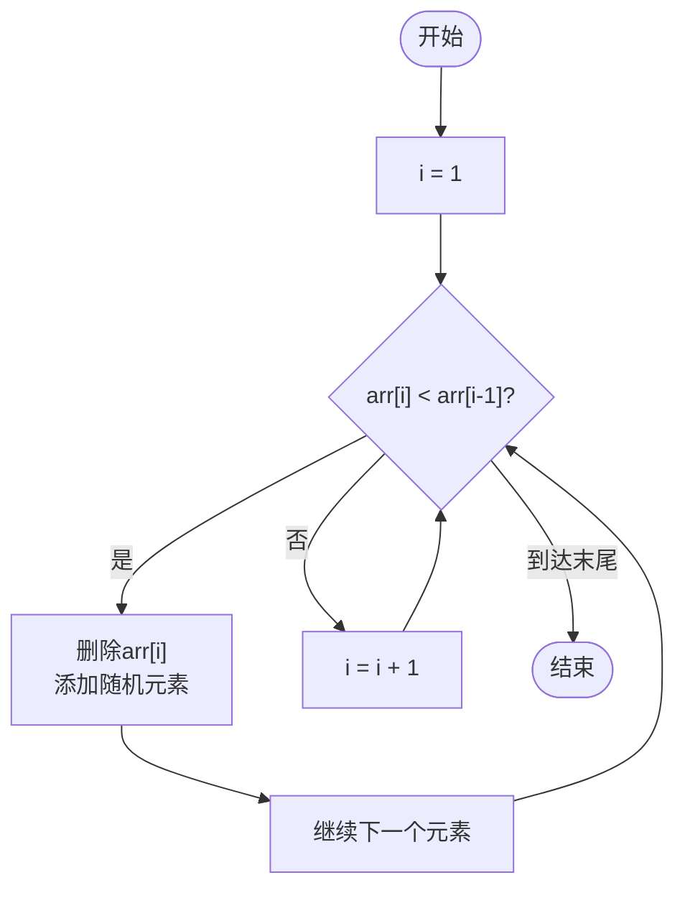
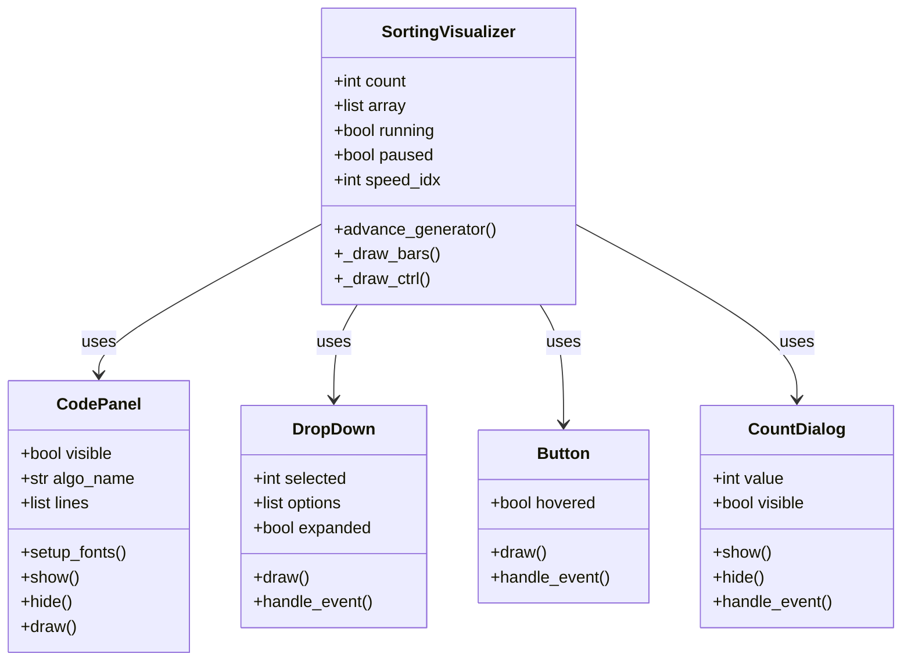
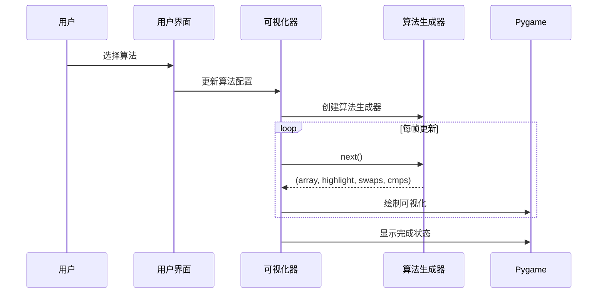
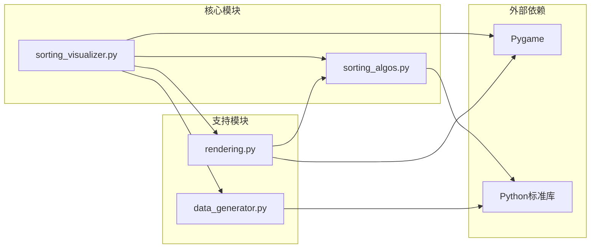

# 趣味排序算法

<cite>
**本文档引用的文件**
- [sorting_algos.py](file://sorting_algos.py)
- [sorting_visualizer.py](file://sorting_visualizer.py)
- [rendering.py](file://rendering.py)
- [data_generator.py](file://data_generator.py)
</cite>

## 目录
1. [简介](#简介)
2. [项目结构](#项目结构)
3. [核心组件](#核心组件)
4. [架构概览](#架构概览)
5. [详细组件分析](#详细组件分析)
6. [依赖关系分析](#依赖关系分析)
7. [性能考虑](#性能考虑)
8. [故障排除指南](#故障排除指南)
9. [结论](#结论)

## 简介

这是一个基于Python和Pygame开发的交互式排序算法可视化系统，专门用于教学和演示目的。该项目实现了19种不同的排序算法，其中包括9种创意和教学导向的"趣味排序算法"，能够直观地展示各种排序方法的工作原理和特性。

该系统的核心目标是通过可视化的交互界面，帮助学生和开发者更好地理解排序算法的概念、实现细节和性能特征。通过实时动画展示，学习者可以观察到不同算法在处理相同数据集时的行为差异。

## 项目结构

项目采用模块化设计，将功能清晰分离到不同的文件中：

**图表来源**
- [sorting_visualizer.py:1-490](file://sorting_visualizer.py#L1-L490)
- [sorting_algos.py:1-600](file://sorting_algos.py#L1-L600)
- [rendering.py:1-564](file://rendering.py#L1-L564)
- [data_generator.py:1-48](file://data_generator.py#L1-L48)

**章节来源**
- [sorting_visualizer.py:1-490](file://sorting_visualizer.py#L1-L490)
- [sorting_algos.py:1-600](file://sorting_algos.py#L1-L600)
- [rendering.py:1-564](file://rendering.py#L1-L564)
- [data_generator.py:1-48](file://data_generator.py#L1-L48)

## 核心组件

### 算法分类体系

项目将排序算法分为两大类别：

#### 基础排序算法（10种）
- 冒泡排序、选择排序、插入排序
- 快速排序、归并排序、希尔排序
- 堆排序、桶排序、计数排序、基数排序

#### 趣味排序算法（9种）
- 猴子排序、睡眠排序、面条排序、斯大林排序
- 鸡尾酒排序、慢排序、煎饼排序、珠排序、鸽巢排序

### 算法接口设计

所有算法都遵循统一的生成器接口模式：

**图表来源**
- [sorting_algos.py:35-50](file://sorting_algos.py#L35-L50)
- [sorting_algos.py:306-327](file://sorting_algos.py#L306-L327)

**章节来源**
- [sorting_algos.py:12-24](file://sorting_algos.py#L12-L24)
- [sorting_algos.py:507-550](file://sorting_algos.py#L507-L550)

## 架构概览

整个系统采用分层架构设计，确保了良好的可维护性和扩展性：

**图表来源**
- [sorting_visualizer.py:62-113](file://sorting_visualizer.py#L62-L113)
- [sorting_algos.py:507-550](file://sorting_algos.py#L507-L550)

## 详细组件分析

### 趣味排序算法详解

#### 猴子排序（Monkey Sort）

猴子排序是最具创意的排序算法之一，其设计理念来源于"猴子倒卖股票"的随机性。

**实现原理**：
- 通过随机打乱数组来尝试达到有序状态
- 每次打乱都会增加交换计数
- 设置最大尝试次数防止无限循环

**特殊行为特征**：
- 时间复杂度：期望O(n!)，最坏情况无限
- 空间复杂度：O(1)
- 教学价值：展示随机算法的不可预测性

**图表来源**
- [sorting_algos.py:434-452](file://sorting_algos.py#L434-L452)

**章节来源**
- [sorting_algos.py:434-452](file://sorting_algos.py#L434-L452)

#### 睡眠排序（Sleep Sort）

睡眠排序是一个极其特殊的排序算法，其核心思想是"让数字自己睡着然后醒来"。

**实现原理**：
- 为每个元素创建一个定时器
- 定时器的延迟时间等于元素的值
- 按照定时器完成的顺序输出结果

**特殊行为特征**：
- 实际应用中不推荐使用
- 展示了算法设计的创意性
- 教学价值：说明算法效率的重要性

**章节来源**
- [sorting_algos.py:455-466](file://sorting_algos.py#L455-L466)

#### 面条排序（Noodle Sort）

面条排序是对插入排序的视觉化模拟，通过"面条"的概念来展示插入过程。

**实现原理**：
- 保持已排序部分不变
- 将新元素插入到正确位置
- 通过动画展示插入过程

**特殊行为特征**：
- 时间复杂度：O(n²)
- 空间复杂度：O(1)
- 教学价值：直观展示插入排序的思路

**章节来源**
- [sorting_algos.py:468-484](file://sorting_algos.py#L468-L484)

#### 斯大林排序（Stalin Sort）

斯大林排序以其独特的"删除"策略而闻名，只保留符合要求的元素。

**实现原理**：
- 从左到右扫描数组
- 如果发现逆序对，就删除较小的元素
- 通过随机填充保证数组长度不变

**特殊行为特征**：
- 不产生真正的排序结果
- 展示了算法设计的幽默性
- 教学价值：说明排序算法的基本要求

**图表来源**
- [sorting_algos.py:486-501](file://sorting_algos.py#L486-L501)

**章节来源**
- [sorting_algos.py:486-501](file://sorting_algos.py#L486-L501)

#### 鸡尾酒排序（Cocktail Sort）

鸡尾酒排序是冒泡排序的双向版本，也称为摇摆排序。

**实现原理**：
- 交替进行正向和反向的冒泡操作
- 每轮同时找到最小值和最大值
- 减少需要遍历的轮数

**特殊行为特征**：
- 时间复杂度：O(n²)
- 空间复杂度：O(1)
- 教学价值：展示优化的冒泡排序思路

**章节来源**
- [sorting_algos.py:306-327](file://sorting_algos.py#L306-L327)

#### 慢排序（Slow Sort）

慢排序是一个故意设计得非常低效的递归算法。

**实现原理**：
- 递归地对数组进行分割和重组
- 在每次比较后都进行额外的操作
- 限制最大元素数量防止超时

**特殊行为特征**：
- 时间复杂度：O(n^(log₃(4)))
- 教学价值：展示算法效率的重要性

**章节来源**
- [sorting_algos.py:329-357](file://sorting_algos.py#L329-L357)

#### 煎饼排序（Pancake Sort）

煎饼排序模拟翻转烹饪的过程来排序。

**实现原理**：
- 找到当前未排序部分的最大元素
- 通过两次翻转将其放到正确位置
- 重复此过程直到完全排序

**特殊行为特征**：
- 时间复杂度：O(n²)
- 空间复杂度：O(1)
- 教学价值：展示贪心算法的应用

**章节来源**
- [sorting_algos.py:359-385](file://sorting_algos.py#L359-L385)

#### 珠排序（Bead Sort）

珠排序模拟了算盘上珠子的物理运动。

**实现原理**：
- 创建网格表示数组
- 模拟重力使"珠子"向下移动
- 通过重力作用得到排序结果

**特殊行为特征**：
- 时间复杂度：O(sum)
- 空间复杂度：O(n×max)
- 教学价值：展示物理模拟在算法中的应用

**章节来源**
- [sorting_algos.py:387-409](file://sorting_algos.py#L387-L409)

#### 鸽巢排序（Pigeonhole Sort）

鸽巢排序基于鸽巢原理，将元素放入对应的"鸽巢"中。

**实现原理**：
- 计算元素范围并创建相应数量的鸽巢
- 将元素分配到对应的鸽巢
- 按顺序取出元素得到排序结果

**特殊行为特征**：
- 时间复杂度：O(n + range)
- 空间复杂度：O(range)
- 教学价值：展示计数类算法的思想

**章节来源**
- [sorting_algos.py:411-432](file://sorting_algos.py#L411-L432)

### 可视化系统架构

#### 渲染系统设计

**图表来源**
- [sorting_visualizer.py:62-113](file://sorting_visualizer.py#L62-L113)
- [rendering.py:110-140](file://rendering.py#L110-L140)
- [rendering.py:284-349](file://rendering.py#L284-L349)
- [rendering.py:354-379](file://rendering.py#L354-L379)
- [rendering.py:384-564](file://rendering.py#L384-L564)

#### 数据流架构

**图表来源**
- [sorting_visualizer.py:198-287](file://sorting_visualizer.py#L198-L287)
- [sorting_visualizer.py:289-384](file://sorting_visualizer.py#L289-L384)

**章节来源**
- [sorting_visualizer.py:146-178](file://sorting_visualizer.py#L146-L178)
- [sorting_visualizer.py:269-287](file://sorting_visualizer.py#L269-L287)

## 依赖关系分析

### 模块间依赖关系

**图表来源**
- [sorting_visualizer.py:34-47](file://sorting_visualizer.py#L34-L47)
- [rendering.py:8-11](file://rendering.py#L8-L11)
- [data_generator.py:1-48](file://data_generator.py#L1-L48)

### 算法依赖分析

所有算法都依赖于统一的生成器接口，这确保了它们可以在相同的可视化框架中运行：

**章节来源**
- [sorting_algos.py:507-550](file://sorting_algos.py#L507-L550)
- [sorting_visualizer.py:198-205](file://sorting_visualizer.py#L198-L205)

## 性能考虑

### 算法复杂度对比

| 算法类型 | 平均时间复杂度 | 最坏时间复杂度 | 空间复杂度 | 稳定性 |
|---------|---------------|---------------|-----------|--------|
| 基础排序 | O(n log n) | O(n²) | O(1) | 大多数稳定 |
| 猴子排序 | O(n!) | 无限 | O(1) | 不适用 |
| 睡眠排序 | O(sum) | O(sum) | O(1) | 不适用 |
| 面条排序 | O(n²) | O(n²) | O(1) | 稳定 |
| 斯大林排序 | O(n) | O(n) | O(1) | 不适用 |
| 鸡尾酒排序 | O(n²) | O(n²) | O(1) | 稳定 |
| 慢排序 | O(n^(log₃4)) | O(n^(log₃4)) | O(log n) | 不适用 |
| 煎饼排序 | O(n²) | O(n²) | O(1) | 不适用 |
| 珠排序 | O(sum) | O(sum) | O(n×max) | 稳定 |
| 鸽巢排序 | O(n + range) | O(n + range) | O(range) | 稳定 |

### 性能优化建议

1. **数据规模控制**：对于低效算法（如猴子排序），建议使用较小的数据集
2. **速度调节**：通过速度级别参数控制动画播放速度
3. **内存管理**：注意某些算法（如珠排序、鸽巢排序）的空间需求较大
4. **算法选择**：根据教学目标选择合适的算法组合

## 故障排除指南

### 常见问题及解决方案

#### 界面显示异常
- **症状**：界面元素显示错位或颜色异常
- **原因**：字体加载失败或屏幕分辨率变化
- **解决**：检查字体文件是否存在，重启应用程序

#### 算法运行缓慢
- **症状**：动画播放过于缓慢
- **原因**：CPU性能不足或速度设置过低
- **解决**：提高速度级别，关闭其他应用程序

#### 内存使用过高
- **症状**：系统响应变慢
- **原因**：数据集过大或算法空间复杂度过高
- **解决**：减小数据集规模，选择更高效的算法

#### 源码显示问题
- **症状**：算法代码面板无法显示
- **原因**：源码提取失败或字体加载问题
- **解决**：检查算法名称拼写，重新启动程序

**章节来源**
- [sorting_visualizer.py:386-461](file://sorting_visualizer.py#L386-L461)
- [rendering.py:133-140](file://rendering.py#L133-L140)

## 结论

这个趣味排序算法可视化系统为算法教学提供了独特而有效的工具。通过将9种创意排序算法与传统的10种基础算法结合，系统不仅展示了算法的多样性，更重要的是通过直观的可视化帮助学习者理解算法的核心思想。

### 主要优势

1. **教育价值**：通过生动的动画展示，帮助学生理解抽象的算法概念
2. **实用性**：提供完整的开发和部署环境，便于教学使用
3. **扩展性**：模块化设计使得添加新的算法变得简单
4. **交互性**：实时控制和调整参数，增强学习体验

### 应用场景

- **课堂教学**：演示不同算法的特点和性能差异
- **自学工具**：帮助编程初学者理解排序算法
- **算法竞赛**：作为算法分析和比较的参考工具
- **技术分享**：展示算法设计的创意和技巧

### 发展建议

1. **算法扩展**：可以添加更多有趣的算法变体
2. **性能分析**：增加详细的性能测试和比较功能
3. **多语言支持**：扩展到其他编程语言的实现
4. **移动端适配**：开发移动设备上的版本

通过这个系统，学习者可以以更加有趣和直观的方式掌握排序算法的知识，培养算法思维和编程能力。