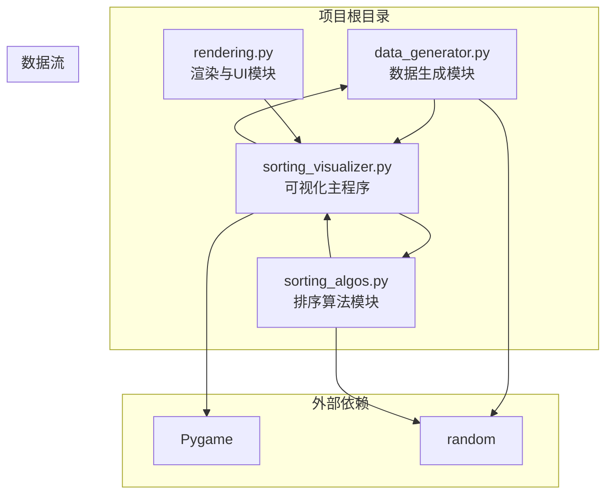
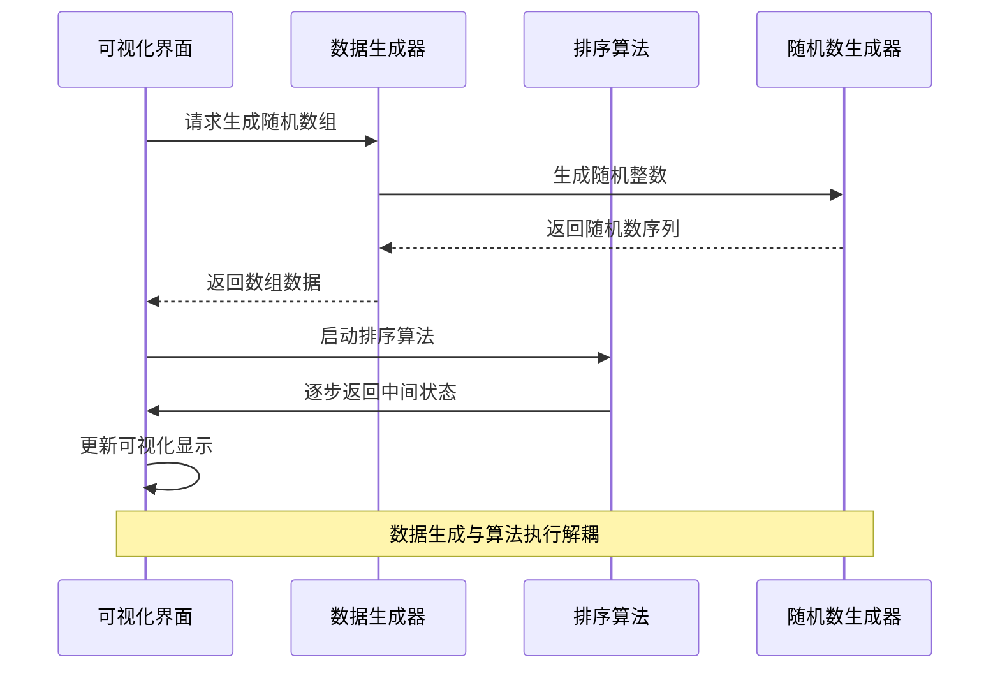
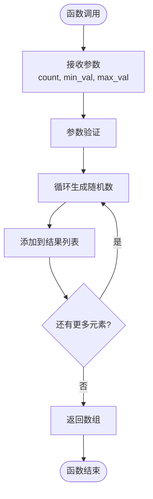
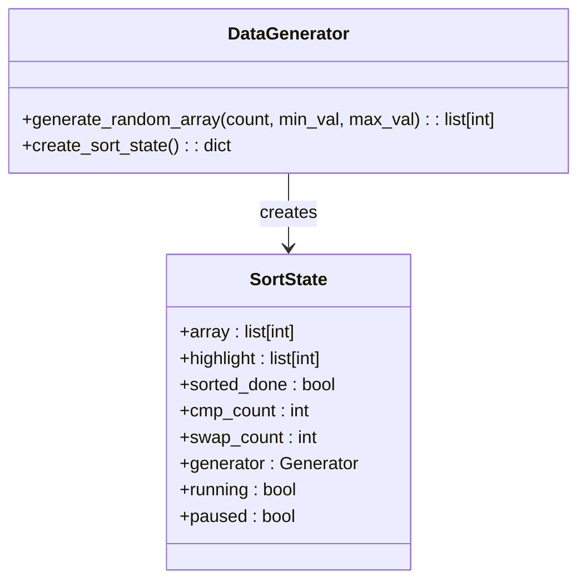
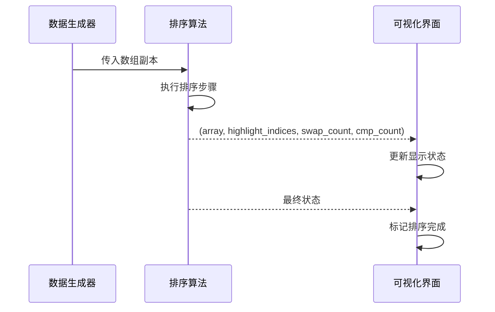
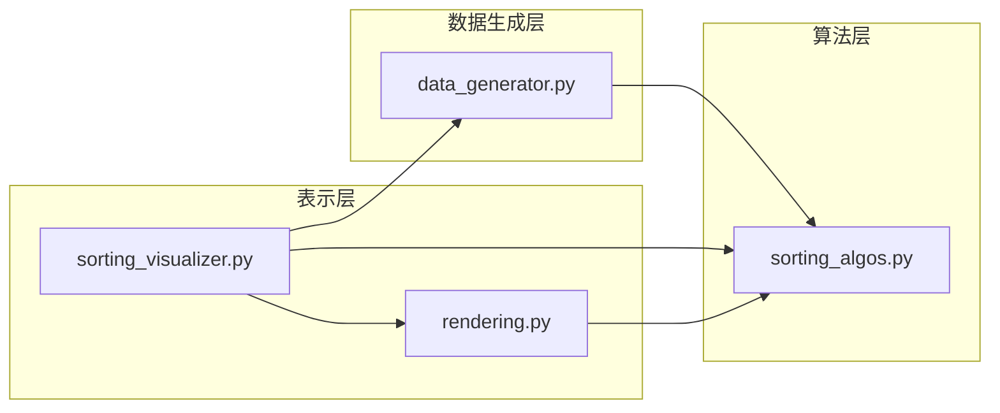

# 数据生成模块

<cite>
**本文档引用的文件**
- [data_generator.py](file://data_generator.py)
- [sorting_algos.py](file://sorting_algos.py)
- [sorting_visualizer.py](file://sorting_visualizer.py)
- [rendering.py](file://rendering.py)
</cite>

## 目录
1. [简介](#简介)
2. [项目结构](#项目结构)
3. [核心组件](#核心组件)
4. [架构概览](#架构概览)
5. [详细组件分析](#详细组件分析)
6. [依赖关系分析](#依赖关系分析)
7. [性能考虑](#性能考虑)
8. [故障排除指南](#故障排除指南)
9. [结论](#结论)
10. [附录](#附录)

## 简介

数据生成模块是Python数据可视化项目的核心组成部分，专门负责为排序算法可视化提供高质量的随机数组数据。该模块采用简洁而高效的实现方式，支持多种数据分布模式，并与排序算法模块无缝集成，为用户提供直观的算法执行过程演示。

该项目基于Pygame框架构建，包含19种不同的排序算法，从基础排序到趣味排序，涵盖了从O(n²)到O(n log n)的各种时间复杂度。数据生成模块作为底层支撑，确保了各种排序算法能够在一致且可控的数据集上进行演示。

## 项目结构

整个项目采用模块化设计，主要文件及其职责如下：

**图表来源**
- [data_generator.py:1-48](file://data_generator.py#L1-L48)
- [sorting_algos.py:1-600](file://sorting_algos.py#L1-L600)
- [sorting_visualizer.py:1-487](file://sorting_visualizer.py#L1-L487)
- [rendering.py:1-557](file://rendering.py#L1-L557)

**章节来源**
- [data_generator.py:1-48](file://data_generator.py#L1-L48)
- [sorting_visualizer.py:33-47](file://sorting_visualizer.py#L33-L47)

## 核心组件

数据生成模块目前包含两个核心功能组件：

### 1. 随机数组生成器
- **功能**：生成指定长度和数值范围的随机整数数组
- **参数**：数组长度、最小值、最大值
- **输出**：Python列表对象

### 2. 排序状态管理器
- **功能**：创建和管理排序过程的状态字典
- **包含字段**：数组数据、高亮索引、排序完成标志、比较计数、交换计数等

**章节来源**
- [data_generator.py:11-23](file://data_generator.py#L11-L23)
- [data_generator.py:26-47](file://data_generator.py#L26-L47)

## 架构概览

数据生成模块在整个可视化系统中的位置和交互关系如下：

**图表来源**
- [sorting_visualizer.py:186-196](file://sorting_visualizer.py#L186-L196)
- [sorting_visualizer.py:269-287](file://sorting_visualizer.py#L269-L287)

## 详细组件分析

### 随机数组生成器分析

#### 实现原理
随机数组生成器采用列表推导式的高效实现方式，通过内置的随机数生成函数创建指定范围内的整数序列。

**图表来源**
- [data_generator.py:11-23](file://data_generator.py#L11-L23)

#### 算法复杂度
- **时间复杂度**：O(n)，其中n为数组长度
- **空间复杂度**：O(n)，用于存储结果数组
- **内存使用**：线性增长，适合大规模数据生成

#### 参数配置机制
- **count参数**：控制数组长度，默认值为100
- **min_val参数**：控制随机数下界，默认值为1
- **max_val参数**：控制随机数上界，默认值为1000

**章节来源**
- [data_generator.py:11-23](file://data_generator.py#L11-L23)

### 排序状态管理器分析

#### 状态字典结构
排序状态管理器创建一个包含多个关键字段的字典，用于跟踪排序过程的各个方面：

**图表来源**
- [data_generator.py:26-47](file://data_generator.py#L26-L47)

#### 状态管理机制
- **数组数据**：存储当前排序的原始数组
- **高亮列表**：标记当前正在比较或操作的元素索引
- **排序完成标志**：指示排序过程是否结束
- **计数器**：跟踪比较和交换操作的次数
- **生成器引用**：保存当前排序算法的生成器实例
- **运行状态**：控制排序过程的启动、暂停和停止

**章节来源**
- [data_generator.py:26-47](file://data_generator.py#L26-L47)

### 数据接口规范

#### 数据格式约定
排序算法期望接收和返回特定格式的数据：

**图表来源**
- [sorting_visualizer.py:198-205](file://sorting_visualizer.py#L198-L205)
- [sorting_visualizer.py:269-287](file://sorting_visualizer.py#L269-L287)

#### 接口契约
- **输入要求**：整数数组，无重复值要求
- **输出格式**：四元组（数组状态、高亮索引、交换计数、比较计数）
- **状态传递**：通过生成器逐步传递中间状态
- **异常处理**：算法内部处理边界情况

**章节来源**
- [sorting_visualizer.py:198-205](file://sorting_visualizer.py#L198-L205)
- [sorting_visualizer.py:269-287](file://sorting_visualizer.py#L269-L287)

## 依赖关系分析

### 模块间依赖图

**图表来源**
- [sorting_visualizer.py:34-47](file://sorting_visualizer.py#L34-L47)

### 外部依赖分析

#### Python标准库依赖
- **random模块**：提供随机数生成功能
- **pygame模块**：提供图形界面和用户交互
- **asyncio模块**：支持异步编程模式

#### 第三方库依赖
- **Pygame**：游戏开发框架，提供图形渲染和事件处理
- **Platform模块**：检测运行环境（桌面/WASM）

**章节来源**
- [data_generator.py:8](file://data_generator.py#L8)
- [sorting_visualizer.py:17-28](file://sorting_visualizer.py#L17-L28)

## 性能考虑

### 时间复杂度分析
- **随机数组生成**：O(n)线性时间复杂度
- **内存分配**：O(n)线性空间复杂度
- **生成器模式**：支持惰性求值，减少内存占用

### 内存优化策略
- **生成器返回**：排序算法使用生成器逐步返回状态
- **数组副本创建**：避免修改原始数据
- **状态字典管理**：集中管理排序过程状态

### 并发处理
- **异步模式**：支持WASM环境下的异步渲染
- **多线程支持**：源码页面在独立线程中运行
- **事件驱动**：基于Pygame事件循环的响应式设计

## 故障排除指南

### 常见问题及解决方案

#### 1. 随机数范围问题
**症状**：生成的数组超出预期范围
**原因**：min_val和max_val参数配置不当
**解决**：检查参数范围，确保min_val ≤ max_val

#### 2. 内存不足问题
**症状**：大数据量时内存使用过高
**原因**：一次性生成大量数据
**解决**：使用生成器模式，按需生成数据

#### 3. 排序算法性能问题
**症状**：某些算法执行缓慢
**原因**：算法复杂度较高或参数设置不当
**解决**：选择合适的数据量，使用适当的算法

### 调试技巧
- **状态监控**：通过比较和交换计数监控算法性能
- **可视化调试**：利用高亮功能观察算法执行过程
- **日志记录**：在关键节点添加状态信息

**章节来源**
- [sorting_visualizer.py:269-287](file://sorting_visualizer.py#L269-L287)

## 结论

数据生成模块作为排序算法可视化系统的基础组件，展现了简洁而高效的实现理念。其设计充分考虑了性能、可维护性和用户体验，在保证功能完整性的同时实现了良好的扩展性。

模块的主要优势包括：
- **简单易用**：API设计直观，易于理解和使用
- **高性能**：采用优化的算法实现，满足实时可视化需求
- **可扩展**：模块化设计便于功能扩展和维护
- **兼容性强**：支持多种运行环境和平台

未来可以考虑的功能增强方向包括：支持更多数据分布模式、增加数据质量验证机制、提供批量数据生成功能等。

## 附录

### 数据分布模式扩展指南

#### 当前支持的分布模式
- **随机分布**：完全随机的数据排列
- **已排序分布**：升序排列的完美数据
- **逆序分布**：降序排列的最坏数据
- **部分排序**：近似有序但存在少量逆序的数据

#### 自定义分布模式实现步骤
1. **分析需求**：确定目标分布特性和应用场景
2. **设计算法**：制定数据生成策略和算法流程
3. **实现函数**：编写具体的生成函数
4. **测试验证**：验证数据质量和算法正确性
5. **集成测试**：与现有系统进行集成测试

### 性能优化最佳实践

#### 代码层面优化
- 使用生成器替代完整数据结构
- 避免不必要的数据复制
- 优化循环结构和条件判断
- 合理使用内置函数和库

#### 内存管理优化
- 及时释放不需要的对象引用
- 使用生成器表达式减少内存占用
- 避免创建大型临时数据结构
- 合理使用缓存机制

#### 用户体验优化
- 提供进度反馈和状态指示
- 支持中断和恢复功能
- 实现平滑的动画效果
- 提供丰富的交互控制