# UI渲染系统

<cite>
**本文档引用的文件**
- [rendering.py](file://rendering.py)
- [sorting_visualizer.py](file://sorting_visualizer.py)
- [sorting_algos.py](file://sorting_algos.py)
- [data_generator.py](file://data_generator.py)
</cite>

## 目录
1. [简介](#简介)
2. [项目结构](#项目结构)
3. [核心组件](#核心组件)
4. [架构概览](#架构概览)
5. [详细组件分析](#详细组件分析)
6. [依赖关系分析](#依赖关系分析)
7. [性能考虑](#性能考虑)
8. [故障排除指南](#故障排除指南)
9. [结论](#结论)
10. [附录](#附录)

## 简介

这是一个基于Pygame的数据可视化项目，专注于排序算法的可视化演示。该系统实现了完整的UI渲染框架，包括颜色管理、字体系统、交互式UI组件和动画效果。系统采用模块化设计，将渲染逻辑、算法实现和数据生成分离，提供了良好的可维护性和扩展性。

## 项目结构

该项目采用清晰的模块化架构，每个功能领域都有专门的文件：

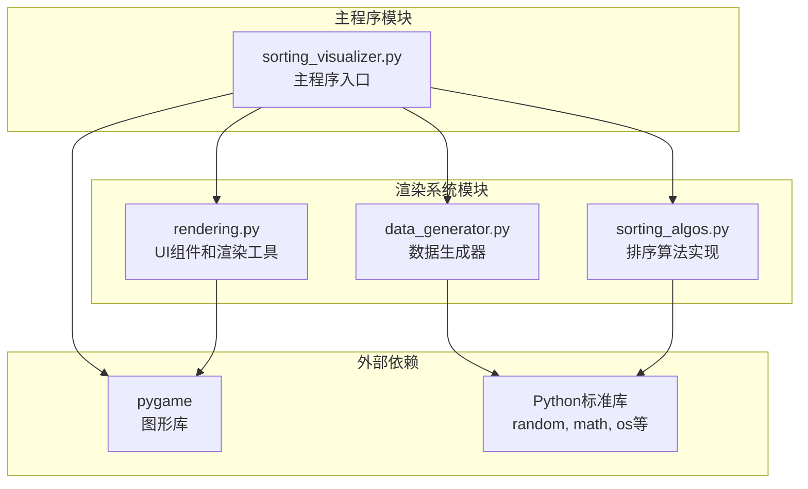

**图表来源**
- [sorting_visualizer.py:1-50](file://sorting_visualizer.py#L1-L50)
- [rendering.py:1-20](file://rendering.py#L1-L20)

**章节来源**
- [sorting_visualizer.py:1-60](file://sorting_visualizer.py#L1-L60)
- [rendering.py:1-50](file://rendering.py#L1-L50)

## 核心组件

UI渲染系统的核心由以下主要组件构成：

### 颜色管理系统
系统定义了丰富的颜色常量，用于统一UI设计风格：
- 基础颜色：黑色、白色、蓝色、黄色、绿色、红色等
- 调色板：青色、橙色、紫色、灰色、浅灰、深蓝、薄荷色等
- 控制栏高度常量：CTRL_H = 160像素

### 字体管理子系统
实现了多层次的字体系统：
- 小号字体：16px
- 中号字体：20px  
- 大号字体：28px
- 支持中文字体（微软雅黑、黑体）
- 自动字体回退机制

### UI组件库
系统提供了完整的UI组件集合：

#### 按钮组件（Button）
- 支持悬停效果
- 可配置的颜色方案
- 文本居中对齐
- 点击事件处理

#### 下拉菜单（DropDown）
- 可展开/折叠的选项列表
- 鼠标悬停高亮
- 选项选择反馈
- 动态位置计算

#### 数量设置对话框（CountDialog）
- 滑动条交互
- 文本输入支持
- 实时数值变更回调
- 确认/取消操作

#### 代码面板（CodePanel）
- 右侧浮动显示
- 语法高亮渲染
- 滚动条支持
- 行号显示

**章节来源**
- [rendering.py:14-33](file://rendering.py#L14-L33)
- [rendering.py:110-280](file://rendering.py#L110-L280)

## 架构概览

系统采用分层架构设计，实现了清晰的关注点分离：

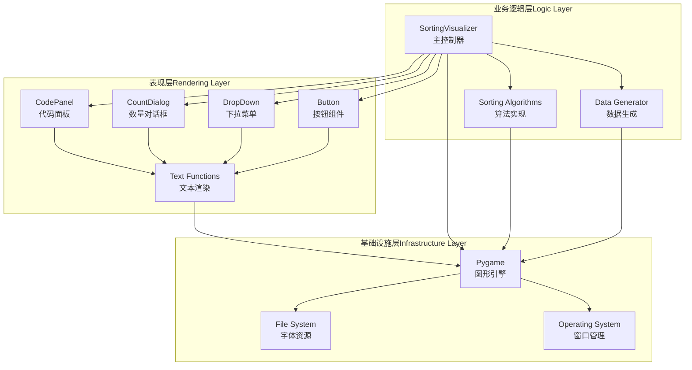

**图表来源**
- [sorting_visualizer.py:62-113](file://sorting_visualizer.py#L62-L113)
- [rendering.py:110-380](file://rendering.py#L110-L380)

## 详细组件分析

### 颜色常量系统

颜色系统采用了统一的命名约定和RGB色彩模型：

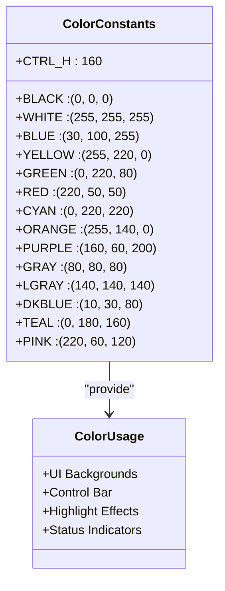

**图表来源**
- [rendering.py:16-32](file://rendering.py#L16-L32)

颜色系统的特点：
- **一致性**：所有组件使用相同的颜色常量
- **语义化**：颜色名称直观反映用途
- **可维护性**：集中管理便于主题修改

**章节来源**
- [rendering.py:14-33](file://rendering.py#L14-L33)

### 字体管理系统

字体系统实现了多级字体层次和智能回退机制：

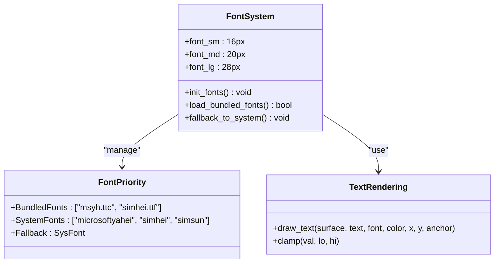

**图表来源**
- [sorting_visualizer.py:115-144](file://sorting_visualizer.py#L115-L144)
- [rendering.py:38-47](file://rendering.py#L38-L47)

字体管理的关键特性：
- **多级字体**：支持不同字号需求
- **字体回退**：从捆绑字体到系统字体的渐进式加载
- **跨平台兼容**：支持Windows字体路径
- **自动降级**：失败时使用系统默认字体

**章节来源**
- [sorting_visualizer.py:115-144](file://sorting_visualizer.py#L115-L144)

### UI组件设计模式

所有UI组件遵循统一的设计模式，实现了相似的接口：

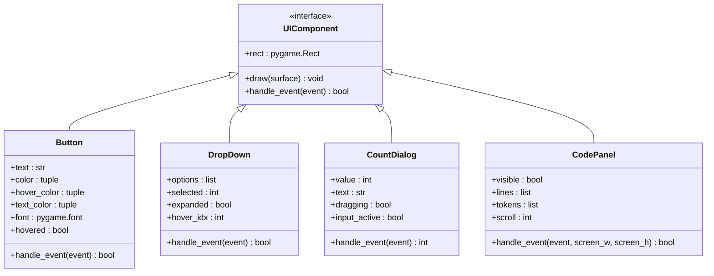

**图表来源**
- [rendering.py:354-379](file://rendering.py#L354-L379)
- [rendering.py:284-349](file://rendering.py#L284-L349)
- [rendering.py:384-564](file://rendering.py#L384-L564)
- [rendering.py:110-280](file://rendering.py#L110-L280)

#### 按钮组件分析

按钮组件实现了标准的GUI交互模式：

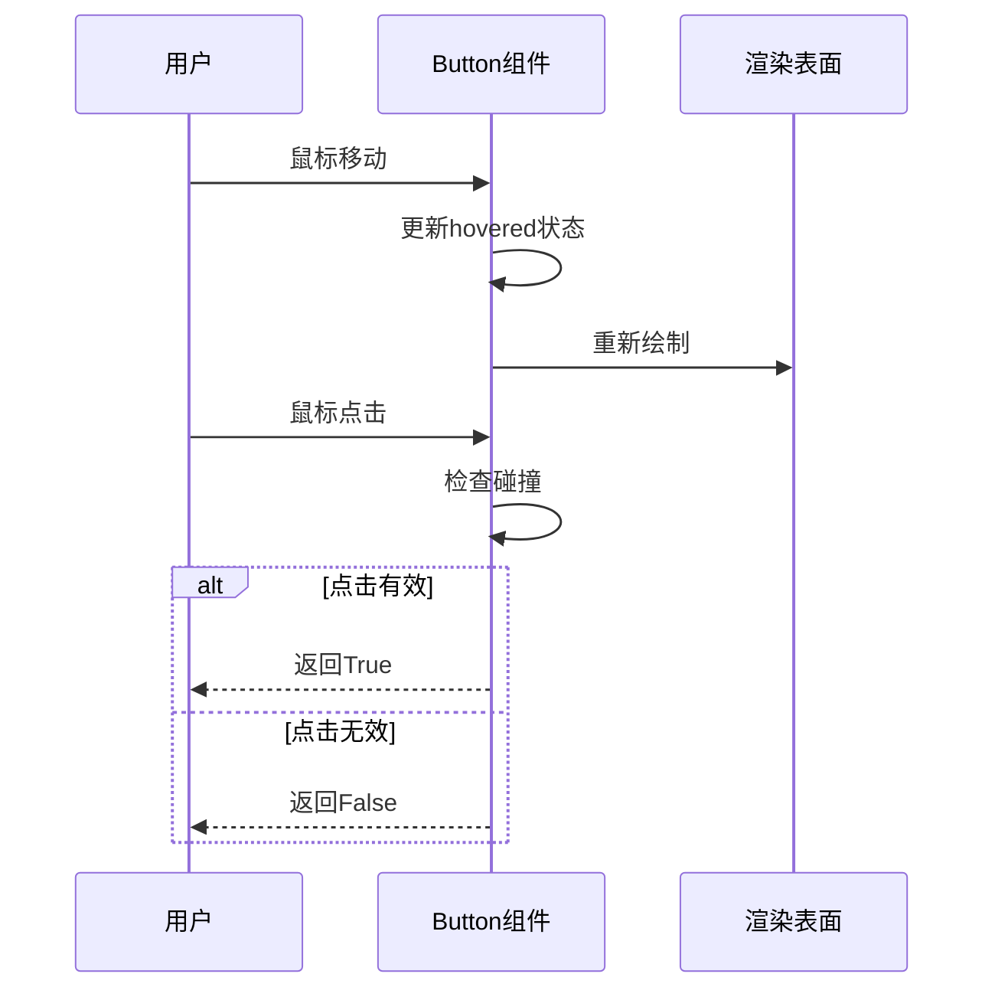

**图表来源**
- [rendering.py:354-379](file://rendering.py#L354-L379)

按钮组件的核心功能：
- **悬停检测**：实时鼠标位置跟踪
- **视觉反馈**：颜色变化表示悬停状态
- **事件处理**：标准化的点击事件响应
- **文本居中**：自动文本定位

**章节来源**
- [rendering.py:354-379](file://rendering.py#L354-L379)

#### 下拉菜单组件分析

下拉菜单实现了复杂的交互状态管理：

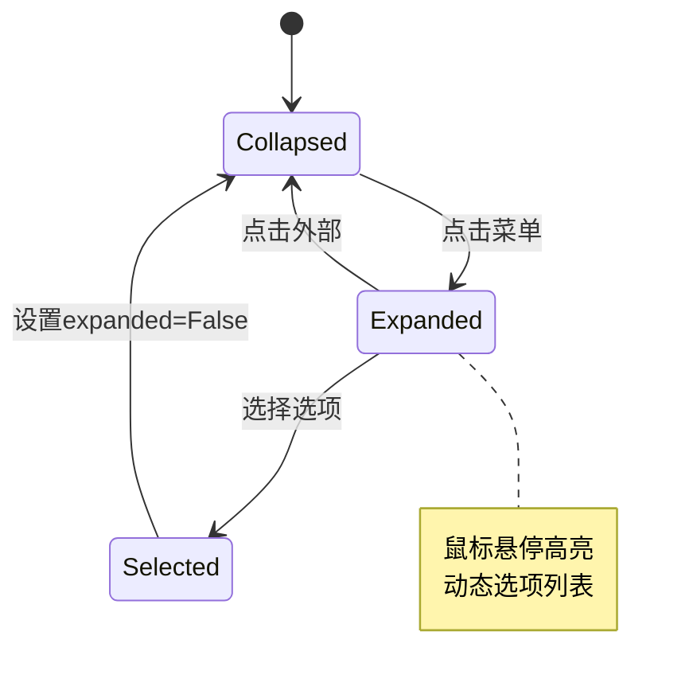

**图表来源**
- [rendering.py:284-349](file://rendering.py#L284-L349)

下拉菜单的关键特性：
- **状态管理**：展开/折叠状态切换
- **悬停高亮**：动态选项高亮显示
- **选项选择**：精确的鼠标碰撞检测
- **动态布局**：根据选项数量调整尺寸

**章节来源**
- [rendering.py:284-349](file://rendering.py#L284-L349)

#### 数量设置对话框分析

数量对话框结合了多种交互模式：

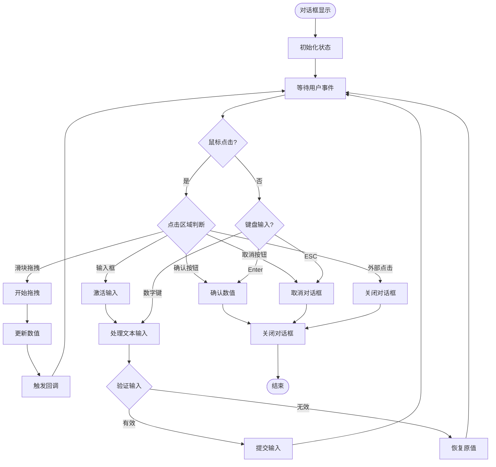

**图表来源**
- [rendering.py:384-564](file://rendering.py#L384-L564)

对话框的复杂交互模式：
- **滑块拖拽**：连续数值更新
- **文本输入**：即时验证和反馈
- **按钮操作**：确认/取消选择
- **键盘支持**：ESC取消，Enter确认

**章节来源**
- [rendering.py:384-564](file://rendering.py#L384-L564)

#### 代码面板组件分析

代码面板实现了高级的文本渲染和滚动功能：

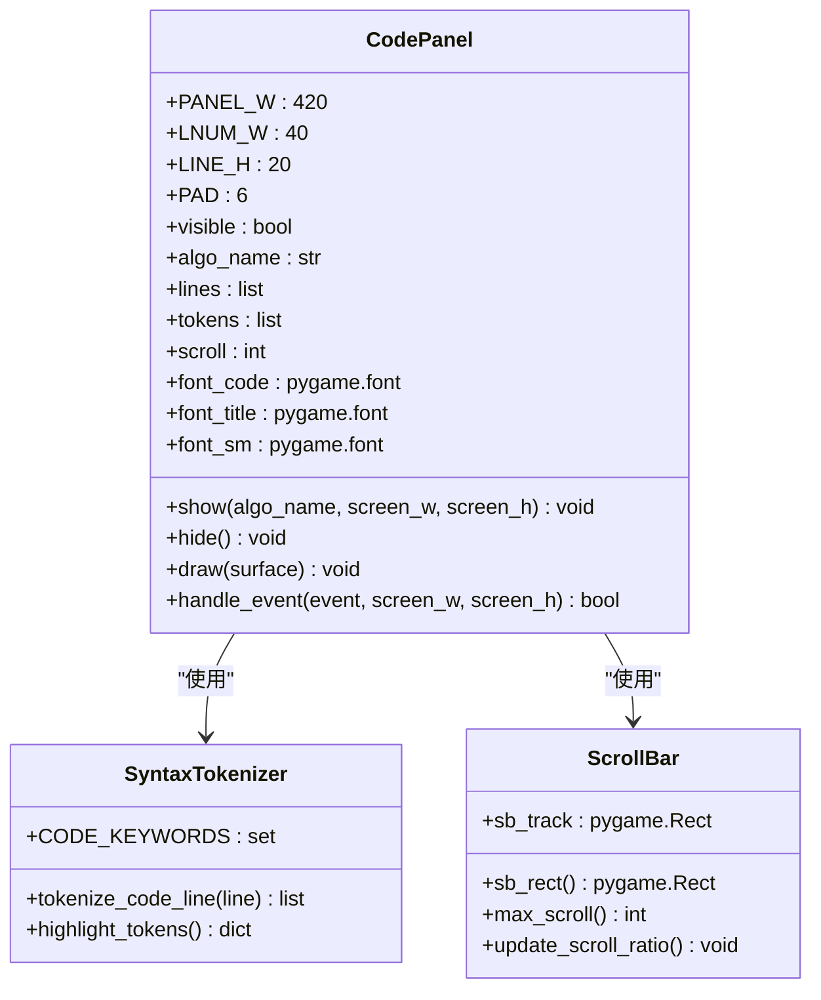

**图表来源**
- [rendering.py:110-280](file://rendering.py#L110-L280)

代码面板的高级功能：
- **语法高亮**：关键字、字符串、注释、函数名、数字的彩色显示
- **行号显示**：左侧固定宽度的行号区域
- **滚动支持**：拖拽滚动条和鼠标滚轮滚动
- **内存优化**：只渲染可见行内容

**章节来源**
- [rendering.py:110-280](file://rendering.py#L110-L280)

### 可视化区域绘制算法

可视化区域实现了高效的柱状图渲染：

```mermaid
flowchart TD
Start([开始绘制]) --> CalcSize[计算可视区域尺寸]
CalcSize --> CalcBarWidth[计算柱宽: (w-10)/n]
CalcBarWidth --> GetMaxVal[获取最大值]
GetMaxVal --> LoopBars{遍历数组元素}
LoopBars --> |有元素| CalcBarHeight[计算柱高: val/max_val*(h-5)]
CalcBarHeight --> CalcPosition[计算位置: x=10+i*bar_w, y=h-bar_h]
CalcPosition --> SetColor[设置颜色]
SetColor --> DrawRect[绘制矩形]
DrawRect --> LoopBars
LoopBars --> |无元素| End([结束])
```

**图表来源**
- [sorting_visualizer.py:289-312](file://sorting_visualizer.py#L289-L312)

柱状图绘制的关键算法：
- **坐标计算**：基于数组索引和值计算位置
- **颜色映射**：完成排序→绿色，高亮→黄色，普通→蓝色
- **尺寸适配**：动态适应屏幕尺寸和数据量
- **性能优化**：只绘制可见区域内的元素

**章节来源**
- [sorting_visualizer.py:289-312](file://sorting_visualizer.py#L289-L312)

### 事件处理系统

系统实现了完整的事件驱动架构：

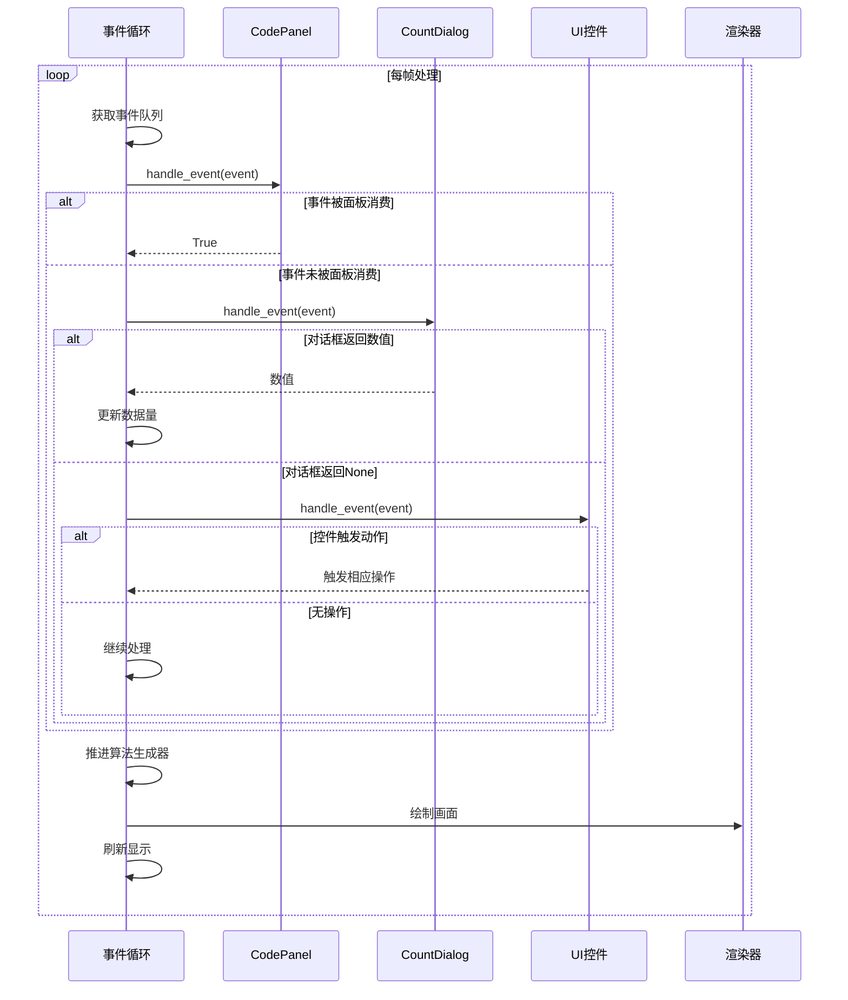

**图表来源**
- [sorting_visualizer.py:386-462](file://sorting_visualizer.py#L386-L462)

事件处理的层次结构：
- **面板优先**：代码面板事件优先处理
- **对话框次之**：数量对话框事件处理
- **控件最后**：其他UI控件事件处理
- **算法推进**：每帧推进排序算法

**章节来源**
- [sorting_visualizer.py:386-462](file://sorting_visualizer.py#L386-L462)

### 响应式设计实现

系统实现了灵活的响应式布局：

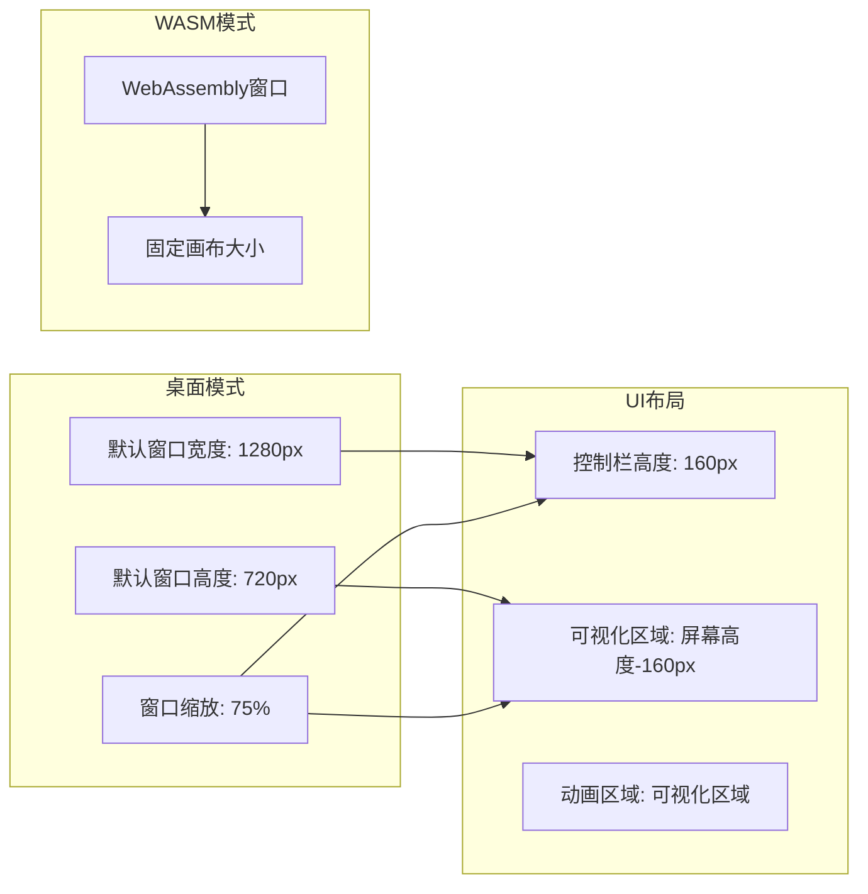

**图表来源**
- [sorting_visualizer.py:52-56](file://sorting_visualizer.py#L52-L56)
- [sorting_visualizer.py:263-267](file://sorting_visualizer.py#L263-L267)

响应式特性的实现：
- **动态窗口大小**：根据屏幕分辨率调整
- **相对布局**：UI元素按比例缩放
- **全屏支持**：支持全屏模式切换
- **字体自适应**：不同分辨率下的字体优化

**章节来源**
- [sorting_visualizer.py:52-56](file://sorting_visualizer.py#L52-L56)
- [sorting_visualizer.py:245-267](file://sorting_visualizer.py#L245-L267)

## 依赖关系分析

系统依赖关系清晰且模块化：

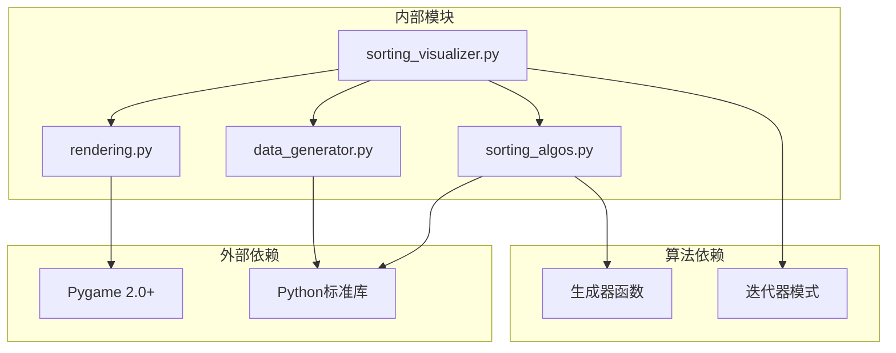

**图表来源**
- [sorting_visualizer.py:34-47](file://sorting_visualizer.py#L34-L47)
- [rendering.py:8-10](file://rendering.py#L8-L10)

依赖关系特点：
- **单向依赖**：主程序依赖渲染模块，渲染模块不反向依赖
- **最小耦合**：算法模块与渲染模块松散耦合
- **纯函数**：算法实现保持纯函数特性
- **外部库**：仅依赖Pygame进行图形渲染

**章节来源**
- [sorting_visualizer.py:34-47](file://sorting_visualizer.py#L34-L47)

## 性能考虑

系统在多个层面实现了性能优化：

### 渲染优化
- **增量更新**：只绘制变化的UI元素
- **可见性裁剪**：跳过不可见的UI组件
- **内存池**：字体和纹理资源复用
- **批量绘制**：减少OpenGL调用次数

### 算法优化
- **生成器模式**：惰性计算，节省内存
- **步进执行**：可调节的执行速度
- **状态缓存**：避免重复计算
- **早期退出**：完成排序后停止计算

### 内存管理
- **弱引用**：避免循环引用
- **及时释放**：临时对象及时销毁
- **对象池**：重复使用的对象复用
- **垃圾回收**：定期清理无用资源

## 故障排除指南

### 常见问题及解决方案

#### 字体加载失败
**症状**：UI文本显示异常或缺失
**原因**：字体文件不存在或权限不足
**解决方法**：
1. 检查字体文件路径
2. 确认字体文件完整性
3. 使用系统字体作为回退

#### 颜色显示异常
**症状**：颜色显示与预期不符
**原因**：RGB值超出范围或颜色常量冲突
**解决方法**：
1. 验证RGB值在0-255范围内
2. 检查颜色常量定义
3. 确认颜色使用的一致性

#### 事件处理冲突
**症状**：UI交互无响应或响应异常
**原因**：事件处理顺序错误或状态冲突
**解决方法**：
1. 检查事件处理优先级
2. 验证组件状态一致性
3. 添加事件消费标记

#### 性能问题
**症状**：帧率下降或卡顿
**原因**：过度绘制或计算密集型操作
**解决方法**：
1. 分析渲染热点
2. 实施延迟计算
3. 优化算法复杂度

**章节来源**
- [sorting_visualizer.py:115-144](file://sorting_visualizer.py#L115-L144)
- [rendering.py:38-47](file://rendering.py#L38-L47)

## 结论

该UI渲染系统展现了优秀的软件工程实践，具有以下突出特点：

### 设计优势
- **模块化架构**：清晰的职责分离和依赖管理
- **统一接口**：一致的UI组件设计模式
- **响应式设计**：灵活的布局适配能力
- **性能优化**：多层面的性能考虑和优化

### 技术特色
- **事件驱动**：完整的事件处理和状态管理
- **语法高亮**：专业的代码渲染功能
- **动画效果**：流畅的可视化展示
- **跨平台**：支持桌面和WebAssembly部署

### 扩展潜力
系统为未来的功能扩展提供了良好的基础，包括：
- 新UI组件的添加
- 自定义主题系统
- 更丰富的交互模式
- 高级动画效果

## 附录

### 使用示例

#### 基本UI组件使用
```python
# 创建按钮
button = Button(100, 100, 120, 40, "开始", (0, 160, 50))
button.draw(screen)

# 处理按钮事件
if button.handle_event(event):
    print("按钮被点击")
```

#### 自定义组件开发指南

要创建新的自定义UI组件，需要遵循以下步骤：

1. **定义接口**：实现统一的draw和handle_event方法
2. **状态管理**：维护组件的内部状态
3. **事件处理**：正确处理各种用户输入
4. **渲染优化**：实现高效的绘制逻辑
5. **集成测试**：确保与其他组件的兼容性

#### 扩展建议

- **主题系统**：实现可配置的主题和样式
- **动画框架**：提供统一的动画接口
- **国际化支持**：添加多语言文本支持
- **无障碍访问**：改进键盘导航和屏幕阅读器支持