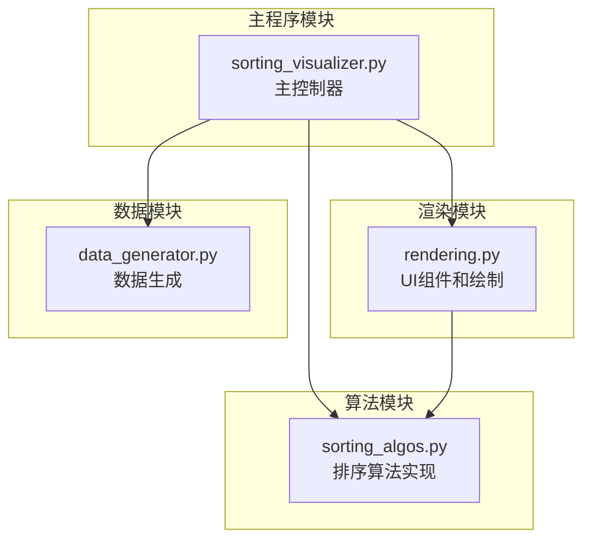
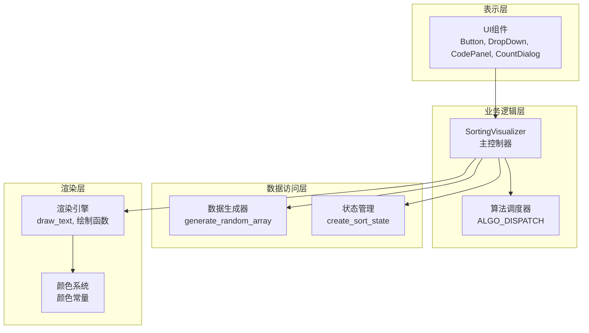
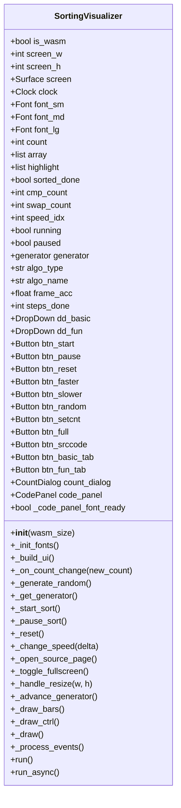
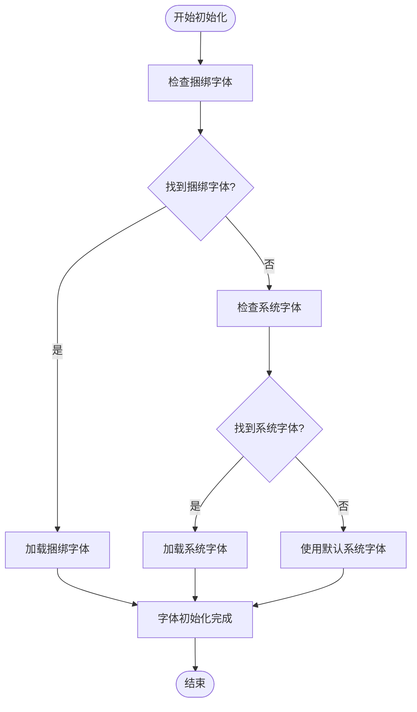
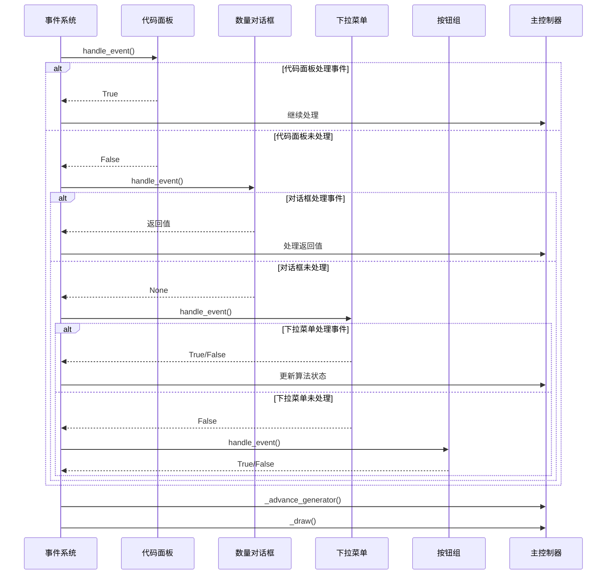
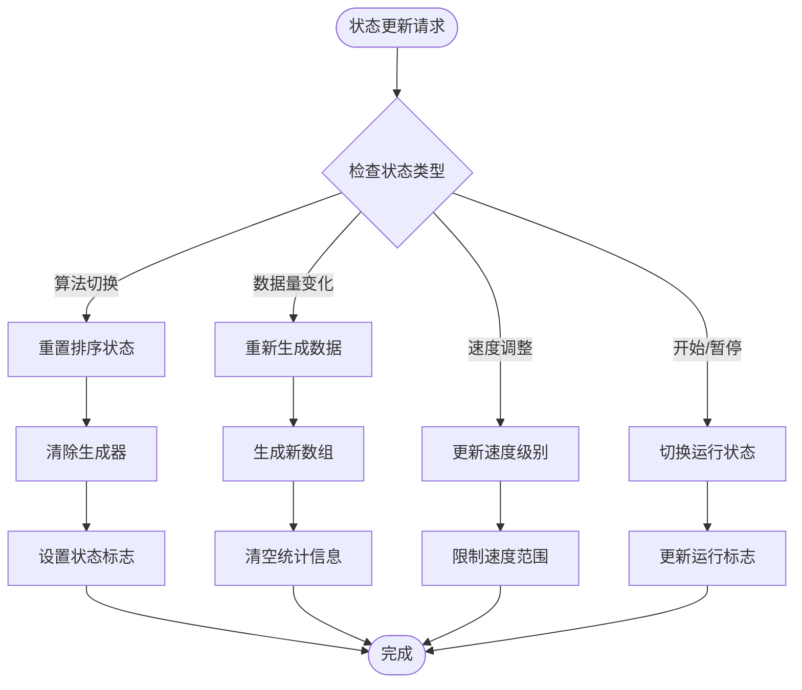
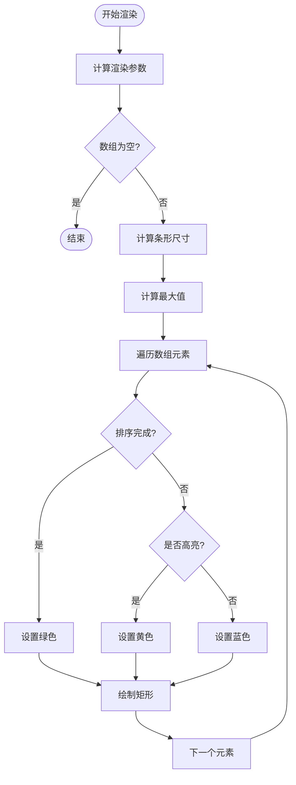
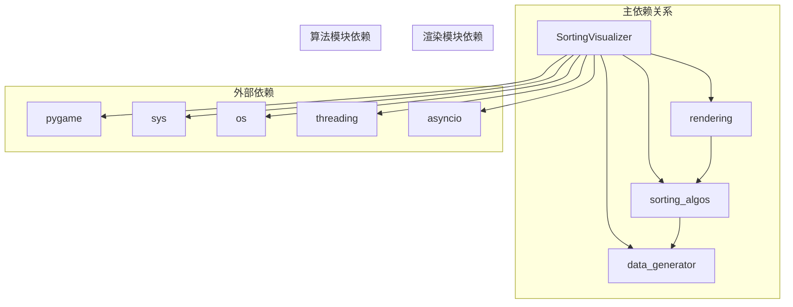

# 主控制器设计

<cite>
**本文档引用的文件**
- [sorting_visualizer.py](file://sorting_visualizer.py)
- [rendering.py](file://rendering.py)
- [sorting_algos.py](file://sorting_algos.py)
- [data_generator.py](file://data_generator.py)
</cite>

## 目录
1. [简介](#简介)
2. [项目结构](#项目结构)
3. [核心组件](#核心组件)
4. [架构概览](#架构概览)
5. [详细组件分析](#详细组件分析)
6. [依赖关系分析](#依赖关系分析)
7. [性能考虑](#性能考虑)
8. [故障排除指南](#故障排除指南)
9. [结论](#结论)

## 简介

SortingVisualizer是一个基于Pygame的排序算法可视化工具，采用事件驱动架构设计。该项目的核心是主控制器类`SortingVisualizer`，它负责管理整个应用程序的状态、处理用户交互、协调算法执行和渲染输出。该系统支持桌面模式和Web浏览器(WASM)两种运行环境，提供了丰富的排序算法演示功能。

## 项目结构

项目采用模块化设计，将不同功能分离到独立的模块中：

**图表来源**
- [sorting_visualizer.py:1-50](file://sorting_visualizer.py#L1-L50)
- [rendering.py:1-20](file://rendering.py#L1-L20)
- [sorting_algos.py:1-20](file://sorting_algos.py#L1-L20)
- [data_generator.py:1-20](file://data_generator.py#L1-L20)

**章节来源**
- [sorting_visualizer.py:1-50](file://sorting_visualizer.py#L1-L50)
- [rendering.py:1-20](file://rendering.py#L1-L20)
- [sorting_algos.py:1-20](file://sorting_algos.py#L1-L20)
- [data_generator.py:1-20](file://data_generator.py#L1-L20)

## 核心组件

### 主控制器类架构

主控制器`SortingVisualizer`是整个系统的核心，负责协调各个组件的工作。其设计遵循以下原则：

- **事件驱动架构**：通过事件循环处理用户输入和系统事件
- **状态管理模式**：集中管理应用状态，确保数据一致性
- **组件化设计**：将UI组件、算法组件和数据组件分离
- **多平台支持**：同时支持桌面和Web浏览器环境

### 全局常量配置

系统定义了多个全局常量来统一管理配置参数：

| 常量名 | 值 | 描述 |
|--------|-----|------|
| WIN_WIDTH | 1280 | 默认窗口宽度 |
| WIN_HEIGHT | 720 | 默认窗口高度 |
| FPS | 60 | 渲染帧率 |
| DEFAULT_COUNT | 100 | 默认数据量 |
| SPEED_LEVELS | [0.25, 0.5, 1.0, 2.0, 4.0, 8.0, 16.0, 32.0, 64.0, 128.0] | 速度级别数组 |

**章节来源**
- [sorting_visualizer.py:50-57](file://sorting_visualizer.py#L50-L57)

## 架构概览

系统采用分层架构设计，主要分为以下几个层次：

**图表来源**
- [sorting_visualizer.py:62-113](file://sorting_visualizer.py#L62-L113)
- [rendering.py:13-47](file://rendering.py#L13-L47)
- [sorting_algos.py:505-550](file://sorting_algos.py#L505-L550)
- [data_generator.py:11-48](file://data_generator.py#L11-L48)

## 详细组件分析

### 主控制器类设计

#### 类结构图

**图表来源**
- [sorting_visualizer.py:62-489](file://sorting_visualizer.py#L62-L489)

#### 初始化流程

主控制器的初始化过程包含以下关键步骤：

1. **环境检测**：检测是否在WASM环境中运行
2. **屏幕设置**：根据环境类型设置合适的屏幕尺寸
3. **字体初始化**：加载字体资源，支持多语言显示
4. **状态初始化**：设置默认的应用状态
5. **数据生成**：生成初始随机数组
6. **UI构建**：创建所有UI组件

**章节来源**
- [sorting_visualizer.py:63-113](file://sorting_visualizer.py#L63-L113)

### 字体系统初始化

字体系统采用了智能回退机制，确保在不同环境下都能正常显示：

**图表来源**
- [sorting_visualizer.py:115-144](file://sorting_visualizer.py#L115-L144)

**章节来源**
- [sorting_visualizer.py:115-144](file://sorting_visualizer.py#L115-L144)

### UI组件构建机制

系统实现了完整的UI组件构建机制，包括多种交互组件：

#### 按钮组件

按钮组件具有完整的交互状态管理：
- **悬停状态**：鼠标悬停时改变颜色
- **点击状态**：点击时触发相应的事件处理
- **文本渲染**：支持居中对齐和多种字体大小

#### 下拉菜单组件

下拉菜单支持动态展开和收起：
- **选项管理**：动态管理菜单选项
- **悬停高亮**：悬停时高亮显示选中项
- **事件处理**：支持鼠标点击和移动事件

#### 对话框组件

对话框组件提供复杂的数据输入功能：
- **滑块输入**：支持拖拽调整数值
- **文本输入**：支持键盘输入和验证
- **确认/取消**：提供标准的对话框操作

**章节来源**
- [rendering.py:354-379](file://rendering.py#L354-L379)
- [rendering.py:284-349](file://rendering.py#L284-L349)
- [rendering.py:384-564](file://rendering.py#L384-L564)

### 多平台支持机制

系统实现了完整的多平台支持，主要体现在以下方面：

#### 桌面模式特性

- **全屏支持**：支持全屏切换功能
- **窗口调整**：支持窗口大小调整
- **外部程序**：支持启动外部源码查看程序
- **本地文件**：支持读取本地文件系统

#### Web浏览器(WASM)模式特性

- **异步处理**：使用asyncio进行异步事件处理
- **无窗口调整**：禁用窗口调整功能
- **无全屏**：禁用全屏模式
- **简化功能**：移除桌面特有的功能

**章节来源**
- [sorting_visualizer.py:23-28](file://sorting_visualizer.py#L23-L28)
- [sorting_visualizer.py:30-32](file://sorting_visualizer.py#L30-L32)
- [sorting_visualizer.py:456-458](file://sorting_visualizer.py#L456-L458)
- [sorting_visualizer.py:472-479](file://sorting_visualizer.py#L472-L479)

### 事件处理流程

系统采用统一的事件处理机制，所有UI组件都遵循相同的事件处理模式：

**图表来源**
- [sorting_visualizer.py:386-461](file://sorting_visualizer.py#L386-L461)
- [rendering.py:241-278](file://rendering.py#L241-L278)
- [rendering.py:491-564](file://rendering.py#L491-L564)

**章节来源**
- [sorting_visualizer.py:386-461](file://sorting_visualizer.py#L386-L461)

### 状态管理系统

系统实现了完整的状态管理机制，确保应用状态的一致性和可预测性：

#### 状态变量说明

| 状态变量 | 类型 | 描述 | 默认值 |
|----------|------|------|--------|
| count | int | 数据数组长度 | 100 |
| array | list | 当前数据数组 | [] |
| highlight | list | 高亮显示索引 | [] |
| sorted_done | bool | 排序完成标志 | False |
| cmp_count | int | 比较次数 | 0 |
| swap_count | int | 交换次数 | 0 |
| speed_idx | int | 速度级别索引 | 2 |
| running | bool | 运行状态 | False |
| paused | bool | 暂停状态 | False |
| generator | generator | 排序生成器 | None |
| algo_type | str | 算法类型 | "basic" |
| algo_name | str | 当前算法名称 | BASIC_ALGOS[0] |

#### 状态更新流程

**图表来源**
- [sorting_visualizer.py:186-234](file://sorting_visualizer.py#L186-L234)
- [sorting_visualizer.py:208-226](file://sorting_visualizer.py#L208-L226)

**章节来源**
- [sorting_visualizer.py:94-106](file://sorting_visualizer.py#L94-L106)
- [sorting_visualizer.py:186-234](file://sorting_visualizer.py#L186-L234)

### 渲染控制机制

系统实现了高效的渲染控制机制，支持多种渲染模式：

#### 视觉条渲染

**图表来源**
- [sorting_visualizer.py:289-312](file://sorting_visualizer.py#L289-L312)

#### 控制栏渲染

控制栏包含以下信息：
- **标题显示**：显示"排序算法可视化"
- **状态信息**：显示当前算法、比较次数、交换次数、速度、数据量
- **算法标签**：显示基础排序和趣味排序标签
- **进度提示**：显示排序完成状态

**章节来源**
- [sorting_visualizer.py:289-362](file://sorting_visualizer.py#L289-L362)

## 依赖关系分析

系统采用松耦合的设计，各模块之间的依赖关系清晰明确：

**图表来源**
- [sorting_visualizer.py:34-47](file://sorting_visualizer.py#L34-L47)
- [rendering.py:8-10](file://rendering.py#L8-L10)
- [sorting_algos.py:9](file://sorting_algos.py#L9)

### 依赖注入模式

系统采用依赖注入的方式管理模块间的依赖关系：

- **算法调度**：通过`ALGO_DISPATCH`字典实现算法的动态调度
- **UI组件**：通过构造函数注入字体和回调函数
- **数据生成**：通过函数调用实现数据的动态生成

**章节来源**
- [sorting_visualizer.py:34-47](file://sorting_visualizer.py#L34-L47)
- [sorting_algos.py:529-550](file://sorting_algos.py#L529-L550)

## 性能考虑

系统在设计时充分考虑了性能优化：

### 渲染性能优化

- **批量绘制**：使用Pygame的批量绘制功能减少绘制调用
- **增量更新**：只更新发生变化的UI组件
- **内存管理**：及时释放不再使用的字体和图像资源

### 算法性能优化

- **生成器模式**：使用Python生成器实现渐进式算法执行
- **速度控制**：通过速度级别控制算法执行频率
- **状态缓存**：缓存算法源码以提高代码面板的响应速度

### 内存管理

- **字体缓存**：缓存已加载的字体以避免重复加载
- **代码缓存**：缓存算法源码以提高访问速度
- **状态复用**：复用现有的状态对象避免频繁创建

## 故障排除指南

### 常见问题及解决方案

#### 字体加载失败

**问题描述**：应用程序无法加载字体文件

**解决方案**：
1. 检查字体文件是否存在
2. 确认字体文件权限正确
3. 验证字体文件格式兼容性

#### 算法执行异常

**问题描述**：排序算法执行过程中出现错误

**解决方案**：
1. 检查算法参数的有效性
2. 验证数据数组的完整性
3. 确认算法生成器的状态

#### UI组件响应问题

**问题描述**：按钮或菜单无法正常响应用户操作

**解决方案**：
1. 检查事件处理函数的正确性
2. 验证组件的可见性和启用状态
3. 确认鼠标位置检测的准确性

**章节来源**
- [sorting_visualizer.py:115-144](file://sorting_visualizer.py#L115-L144)
- [rendering.py:241-278](file://rendering.py#L241-L278)

## 结论

SortingVisualizer主控制器展现了优秀的软件架构设计：

### 设计优势

1. **模块化设计**：清晰的模块分离使得代码易于维护和扩展
2. **事件驱动架构**：灵活的事件处理机制支持复杂的用户交互
3. **多平台支持**：统一的接口设计实现了桌面和Web环境的无缝切换
4. **状态管理**：完善的状态管理系统确保了应用的稳定性和一致性

### 技术亮点

- **生成器模式**：巧妙地使用Python生成器实现了渐进式算法演示
- **智能回退机制**：字体系统和算法源码的多重回退确保了跨平台兼容性
- **组件化UI**：可复用的UI组件提高了开发效率和代码质量
- **异步处理**：WASM模式下的异步事件处理保证了Web环境的流畅体验

### 改进建议

1. **错误处理增强**：可以添加更详细的错误日志和异常处理机制
2. **性能监控**：可以集成性能监控工具来跟踪渲染和算法执行性能
3. **测试覆盖**：建议增加单元测试和集成测试来提高代码质量
4. **文档完善**：可以添加更多的API文档和使用示例

该系统为排序算法教学和演示提供了一个优秀的可视化平台，其设计理念和实现方式值得其他类似项目借鉴学习。