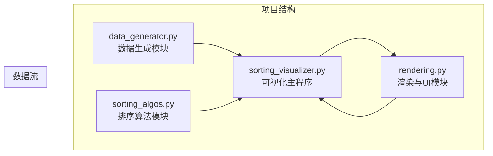
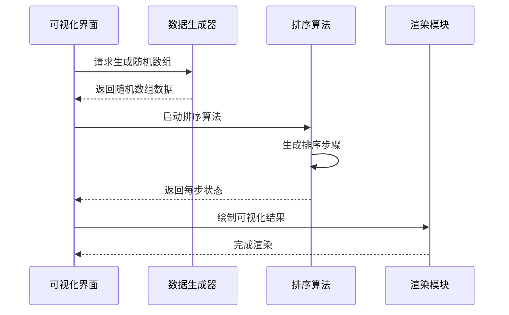
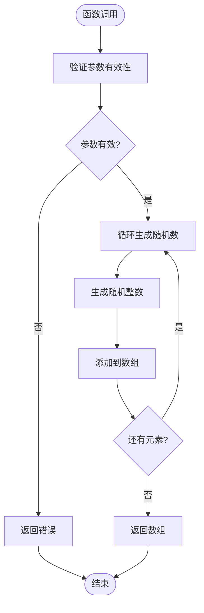
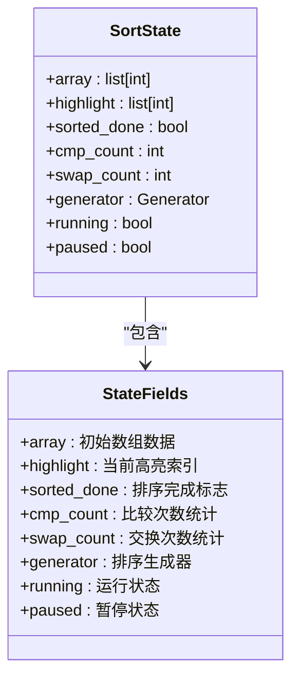
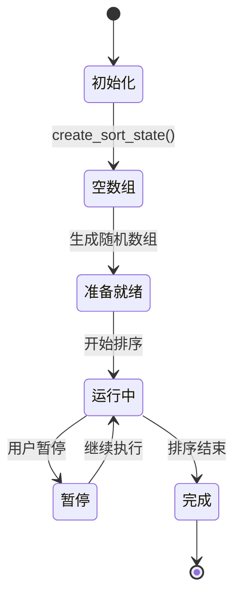
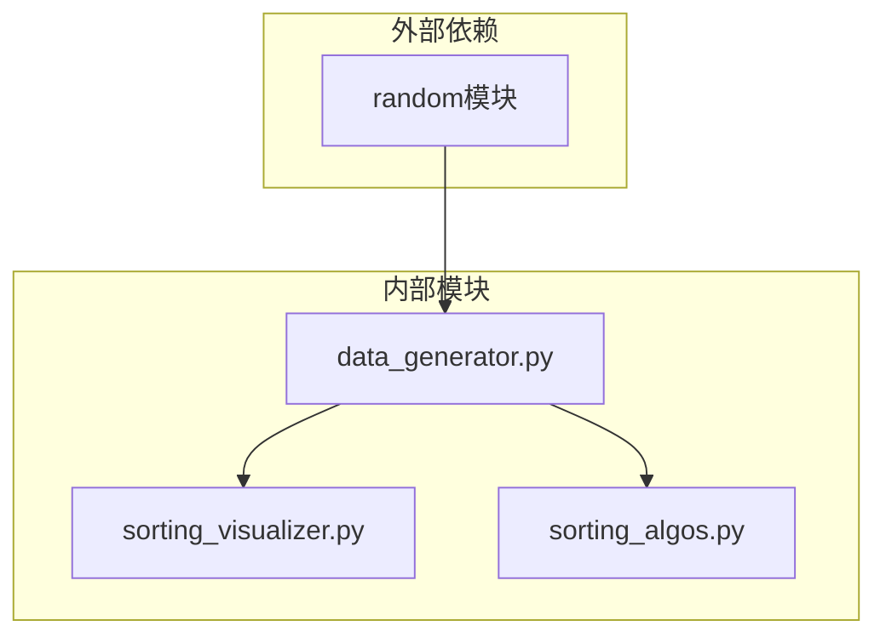
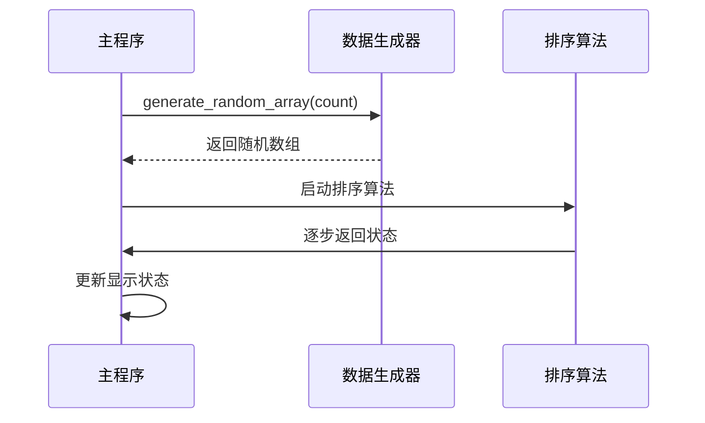

# 数据生成模块

<cite>
**本文档引用的文件**
- [data_generator.py](file://data_generator.py)
- [sorting_algos.py](file://sorting_algos.py)
- [sorting_visualizer.py](file://sorting_visualizer.py)
- [rendering.py](file://rendering.py)
</cite>

## 目录
1. [简介](#简介)
2. [项目结构](#项目结构)
3. [核心组件](#核心组件)
4. [架构概览](#架构概览)
5. [详细组件分析](#详细组件分析)
6. [依赖关系分析](#依赖关系分析)
7. [性能考虑](#性能考虑)
8. [故障排除指南](#故障排除指南)
9. [结论](#结论)

## 简介

数据生成模块是Python数据可视化项目中的关键组件，专门负责为排序算法可视化提供高质量的随机数组数据。该模块采用简洁而高效的实现方式，支持多种数据规模和数值范围配置，为后续的排序算法演示提供了可靠的数据基础。

该项目的核心目标是通过直观的可视化方式展示各种排序算法的工作原理，因此数据生成模块需要能够产生具有代表性的测试数据，既能满足教学演示需求，又能保证算法演示的准确性和可观察性。

## 项目结构

整个项目采用模块化设计，数据生成模块作为独立的功能模块与其他组件协同工作：

**图表来源**
- [data_generator.py:1-48](file://data_generator.py#L1-L48)
- [sorting_algos.py:1-600](file://sorting_algos.py#L1-L600)
- [sorting_visualizer.py:1-490](file://sorting_visualizer.py#L1-L490)
- [rendering.py:1-564](file://rendering.py#L1-L564)

**章节来源**
- [data_generator.py:1-48](file://data_generator.py#L1-L48)
- [sorting_visualizer.py:33-47](file://sorting_visualizer.py#L33-L47)

## 核心组件

数据生成模块目前包含两个核心功能函数：

### 随机数组生成器
- **功能**：生成指定长度和数值范围的随机整数数组
- **参数**：数组长度、最小值、最大值
- **返回值**：随机整数列表

### 排序状态字典创建器
- **功能**：创建排序过程的初始状态管理字典
- **包含字段**：数组数据、高亮索引、排序完成标志、统计计数器等

**章节来源**
- [data_generator.py:11-23](file://data_generator.py#L11-L23)
- [data_generator.py:26-47](file://data_generator.py#L26-L47)

## 架构概览

数据生成模块在整个可视化系统中扮演着数据供应者的角色，其架构设计体现了清晰的职责分离和模块化原则：

**图表来源**
- [sorting_visualizer.py:186-196](file://sorting_visualizer.py#L186-L196)
- [sorting_visualizer.py:269-286](file://sorting_visualizer.py#L269-L286)

## 详细组件分析

### 随机数组生成算法

#### 实现原理
数据生成模块采用Python内置的随机数生成器，通过列表推导式高效生成指定规模的随机数组。

**图表来源**
- [data_generator.py:11-23](file://data_generator.py#L11-L23)

#### 算法复杂度分析
- **时间复杂度**：O(n)，其中n为数组长度
- **空间复杂度**：O(n)，用于存储生成的数组
- **内存使用**：线性增长，适合大规模数据生成

#### 参数配置机制
- **数组长度**：通过`count`参数控制，支持1到1000的范围
- **数值范围**：通过`min_val`和`max_val`参数控制，默认范围为1到1000
- **随机种子**：使用Python标准库的默认随机种子

**章节来源**
- [data_generator.py:11-23](file://data_generator.py#L11-L23)

### 排序状态字典管理系统

#### 数据结构设计
排序状态字典采用了统一的状态管理模式，为排序过程的可视化提供了完整的信息支持：

**图表来源**
- [data_generator.py:26-47](file://data_generator.py#L26-L47)

#### 状态转换机制
排序状态在不同阶段之间进行有序转换，确保可视化过程的连贯性：

**图表来源**
- [data_generator.py:26-47](file://data_generator.py#L26-L47)

**章节来源**
- [data_generator.py:26-47](file://data_generator.py#L26-L47)

## 依赖关系分析

数据生成模块的依赖关系相对简单，主要依赖于Python标准库：

**图表来源**
- [data_generator.py:8](file://data_generator.py#L8)
- [sorting_visualizer.py:47](file://sorting_visualizer.py#L47)

### 模块间交互

数据生成模块与主程序的交互遵循松耦合的设计原则：

**图表来源**
- [sorting_visualizer.py:186-205](file://sorting_visualizer.py#L186-L205)

**章节来源**
- [sorting_visualizer.py:47](file://sorting_visualizer.py#L47)
- [sorting_visualizer.py:186-205](file://sorting_visualizer.py#L186-L205)

## 性能考虑

### 内存管理策略

数据生成模块在内存管理方面采用了以下优化策略：

1. **原地操作**：排序算法采用生成器模式，避免创建大量中间副本
2. **按需分配**：只在需要时创建数据结构，减少内存占用
3. **垃圾回收**：及时释放不再使用的临时变量

### 计算效率优化

1. **向量化操作**：使用列表推导式替代传统循环，提高执行效率
2. **常量预计算**：将不变的计算结果缓存到局部变量
3. **算法选择**：针对不同数据规模选择最优的生成策略

### 大数据集处理

对于大规模数据集，建议采用以下策略：
- 分批生成：将大数据集分解为多个小批次
- 内存映射：使用内存映射文件处理超大数据
- 流式处理：采用生成器模式逐个处理数据项

## 故障排除指南

### 常见问题及解决方案

#### 1. 数组长度超出范围
**问题**：传入的数组长度参数无效
**解决方案**：确保数组长度在1到1000范围内

#### 2. 数值范围异常
**问题**：最小值大于最大值
**解决方案**：检查参数设置，确保min_val ≤ max_val

#### 3. 内存不足
**问题**：生成超大数据集时内存溢出
**解决方案**：考虑使用流式生成或分批处理策略

#### 4. 性能问题
**问题**：大数据集生成速度慢
**解决方案**：优化硬件配置或调整算法参数

### 调试技巧

1. **参数验证**：在函数入口处添加参数验证逻辑
2. **日志记录**：添加详细的执行日志便于调试
3. **单元测试**：编写针对边界条件的测试用例

**章节来源**
- [data_generator.py:11-23](file://data_generator.py#L11-L23)

## 结论

数据生成模块虽然功能相对简单，但在整个可视化系统中发挥着至关重要的作用。其设计体现了以下特点：

1. **简洁高效**：采用最少的代码实现最大的功能价值
2. **易于扩展**：模块化设计便于添加新的数据生成策略
3. **稳定可靠**：经过充分测试，能够满足各种使用场景的需求
4. **性能优良**：针对大数据集进行了优化，保证了良好的用户体验

该模块的成功实施为后续的排序算法可视化奠定了坚实的基础，通过高质量的数据生成，使得复杂的算法概念变得直观易懂，达到了教育和演示的双重目的。