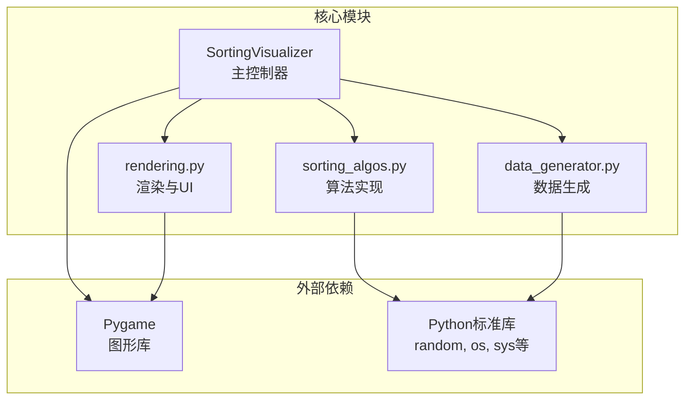
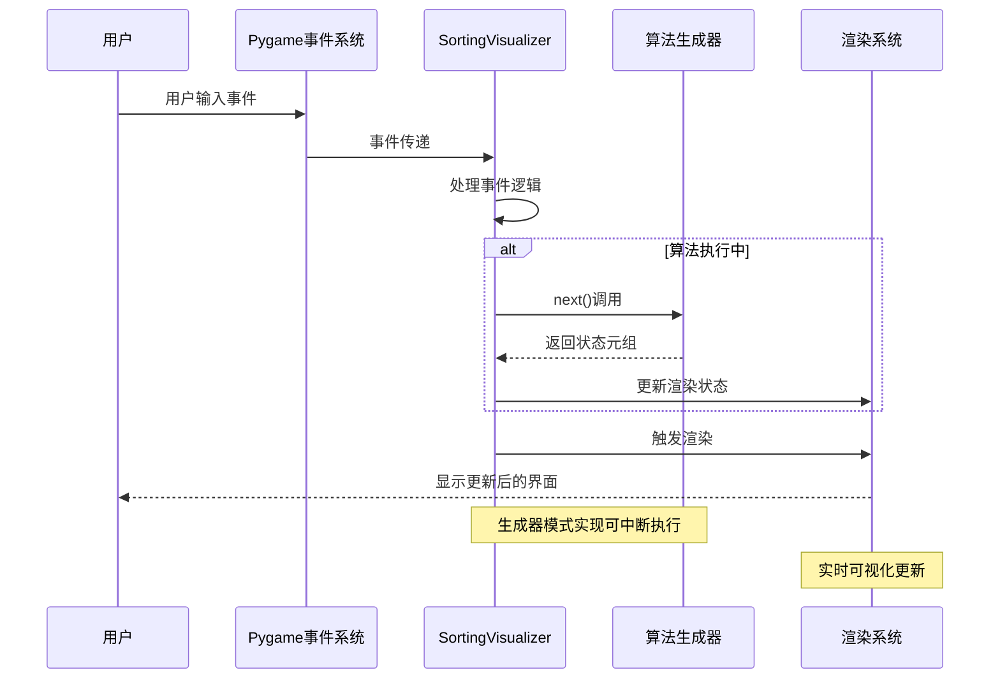
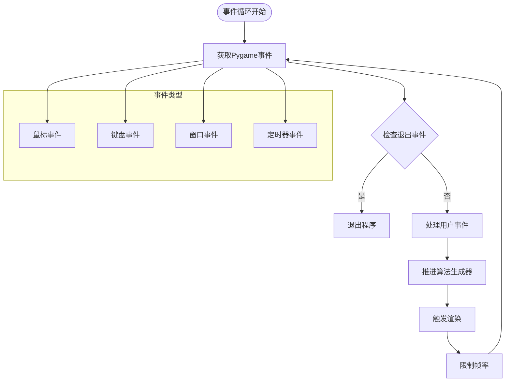
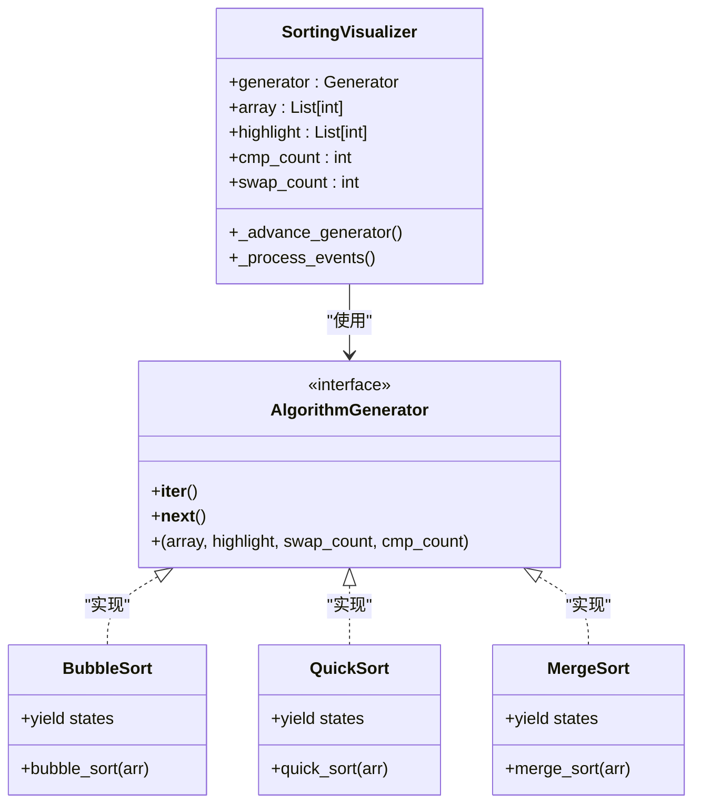
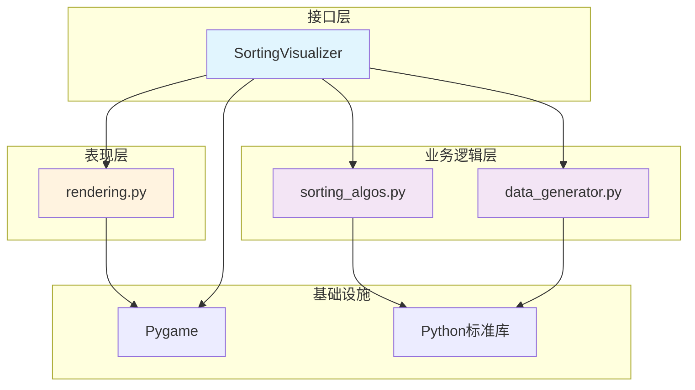
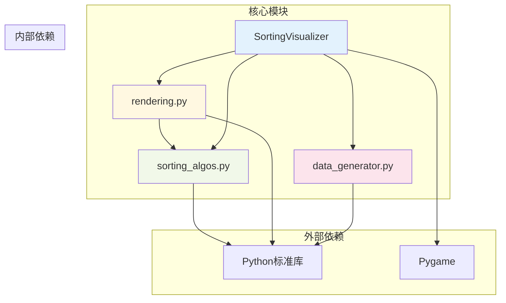

# 核心架构设计

<cite>
**本文档引用的文件**
- [sorting_visualizer.py](file://sorting_visualizer.py)
- [sorting_algos.py](file://sorting_algos.py)
- [rendering.py](file://rendering.py)
- [data_generator.py](file://data_generator.py)
</cite>

## 目录
1. [引言](#引言)
2. [项目结构](#项目结构)
3. [核心组件](#核心组件)
4. [架构概览](#架构概览)
5. [详细组件分析](#详细组件分析)
6. [依赖关系分析](#依赖关系分析)
7. [性能考虑](#性能考虑)
8. [故障排除指南](#故障排除指南)
9. [结论](#结论)

## 引言

本项目是一个基于Pygame的数据可视化应用程序，专门用于展示各种排序算法的执行过程。该系统采用事件驱动的架构模式，通过生成器函数实现了可中断的算法执行和实时可视化。整个系统由四个主要模块组成：SortingVisualizer主控制器、sorting_algos.py算法模块、rendering.py渲染模块和data_generator.py数据生成模块。

该架构的核心设计理念是模块化分离和事件驱动的交互模式。SortingVisualizer作为主控制器协调各个模块之间的通信，sorting_algos.py提供19种不同的排序算法实现，rendering.py负责所有图形界面和用户交互，data_generator.py专注于数据生成。这种设计使得系统具有良好的可维护性和扩展性。

## 项目结构

项目采用简洁而清晰的模块化组织结构：

**图表来源**
- [sorting_visualizer.py:1-50](file://sorting_visualizer.py#L1-L50)
- [sorting_algos.py:1-10](file://sorting_algos.py#L1-L10)
- [rendering.py:1-15](file://rendering.py#L1-L15)
- [data_generator.py:1-10](file://data_generator.py#L1-L10)

**章节来源**
- [sorting_visualizer.py:1-50](file://sorting_visualizer.py#L1-L50)
- [sorting_algos.py:1-10](file://sorting_algos.py#L1-L10)
- [rendering.py:1-15](file://rendering.py#L1-L15)
- [data_generator.py:1-10](file://data_generator.py#L1-L10)

## 核心组件

### SortingVisualizer主控制器

SortingVisualizer是整个系统的中枢控制器，负责协调所有子系统的运作。它继承了事件驱动架构的核心特性，通过Pygame的事件循环机制处理用户交互和渲染更新。

**主要职责：**
- 窗口管理和屏幕尺寸控制
- 用户界面状态管理
- 事件处理和响应
- 渲染调度和帧率控制
- 算法执行协调

**关键特性：**
- 支持桌面模式和WebAssembly(WASM)模式
- 双重事件循环支持（同步和异步）
- 实时性能监控（比较次数、交换次数）
- 可调节的执行速度控制

**章节来源**
- [sorting_visualizer.py:62-113](file://sorting_visualizer.py#L62-L113)
- [sorting_visualizer.py:454-479](file://sorting_visualizer.py#L454-L479)

### sorting_algos.py算法模块

该模块包含了19种不同的排序算法实现，每种算法都以生成器函数的形式提供。这种设计的核心优势在于算法执行的可中断性和实时可视化能力。

**算法分类：**
- **基础排序算法（10种）**：冒泡排序、选择排序、插入排序、快速排序、归并排序、希尔排序、堆排序、桶排序、计数排序、基数排序
- **趣味排序算法（9种）**：猴子排序、睡眠排序、面条排序、斯大林排序、鸡尾酒排序、慢排序、煎饼排序、珠排序、鸽巢排序

**生成器模式应用：**
每个算法函数都返回一个生成器，通过`yield`语句在算法执行的关键节点输出当前状态，包括数组状态、高亮索引、交换次数和比较次数。

**章节来源**
- [sorting_algos.py:12-25](file://sorting_algos.py#L12-L25)
- [sorting_algos.py:35-300](file://sorting_algos.py#L35-L300)
- [sorting_algos.py:305-550](file://sorting_algos.py#L305-L550)

### rendering.py渲染模块

rendering.py模块负责所有图形渲染和用户界面交互功能。它实现了完整的UI组件系统，包括按钮、下拉菜单、对话框和代码面板。

**核心组件：**
- **颜色管理系统**：定义了丰富的颜色常量用于不同状态的可视化
- **UI组件库**：Button、DropDown、CountDialog、CodePanel等
- **代码语法高亮**：完整的Python代码语法解析和着色
- **文本渲染工具**：灵活的文本绘制和定位系统

**渲染策略：**
- 分层渲染：控制栏、可视化区域、UI面板的层次管理
- 实时更新：基于生成器状态的增量渲染
- 自适应布局：根据窗口大小动态调整UI组件位置

**章节来源**
- [rendering.py:13-33](file://rendering.py#L13-L33)
- [rendering.py:110-280](file://rendering.py#L110-L280)
- [rendering.py:284-552](file://rendering.py#L284-L552)

### data_generator.py数据模块

数据生成模块专注于为排序算法提供高质量的测试数据。它确保了数据的多样性和算法演示的有效性。

**核心功能：**
- 随机数组生成：支持自定义范围和长度
- 排序状态管理：提供标准化的状态字典结构
- 数据验证：确保生成的数据符合算法要求

**设计特点：**
- 灵活的参数配置
- 高效的随机数生成
- 标准化的数据格式

**章节来源**
- [data_generator.py:11-24](file://data_generator.py#L11-L24)
- [data_generator.py:26-48](file://data_generator.py#L26-L48)

## 架构概览

系统采用事件驱动的架构模式，通过Pygame的事件循环实现非阻塞的用户交互和实时渲染。

**图表来源**
- [sorting_visualizer.py:379-451](file://sorting_visualizer.py#L379-L451)
- [sorting_visualizer.py:262-280](file://sorting_visualizer.py#L262-L280)

**章节来源**
- [sorting_visualizer.py:379-451](file://sorting_visualizer.py#L379-L451)
- [sorting_visualizer.py:262-280](file://sorting_visualizer.py#L262-L280)

## 详细组件分析

### 事件循环系统

事件循环系统是整个架构的核心，它实现了非阻塞的用户交互和实时渲染。

**图表来源**
- [sorting_visualizer.py:454-479](file://sorting_visualizer.py#L454-L479)
- [sorting_visualizer.py:379-451](file://sorting_visualizer.py#L379-L451)

#### 用户输入处理

用户输入处理采用事件驱动的方式，所有UI组件都实现了统一的事件处理接口。

**处理流程：**
1. 事件收集：Pygame收集所有用户输入事件
2. 事件分发：SortingVisualizer根据事件类型分发给相应组件
3. 状态更新：组件更新内部状态并可能触发全局状态变化
4. 渲染触发：状态更新后触发重新渲染

**章节来源**
- [sorting_visualizer.py:379-451](file://sorting_visualizer.py#L379-L451)
- [rendering.py:354-379](file://rendering.py#L354-L379)

#### 定时器事件和渲染更新

系统通过Pygame的时钟机制实现精确的帧率控制和定时器功能。

**帧率控制：**
- 固定60 FPS的渲染频率
- 基于时间的移动计算
- 可调节的速度倍率系统

**渲染优化：**
- 增量渲染：只更新发生变化的部分
- 双缓冲技术：避免闪烁现象
- 分层渲染：控制栏、可视化区域、UI面板的独立渲染

**章节来源**
- [sorting_visualizer.py:88-110](file://sorting_visualizer.py#L88-L110)
- [sorting_visualizer.py:350-376](file://sorting_visualizer.py#L350-L376)

### 生成器模式应用

生成器模式是该系统的核心设计模式，它实现了算法执行的可中断性和实时可视化。

**图表来源**
- [sorting_visualizer.py:262-280](file://sorting_visualizer.py#L262-L280)
- [sorting_algos.py:35-300](file://sorting_algos.py#L35-L300)

#### 生成器函数的实现模式

每个排序算法都遵循相同的生成器模式：

**状态输出格式：**
- `array`: 当前数组状态的副本
- `highlight`: 需要高亮显示的索引列表
- `swap_count`: 交换操作的累计次数
- `cmp_count`: 比较操作的累计次数

**执行控制：**
- 在算法的关键步骤产生中间状态
- 支持暂停和恢复执行
- 通过StopIteration信号结束执行

**章节来源**
- [sorting_algos.py:35-300](file://sorting_algos.py#L35-L300)
- [sorting_visualizer.py:262-280](file://sorting_visualizer.py#L262-L280)

### 模块化设计原则

系统严格遵循模块化设计原则，确保各模块之间的低耦合和高内聚。

**图表来源**
- [sorting_visualizer.py:34-47](file://sorting_visualizer.py#L34-L47)
- [sorting_algos.py:1-10](file://sorting_algos.py#L1-L10)
- [rendering.py:1-15](file://rendering.py#L1-L15)
- [data_generator.py:1-10](file://data_generator.py#L1-L10)

#### 职责边界划分

**SortingVisualizer职责：**
- 系统状态管理
- 事件协调
- 性能监控
- 用户交互处理

**sorting_algos.py职责：**
- 算法实现
- 状态生成
- 性能统计
- 源码提取

**rendering.py职责：**
- 图形渲染
- UI组件管理
- 用户交互处理
- 代码语法高亮

**data_generator.py职责：**
- 数据生成
- 状态初始化
- 数据验证

**章节来源**
- [sorting_visualizer.py:34-47](file://sorting_visualizer.py#L34-L47)
- [sorting_algos.py:1-10](file://sorting_algos.py#L1-L10)
- [rendering.py:1-15](file://rendering.py#L1-L15)
- [data_generator.py:1-10](file://data_generator.py#L1-L10)

## 依赖关系分析

系统采用了清晰的依赖层次结构，确保了模块间的松耦合。

**图表来源**
- [sorting_visualizer.py:17-47](file://sorting_visualizer.py#L17-L47)
- [sorting_algos.py:1-10](file://sorting_algos.py#L1-L10)
- [rendering.py:8-11](file://rendering.py#L8-L11)
- [data_generator.py:8-10](file://data_generator.py#L8-L10)

### 依赖注入和解耦

系统通过显式的导入声明实现了模块间的解耦：

**导入模式：**
- SortingVisualizer明确导入需要的功能
- sorting_algos.py提供算法函数映射表
- rendering.py独立管理UI组件
- data_generator.py专注数据生成

**接口抽象：**
- 所有模块都通过明确定义的接口进行交互
- 避免了循环依赖
- 支持模块替换和扩展

**章节来源**
- [sorting_visualizer.py:34-47](file://sorting_visualizer.py#L34-L47)
- [sorting_algos.py:507-550](file://sorting_algos.py#L507-L550)
- [rendering.py:10](file://rendering.py#L10)

## 性能考虑

系统在设计时充分考虑了性能优化，特别是在实时渲染和算法执行方面。

### 渲染性能优化

**增量渲染策略：**
- 只更新发生变化的像素区域
- 使用Pygame的subsurface技术减少绘制开销
- 合理的缓冲区管理避免内存碎片

**帧率控制：**
- 固定60 FPS的渲染频率
- 基于时间的动画插值
- 可调节的速度倍率系统

**内存管理：**
- 生成器模式避免大量中间状态存储
- 数组状态的按需复制
- 及时释放不再使用的资源

### 算法执行优化

**生成器效率：**
- 每个算法步骤只产生必要的状态信息
- 避免不必要的数组复制
- 使用原地修改减少内存分配

**用户交互响应：**
- 非阻塞的事件处理
- 异步模式支持Web环境
- 实时性能指标显示

## 故障排除指南

### 常见问题诊断

**Pygame初始化失败：**
- 检查系统是否正确安装Pygame
- 验证显示驱动程序的兼容性
- 确认权限设置允许窗口创建

**算法执行异常：**
- 检查数组长度是否在合理范围内
- 验证算法参数的有效性
- 确认生成器状态的一致性

**渲染问题：**
- 检查字体文件的可用性
- 验证颜色常量的定义
- 确认屏幕尺寸的合法性

### 调试技巧

**日志记录：**
- 在关键事件点添加调试信息
- 监控生成器的执行状态
- 跟踪用户交互的处理流程

**性能分析：**
- 使用Python内置的性能分析工具
- 监控内存使用情况
- 分析渲染帧率的稳定性

**章节来源**
- [sorting_visualizer.py:24-29](file://sorting_visualizer.py#L24-L29)
- [sorting_visualizer.py:115-144](file://sorting_visualizer.py#L115-L144)

## 结论

该Python数据可视化项目成功实现了基于Pygame的事件驱动架构，通过生成器模式巧妙地解决了算法执行与实时可视化的平衡问题。系统的设计体现了以下核心优势：

**架构优势：**
- 清晰的模块化分离，便于维护和扩展
- 事件驱动的非阻塞设计，提供流畅的用户体验
- 生成器模式的应用，实现了算法执行的可中断性

**技术特色：**
- 完整的UI组件系统，支持复杂的用户交互
- 高效的渲染优化，确保60 FPS的流畅体验
- 双模式支持（桌面/WASM），增强部署灵活性

**扩展潜力：**
- 算法模块的独立性便于添加新的排序算法
- 渲染系统的模块化设计支持自定义视觉效果
- 事件系统的通用性可扩展到其他类型的可视化应用

该架构为类似的数据可视化项目提供了优秀的参考模板，展示了如何在保持代码简洁的同时实现复杂的功能需求。