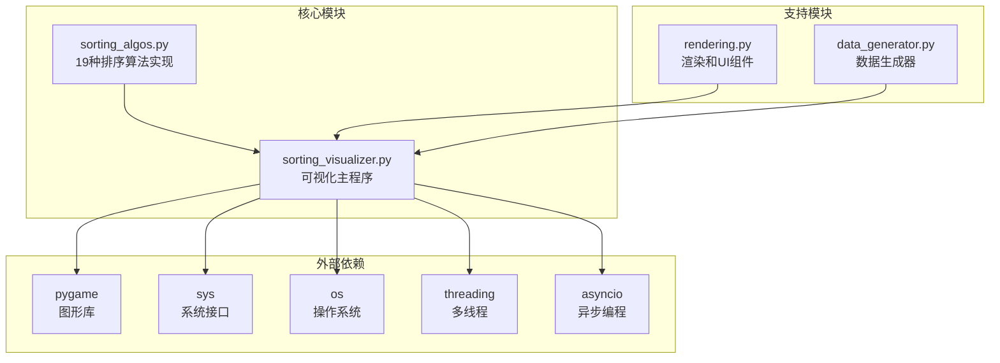
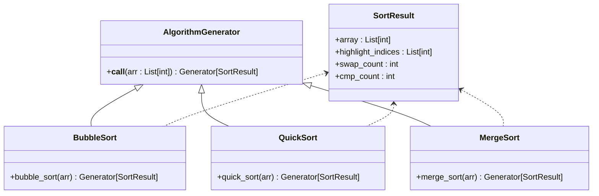
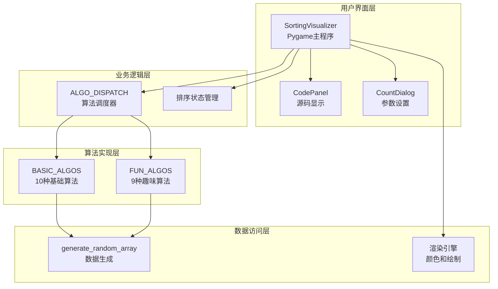
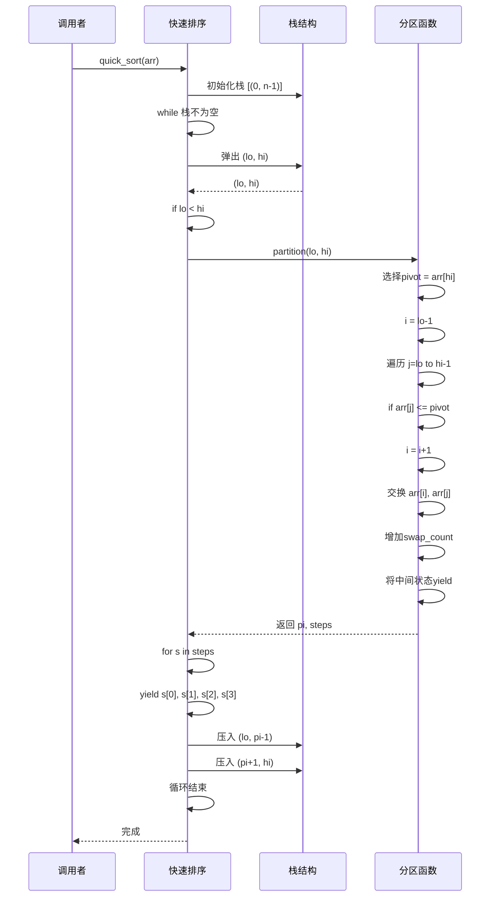
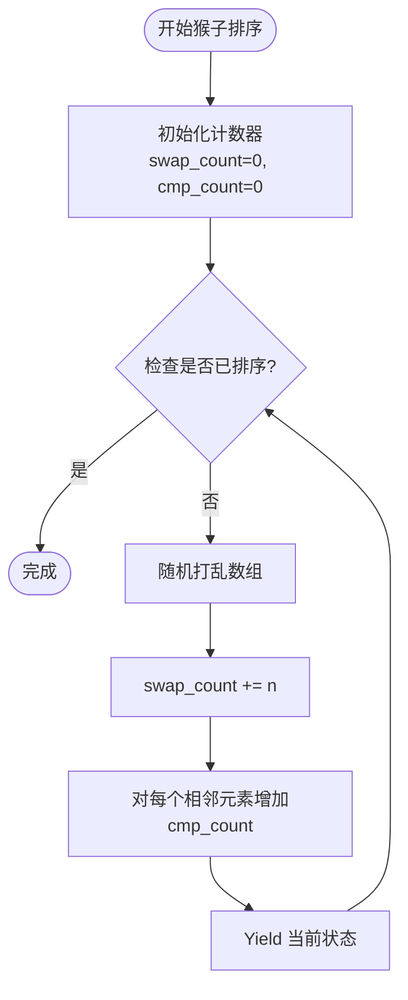
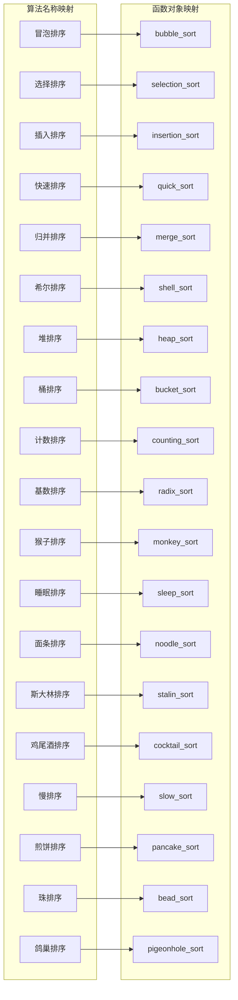
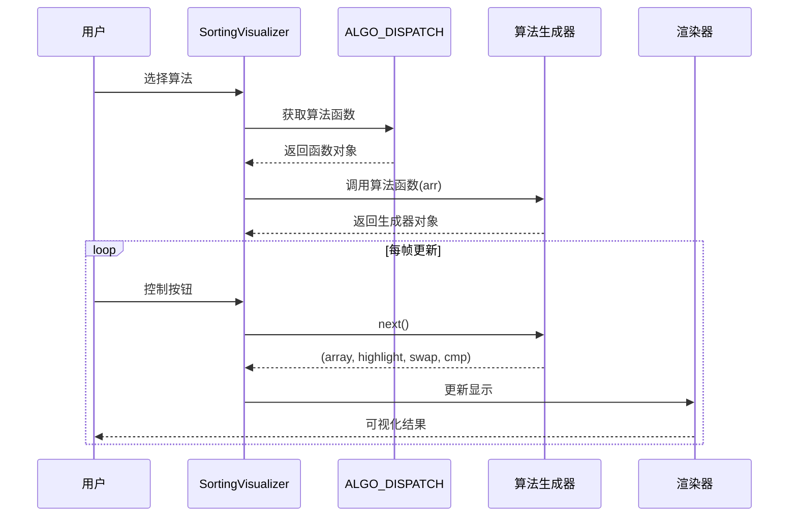
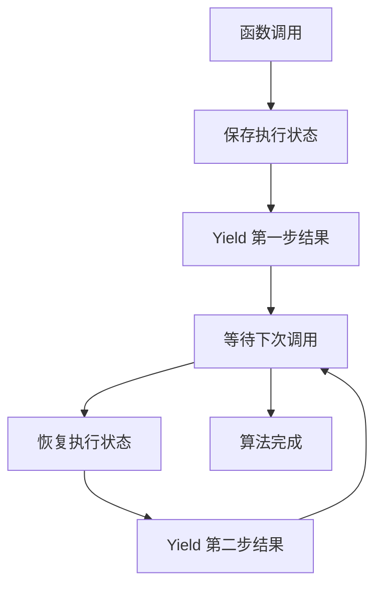

# 算法模块架构

<cite>
**本文档引用的文件**
- [sorting_algos.py](file://sorting_algos.py)
- [sorting_visualizer.py](file://sorting_visualizer.py)
- [rendering.py](file://rendering.py)
- [data_generator.py](file://data_generator.py)
</cite>

## 目录
1. [引言](#引言)
2. [项目结构](#项目结构)
3. [核心组件](#核心组件)
4. [架构概览](#架构概览)
5. [详细组件分析](#详细组件分析)
6. [算法调度机制](#算法调度机制)
7. [生成器模式应用](#生成器模式应用)
8. [复杂度分析](#复杂度分析)
9. [性能考虑](#性能考虑)
10. [故障排除指南](#故障排除指南)
11. [结论](#结论)

## 引言

sorting_algos.py 是一个专门设计用于数据可视化教学的Python模块，包含了19种不同的排序算法实现。该模块采用独特的生成器模式，将复杂的排序过程分解为可观察的步骤序列，使得每个算法的执行过程都能被完整地可视化展示。

这个模块的核心创新在于其统一的数据返回格式 `(array, highlight_indices, swap_count, cmp_count)`，这种设计不仅简化了可视化逻辑，还为算法性能分析提供了便利。模块分为两大类算法：10种基础排序算法和9种趣味排序算法，每种算法都经过精心设计以确保教学效果和可视化体验。

## 项目结构

该项目采用模块化设计，将功能清晰分离：



**图表来源**
- [sorting_algos.py:1-600](file://sorting_algos.py#L1-L600)
- [sorting_visualizer.py:1-490](file://sorting_visualizer.py#L1-L490)
- [rendering.py:1-564](file://rendering.py#L1-L564)
- [data_generator.py:1-48](file://data_generator.py#L1-L48)

**章节来源**
- [sorting_algos.py:1-600](file://sorting_algos.py#L1-L600)
- [sorting_visualizer.py:1-490](file://sorting_visualizer.py#L1-L490)
- [rendering.py:1-564](file://rendering.py#L1-L564)
- [data_generator.py:1-48](file://data_generator.py#L1-L48)

## 核心组件

### 算法分类体系

模块将19种排序算法按照教学价值和实用性分为两个主要类别：

#### 基础排序算法（10种）
这些是计算机科学教育中的经典算法，具有重要的理论和实践价值：

1. **冒泡排序** - 简单直观的相邻元素比较交换
2. **选择排序** - 每轮选择最小元素放置到正确位置
3. **插入排序** - 类似扑克牌整理的就地排序
4. **快速排序** - 分治思想的经典高效算法
5. **归并排序** - 稳定的分治排序算法
6. **希尔排序** - 插入排序的改进版本
7. **堆排序** - 基于二叉堆的原地排序
8. **桶排序** - 分布式统计的高效排序
9. **计数排序** - 线性时间的非比较排序
10. **基数排序** - 基于位数的非比较排序

#### 趣味排序算法（9种）
这些算法虽然在实际应用中效率不高，但具有独特的教学价值和娱乐性：

1. **猴子排序** - 随机打乱直到有序
2. **睡眠排序** - 模拟时间延迟的排序
3. **面条排序** - 视觉化的插入演示
4. **斯大林排序** - 删除不符合条件的元素
5. **鸡尾酒排序** - 双向冒泡排序
6. **慢排序** - 故意设计的低效递归算法
7. **煎饼排序** - 翻转操作的排序游戏
8. **珠排序** - 物理重力模拟的排序
9. **鸽巢排序** - 基于范围的计数排序变体

**章节来源**
- [sorting_algos.py:12-24](file://sorting_algos.py#L12-L24)

### 数据结构设计

每个算法都遵循统一的生成器接口，返回四元组数据结构：



**图表来源**
- [sorting_algos.py:35-50](file://sorting_algos.py#L35-L50)
- [sorting_algos.py:89-121](file://sorting_algos.py#L89-L121)
- [sorting_algos.py:123-152](file://sorting_algos.py#L123-L152)

**章节来源**
- [sorting_algos.py:35-50](file://sorting_algos.py#L35-L50)
- [sorting_algos.py:89-121](file://sorting_algos.py#L89-L121)
- [sorting_algos.py:123-152](file://sorting_algos.py#L123-L152)

## 架构概览

整个系统采用分层架构设计，实现了算法实现与可视化展示的完全解耦：



**图表来源**
- [sorting_visualizer.py:62-113](file://sorting_visualizer.py#L62-L113)
- [sorting_algos.py:507-550](file://sorting_algos.py#L507-L550)
- [data_generator.py:11-23](file://data_generator.py#L11-L23)
- [rendering.py:107-278](file://rendering.py#L107-L278)

**章节来源**
- [sorting_visualizer.py:62-113](file://sorting_visualizer.py#L62-L113)
- [sorting_algos.py:507-550](file://sorting_algos.py#L507-L550)
- [data_generator.py:11-23](file://data_generator.py#L11-L23)
- [rendering.py:107-278](file://rendering.py#L107-L278)

## 详细组件分析

### 基础排序算法实现

#### 冒泡排序（Bubble Sort）

冒泡排序是最简单的排序算法之一，通过重复遍历数组并比较相邻元素来工作：

```mermaid
flowchart TD
START([开始冒泡排序]) --> INIT[初始化计数器<br/>swap_count=0, cmp_count=0]
INIT --> OUTER_LOOP[外层循环 i=0 to n-1]
OUTER_LOOP --> INNER_LOOP[内层循环 j=0 to n-i-2]
INNER_LOOP --> COMPARE[比较 arr[j] 和 arr[j+1]]
COMPARE --> CHECK{arr[j] > arr[j+1]?}
CHECK --> |是| SWAP[交换元素并增加swap_count]
CHECK --> |否| CONTINUE[继续比较]
SWAP --> YIELD1[Yield 当前状态]
CONTINUE --> NEXT_J[下一个j]
YIELD1 --> NEXT_J
NEXT_J --> INNER_LOOP
INNER_LOOP --> NEXT_I[下一个i]
NEXT_I --> OUTER_LOOP
OUTER_LOOP --> END([完成])
```

**图表来源**
- [sorting_algos.py:35-48](file://sorting_algos.py#L35-L48)

冒泡排序的特点：
- 时间复杂度：O(n²)
- 空间复杂度：O(1)
- 稳定性：稳定
- 教学价值：最易理解的排序算法

**章节来源**
- [sorting_algos.py:35-48](file://sorting_algos.py#L35-L48)

#### 快速排序（Quick Sort）

快速排序采用分治策略，通过选择基准元素将数组分割为两部分：



**图表来源**
- [sorting_algos.py:89-121](file://sorting_algos.py#L89-L121)

快速排序的关键特性：
- 平均时间复杂度：O(n log n)
- 最坏时间复杂度：O(n²)
- 空间复杂度：O(log n)
- 稳定性：不稳定
- 教学价值：分治思想的经典示例

**章节来源**
- [sorting_algos.py:89-121](file://sorting_algos.py#L89-L121)

#### 归并排序（Merge Sort）

归并排序采用自底向上的合并策略，将数组递归分割后合并：

```mermaid
flowchart TD
START([开始归并排序]) --> INIT[初始化计数器<br/>swap_count=0, cmp_count=0]
INIT --> WIDTH_SET[width = 1]
WIDTH_SET --> WIDTH_CHECK{width < n?}
WIDTH_CHECK --> |是| LOOP_I[for i=0 to n-width*2 step width*2]
LOOP_I --> SPLIT[分割数组为左右两部分]
SPLIT --> MERGE[Merge过程]
MERGE --> COMPARE1[arr[left[li]] <= arr[right[ri]]?]
COMPARE1 --> |是| PLACE_LEFT[放置左元素并增加swap_count]
COMPARE1 --> |否| PLACE_RIGHT[放置右元素并增加swap_count]
PLACE_LEFT --> NEXT_LEFT[li++, k++]
PLACE_RIGHT --> NEXT_RIGHT[ri++, k++]
NEXT_LEFT --> MERGE
NEXT_RIGHT --> MERGE
MERGE --> NEXT_I
NEXT_I --> WIDTH_SET
WIDTH_CHECK --> |否| DONE([完成])
```

**图表来源**
- [sorting_algos.py:123-152](file://sorting_algos.py#L123-L152)

归并排序的重要特点：
- 时间复杂度：O(n log n)
- 空间复杂度：O(n)
- 稳定性：稳定
- 教学价值：分治算法的完美范例

**章节来源**
- [sorting_algos.py:123-152](file://sorting_algos.py#L123-L152)

### 趣味排序算法实现

#### 猴子排序（Monkey Sort）

猴子排序是一种极其低效的算法，通过随机打乱数组直到排序完成：



**图表来源**
- [sorting_algos.py:434-452](file://sorting_algos.py#L434-L452)

猴子排序的教学意义：
- 时间复杂度：理论上无限，期望约为 O(n!·n)
- 空间复杂度：O(1)
- 稳定性：无意义
- 教学价值：展示算法效率的重要性

**章节来源**
- [sorting_algos.py:434-452](file://sorting_algos.py#L434-L452)

#### 斯大林排序（Stalin Sort）

斯大林排序通过删除不符合条件的元素来"排序"数组：

```mermaid
flowchart TD
START([开始斯大林排序]) --> INIT[初始化计数器<br/>swap_count=0, cmp_count=0]
INIT --> LOOP{i=1 到 len(arr)-1}
LOOP --> COMPARE{arr[i] < arr[i-1]?}
COMPARE --> |是| REMOVE[删除arr[i]并添加随机元素]
COMPARE --> |否| NEXT[移动到下一个元素]
REMOVE --> INCREASE_SWAP[swap_count += 1]
INCREASE_SWAP --> YIELD[Yield 当前状态]
NEXT --> LOOP
LOOP --> DONE([完成])
```

**图表来源**
- [sorting_algos.py:486-501](file://sorting_algos.py#L486-L501)

斯大林排序的独特性质：
- 时间复杂度：O(n)
- 空间复杂度：O(1)
- 稳定性：无意义
- 教学价值：展示算法设计的创意性

**章节来源**
- [sorting_algos.py:486-501](file://sorting_algos.py#L486-L501)

## 算法调度机制

### ALGO_DISPATCH 字典组织

模块使用字典映射来实现算法的动态调度，这是整个系统的核心机制：



**图表来源**
- [sorting_algos.py:507-550](file://sorting_algos.py#L507-L550)

### 动态调用流程

可视化程序通过以下流程实现算法的动态调用：



**图表来源**
- [sorting_visualizer.py:198-222](file://sorting_visualizer.py#L198-L222)
- [sorting_visualizer.py:269-286](file://sorting_visualizer.py#L269-L286)

**章节来源**
- [sorting_algos.py:507-550](file://sorting_algos.py#L507-L550)
- [sorting_visualizer.py:198-222](file://sorting_visualizer.py#L198-L222)
- [sorting_visualizer.py:269-286](file://sorting_visualizer.py#L269-L286)

## 生成器模式应用

### 生成器设计原理

每个排序算法都被实现为生成器函数，这种设计带来了多重优势：

#### 1. 状态管理简化

生成器自动维护算法执行状态，无需手动管理复杂的局部变量：



#### 2. 内存效率提升

生成器只在需要时产生数据，避免了传统方法可能产生的大量中间结果存储：

#### 3. 可中断执行

生成器可以在任意yield点暂停，允许UI系统进行渲染和用户交互。

### 统一返回格式设计

生成器返回的四元组格式具有以下设计优势：

| 元素 | 类型 | 描述 | 用途 |
|------|------|------|------|
| array | List[int] | 当前数组状态 | 可视化显示 |
| highlight_indices | List[int] | 高亮显示的索引 | 突出关键元素 |
| swap_count | int | 交换操作次数 | 性能统计 |
| cmp_count | int | 比较操作次数 | 性能统计 |

**章节来源**
- [sorting_algos.py:35-48](file://sorting_algos.py#L35-L48)
- [sorting_algos.py:89-121](file://sorting_algos.py#L89-L121)
- [sorting_algos.py:123-152](file://sorting_algos.py#L123-L152)

## 复杂度分析

### 时间复杂度对比

| 算法 | 最好情况 | 平均情况 | 最坏情况 | 稳定性 |
|------|----------|----------|----------|--------|
| 冒泡排序 | O(n) | O(n²) | O(n²) | 稳定 |
| 选择排序 | O(n²) | O(n²) | O(n²) | 不稳定 |
| 插入排序 | O(n) | O(n²) | O(n²) | 稳定 |
| 快速排序 | O(n log n) | O(n log n) | O(n²) | 不稳定 |
| 归并排序 | O(n log n) | O(n log n) | O(n log n) | 稳定 |
| 希尔排序 | O(n log²n) | O(n^(3/2)) | O(n²) | 不稳定 |
| 堆排序 | O(n log n) | O(n log n) | O(n log n) | 不稳定 |
| 桶排序 | O(n+k) | O(n+n²/k) | O(n²) | 稳定 |
| 计数排序 | O(n+k) | O(n+k) | O(n+k) | 稳定 |
| 基数排序 | O(d·n) | O(d·n) | O(d·n) | 稳定 |
| 猴子排序 | O(∞) | O(∞) | O(∞) | 无意义 |
| 睡眠排序 | O(n) | O(n) | O(n) | 无意义 |
| 面条排序 | O(n²) | O(n²) | O(n²) | 稳定 |
| 斯大林排序 | O(n) | O(n) | O(n) | 无意义 |
| 鸡尾酒排序 | O(n) | O(n²) | O(n²) | 稳定 |
| 慢排序 | O(n³) | O(n³) | O(n³) | 不稳定 |
| 煎饼排序 | O(n) | O(n²) | O(n²) | 不稳定 |
| 珠排序 | O(n·k) | O(n·k) | O(n·k) | 稳定 |
| 鸽巢排序 | O(n+k) | O(n+k) | O(n+k) | 稳定 |

### 空间复杂度对比

| 算法 | 原地排序 | 额外空间 | 适用场景 |
|------|----------|----------|----------|
| 冒泡排序 | ✓ | O(1) | 教学演示 |
| 选择排序 | ✓ | O(1) | 教学演示 |
| 插入排序 | ✓ | O(1) | 小规模数据 |
| 快速排序 | ✓ | O(log n) | 通用排序 |
| 归并排序 | ✗ | O(n) | 稳定排序需求 |
| 希尔排序 | ✓ | O(1) | 改进插入排序 |
| 堆排序 | ✓ | O(1) | 内存受限环境 |
| 桶排序 | ✗ | O(n+k) | 分布均匀数据 |
| 计数排序 | ✗ | O(k) | 已知范围数据 |
| 基数排序 | ✗ | O(n+k) | 大整数排序 |
| 猴子排序 | ✓ | O(1) | 教学演示 |
| 睡眠排序 | ✓ | O(1) | 教学演示 |
| 面条排序 | ✓ | O(1) | 教学演示 |
| 斯大林排序 | ✓ | O(1) | 教学演示 |
| 鸡尾酒排序 | ✓ | O(1) | 教学演示 |
| 慢排序 | ✓ | O(log n) | 教学演示 |
| 煎饼排序 | ✓ | O(1) | 教学演示 |
| 珠排序 | ✗ | O(n·k) | 物理模拟 |
| 鸽巢排序 | ✗ | O(k) | 已知范围数据 |

**章节来源**
- [sorting_algos.py:12-24](file://sorting_algos.py#L12-L24)

## 性能考虑

### 生成器性能优化

1. **内存使用优化**
   - 使用 `arr[:]` 创建浅拷贝，避免修改原始数组
   - 在算法内部维护局部计数器，减少全局变量访问

2. **计算效率优化**
   - 预先计算数组长度，避免重复调用 `len(arr)`
   - 合理使用 `nonlocal` 关键字减少作用域查找开销

3. **可视化性能**
   - 通过 `SPEED_LEVELS` 实现可调节的播放速度
   - 使用 `clamp` 函数确保索引边界安全

### 算法实现优化

1. **快速排序优化**
   - 使用显式栈替代递归，避免深度递归可能导致的栈溢出
   - 在分区过程中收集中间步骤，提供完整的可视化效果

2. **堆排序优化**
   - 实现迭代式的 `heapify` 过程，避免递归问题
   - 通过步骤收集确保每个堆调整操作都被可视化

3. **桶排序优化**
   - 使用 `clamp` 函数确保桶索引的安全性
   - 对空桶进行特殊处理，提高算法鲁棒性

**章节来源**
- [sorting_algos.py:89-121](file://sorting_algos.py#L89-L121)
- [sorting_algos.py:179-221](file://sorting_algos.py#L179-L221)
- [sorting_algos.py:223-247](file://sorting_algos.py#L223-L247)

## 故障排除指南

### 常见问题及解决方案

#### 1. 算法名称映射错误

**问题症状**：选择算法时出现 `None` 返回值

**解决方法**：
- 检查 `ALGO_DISPATCH` 字典中的键值对是否匹配
- 确保算法名称与函数名一致
- 验证 `ALGO_FUNC_MAP` 和 `ALGO_DISPATCH` 的同步性

#### 2. 生成器执行异常

**问题症状**：程序在执行过程中崩溃或卡死

**解决方法**：
- 检查生成器函数中的 `yield` 语句是否完整
- 确保所有分支都有适当的 `yield` 返回
- 验证数组索引访问的安全性

#### 3. 可视化显示问题

**问题症状**：数组显示异常或颜色错误

**解决方法**：
- 检查 `highlight_indices` 列表的有效性
- 验证颜色常量定义的正确性
- 确认数组长度与可视化的比例关系

#### 4. 性能问题

**问题症状**：算法执行缓慢或内存占用过高

**解决方法**：
- 调整 `SPEED_LEVELS` 中的速度级别
- 优化算法实现中的不必要的操作
- 检查是否有重复的计算或存储

**章节来源**
- [sorting_visualizer.py:198-222](file://sorting_visualizer.py#L198-L222)
- [sorting_visualizer.py:269-286](file://sorting_visualizer.py#L269-L286)

## 结论

sorting_algos.py 模块成功地将19种不同的排序算法以统一的生成器模式实现，为数据可视化教学提供了强大的基础设施。通过精心设计的算法分类体系、灵活的调度机制和标准化的数据格式，该模块不仅满足了教学需求，还为算法研究和性能分析提供了便利。

模块的主要优势包括：

1. **教学友好性**：统一的生成器接口使得任何排序算法都可以被完整地可视化展示
2. **扩展性强**：新的算法可以轻松添加到现有的调度系统中
3. **性能透明**：内置的计数器为算法性能分析提供了准确的数据
4. **可视化集成**：与Pygame渲染系统的无缝集成提供了丰富的用户体验

未来的发展方向可能包括：
- 添加更多高级算法的可视化实现
- 优化大规模数据集的处理能力
- 增强交互式学习功能
- 扩展到其他数据结构的可视化