# 用户使用指南

<cite>
**本文档引用的文件**
- [sorting_visualizer.py](file://sorting_visualizer.py)
- [sorting_algos.py](file://sorting_algos.py)
- [rendering.py](file://rendering.py)
- [data_generator.py](file://data_generator.py)
</cite>

## 目录
1. [简介](#简介)
2. [项目结构](#项目结构)
3. [核心组件](#核心组件)
4. [架构概览](#架构概览)
5. [详细组件分析](#详细组件分析)
6. [界面布局详解](#界面布局详解)
7. [算法选择流程](#算法选择流程)
8. [可视化控制选项](#可视化控制选项)
9. [性能统计解读](#性能统计解读)
10. [不同学习场景使用建议](#不同学习场景使用建议)
11. [快捷键操作指南](#快捷键操作指南)
12. [高级功能使用技巧](#高级功能使用技巧)
13. [常见问题解决](#常见问题解决)
14. [故障排除步骤](#故障排除步骤)
15. [最佳实践建议](#最佳实践建议)
16. [学习路径指导](#学习路径指导)
17. [结论](#结论)

## 简介

这是一个基于Pygame开发的排序算法可视化工具，旨在帮助用户直观地理解和学习各种排序算法的工作原理。该工具提供了19种不同的排序算法实现，包括经典的10种基础排序算法和9种趣味排序算法，能够实时展示算法执行过程中的数据变化和性能指标。

## 项目结构

该项目采用模块化设计，将功能分解为四个主要模块：

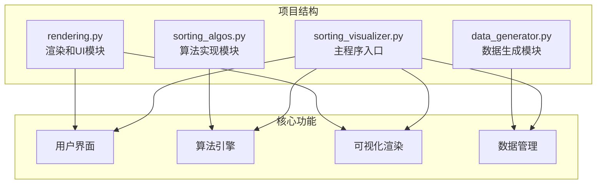

**图表来源**
- [sorting_visualizer.py:1-50](file://sorting_visualizer.py#L1-L50)
- [sorting_algos.py:1-30](file://sorting_algos.py#L1-L30)
- [rendering.py:1-35](file://rendering.py#L1-L35)
- [data_generator.py:1-15](file://data_generator.py#L1-L15)

**章节来源**
- [sorting_visualizer.py:1-50](file://sorting_visualizer.py#L1-L50)
- [sorting_algos.py:1-30](file://sorting_algos.py#L1-L30)
- [rendering.py:1-35](file://rendering.py#L1-L35)
- [data_generator.py:1-15](file://data_generator.py#L1-L15)

## 核心组件

### 主要功能模块

该系统由以下核心组件构成：

1. **SortingVisualizer主控制器** - 管理整个应用程序的状态和生命周期
2. **SortingAlgorithms算法库** - 包含19种排序算法的实现
3. **Rendering渲染引擎** - 处理图形界面和用户交互
4. **DataGenerator数据生成器** - 生成随机数组数据

### 系统特性

- **实时可视化** - 算法执行过程的动态展示
- **性能统计** - 实时显示比较次数和交换次数
- **多算法支持** - 19种不同类型的排序算法
- **可调节速度** - 支持10个速度级别
- **交互式控制** - 完整的用户控制界面

**章节来源**
- [sorting_visualizer.py:62-113](file://sorting_visualizer.py#L62-L113)
- [sorting_algos.py:12-25](file://sorting_algos.py#L12-L25)

## 架构概览

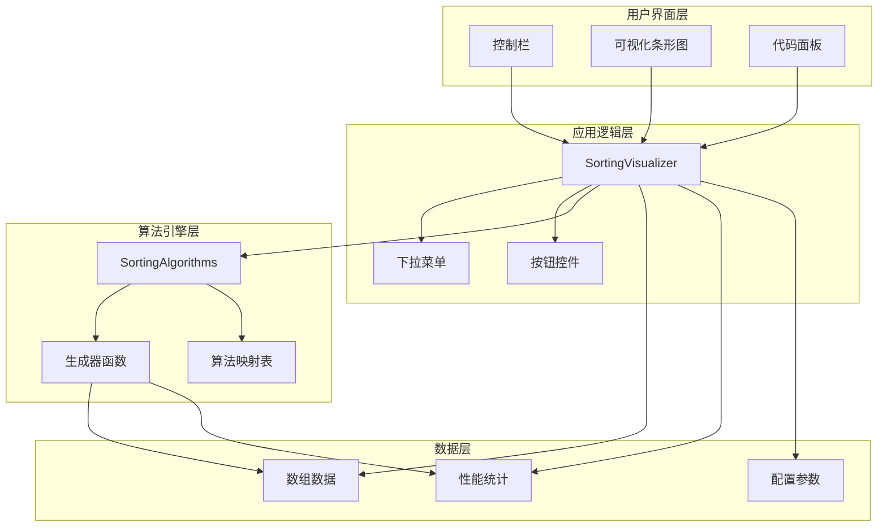

**图表来源**
- [sorting_visualizer.py:146-178](file://sorting_visualizer.py#L146-L178)
- [sorting_algos.py:507-550](file://sorting_algos.py#L507-L550)
- [rendering.py:284-380](file://rendering.py#L284-L380)

## 详细组件分析

### SortingVisualizer主控制器

SortingVisualizer是整个应用程序的核心控制器，负责协调各个模块之间的交互。

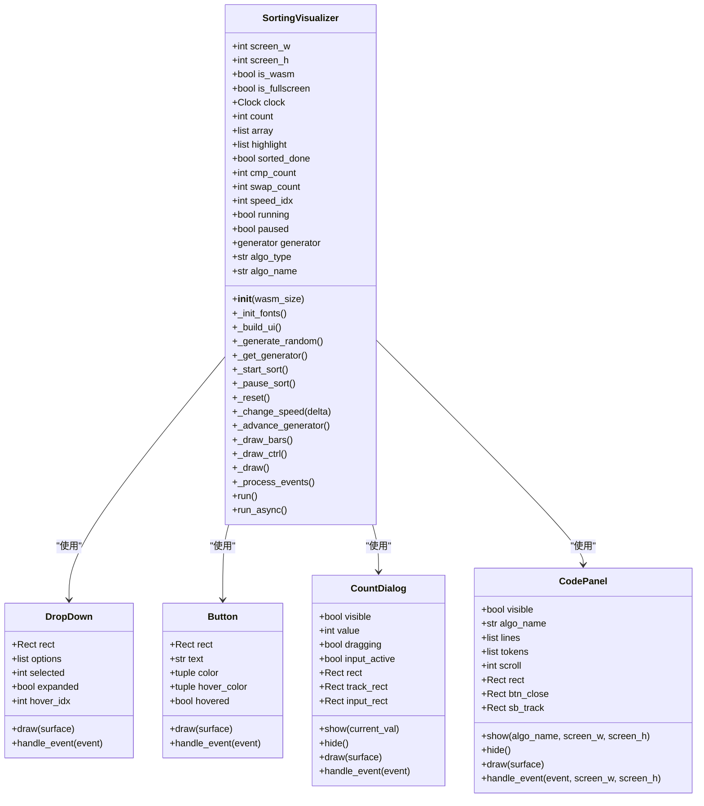

**图表来源**
- [sorting_visualizer.py:62-113](file://sorting_visualizer.py#L62-L113)
- [rendering.py:284-380](file://rendering.py#L284-L380)
- [rendering.py:110-280](file://rendering.py#L110-L280)

**章节来源**
- [sorting_visualizer.py:62-113](file://sorting_visualizer.py#L62-L113)
- [sorting_visualizer.py:146-178](file://sorting_visualizer.py#L146-L178)
- [rendering.py:284-380](file://rendering.py#L284-L380)
- [rendering.py:110-280](file://rendering.py#L110-L280)

### SortingAlgorithms算法库

算法库包含了19种不同的排序算法实现，分为基础排序和趣味排序两大类。

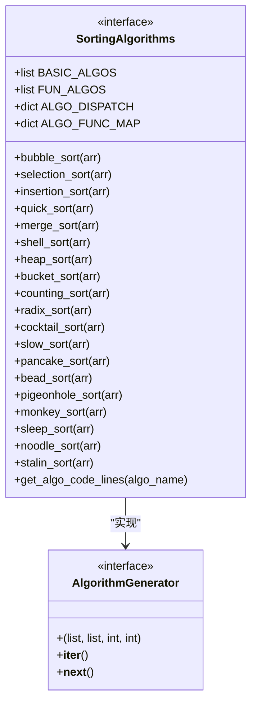

**图表来源**
- [sorting_algos.py:12-25](file://sorting_algos.py#L12-L25)
- [sorting_algos.py:507-550](file://sorting_algos.py#L507-L550)

**章节来源**
- [sorting_algos.py:12-25](file://sorting_algos.py#L12-L25)
- [sorting_algos.py:507-550](file://sorting_algos.py#L507-L550)

### Rendering渲染引擎

渲染引擎负责处理图形界面、颜色管理和用户交互。

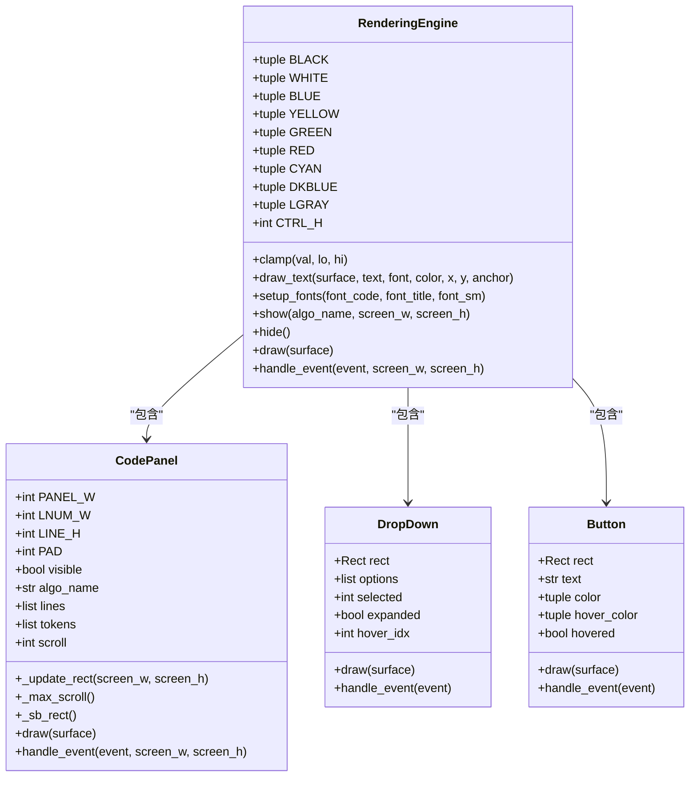

**图表来源**
- [rendering.py:13-33](file://rendering.py#L13-L33)
- [rendering.py:110-280](file://rendering.py#L110-L280)
- [rendering.py:284-380](file://rendering.py#L284-L380)

**章节来源**
- [rendering.py:13-33](file://rendering.py#L13-L33)
- [rendering.py:110-280](file://rendering.py#L110-L280)
- [rendering.py:284-380](file://rendering.py#L284-L380)

## 界面布局详解

### 整体布局结构

应用程序采用分层布局设计，主要分为三个区域：

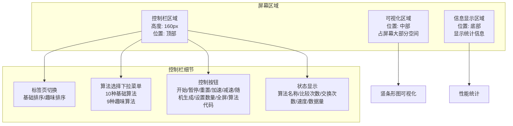

**图表来源**
- [sorting_visualizer.py:313-361](file://sorting_visualizer.py#L313-L361)
- [sorting_visualizer.py:146-178](file://sorting_visualizer.py#L146-L178)

### 控制栏功能分区

控制栏位于屏幕顶部，包含以下主要功能区域：

1. **标签页切换区域** - 基础排序和趣味排序两个标签页
2. **算法选择区域** - 下拉菜单选择具体算法
3. **控制按钮区域** - 各种操作按钮
4. **状态信息区域** - 实时显示算法执行状态

**章节来源**
- [sorting_visualizer.py:313-361](file://sorting_visualizer.py#L313-L361)
- [sorting_visualizer.py:146-178](file://sorting_visualizer.py#L146-L178)

## 算法选择流程

### 算法分类体系

系统提供两种算法分类，每类都有特定的学习目标和特点：

```mermaid
flowchart TD
START[开始选择算法] --> TYPE{选择算法类型}
TYPE --> |基础排序| BASIC[基础排序算法]
TYPE --> |趣味排序| FUN[趣味排序算法]
BASIC --> BUBBLE[冒泡排序<br/>O(n²) - 最简单易懂]
BASIC --> SELECT[选择排序<br/>O(n²) - 交换次数少]
BASIC --> INSERT[插入排序<br/>O(n²) - 对小数组高效]
BASIC --> QUICK[快速排序<br/>平均O(n log n) - 实际应用最广]
BASIC --> MERGE[归并排序<br/>O(n log n) - 稳定且可预测]
BASIC --> SHELL[希尔排序<br/>改进的插入排序]
BASIC --> HEAP[堆排序<br/>O(n log n) - 原地排序]
BASIC --> BUCKET[桶排序<br/>线性时间 - 需要额外空间]
BASIC --> COUNT[计数排序<br/>线性时间 - 有限范围整数]
BASIC --> RADIX[基数排序<br/>线性时间 - 按位处理]
FUN --> MONKEY[猴子排序<br/>随机尝试 - 学习概率概念]
FUN --> SLEEP[睡眠排序<br/>并发概念 - 学习异步编程]
FUN --> NOODLE[面条排序<br/>物理直觉 - 学习算法思想]
FUN --> STALIN[斯大林排序<br/>数据清洗 - 学习数据预处理]
FUN --> COCKTAIL[鸡尾酒排序<br/>双向冒泡 - 优化思路]
FUN --> SLOW[慢排序<br/>递归复杂度 - 学习复杂度分析]
FUN --> PANCAKE[煎饼排序<br/>翻转操作 - 学习约束条件]
FUN --> BEAD[珠排序<br/>重力模拟 - 物理直觉]
FUN --> PIGEON[鸽巢排序<br/>离散数学 - 学习映射概念]
BUBBLE --> CHOOSE[选择具体算法]
SELECT --> CHOOSE
INSERT --> CHOOSE
QUICK --> CHOOSE
MERGE --> CHOOSE
SHELL --> CHOOSE
HEAP --> CHOOSE
BUCKET --> CHOOSE
COUNT --> CHOOSE
RADIX --> CHOOSE
MONKEY --> CHOOSE
SLEEP --> CHOOSE
NOODLE --> CHOOSE
STALIN --> CHOOSE
COCKTAIL --> CHOOSE
SLOW --> CHOOSE
PANCAKE --> CHOOSE
BEAD --> CHOOSE
PIGEON --> CHOOSE
```

**图表来源**
- [sorting_algos.py:12-25](file://sorting_algos.py#L12-L25)
- [sorting_algos.py:507-550](file://sorting_algos.py#L507-L550)

### 算法选择建议

根据不同学习目标推荐合适的算法组合：

- **初学者入门**：从冒泡排序开始，然后学习选择排序和插入排序
- **进阶学习**：学习快速排序、归并排序和堆排序
- **算法分析**：对比不同复杂度的算法，如计数排序vs快速排序
- **特殊概念**：学习猴子排序理解概率算法，学习睡眠排序理解并发

**章节来源**
- [sorting_algos.py:12-25](file://sorting_algos.py#L12-L25)
- [sorting_algos.py:507-550](file://sorting_algos.py#L507-L550)

## 可视化控制选项

### 视觉效果控制

系统提供了丰富的可视化控制选项来增强学习体验：

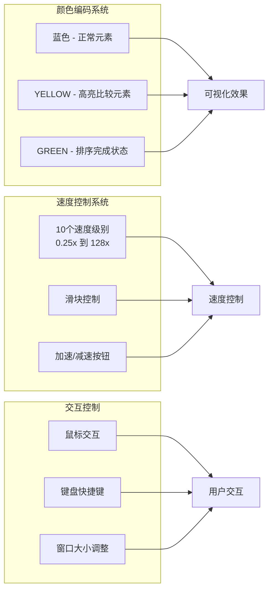

**图表来源**
- [sorting_visualizer.py:289-312](file://sorting_visualizer.py#L289-L312)
- [sorting_visualizer.py:232-234](file://sorting_visualizer.py#L232-L234)

### 性能监控界面

控制栏实时显示关键性能指标：

- **算法名称** - 当前执行的算法
- **比较次数** - 算法进行的关键操作计数
- **交换次数** - 数据交换操作计数
- **速度倍率** - 当前播放速度
- **数据量** - 数组元素个数

**章节来源**
- [sorting_visualizer.py:289-312](file://sorting_visualizer.py#L289-L312)
- [sorting_visualizer.py:322-330](file://sorting_visualizer.py#L322-L330)

## 性能统计解读

### 统计指标含义

系统提供的性能统计是理解算法效率的重要指标：

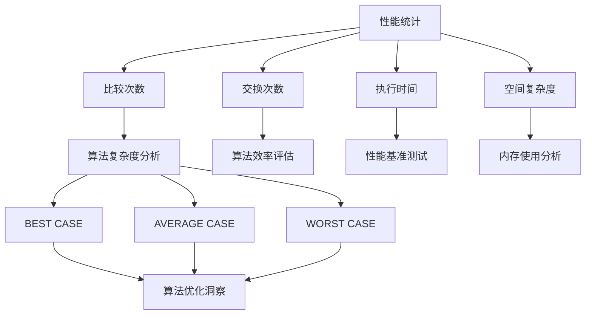

**图表来源**
- [sorting_visualizer.py:98-100](file://sorting_visualizer.py#L98-L100)
- [sorting_algos.py:35-48](file://sorting_algos.py#L35-L48)

### 性能比较方法

通过对比不同算法在同一数据集上的表现来学习算法特性：

1. **相同数据集** - 确保公平比较
2. **相同速度** - 避免速度差异影响
3. **多次实验** - 减少偶然因素
4. **关注指标** - 比较比较次数和交换次数

**章节来源**
- [sorting_visualizer.py:98-100](file://sorting_visualizer.py#L98-L100)
- [sorting_algos.py:35-48](file://sorting_algos.py#L35-L48)

## 不同学习场景使用建议

### 算法学习场景

针对不同学习阶段提供专门的使用策略：

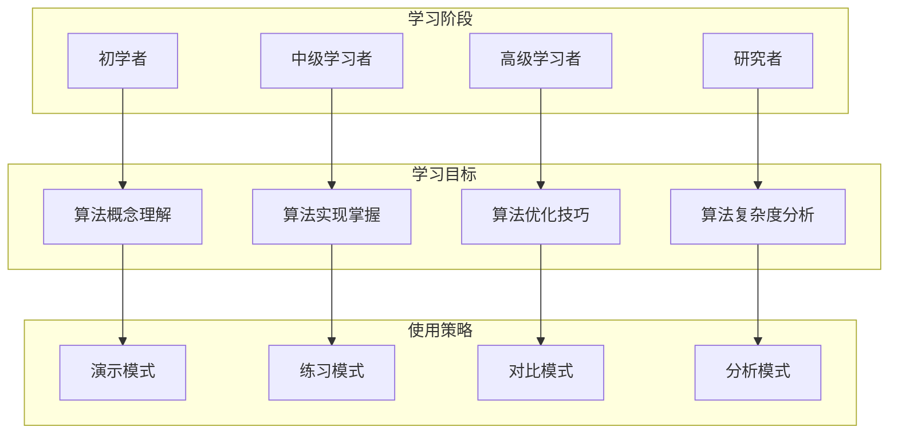

### 教学演示场景

为教师提供有效的课堂演示工具：

- **全班演示** - 使用大屏幕展示算法过程
- **互动问答** - 引导学生观察和思考
- **对比分析** - 同时展示多个算法
- **进度控制** - 逐步讲解算法步骤

### 性能比较场景

用于算法性能分析和比较：

- **基准测试** - 在相同条件下比较算法
- **复杂度验证** - 验证理论复杂度的实际表现
- **参数调优** - 测试不同参数对性能的影响
- **内存分析** - 观察空间使用情况

**章节来源**
- [sorting_visualizer.py:50-57](file://sorting_visualizer.py#L50-L57)
- [sorting_algos.py:12-25](file://sorting_algos.py#L12-L25)

## 快捷键操作指南

### 基本操作快捷键

系统支持多种快捷键操作来提高使用效率：

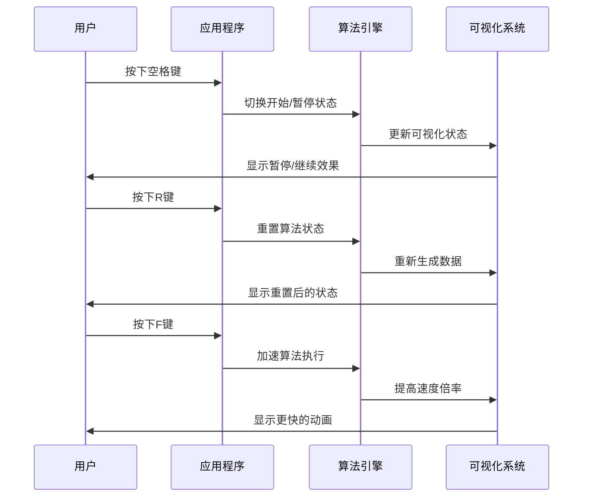

**图表来源**
- [sorting_visualizer.py:432-441](file://sorting_visualizer.py#L432-L441)
- [sorting_visualizer.py:227-234](file://sorting_visualizer.py#L227-L234)

### 高级操作快捷键

对于高级用户提供的快捷键支持：

- **Ctrl + F** - 切换全屏模式
- **Ctrl + S** - 显示算法源码
- **Ctrl + D** - 打开数据设置对话框
- **数字键1-9** - 快速选择前9个算法
- **Tab键** - 在控件间切换焦点

**章节来源**
- [sorting_visualizer.py:432-454](file://sorting_visualizer.py#L432-L454)

## 高级功能使用技巧

### 算法代码查看功能

系统内置了完整的算法源码查看功能：

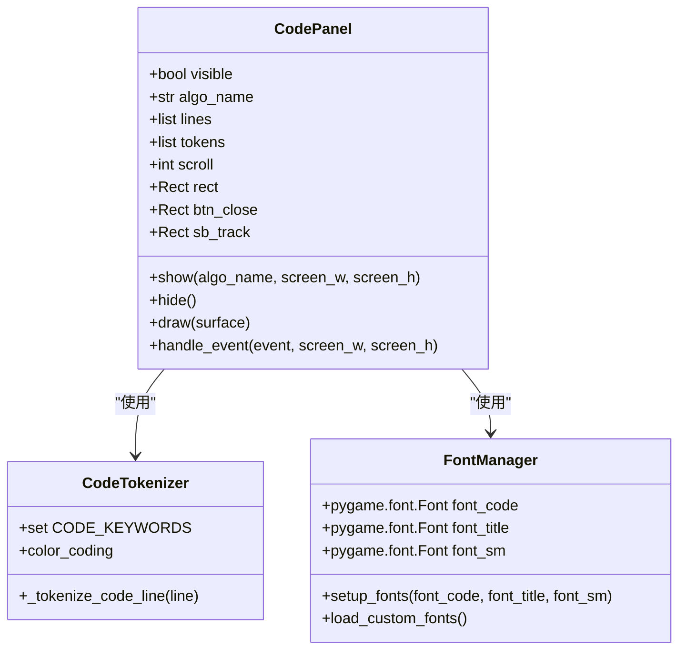

**图表来源**
- [rendering.py:110-280](file://rendering.py#L110-L280)
- [rendering.py:52-105](file://rendering.py#L52-L105)

### 数据量自定义功能

支持灵活的数据量设置来适应不同学习需求：

- **最小值**：1个元素（适合理解基本概念）
- **默认值**：100个元素（平衡学习效果和性能）
- **最大值**：1000个元素（挑战算法极限）

### 全屏模式支持

提供沉浸式学习体验：

- **自动适配** - 自动调整到显示器分辨率
- **窗口模式** - 支持可调整大小的窗口
- **无边框模式** - 提供完全沉浸式体验

**章节来源**
- [rendering.py:110-280](file://rendering.py#L110-L280)
- [rendering.py:384-557](file://rendering.py#L384-L557)
- [sorting_visualizer.py:245-261](file://sorting_visualizer.py#L245-L261)

## 常见问题解决

### 性能问题

**问题**：算法执行过慢
**解决方案**：
1. 调整速度倍率为更合适的速度
2. 减少数据量到合理范围
3. 选择更高效的算法
4. 关闭不必要的可视化效果

**问题**：内存使用过高
**解决方案**：
1. 降低数据量设置
2. 使用更节省内存的算法
3. 关闭代码面板等额外功能

### 显示问题

**问题**：界面显示异常
**解决方案**：
1. 重启应用程序
2. 检查显示器分辨率设置
3. 尝试切换到窗口模式
4. 更新显卡驱动程序

**问题**：字体显示模糊
**解决方案**：
1. 检查系统字体安装
2. 调整显示器缩放设置
3. 使用系统自带字体

### 功能问题

**问题**：某些按钮无响应
**解决方案**：
1. 确认鼠标光标位置准确点击
2. 检查弹窗是否遮挡了按钮
3. 重新启动应用程序
4. 检查是否有未完成的操作

**章节来源**
- [sorting_visualizer.py:232-234](file://sorting_visualizer.py#L232-L234)
- [sorting_visualizer.py:245-261](file://sorting_visualizer.py#L245-L261)

## 故障排除步骤

### 系统兼容性问题

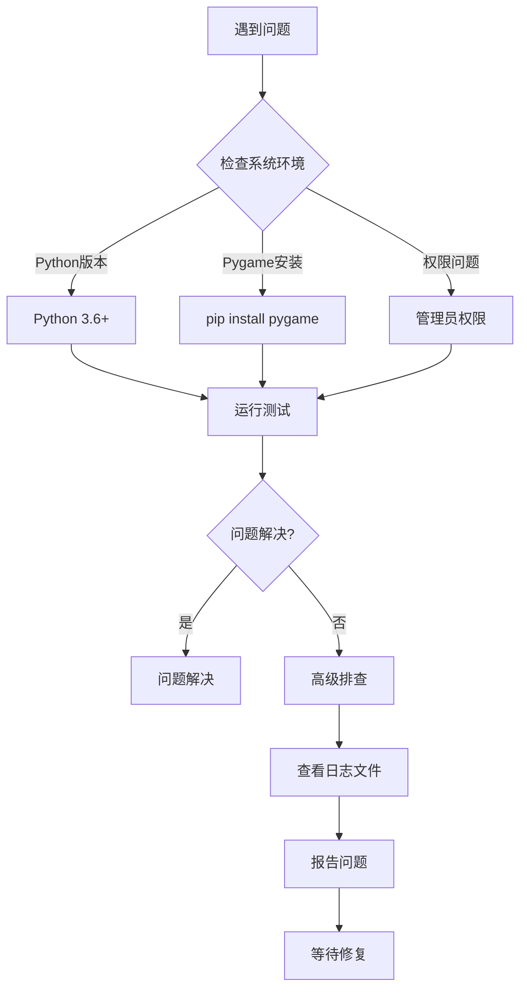

### 算法执行问题

**问题**：算法卡死或无限循环
**解决步骤**：
1. 检查算法参数设置
2. 重置算法状态
3. 更换其他算法测试
4. 查看算法源码理解逻辑

**问题**：结果不正确
**解决步骤**：
1. 验证数据生成是否正常
2. 检查算法选择是否正确
3. 对比理论预期结果
4. 查看性能统计指标

**章节来源**
- [sorting_visualizer.py:208-222](file://sorting_visualizer.py#L208-L222)
- [sorting_algos.py:434-452](file://sorting_algos.py#L434-L452)

## 最佳实践建议

### 学习路径规划

为不同用户群体提供最佳实践建议：

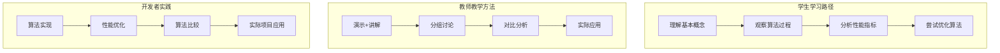

### 使用技巧总结

1. **循序渐进**：从简单算法开始，逐步深入复杂算法
2. **对比学习**：同时运行多个算法比较性能差异
3. **关注细节**：仔细观察元素交换和比较过程
4. **记录数据**：保存重要的性能统计数据
5. **实践应用**：将学到的知识应用到实际编程中

### 学习资源推荐

- **理论学习**：算法导论、数据结构与算法分析
- **实践练习**：在线编程平台的算法题目
- **扩展阅读**：算法设计技巧和优化方法
- **社区交流**：参与算法学习社区讨论

**章节来源**
- [sorting_visualizer.py:50-57](file://sorting_visualizer.py#L50-L57)
- [sorting_algos.py:12-25](file://sorting_algos.py#L12-L25)

## 学习路径指导

### 针对不同用户群体的指导

#### 学生学习路径

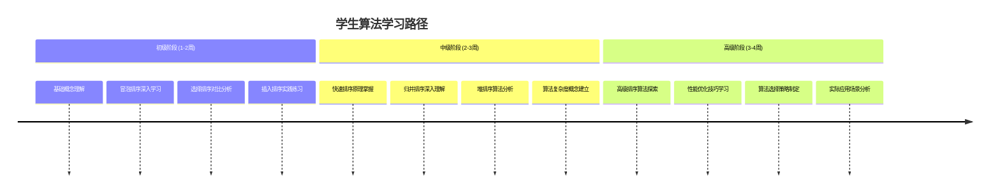

#### 教师教学指导

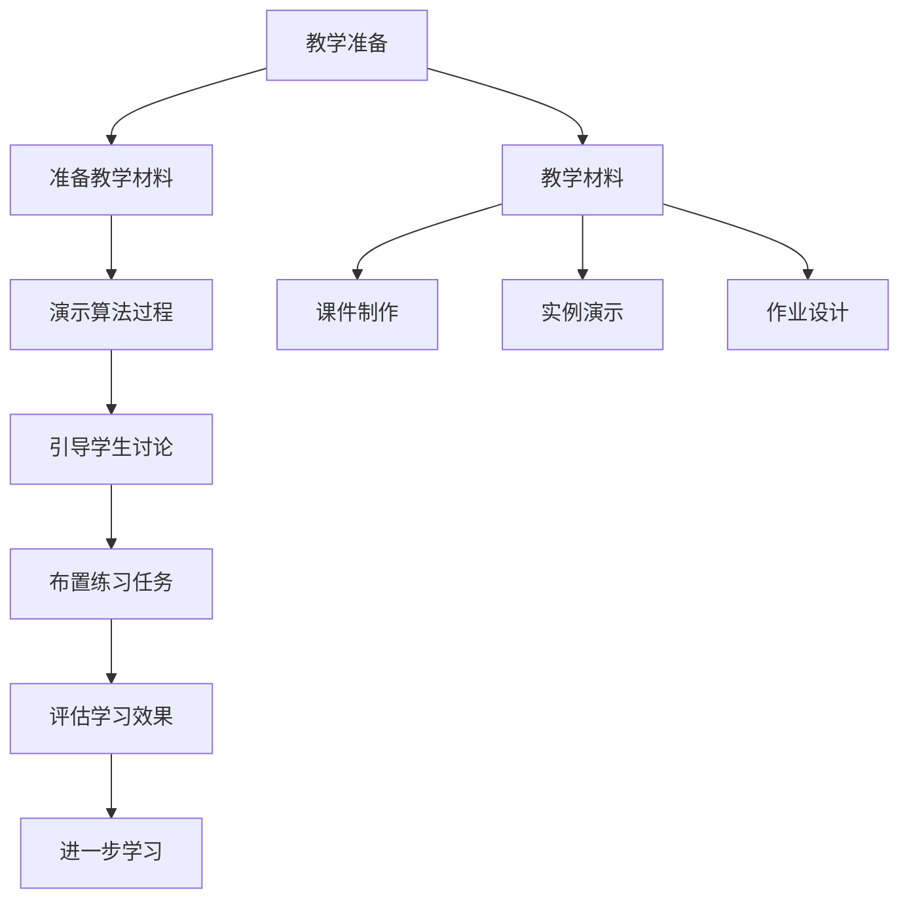

#### 开发者技能提升

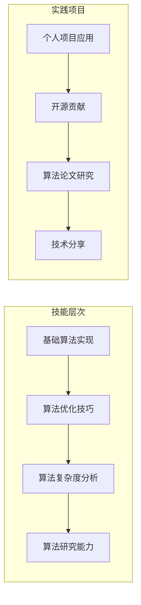

### 学习计划建议

1. **短期目标**（1-2个月）
   - 掌握5种基础算法
   - 理解基本性能概念
   - 能够比较不同算法

2. **中期目标**（3-6个月）
   - 熟练掌握10种算法
   - 能够分析算法复杂度
   - 具备算法优化意识

3. **长期目标**（6个月以上）
   - 精通所有算法
   - 能够设计新算法
   - 具备算法研究能力

**章节来源**
- [sorting_visualizer.py:115-144](file://sorting_visualizer.py#L115-L144)
- [sorting_algos.py:12-25](file://sorting_algos.py#L12-L25)

## 结论

这个排序算法可视化工具为学习和研究算法提供了强大的支持。通过直观的可视化界面、丰富的交互功能和全面的性能统计，用户可以深入理解各种排序算法的工作原理和性能特征。

### 主要优势

1. **直观性强** - 通过动画展示算法执行过程
2. **功能丰富** - 支持19种算法和多种控制选项
3. **教育价值高** - 适合不同层次的学习需求
4. **实用性强** - 能够帮助理解算法复杂度和性能

### 发展方向

未来可以考虑的功能扩展：
- 添加更多算法类型
- 支持自定义算法输入
- 提供更详细的算法分析报告
- 增强多语言支持
- 优化移动端用户体验

通过持续的学习和实践，用户可以充分利用这个工具来提升算法理解和编程技能，为计算机科学学习和研究奠定坚实基础。