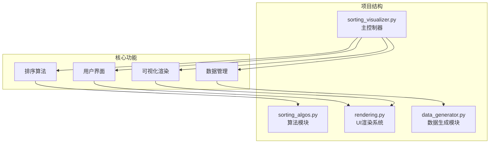
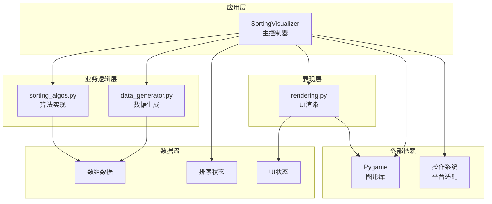
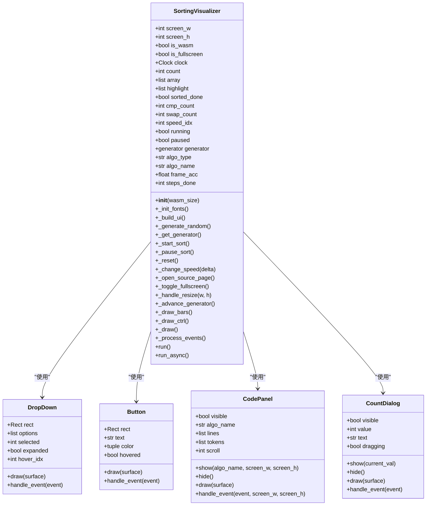
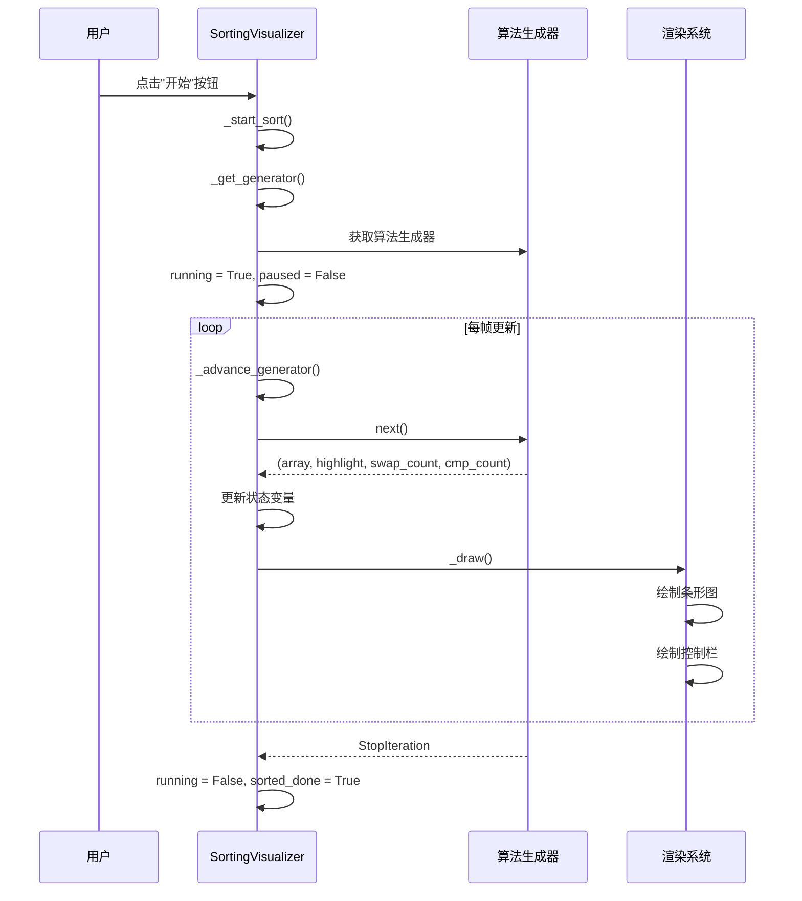
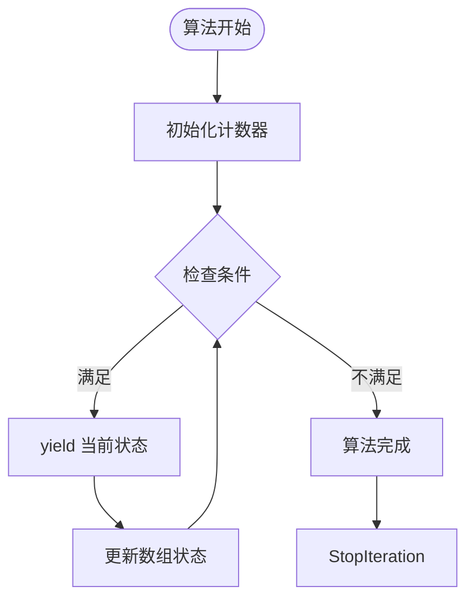
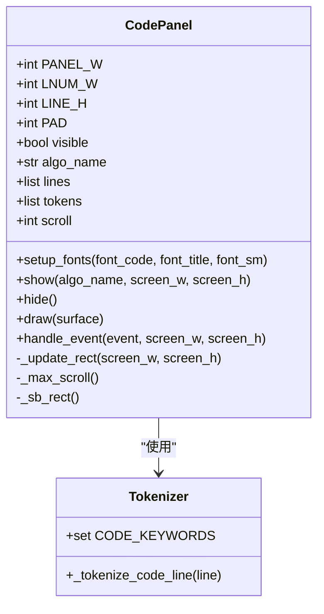
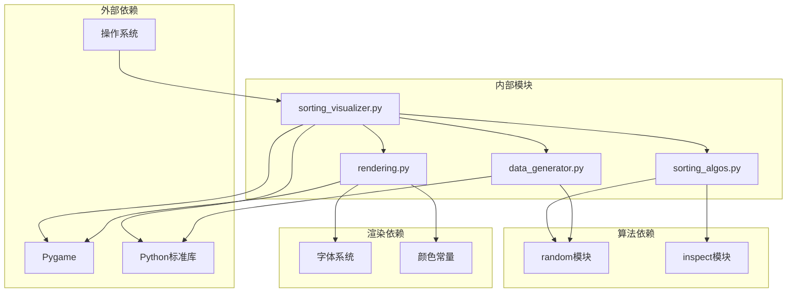

# Python数据可视化项目概述

<cite>
**本文档引用的文件**
- [sorting_visualizer.py](file://sorting_visualizer.py)
- [sorting_algos.py](file://sorting_algos.py)
- [rendering.py](file://rendering.py)
- [data_generator.py](file://data_generator.py)
</cite>

## 目录
1. [项目简介](#项目简介)
2. [项目结构](#项目结构)
3. [核心组件](#核心组件)
4. [架构概览](#架构概览)
5. [详细组件分析](#详细组件分析)
6. [依赖关系分析](#依赖关系分析)
7. [性能考虑](#性能考虑)
8. [故障排除指南](#故障排除指南)
9. [结论](#结论)

## 项目简介

这是一个基于Pygame开发的桌面应用程序，专注于19种排序算法的可视化演示。该项目旨在通过直观的图形界面帮助用户理解和学习各种排序算法的工作原理和执行过程。

### 主要目标
- **教育价值**：为计算机科学学生和编程爱好者提供交互式的学习工具
- **可视化学习**：将抽象的算法概念转化为直观的图形动画
- **算法教学**：支持多种排序算法的教学和演示需求
- **跨平台兼容**：同时支持桌面环境和Web WASM模式

### 支持的排序算法
项目包含19种不同的排序算法，分为两大类别：

**基础排序算法（10种）**：
- 冒泡排序、选择排序、插入排序、快速排序
- 归并排序、希尔排序、堆排序、桶排序
- 计数排序、基数排序

**趣味排序算法（9种）**：
- 猴子排序、睡眠排序、面条排序、斯大林排序
- 鸡尾酒排序、慢排序、煎饼排序、珠排序
- 鸽巢排序

## 项目结构

该项目采用模块化设计，将功能分解为四个主要模块：

**图表来源**
- [sorting_visualizer.py:1-50](file://sorting_visualizer.py#L1-L50)
- [sorting_algos.py:1-30](file://sorting_algos.py#L1-L30)
- [rendering.py:1-20](file://rendering.py#L1-L20)
- [data_generator.py:1-20](file://data_generator.py#L1-L20)

**章节来源**
- [sorting_visualizer.py:1-50](file://sorting_visualizer.py#L1-L50)
- [sorting_algos.py:1-30](file://sorting_algos.py#L1-L30)
- [rendering.py:1-20](file://rendering.py#L1-L20)
- [data_generator.py:1-20](file://data_generator.py#L1-L20)

## 核心组件

### SortingVisualizer 主控制器

SortingVisualizer是整个应用程序的核心控制器，负责协调各个模块之间的交互和数据流。

**主要职责**：
- 窗口管理和屏幕尺寸控制
- 用户界面事件处理
- 排序算法调度和执行
- 实时数据更新和渲染
- 跨平台兼容性支持

**关键特性**：
- 支持桌面和Web WASM两种运行模式
- 动态字体加载和多语言支持
- 实时性能统计和进度跟踪
- 可调节的播放速度控制

**章节来源**
- [sorting_visualizer.py:62-113](file://sorting_visualizer.py#L62-L113)
- [sorting_visualizer.py:146-177](file://sorting_visualizer.py#L146-L177)
- [sorting_visualizer.py:179-224](file://sorting_visualizer.py#L179-L224)

### 排序算法模块

sorting_algos.py实现了19种不同的排序算法，每种算法都设计为生成器函数，能够逐步产生可视化状态。

**算法分类**：
- **基础算法**：实现经典的高效排序算法
- **趣味算法**：展示有趣的算法思想和概念

**生成器模式**：
每个算法函数都遵循统一的接口：`yield (array, highlight_indices, swap_count, cmp_count)`

**章节来源**
- [sorting_algos.py:12-25](file://sorting_algos.py#L12-L25)
- [sorting_algos.py:35-87](file://sorting_algos.py#L35-L87)
- [sorting_algos.py:507-550](file://sorting_algos.py#L507-L550)

### UI渲染系统

rendering.py提供了完整的用户界面组件和渲染功能。

**核心组件**：
- **颜色管理系统**：定义了丰富的颜色常量用于不同状态的可视化
- **UI组件库**：包括按钮、下拉菜单、对话框等可复用组件
- **代码面板**：支持语法高亮的算法源码显示
- **滚动条系统**：高效的滚动条实现用于长列表显示

**章节来源**
- [rendering.py:13-33](file://rendering.py#L13-L33)
- [rendering.py:110-140](file://rendering.py#L110-L140)
- [rendering.py:284-349](file://rendering.py#L284-L349)

### 数据生成模块

data_generator.py专门负责生成排序可视化所需的随机数据。

**功能特性**：
- 随机整数数组生成
- 可配置的数据范围
- 排序状态初始化
- 性能优化的数据结构

**章节来源**
- [data_generator.py:11-24](file://data_generator.py#L11-L24)
- [data_generator.py:26-48](file://data_generator.py#L26-L48)

## 架构概览

项目采用了清晰的分层架构设计，确保了良好的模块分离和可维护性。

**图表来源**
- [sorting_visualizer.py:34-47](file://sorting_visualizer.py#L34-L47)
- [sorting_algos.py:1-10](file://sorting_algos.py#L1-L10)
- [rendering.py:8-11](file://rendering.py#L8-L11)

### 设计模式应用

项目实现了多种设计模式以提高代码质量：

**1. 生成器模式**
- 所有排序算法都实现为生成器
- 支持渐进式可视化更新
- 内存效率优化

**2. 组件化设计**
- UI组件独立封装
- 可复用的组件库
- 清晰的接口定义

**3. 策略模式**
- 算法调度器
- 多种算法的统一接口
- 运行时算法切换

**章节来源**
- [sorting_visualizer.py:191-198](file://sorting_visualizer.py#L191-L198)
- [sorting_algos.py:529-550](file://sorting_algos.py#L529-L550)

## 详细组件分析

### SortingVisualizer 类详细分析

**图表来源**
- [sorting_visualizer.py:62-113](file://sorting_visualizer.py#L62-L113)
- [rendering.py:284-349](file://rendering.py#L284-L349)
- [rendering.py:354-379](file://rendering.py#L354-L379)
- [rendering.py:110-140](file://rendering.py#L110-L140)
- [rendering.py:384-482](file://rendering.py#L384-L482)

#### 排序算法执行流程

**图表来源**
- [sorting_visualizer.py:201-215](file://sorting_visualizer.py#L201-L215)
- [sorting_visualizer.py:262-280](file://sorting_visualizer.py#L262-L280)
- [sorting_visualizer.py:350-376](file://sorting_visualizer.py#L350-L376)

**章节来源**
- [sorting_visualizer.py:201-280](file://sorting_visualizer.py#L201-L280)
- [sorting_visualizer.py:350-451](file://sorting_visualizer.py#L350-L451)

### 排序算法实现分析

#### 算法复杂度对比

| 算法类型 | 时间复杂度(平均) | 时间复杂度(最坏) | 空间复杂度 | 稳定性 |
|---------|-----------------|-----------------|-----------|--------|
| 基础排序 | O(n²) - O(n log n) | O(n²) - O(n²) | O(1) - O(n) | 不稳定 - 稳定 |
| 趣味排序 | O(∞) - O(n log n) | O(∞) - O(n²) | O(1) - O(n) | 不稳定 - 稳定 |

**章节来源**
- [sorting_algos.py:35-300](file://sorting_algos.py#L35-L300)
- [sorting_algos.py:306-502](file://sorting_algos.py#L306-L502)

#### 生成器模式实现

**图表来源**
- [sorting_algos.py:35-48](file://sorting_algos.py#L35-L48)
- [sorting_algos.py:89-121](file://sorting_algos.py#L89-L121)

**章节来源**
- [sorting_algos.py:35-502](file://sorting_algos.py#L35-L502)

### UI组件系统

#### 代码面板实现

**图表来源**
- [rendering.py:110-140](file://rendering.py#L110-L140)
- [rendering.py:59-104](file://rendering.py#L59-L104)

**章节来源**
- [rendering.py:110-279](file://rendering.py#L110-L279)
- [rendering.py:59-104](file://rendering.py#L59-L104)

## 依赖关系分析

项目具有清晰的依赖层次结构，确保了模块间的松耦合。

**图表来源**
- [sorting_visualizer.py:17-47](file://sorting_visualizer.py#L17-L47)
- [sorting_algos.py:9-10](file://sorting_algos.py#L9-L10)
- [rendering.py:8-11](file://rendering.py#L8-L11)
- [data_generator.py:8](file://data_generator.py#L8)

### 平台兼容性设计

项目实现了优雅的降级机制，支持多种运行环境：

**桌面模式特性**：
- 完整的Pygame功能支持
- 字体文件自动检测
- 全屏模式切换
- 异步源码页面

**Web WASM模式特性**：
- Emscripten平台检测
- 简化的字体处理
- 无子进程支持
- 异步事件循环

**章节来源**
- [sorting_visualizer.py:23-28](file://sorting_visualizer.py#L23-L28)
- [sorting_visualizer.py:30-32](file://sorting_visualizer.py#L30-L32)
- [sorting_visualizer.py:462-469](file://sorting_visualizer.py#L462-L469)

## 性能考虑

### 内存优化策略

1. **生成器模式**：避免一次性生成所有中间状态
2. **按需渲染**：只在需要时更新屏幕
3. **对象池**：复用UI组件实例
4. **数据压缩**：最小化状态存储

### 渲染性能优化

1. **批量绘制**：减少Pygame调用次数
2. **增量更新**：只更新变化的部分
3. **硬件加速**：利用Pygame的渲染优化
4. **帧率控制**：稳定的60 FPS运行

### 算法性能特性

- **时间复杂度**：从O(n)到O(n!)不等
- **空间复杂度**：从O(1)到O(n²)不等
- **稳定性**：部分算法保持相对顺序
- **适用场景**：教学演示和性能对比

## 故障排除指南

### 常见问题及解决方案

**问题1：字体显示异常**
- 检查字体文件是否存在
- 验证字体路径权限
- 尝试使用系统字体作为后备

**问题2：算法执行卡顿**
- 调整播放速度设置
- 减少数据量大小
- 关闭不必要的UI组件

**问题3：Web模式运行问题**
- 确认Emscripten环境
- 检查网络连接
- 验证文件完整性

**问题4：内存使用过高**
- 限制数据量范围
- 定期清理未使用的对象
- 监控生成器状态

**章节来源**
- [sorting_visualizer.py:115-144](file://sorting_visualizer.py#L115-L144)
- [sorting_visualizer.py:230-237](file://sorting_visualizer.py#L230-L237)
- [rendering.py:35-47](file://rendering.py#L35-L47)

## 结论

这个Python数据可视化项目是一个精心设计的教育工具，成功地将复杂的算法概念转化为直观的可视化体验。项目的主要优势包括：

### 技术成就
- **模块化架构**：清晰的功能分离和良好的可维护性
- **跨平台支持**：同时支持桌面和Web环境
- **教育导向**：专门为学习和教学设计
- **性能优化**：高效的渲染和内存管理

### 应用价值
- **教学工具**：帮助学生理解算法执行过程
- **演示平台**：适合课堂和讲座展示
- **学习资源**：支持自主学习和研究
- **开发参考**：展示了Python GUI开发的最佳实践

### 发展前景
项目为进一步扩展提供了良好的基础，可以考虑添加更多算法、改进用户体验、增强交互功能等。这个项目不仅是一个优秀的教学工具，也是一个值得学习的软件工程范例。